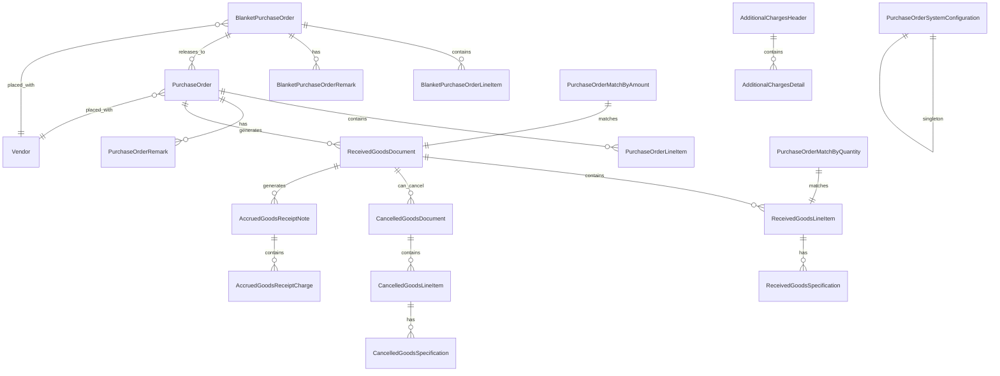

Based on the Purchase Order database reference guide, I'll create an Ash domain specification with semantically meaningful resource names and field definitions.

# Accountex Purchase Order Domain Specification

## Domain Overview

The Purchase Order domain manages procurement operations including purchase orders, blanket purchase orders, goods receipts, cancellations, and related financial accruals.

## Mermaid Diagram



## Resources

### 1. PurchaseOrderSystemConfiguration
**Table:** `purchase_order_system_configurations`

```elixir
defmodule Accountex.PurchaseOrder.PurchaseOrderSystemConfiguration do
  use Ash.Resource,
    data_layer: AshPostgres.DataLayer,
    domain: Accountex.PurchaseOrder

  postgres do
    table "purchase_order_system_configurations"
    repo Accountex.Repo
  end

  attributes do
    uuid_primary_key :id

    attribute :accounts_payable_setup_status, :string, allow_nil?: false, default: ""
    attribute :purchase_order_setup_status, :string, allow_nil?: false, default: ""
    attribute :current_accounting_period, :string, allow_nil?: false, default: ""
    attribute :current_1099_tax_year, :string
    attribute :default_bank_number, :string
    attribute :default_fob_terms, :string
    attribute :default_freight_code, :string
    attribute :next_voucher_number, :string, default: "1000000001"
    attribute :next_purchase_order_number, :string, default: "1000000001"
    attribute :next_blanket_purchase_order_number, :string, default: "1000000001"
    attribute :next_receipt_number, :string, default: "1000000001"
    attribute :next_cancellation_number, :string, default: ""
    attribute :default_transaction_number, :string
    attribute :default_resale_number, :string
    attribute :default_ship_via_method, :string
    attribute :default_payment_urgency_level, :string, default: "1"
    attribute :default_payment_code, :string
    attribute :default_reference_text, :string
    attribute :accrual_accounting_type, :string
    attribute :payable_general_ledger_account, :string, allow_nil?: false
    attribute :discount_general_ledger_account, :string, allow_nil?: false
    attribute :adjustment_general_ledger_account, :string, allow_nil?: false
    attribute :unrealized_exchange_gain_loss_account, :string
    attribute :expense_general_ledger_account, :string, allow_nil?: false
    attribute :interest_general_ledger_account, :string, allow_nil?: false
    attribute :suspense_general_ledger_account, :string, allow_nil?: false
    attribute :prepaid_expense_general_ledger_account, :string, allow_nil?: false
    attribute :freight_cost_general_ledger_account, :string, allow_nil?: false
    attribute :sales_tax_cost_general_ledger_account, :string, allow_nil?: false
    attribute :accrued_received_goods_account, :string, allow_nil?: false
    attribute :withholding_tax_account, :string
    attribute :purchase_tax_account, :string
    attribute :enable_auto_generate_purchase_order_number, :boolean, default: true
    attribute :enable_auto_generate_blanket_po_number, :boolean, default: false
    attribute :enable_purchase_order_matching, :boolean, default: false
    attribute :enable_accrued_received_goods, :boolean, default: false
    attribute :enable_multi_currency, :boolean, default: false
    attribute :enable_purchase_order_export, :boolean, default: false
    attribute :require_purchase_order_for_invoice, :boolean, default: false
    attribute :verify_purchase_order_number, :boolean, default: false
    
    timestamps()
  end
end
```

### 2. PurchaseOrder
**Table:** `purchase_orders`

```elixir
defmodule Accountex.PurchaseOrder.PurchaseOrder do
  use Ash.Resource,
    data_layer: AshPostgres.DataLayer,
    domain: Accountex.PurchaseOrder

  postgres do
    table "purchase_orders"
    repo Accountex.Repo
  end

  attributes do
    uuid_primary_key :id
    
    attribute :purchase_order_number, :string, allow_nil?: false
    attribute :revision_number, :string, default: ""
    attribute :vendor_id, :uuid, allow_nil?: false
    attribute :buyer_code, :string
    attribute :entered_by_user_name, :string, allow_nil?: false
    attribute :confirmed_to_contact, :string
    attribute :short_description, :string
    attribute :order_from_company_name, :string
    attribute :order_from_address_line_1, :string
    attribute :order_from_address_line_2, :string
    attribute :order_from_city, :string
    attribute :order_from_state, :string
    attribute :order_from_zip_code, :string
    attribute :order_from_country, :string
    attribute :order_from_phone_number, :string
    attribute :order_from_contact_name, :string
    attribute :order_from_email_address, :string
    attribute :ship_to_company_name, :string
    attribute :ship_to_address_line_1, :string
    attribute :ship_to_address_line_2, :string
    attribute :ship_to_city, :string
    attribute :ship_to_state, :string
    attribute :ship_to_zip_code, :string
    attribute :ship_to_country, :string
    attribute :ship_to_phone_number, :string
    attribute :ship_to_contact_name, :string
    attribute :shipping_method, :string
    attribute :fob_terms, :string
    attribute :customer_sales_order_number, :string
    attribute :warehouse_code, :string, allow_nil?: false
    attribute :freight_code, :string
    attribute :freight_tax_code, :string
    attribute :sales_tax_code, :string
    attribute :payment_code, :string, allow_nil?: false
    attribute :currency_code, :string, default: "USD"
    attribute :source_system, :string
    attribute :blanket_purchase_order_id, :uuid
    attribute :created_date, :utc_datetime_usec
    attribute :order_date, :utc_datetime_usec
    attribute :requested_date, :utc_datetime_usec
    attribute :quote_approval_date, :utc_datetime_usec
    attribute :enable_accrued_goods_receipt, :boolean, default: false
    attribute :is_quote, :boolean, default: false
    attribute :is_cancelled, :boolean, default: false
    attribute :prevent_backorder, :boolean, default: false
    attribute :apply_sales_tax, :boolean, default: false
    attribute :include_tax_in_cost, :boolean, default: false
    attribute :is_printed, :boolean, default: false
    attribute :enable_export, :boolean, default: false
    attribute :use_vendor_part_number, :boolean, default: false
    attribute :is_drop_ship, :boolean, default: false
    attribute :payment_discount_days, :integer, default: 0
    attribute :payment_net_days, :integer, default: 0
    attribute :payment_discount_percentage, :decimal, default: 0
    attribute :line_discount_percentage, :decimal, default: 0
    attribute :tax_version_number, :integer, default: 0
    attribute :freight_tax_version_number, :integer, default: 0
    attribute :taxable_amount_1, :decimal, default: 0
    attribute :taxable_amount_2, :decimal, default: 0
    attribute :subtotal_amount, :decimal, default: 0
    attribute :discount_amount, :decimal, default: 0
    attribute :freight_amount, :decimal, default: 0
    attribute :tax_amount_1, :decimal, default: 0
    attribute :tax_amount_2, :decimal, default: 0
    attribute :tax_amount_3, :decimal, default: 0
    attribute :freight_tax_amount_1, :decimal, default: 0
    attribute :freight_tax_amount_2, :decimal, default: 0
    attribute :freight_tax_amount_3, :decimal, default: 0
    attribute :charged_freight_amount, :decimal, default: 0
    attribute :invoiced_amount, :decimal, default: 0
    attribute :foreign_taxable_amount_1, :decimal, default: 0
    attribute :foreign_taxable_amount_2, :decimal, default: 0
    attribute :foreign_subtotal_amount, :decimal, default: 0
    attribute :foreign_discount_amount, :decimal, default: 0
    attribute :foreign_freight_amount, :decimal, default: 0
    attribute :foreign_tax_amount_1, :decimal, default: 0
    attribute :foreign_tax_amount_2, :decimal, default: 0
    attribute :foreign_tax_amount_3, :decimal, default: 0
    attribute :foreign_freight_tax_amount_1, :decimal, default: 0
    attribute :foreign_freight_tax_amount_2, :decimal, default: 0
    attribute :foreign_freight_tax_amount_3, :decimal, default: 0
    attribute :foreign_charged_freight_amount, :decimal, default: 0
    attribute :foreign_invoiced_amount, :decimal, default: 0
    attribute :exchange_rate, :decimal, default: 1
    
    timestamps()
  end

  relationships do
    belongs_to :vendor, Accountex.Vendor.Vendor
    belongs_to :blanket_purchase_order, Accountex.PurchaseOrder.BlanketPurchaseOrder
    
    has_many :purchase_order_line_items, Accountex.PurchaseOrder.PurchaseOrderLineItem
    has_many :purchase_order_remarks, Accountex.PurchaseOrder.PurchaseOrderRemark
    has_many :received_goods_documents, Accountex.PurchaseOrder.ReceivedGoodsDocument
  end
end
```

### 3. PurchaseOrderLineItem
**Table:** `purchase_order_line_items`

```elixir
defmodule Accountex.PurchaseOrder.PurchaseOrderLineItem do
  use Ash.Resource,
    data_layer: AshPostgres.DataLayer,
    domain: Accountex.PurchaseOrder

  postgres do
    table "purchase_order_line_items"
    repo Accountex.Repo
  end

  attributes do
    uuid_primary_key :id
    
    attribute :purchase_order_id, :uuid, allow_nil?: false
    attribute :vendor_id, :uuid, allow_nil?: false
    attribute :warehouse_code, :string, allow_nil?: false
    attribute :line_item_key, :string, allow_nil?: false
    attribute :sales_order_line_item_id, :string
    attribute :item_number, :string, allow_nil?: false
    attribute :specification_code_1, :string
    attribute :specification_code_2, :string
    attribute :item_description, :string, allow_nil?: false
    attribute :vendor_part_number, :string
    attribute :unit_of_measure, :string
    attribute :line_tax_code, :string
    attribute :reference_account, :string
    attribute :requested_date, :utc_datetime_usec
    attribute :is_stock_item, :boolean, default: true
    attribute :use_vendor_part_number, :boolean, default: false
    attribute :is_taxable_1, :boolean, default: false
    attribute :is_taxable_2, :boolean, default: false
    attribute :overwrite_remark, :boolean, default: false
    attribute :print_remark, :boolean, default: false
    attribute :quantity_decimal_places, :integer, default: 0
    attribute :line_discount_percentage, :decimal, default: 0
    attribute :line_tax_version, :integer, default: 0
    attribute :order_amount, :decimal, default: 0
    attribute :line_discount_amount, :decimal, default: 0
    attribute :line_tax_amount_1, :decimal, default: 0
    attribute :line_tax_amount_2, :decimal, default: 0
    attribute :line_tax_amount_3, :decimal, default: 0
    attribute :foreign_order_amount, :decimal, default: 0
    attribute :foreign_discount_amount, :decimal, default: 0
    attribute :foreign_tax_amount_1, :decimal, default: 0
    attribute :foreign_tax_amount_2, :decimal, default: 0
    attribute :foreign_tax_amount_3, :decimal, default: 0
    attribute :ordered_quantity, :decimal, default: 0
    attribute :received_quantity, :decimal, default: 0
    attribute :item_conversion_quantity, :decimal, default: 1
    attribute :transaction_conversion_quantity, :decimal, default: 1
    attribute :unit_cost, :decimal, default: 0
    attribute :unit_cost_including_tax, :decimal, default: 0
    attribute :foreign_unit_cost, :decimal, default: 0
    attribute :foreign_unit_cost_including_tax, :decimal, default: 0
    attribute :sequence_number, :integer, default: 0
    
    timestamps()
  end

  relationships do
    belongs_to :purchase_order, Accountex.PurchaseOrder.PurchaseOrder
    belongs_to :vendor, Accountex.Vendor.Vendor
    
    has_many :purchase_order_line_item_remarks, Accountex.PurchaseOrder.PurchaseOrderLineItemRemark
  end
end
```

### 4. BlanketPurchaseOrder
**Table:** `blanket_purchase_orders`

```elixir
defmodule Accountex.PurchaseOrder.BlanketPurchaseOrder do
  use Ash.Resource,
    data_layer: AshPostgres.DataLayer,
    domain: Accountex.PurchaseOrder

  postgres do
    table "blanket_purchase_orders"
    repo Accountex.Repo
  end

  attributes do
    uuid_primary_key :id
    
    attribute :blanket_purchase_order_number, :string, allow_nil?: false
    attribute :vendor_id, :uuid, allow_nil?: false
    attribute :revision_number, :string, default: ""
    attribute :buyer_code, :string
    attribute :entered_by_user_name, :string, allow_nil?: false
    attribute :confirmed_to_contact, :string
    attribute :short_description, :string
    attribute :order_from_company_name, :string
    attribute :order_from_address_line_1, :string
    attribute :order_from_address_line_2, :string
    attribute :order_from_city, :string
    attribute :order_from_state, :string
    attribute :order_from_zip_code, :string
    attribute :order_from_country, :string
    attribute :order_from_phone_number, :string
    attribute :order_from_contact_name, :string
    attribute :order_from_email_address, :string
    attribute :ship_to_company_name, :string
    attribute :ship_to_address_line_1, :string
    attribute :ship_to_address_line_2, :string
    attribute :ship_to_city, :string
    attribute :ship_to_state, :string
    attribute :ship_to_zip_code, :string
    attribute :ship_to_country, :string
    attribute :ship_to_phone_number, :string
    attribute :ship_to_contact_name, :string
    attribute :shipping_method, :string
    attribute :fob_terms, :string
    attribute :customer_sales_order_number, :string
    attribute :warehouse_code, :string, allow_nil?: false
    attribute :freight_code, :string
    attribute :freight_tax_code, :string
    attribute :sales_tax_code, :string
    attribute :payment_code, :string, allow_nil?: false
    attribute :currency_code, :string, default: "USD"
    attribute :source_system, :string
    attribute :created_date, :utc_datetime_usec
    attribute :valid_until_date, :utc_datetime_usec
    attribute :enable_accrued_goods_receipt, :boolean, default: false
    attribute :is_cancelled, :boolean, default: false
    attribute :prevent_backorder, :boolean, default: false
    attribute :freight_is_taxable_1, :boolean, default: false
    attribute :freight_is_taxable_2, :boolean, default: false
    attribute :apply_sales_tax, :boolean, default: false
    attribute :include_tax_in_cost, :boolean, default: false
    attribute :enable_export, :boolean, default: false
    attribute :use_vendor_part_number, :boolean, default: false
    attribute :is_printed, :boolean, default: false
    attribute :enable_matching, :boolean, default: false
    attribute :payment_discount_days, :integer, default: 0
    attribute :payment_net_days, :integer, default: 0
    attribute :payment_discount_percentage, :decimal, default: 0
    attribute :line_discount_percentage, :decimal, default: 0
    attribute :tax_version_number, :integer, default: 0
    attribute :freight_tax_version_number, :integer, default: 0
    attribute :taxable_amount_1, :decimal, default: 0
    attribute :taxable_amount_2, :decimal, default: 0
    attribute :subtotal_amount, :decimal, default: 0
    attribute :discount_amount, :decimal, default: 0
    attribute :freight_amount, :decimal, default: 0
    attribute :tax_amount_1, :decimal, default: 0
    attribute :tax_amount_2, :decimal, default: 0
    attribute :tax_amount_3, :decimal, default: 0
    attribute :freight_tax_amount_1, :decimal, default: 0
    attribute :freight_tax_amount_2, :decimal, default: 0
    attribute :freight_tax_amount_3, :decimal, default: 0
    attribute :foreign_taxable_amount_1, :decimal, default: 0
    attribute :foreign_taxable_amount_2, :decimal, default: 0
    attribute :foreign_subtotal_amount, :decimal, default: 0
    attribute :foreign_discount_amount, :decimal, default: 0
    attribute :foreign_freight_amount, :decimal, default: 0
    attribute :foreign_tax_amount_1, :decimal, default: 0
    attribute :foreign_tax_amount_2, :decimal, default: 0
    attribute :foreign_tax_amount_3, :decimal, default: 0
    attribute :foreign_freight_tax_amount_1, :decimal, default: 0
    attribute :foreign_freight_tax_amount_2, :decimal, default: 0
    attribute :foreign_freight_tax_amount_3, :decimal, default: 0
    attribute :exchange_rate, :decimal, default: 1
    
    timestamps()
  end

  relationships do
    belongs_to :vendor, Accountex.Vendor.Vendor
    
    has_many :blanket_purchase_order_line_items, Accountex.PurchaseOrder.BlanketPurchaseOrderLineItem
    has_many :blanket_purchase_order_remarks, Accountex.PurchaseOrder.BlanketPurchaseOrderRemark
    has_many :purchase_orders, Accountex.PurchaseOrder.PurchaseOrder
  end
end
```

### 5. ReceivedGoodsDocument
**Table:** `received_goods_documents`

```elixir
defmodule Accountex.PurchaseOrder.ReceivedGoodsDocument do
  use Ash.Resource,
    data_layer: AshPostgres.DataLayer,
    domain: Accountex.PurchaseOrder

  postgres do
    table "received_goods_documents"
    repo Accountex.Repo
  end

  attributes do
    uuid_primary_key :id
    
    attribute :purchase_order_id, :uuid, allow_nil?: false
    attribute :receipt_number, :string, allow_nil?: false
    attribute :vendor_id, :uuid, allow_nil?: false
    attribute :warehouse_code, :string, allow_nil?: false
    attribute :invoice_number, :string
    attribute :shipping_method, :string
    attribute :freight_code, :string
    attribute :freight_tax_code, :string
    attribute :tax_code, :string
    attribute :receipt_date, :utc_datetime_usec
    attribute :freight_is_taxable_1, :boolean, default: false
    attribute :freight_is_taxable_2, :boolean, default: false
    attribute :tax_version_number, :integer, default: 0
    attribute :freight_tax_version_number, :integer, default: 0
    attribute :taxable_amount_1, :decimal, default: 0
    attribute :taxable_amount_2, :decimal, default: 0
    attribute :received_amount, :decimal, default: 0
    attribute :discount_amount, :decimal, default: 0
    attribute :freight_amount, :decimal, default: 0
    attribute :tax_amount_1, :decimal, default: 0
    attribute :tax_amount_2, :decimal, default: 0
    attribute :tax_amount_3, :decimal, default: 0
    attribute :freight_tax_amount_1, :decimal, default: 0
    attribute :freight_tax_amount_2, :decimal, default: 0
    attribute :freight_tax_amount_3, :decimal, default: 0
    attribute :foreign_taxable_amount_1, :decimal, default: 0
    attribute :foreign_taxable_amount_2, :decimal, default: 0
    attribute :foreign_received_amount, :decimal, default: 0
    attribute :foreign_discount_amount, :decimal, default: 0
    attribute :foreign_freight_amount, :decimal, default: 0
    attribute :foreign_tax_amount_1, :decimal, default: 0
    attribute :foreign_tax_amount_2, :decimal, default: 0
    attribute :foreign_tax_amount_3, :decimal, default: 0
    attribute :foreign_freight_tax_amount_1, :decimal, default: 0
    attribute :foreign_freight_tax_amount_2, :decimal, default: 0
    attribute :foreign_freight_tax_amount_3, :decimal, default: 0
    attribute :exchange_rate, :decimal, default: 1
    
    timestamps()
  end

  relationships do
    belongs_to :purchase_order, Accountex.PurchaseOrder.PurchaseOrder
    belongs_to :vendor, Accountex.Vendor.Vendor
    
    has_many :received_goods_line_items, Accountex.PurchaseOrder.ReceivedGoodsLineItem
    has_one :cancelled_goods_document, Accountex.PurchaseOrder.CancelledGoodsDocument
  end
end
```

### 6. ReceivedGoodsLineItem
**Table:** `received_goods_line_items`

```elixir
defmodule Accountex.PurchaseOrder.ReceivedGoodsLineItem do
  use Ash.Resource,
    data_layer: AshPostgres.DataLayer,
    domain: Accountex.PurchaseOrder

  postgres do
    table "received_goods_line_items"
    repo Accountex.Repo
  end

  attributes do
    uuid_primary_key :id
    
    attribute :received_goods_document_id, :uuid, allow_nil?: false
    attribute :purchase_order_id, :uuid, allow_nil?: false
    attribute :vendor_id, :uuid, allow_nil?: false
    attribute :warehouse_code, :string, allow_nil?: false
    attribute :line_item_key, :string, allow_nil?: false
    attribute :item_number, :string, allow_nil?: false
    attribute :specification_code_1, :string
    attribute :specification_code_2, :string
    attribute :item_description, :string, allow_nil?: false
    attribute :serial_number, :string
    attribute :unit_of_measure, :string
    attribute :invoice_number, :string
    attribute :bin_location, :string, allow_nil?: false
    attribute :line_tax_code, :string
    attribute :requested_date, :utc_datetime_usec
    attribute :receipt_date, :utc_datetime_usec
    attribute :created_date, :utc_datetime_usec
    attribute :enable_multiple_bins, :boolean, default: false
    attribute :is_stock_item, :boolean, default: true
    attribute :is_taxable_1, :boolean, default: false
    attribute :is_taxable_2, :boolean, default: false
    attribute :quantity_decimal_places, :integer, default: 0
    attribute :line_discount_percentage, :decimal, default: 0
    attribute :line_tax_version, :integer, default: 0
    attribute :received_amount, :decimal, default: 0
    attribute :line_discount_amount, :decimal, default: 0
    attribute :line_tax_amount_1, :decimal, default: 0
    attribute :line_tax_amount_2, :decimal, default: 0
    attribute :line_tax_amount_3, :decimal, default: 0
    attribute :foreign_received_amount, :decimal, default: 0
    attribute :foreign_discount_amount, :decimal, default: 0
    attribute :foreign_tax_amount_1, :decimal, default: 0
    attribute :foreign_tax_amount_2, :decimal, default: 0
    attribute :foreign_tax_amount_3, :decimal, default: 0
    attribute :backorder_quantity, :decimal, default: 0
    attribute :received_quantity, :decimal, default: 0
    attribute :cancelled_quantity, :decimal, default: 0
    attribute :unit_cost, :decimal, default: 0
    attribute :unit_cost_including_tax, :decimal, default: 0
    attribute :foreign_unit_cost, :decimal, default: 0
    attribute :foreign_unit_cost_including_tax, :decimal, default: 0
    
    timestamps()
  end

  relationships do
    belongs_to :received_goods_document, Accountex.PurchaseOrder.ReceivedGoodsDocument
    belongs_to :purchase_order, Accountex.PurchaseOrder.PurchaseOrder
    belongs_to :vendor, Accountex.Vendor.Vendor
    
    has_many :received_goods_specifications, Accountex.PurchaseOrder.ReceivedGoodsSpecification
  end
end
```

### 7. CancelledGoodsDocument
**Table:** `cancelled_goods_documents`

```elixir
defmodule Accountex.PurchaseOrder.CancelledGoodsDocument do
  use Ash.Resource,
    data_layer: AshPostgres.DataLayer,
    domain: Accountex.PurchaseOrder

  postgres do
    table "cancelled_goods_documents"
    repo Accountex.Repo
  end

  attributes do
    uuid_primary_key :id
    
    attribute :purchase_order_id, :uuid, allow_nil?: false
    attribute :receipt_number, :string, allow_nil?: false
    attribute :cancellation_number, :string, allow_nil?: false
    attribute :vendor_id, :uuid, allow_nil?: false
    attribute :warehouse_code, :string, allow_nil?: false
    attribute :cancellation_date, :utc_datetime_usec
    attribute :is_printed, :boolean, default: false
    attribute :cancelled_received_amount, :decimal, default: 0
    attribute :cancelled_discount_amount, :decimal, default: 0
    attribute :cancelled_freight_amount, :decimal, default: 0
    attribute :cancelled_tax_amount_1, :decimal, default: 0
    attribute :cancelled_tax_amount_2, :decimal, default: 0
    attribute :cancelled_tax_amount_3, :decimal, default: 0
    attribute :foreign_cancelled_received_amount, :decimal, default: 0
    attribute :foreign_cancelled_discount_amount, :decimal, default: 0
    attribute :foreign_cancelled_freight_amount, :decimal, default: 0
    attribute :foreign_cancelled_tax_amount_1, :decimal, default: 0
    attribute :foreign_cancelled_tax_amount_2, :decimal, default: 0
    attribute :foreign_cancelled_tax_amount_3, :decimal, default: 0
    
    timestamps()
  end

  relationships do
    belongs_to :purchase_order, Accountex.PurchaseOrder.PurchaseOrder
    belongs_to :vendor, Accountex.Vendor.Vendor
    belongs_to :received_goods_document, Accountex.PurchaseOrder.ReceivedGoodsDocument,
      source_attribute: :receipt_number,
      destination_attribute: :receipt_number
    
    has_many :cancelled_goods_line_items, Accountex.PurchaseOrder.CancelledGoodsLineItem
  end
end
```

## Domain Definition

```elixir
defmodule Accountex.PurchaseOrder do
  use Ash.Domain

  resources do
    resource Accountex.PurchaseOrder.PurchaseOrderSystemConfiguration
    resource Accountex.PurchaseOrder.PurchaseOrder
    resource Accountex.PurchaseOrder.PurchaseOrderLineItem
    resource Accountex.PurchaseOrder.PurchaseOrderRemark
    resource Accountex.PurchaseOrder.PurchaseOrderLineItemRemark
    resource Accountex.PurchaseOrder.BlanketPurchaseOrder
    resource Accountex.PurchaseOrder.BlanketPurchaseOrderLineItem
    resource Accountex.PurchaseOrder.BlanketPurchaseOrderRemark
    resource Accountex.PurchaseOrder.ReceivedGoodsDocument
    resource Accountex.PurchaseOrder.ReceivedGoodsLineItem
    resource Accountex.PurchaseOrder.ReceivedGoodsSpecification
    resource Accountex.PurchaseOrder.CancelledGoodsDocument
    resource Accountex.PurchaseOrder.CancelledGoodsLineItem
    resource Accountex.PurchaseOrder.CancelledGoodsSpecification
    resource Accountex.PurchaseOrder.AdditionalChargesHeader
    resource Accountex.PurchaseOrder.AdditionalChargesDetail
    resource Accountex.PurchaseOrder.AccruedGoodsReceiptNote
    resource Accountex.PurchaseOrder.AccruedGoodsReceiptCharge
    resource Accountex.PurchaseOrder.PurchaseOrderMatchByAmount
    resource Accountex.PurchaseOrder.PurchaseOrderMatchByQuantity
    resource Accountex.PurchaseOrder.SystemRemark
  end
end
```

## Code Interfaces

```elixir
defmodule Accountex.PurchaseOrder do
  use Ash.Domain

  # Purchase Orders
  code_interface :purchase_orders do
    define :create_purchase_order, action: :create
    define :list_purchase_orders, action: :read
    define :get_purchase_order, action: :read, get?: true
    define :update_purchase_order, action: :update
    define :cancel_purchase_order, action: :cancel
    define :approve_purchase_order_quote, action: :approve_quote
    define :print_purchase_order, action: :print
    define :export_purchase_order, action: :export
  end

  # Purchase Order Line Items
  code_interface :purchase_order_line_items do
    define :add_purchase_order_line_item, action: :create
    define :list_purchase_order_line_items, action: :read
    define :update_purchase_order_line_item, action: :update
    define :remove_purchase_order_line_item, action: :destroy
  end

  # Blanket Purchase Orders
  code_interface :blanket_purchase_orders do
    define :create_blanket_purchase_order, action: :create
    define :list_blanket_purchase_orders, action: :read
    define :get_blanket_purchase_order, action: :read, get?: true
    define :update_blanket_purchase_order, action: :update
    define :cancel_blanket_purchase_order, action: :cancel
    define :release_blanket_purchase_order, action: :release
  end

  # Received Goods Documents
  code_interface :received_goods_documents do
    define :receive_goods, action: :create
    define :list_received_goods_documents, action: :read
    define :get_received_goods_document, action: :read, get?: true
    define :update_received_goods_document, action: :update
    define :accrue_received_goods, action: :accrue
  end

  # Cancelled Goods Documents
  code_interface :cancelled_goods_documents do
    define :cancel_received_goods, action: :create
    define :list_cancelled_goods_documents, action: :read
    define :get_cancelled_goods_document, action: :read, get?: true
  end

  # System Configuration
  code_interface :purchase_order_system_configurations do
    define :get_system_configuration, action: :read, get?: true
    define :update_system_configuration, action: :update
    define :initialize_system_configuration, action: :create
  end

  # Matching Operations
  code_interface :purchase_order_matches_by_amount do
    define :create_amount_match, action: :create
    define :list_amount_matches, action: :read
    define :resolve_amount_match, action: :resolve
  end

  code_interface :purchase_order_matches_by_quantity do
    define :create_quantity_match, action: :create
    define :list_quantity_matches, action: :read
    define :resolve_quantity_match, action: :resolve
  end
end
```

This domain specification provides:

1. **Semantically meaningful resource names** - Instead of abbreviated table names like "Popord", we use full names like "PurchaseOrder"
2. **Descriptive field names** - All fields use clear snake_case naming that describes their purpose
3. **Proper relationships** - All foreign key relationships are properly defined using Ash relationships
4. **UUID7 primary keys** - All resources use UUID7 as their primary key field named `id`
5. **Comprehensive code interfaces** - The domain includes well-defined interfaces for all major operations
6. **Clear domain boundaries** - The Purchase Order domain is properly scoped and separated from other domains like Vendor

The resources cover the complete purchase order lifecycle from creation through receipt and potential cancellation, with proper support for blanket orders, accruals, and matching operations.