# Accountex Accounts Payable - Workflows and State Management

## Overview

This document provides a comprehensive analysis of workflows and state management in the Accounts Payable domain. Each workflow represents a coordinated sequence of commands and events that manage state transitions across AP components. The workflows follow event-sourced patterns using the Commanded framework with sophisticated approval processes, payment coordination, and comprehensive audit trails.

## Core Invoice Management Workflows

### 1. Invoice Receipt and Processing Workflow

**Description**: Complete invoice lifecycle from vendor submission through validation, approval, and payment authorization, including three-way matching and GL distribution management.

**State Transitions**: 
`Draft` → `Validating` → `Pending Match` → `Pending Approval` → `Approved` → `Paid` → `Closed`

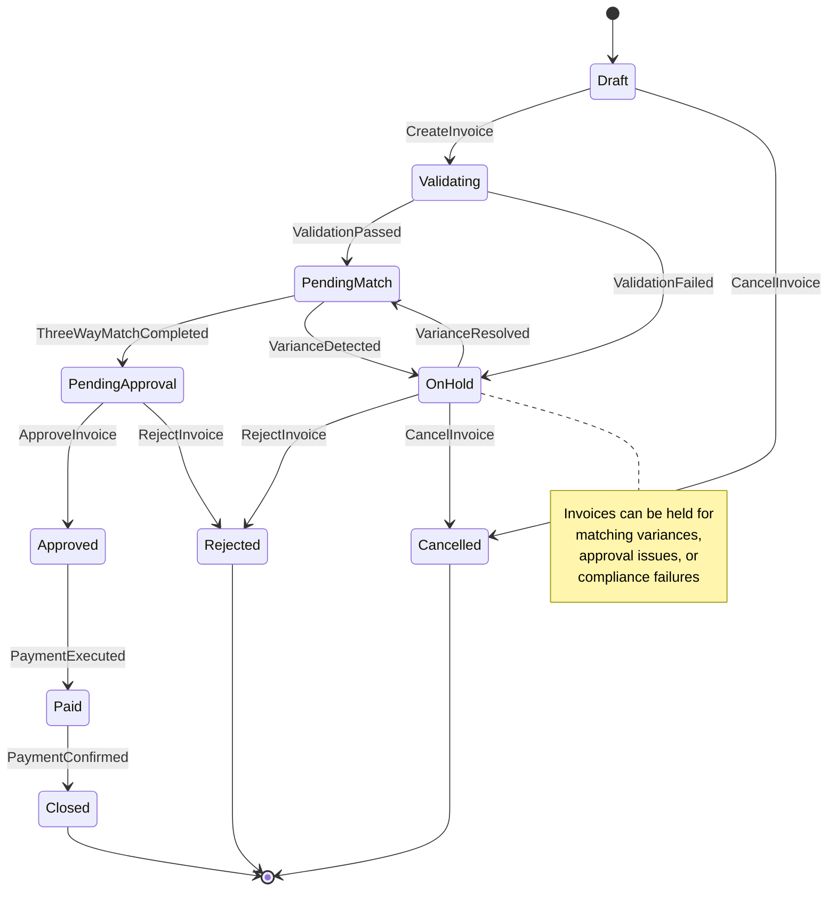

**Commands Involved**:
- `CreateInvoice` - Initiate invoice processing
- `ValidateInvoice` - Verify business rules and matching requirements
- `ApproveInvoice` - Authorize invoice for payment
- `RejectInvoice` - Return invoice to originator
- `CancelInvoice` - Void invoice before processing
- `MarkInvoicePaid` - Record payment completion
- `ResolveVariance` - Handle three-way matching discrepancies

**Events Involved**:
- `InvoiceReceived` - Invoice successfully entered into system
- `InvoiceValidated` - Validation process completed
- `InvoiceApproved` - Authorization received for payment
- `InvoiceRejected` - Invoice returned to originator
- `InvoiceCancelled` - Invoice voided before processing
- `InvoiceMarkedAsPaid` - Payment processing completed
- `VarianceResolved` - Matching discrepancy corrected

**Business Rules**:
- Vendor must be active and approved for transactions
- Invoice numbers must be unique per vendor
- Three-way matching required for PO-based invoices
- Approval authority based on invoice amount and type
- GL distributions must sum to invoice total

---

### 2. Three-Way Matching Workflow

**Description**: Sophisticated matching process coordinating purchase orders, goods receipts, and vendor invoices with tolerance checking and variance resolution.

**State Transitions**:
`Match Initiated` → `Collecting Documents` → `Analyzing` → `Variance Detection` → `Resolution` → `Completed`

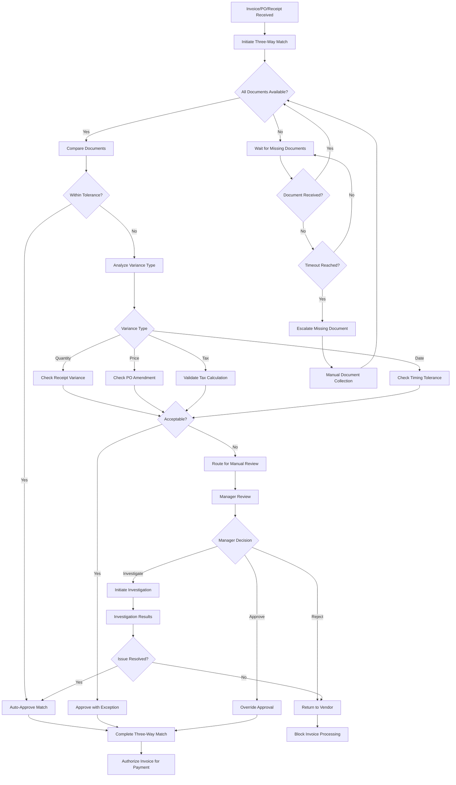

**Commands Involved**:
- `InitiateThreeWayMatch` - Begin matching process
- `CollectMatchingDocuments` - Gather PO, receipt, and invoice
- `AnalyzeVariances` - Compare documents for differences
- `ProcessVariance` - Handle tolerance exceptions
- `ApproveVariance` - Authorize variance acceptance
- `RejectMatch` - Decline matching due to variances
- `CompleteThreeWayMatch` - Finalize matching process

**Events Involved**:
- `ThreeWayMatchInitiated` - Matching process started
- `MatchingDocumentsCollected` - All documents available
- `VariancesAnalyzed` - Document differences identified
- `VarianceProcessed` - Exception handling completed
- `VarianceApproved` - Variance acceptance authorized
- `MatchRejected` - Matching declined
- `ThreeWayMatchCompleted` - Process successfully finished

**Business Rules**:
- Quantity variances within 5% tolerance auto-approved
- Price variances above $100 require manager approval
- Date variances beyond 7 days trigger investigation
- Tax calculation variances require recalculation
- All variances maintain detailed audit trail

---

### 3. Vendor Onboarding Workflow

**Description**: Comprehensive vendor establishment including compliance validation, risk assessment, banking setup, and approval coordination with regulatory screening.

**State Transitions**:
`Vendor Proposed` → `Onboarding` → `Validating` → `Risk Assessment` → `Approved` → `Active`

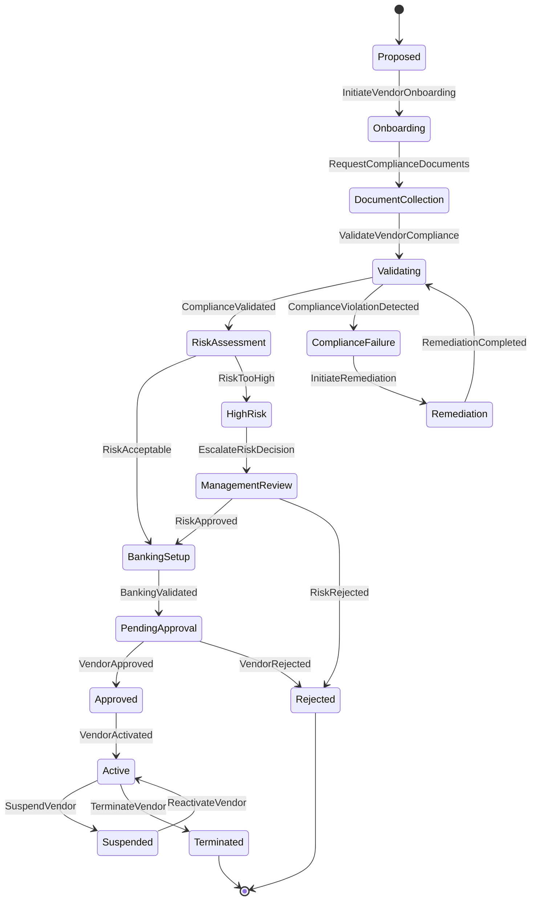

**Commands Involved**:
- `InitiateVendorOnboarding` - Begin vendor establishment process
- `RequestComplianceDocuments` - Gather required documentation
- `ValidateVendorCompliance` - Verify regulatory and business requirements
- `AssessVendorRisk` - Evaluate vendor risk profile
- `SetupBankingDetails` - Configure payment methods
- `ApproveVendor` - Authorize vendor for transactions
- `ActivateVendor` - Enable vendor for business operations

**Events Involved**:
- `VendorOnboardingInitiated` - Establishment process started
- `ComplianceDocumentsRequested` - Documentation gathering begun
- `VendorComplianceValidated` - Requirements verified
- `VendorRiskAssessed` - Risk evaluation completed
- `BankingDetailsSetup` - Payment configuration completed
- `VendorApproved` - Authorization received
- `VendorActivated` - Vendor enabled for operations

**Business Rules**:
- All compliance documents must be current and valid
- Risk assessment must be within acceptable company limits
- Banking information requires validation through prenote or microdeposit
- Final approval authority appropriate for vendor classification
- OFAC screening required for all new vendors

---

## Payment Processing Workflows

### 4. Payment Run Processing Workflow

**Description**: Batch payment processing including invoice selection, optimization for discounts, approval coordination, and multi-method payment execution with monitoring.

**State Transitions**:
`Run Initiated` → `Invoice Selection` → `Optimization` → `Approval` → `Execution` → `Confirmation` → `Completed`

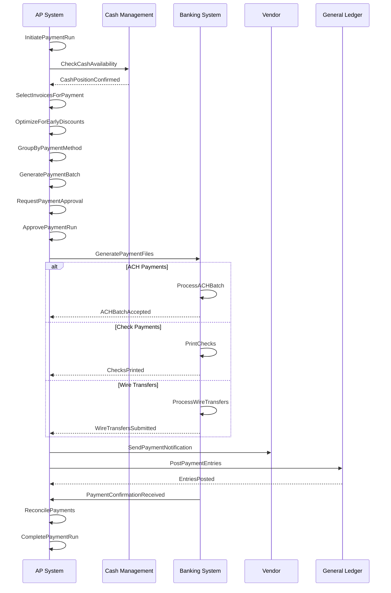

**Commands Involved**:
- `InitiatePaymentRun` - Begin batch payment process
- `SelectInvoicesForPayment` - Choose invoices for payment
- `OptimizePaymentSchedule` - Maximize early payment discounts
- `ApprovePaymentRun` - Authorize payment execution
- `ExecutePaymentRun` - Process payment batch
- `GeneratePaymentFiles` - Create bank transmission files
- `ConfirmPayments` - Verify payment settlement

**Events Involved**:
- `PaymentRunInitiated` - Batch process started
- `InvoicesSelectedForPayment` - Payment queue populated
- `PaymentScheduleOptimized` - Discount optimization completed
- `PaymentRunApproved` - Authorization received
- `PaymentRunExecuted` - Batch processing completed
- `PaymentFilesGenerated` - Bank files created
- `PaymentsConfirmed` - Settlement verification received

**Business Rules**:
- Payment run approval required for amounts exceeding thresholds
- Early payment discount NPV analysis for optimization
- Payment method selection based on vendor preferences and cost
- Cash availability validation before execution
- Dual approval required for high-value payment runs

---

### 5. Check Payment Processing Workflow

**Description**: Check-specific payment processing including printing, signature authorization, positive pay file generation, and bank reconciliation with fraud prevention.

**State Transitions**:
`Check Authorized` → `Printing` → `Signature Required` → `Mailed` → `Cleared` → `Reconciled`

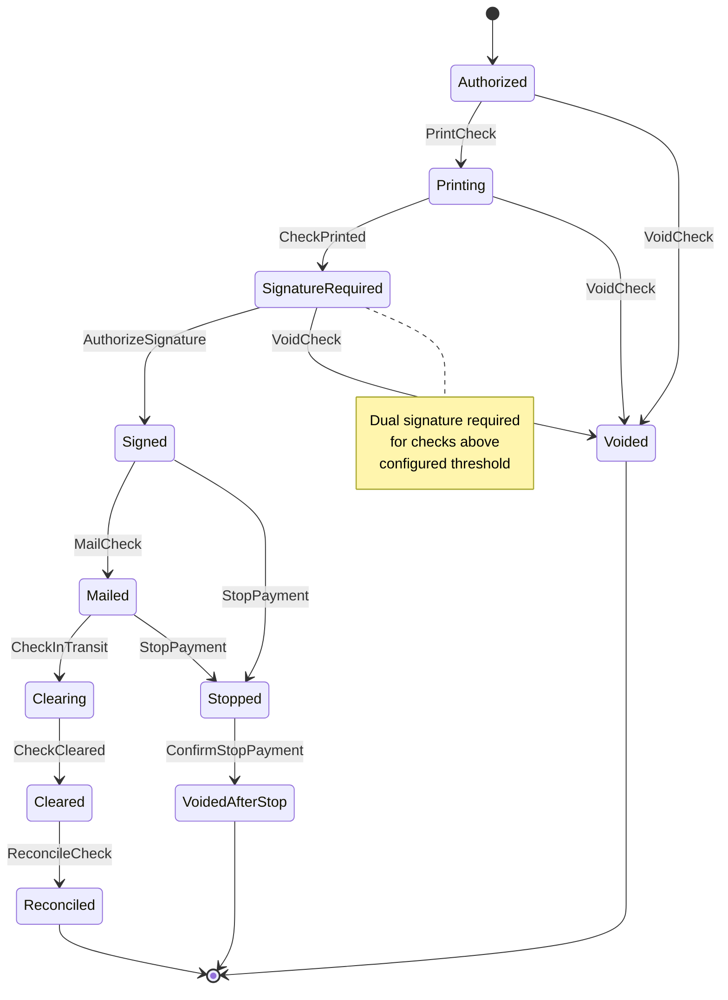

**Commands Involved**:
- `PrintCheck` - Generate physical check
- `AuthorizeSignature` - Approve check signing
- `GeneratePositivePayFile` - Create fraud prevention file
- `MailCheck` - Process check delivery
- `StopPayment` - Initiate stop payment request
- `VoidCheck` - Cancel check before or after printing
- `ReconcileCheck` - Match check to bank statement

**Events Involved**:
- `CheckPrinted` - Physical check generated
- `SignatureAuthorized` - Check signing approved
- `PositivePayFileGenerated` - Fraud prevention file created
- `CheckMailed` - Check sent to vendor
- `StopPaymentInitiated` - Stop payment requested
- `CheckVoided` - Check cancelled
- `CheckReconciled` - Bank reconciliation completed

**Business Rules**:
- Prenumbered check control with gap analysis
- Dual signature required for checks above threshold amount
- Positive pay file generation for fraud prevention
- Stop payment authorization within bank cutoff times
- Check reconciliation within 90 days of issue

---

## Vendor Management Workflows

### 6. Vendor Performance Management Workflow

**Description**: Continuous vendor performance monitoring including scorecard generation, performance analysis, improvement planning, and relationship optimization.

**State Transitions**:
`Performance Baseline` → `Monitoring` → `Analysis` → `Scorecard` → `Action Planning` → `Improvement`

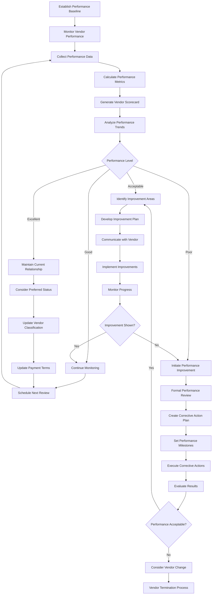

**Commands Involved**:
- `UpdatePerformanceMetrics` - Record vendor performance data
- `GenerateScorecard` - Create performance evaluation
- `AnalyzePerformanceTrends` - Examine performance patterns
- `InitiateImprovementPlan` - Begin performance enhancement
- `ClassifyVendor` - Update vendor classification
- `SchedulePerformanceReview` - Plan formal review
- `TerminateVendor` - End vendor relationship

**Events Involved**:
- `PerformanceMetricsUpdated` - Performance data recorded
- `ScorecardGenerated` - Evaluation completed
- `PerformanceTrendsAnalyzed` - Pattern analysis finished
- `ImprovementPlanInitiated` - Enhancement process begun
- `VendorClassified` - Classification updated
- `PerformanceReviewScheduled` - Review planned
- `VendorTerminated` - Relationship ended

**Business Rules**:
- Performance evaluation based on invoice accuracy, delivery performance, quality, and compliance
- Scorecard generation monthly for strategic vendors, quarterly for others
- Performance improvement plans require vendor agreement
- Poor performance triggers procurement review and potential vendor change
- Classification changes affect payment terms and processing priority

---

## Advanced Payment Workflows

### 7. Electronic Payments Workflow

**Description**: Electronic payment processing including ACH, wire transfers, and virtual cards with bank integration, security validation, and confirmation tracking.

**State Transitions**:
`Payment Authorized` → `Bank Validation` → `File Generation` → `Transmission` → `Settlement` → `Confirmed`

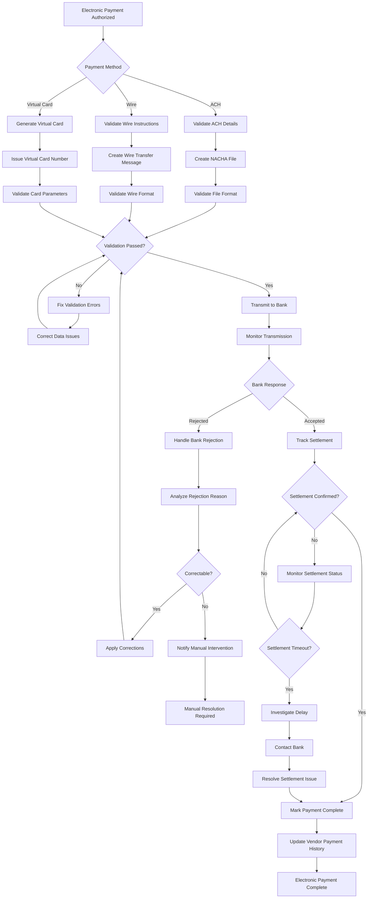

**Commands Involved**:
- `ProcessElectronicPayment` - Handle electronic payment methods
- `ValidatePaymentDetails` - Verify banking and payment information
- `GeneratePaymentFile` - Create bank transmission file
- `TransmitPaymentFile` - Send file to banking system
- `TrackSettlement` - Monitor payment settlement
- `HandleBankRejection` - Process rejected payments
- `ConfirmSettlement` - Verify payment completion

**Events Involved**:
- `ElectronicPaymentProcessed` - Electronic payment initiated
- `PaymentDetailsValidated` - Banking information verified
- `PaymentFileGenerated` - Bank file created
- `PaymentFileTransmitted` - File sent to bank
- `SettlementTracked` - Settlement monitoring begun
- `BankRejectionHandled` - Rejection processed
- `SettlementConfirmed` - Payment completion verified

**Business Rules**:
- Electronic payment validation required for new vendor banking details
- NACHA file format compliance for ACH payments
- Wire transfer authentication and authorization procedures
- Virtual card spending limits and merchant restrictions
- Settlement confirmation required within business day timing

---

### 8. Recurring Invoice Automation Workflow

**Description**: Automated recurring invoice processing including template management, schedule coordination, generation monitoring, and exception handling.

**State Transitions**:
`Template Created` → `Active` → `Generation Due` → `Invoice Generated` → `Processed` → `Next Cycle`

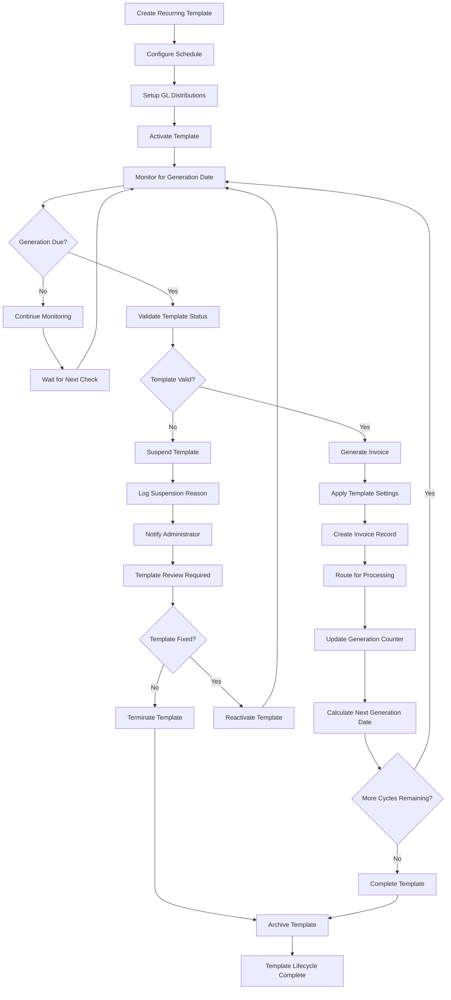

**Commands Involved**:
- `CreateRecurringTemplate` - Setup automated invoice template
- `ActivateTemplate` - Enable automatic generation
- `ProcessRecurringInvoice` - Generate invoice from template
- `UpdateTemplate` - Modify template parameters
- `SuspendTemplate` - Pause automatic generation
- `DeactivateTemplate` - End recurring process
- `ArchiveTemplate` - Preserve template history

**Events Involved**:
- `RecurringTemplateCreated` - Template successfully established
- `TemplateActivated` - Automatic generation enabled
- `RecurringInvoiceGenerated` - Invoice created from template
- `TemplateUpdated` - Template parameters modified
- `TemplateSuspended` - Generation paused
- `TemplateDeactivated` - Recurring process ended
- `TemplateArchived` - Historical data preserved

**Business Rules**:
- Template vendor must remain active throughout recurring cycle
- Generation schedule validates against business calendar
- Template amounts require approval for significant changes
- Failed generation triggers error handling and notification
- Template lifecycle maintains complete audit trail

---

## Compliance and Tax Workflows

### 9. Tax Form 1099 Processing Workflow

**Description**: Annual 1099 tax reporting including vendor qualification, payment tracking, form generation, distribution, and regulatory filing with compliance validation.

**State Transitions**:
`Qualification Assessment` → `Payment Tracking` → `Form Generation` → `Distribution` → `Filing` → `Archived`

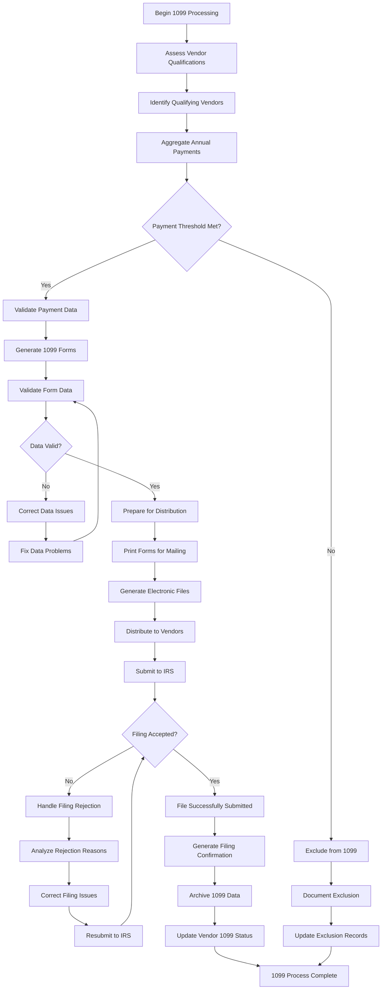

**Commands Involved**:
- `QualifyVendorFor1099` - Assess vendor eligibility
- `TrackReportablePayment` - Record qualifying payments
- `Generate1099Forms` - Create tax forms
- `DistributeForms` - Send forms to vendors
- `File1099Returns` - Submit to regulatory authority
- `Archive1099Data` - Preserve tax records
- `Handle1099Exception` - Process filing issues

**Events Involved**:
- `VendorQualifiedFor1099` - Eligibility determined
- `ReportablePaymentTracked` - Qualifying payment recorded
- `1099FormsGenerated` - Tax forms created
- `FormsDistributed` - Forms sent to vendors
- `1099ReturnsFileed` - Regulatory submission completed
- `1099DataArchived` - Records preserved
- `1099ExceptionHandled` - Issues processed

**Business Rules**:
- Vendor qualification based on payment thresholds and business type
- Payment aggregation includes all qualifying payments for calendar year
- Form generation must meet IRS formatting requirements
- Distribution deadline compliance for vendor and IRS submissions
- Historical data retention for audit and compliance purposes

---

### 10. Compliance Monitoring Workflow

**Description**: Continuous compliance monitoring including regulatory requirement tracking, violation detection, investigation coordination, and corrective action management.

**State Transitions**:
`Active Monitoring` → `Issue Detected` → `Investigation` → `Corrective Action` → `Validation` → `Compliant`

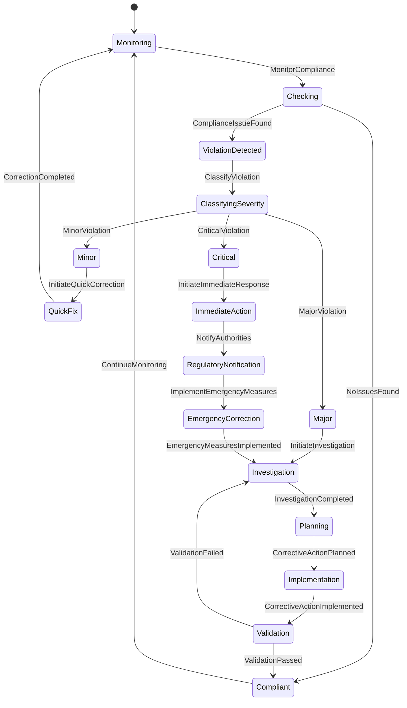

**Commands Involved**:
- `MonitorCompliance` - Check regulatory adherence
- `DetectViolation` - Identify compliance issues
- `ClassifyViolation` - Categorize violation severity
- `InitiateInvestigation` - Begin compliance investigation
- `ImplementCorrectiveAction` - Execute compliance fixes
- `ValidateCompliance` - Verify regulatory adherence
- `GenerateComplianceReport` - Create regulatory documentation

**Events Involved**:
- `ComplianceMonitored` - Adherence checking completed
- `ViolationDetected` - Compliance issue identified
- `ViolationClassified` - Severity categorized
- `InvestigationInitiated` - Investigation begun
- `CorrectiveActionImplemented` - Fixes executed
- `ComplianceValidated` - Adherence verified
- `ComplianceReportGenerated` - Documentation created

**Business Rules**:
- Compliance monitoring frequency based on vendor risk classification
- Violation severity determines response timing and escalation
- Critical violations require immediate regulatory notification
- Corrective action plans require management approval
- All compliance activities maintain detailed audit trails

---

## Period-End and Financial Workflows

### 11. Period-End Closing Workflow

**Description**: Comprehensive AP period-end closing including transaction validation, accrual processing, GL integration, and financial reporting with audit compliance.

**State Transitions**:
`Period End Initiated` → `Transaction Validation` → `Accrual Processing` → `GL Integration` → `Reporting` → `Period Closed`

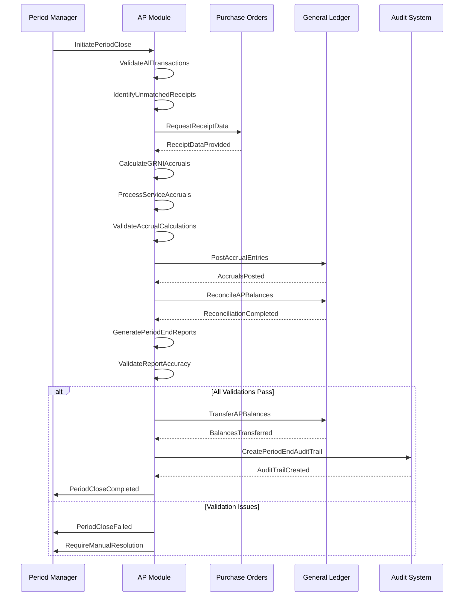

**Commands Involved**:
- `InitiatePeriodClose` - Begin AP period-end procedures
- `ValidateTransactions` - Verify transaction completeness
- `CalculateAccruals` - Compute GRNI and service accruals
- `ProcessServiceAccrual` - Handle service accruals
- `SyncWithGL` - Synchronize with General Ledger
- `GeneratePeriodEndReports` - Create closing reports
- `CompletePeriodClose` - Finalize period-end procedures

**Events Involved**:
- `PeriodCloseInitiated` - Closing procedures started
- `TransactionsValidated` - Transaction verification completed
- `AccrualsCalculated` - Accrual computation finished
- `ServiceAccrualProcessed` - Service accruals handled
- `SyncedWithGL` - GL synchronization completed
- `PeriodEndReportsGenerated` - Closing reports created
- `PeriodClosingCompleted` - Period-end procedures finished

**Business Rules**:
- All AP transactions must be approved before period close
- Accrual calculations include all unmatched receipts
- GL integration must balance perfectly before closing
- Period-end reports require validation before finalization
- Audit trail preservation for regulatory compliance

---

### 12. Cash Forecasting Integration Workflow

**Description**: Cash flow forecasting coordination including payment schedule analysis, liquidity planning, and optimization recommendations with treasury integration.

**State Transitions**:
`Forecast Required` → `Data Collection` → `Analysis` → `Forecasting` → `Optimization` → `Implementation`

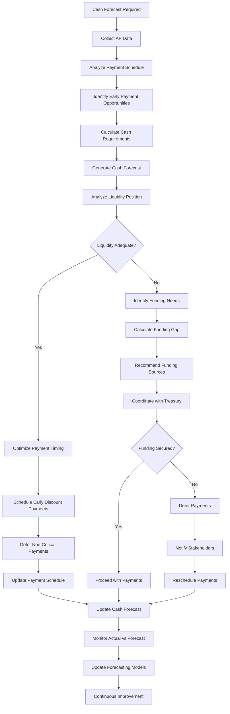

**Commands Involved**:
- `UpdateCashForecast` - Refresh cash flow projections
- `AnalyzePaymentSchedule` - Examine upcoming payments
- `OptimizePaymentTiming` - Balance cash flow and discounts
- `ValidateCashAvailability` - Verify sufficient funds
- `CoordinateWithTreasury` - Align with cash management
- `DeferPayments` - Delay non-critical payments
- `MonitorCashPosition` - Track actual cash flow

**Events Involved**:
- `CashForecastUpdated` - Projections refreshed
- `PaymentScheduleAnalyzed` - Payment timing examined
- `PaymentTimingOptimized` - Cash flow balanced
- `CashAvailabilityValidated` - Funds verified
- `TreasuryCoordinationCompleted` - Cash management aligned
- `PaymentsDeferred` - Non-critical payments delayed
- `CashPositionMonitored` - Actual flow tracked

**Business Rules**:
- Cash forecasting updated daily with current payment schedules
- Early payment discount evaluation based on cost of capital
- Liquidity requirements include safety margin for operations
- Payment deferral requires business impact assessment
- Treasury coordination for funding shortfalls

---

## Integration and Data Management Workflows

### 13. Purchase Order Integration Workflow

**Description**: Seamless integration with purchasing module including PO status synchronization, encumbrance management, and accrual coordination with real-time data exchange.

**State Transitions**:
`PO Created` → `Encumbrance Posted` → `Goods Received` → `Accrued` → `Invoice Matched` → `Paid` → `Closed`

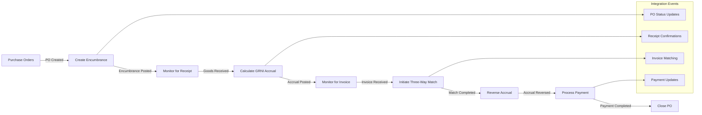

**Commands Involved**:
- `SyncPOStatus` - Synchronize purchase order status
- `CreateEncumbrance` - Record purchase commitment
- `UpdateThreeWayMatch` - Coordinate matching process
- `ReverseAccrual` - Remove accrual upon invoice receipt
- `ClosePurchaseOrder` - Complete PO lifecycle
- `ValidatePOIntegration` - Verify integration accuracy
- `HandlePOException` - Process integration errors

**Events Involved**:
- `POStatusSynced` - Status synchronization completed
- `EncumbranceCreated` - Purchase commitment recorded
- `ThreeWayMatchUpdated` - Matching coordination completed
- `AccrualReversed` - Accrual removal processed
- `PurchaseOrderClosed` - PO lifecycle completed
- `POIntegrationValidated` - Integration accuracy verified
- `POExceptionHandled` - Integration errors processed

**Business Rules**:
- Encumbrance creation required for approved purchase orders
- GRNI accruals calculated using PO price and received quantities
- Three-way matching validates PO, receipt, and invoice consistency
- Accrual reversal occurs automatically upon invoice receipt
- PO closure requires complete invoice and payment processing

---

### 14. GL Integration and Synchronization Workflow

**Description**: Real-time general ledger integration including automatic journal entry generation, balance reconciliation, and financial reporting coordination with error handling.

**State Transitions**:
`AP Transaction Posted` → `GL Entry Generated` → `Posted to GL` → `Reconciled` → `Reported`

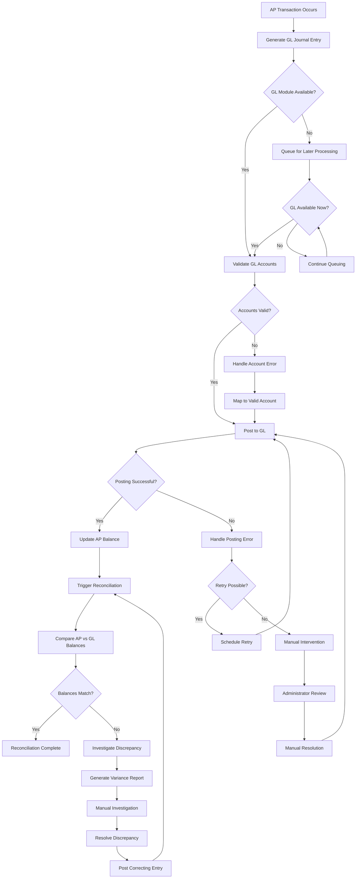

**Commands Involved**:
- `GenerateGLEntries` - Create journal entries for AP transactions
- `PostToGL` - Submit entries to General Ledger
- `ReconcileWithGL` - Compare AP and GL balances
- `SyncAPBalances` - Synchronize balance information
- `HandleGLError` - Process GL integration errors
- `ValidateGLAccounts` - Verify chart of accounts mapping
- `CorrectGLDiscrepancy` - Fix balance differences

**Events Involved**:
- `GLEntriesGenerated` - Journal entries created
- `PostedToGL` - Entries submitted to General Ledger
- `ReconciledWithGL` - Balance comparison completed
- `APBalancesSynced` - Synchronization finished
- `GLErrorHandled` - Integration errors processed
- `GLAccountsValidated` - Account mapping verified
- `GLDiscrepancyCorrected` - Balance differences fixed

**Business Rules**:
- All AP transactions generate corresponding GL entries
- GL posting occurs in real-time when GL module available
- Balance reconciliation required daily at minimum
- Discrepancies above tolerance trigger investigation
- Manual posting approval required for correcting entries

---

## Error Handling and Recovery Workflows

### 15. Transaction Error Recovery Workflow

**Description**: Comprehensive error handling including error classification, recovery strategy determination, compensation processing, and system integrity restoration.

**State Transitions**:
`Error Detected` → `Classified` → `Recovery Strategy` → `Compensation` → `Validation` → `Resolved`

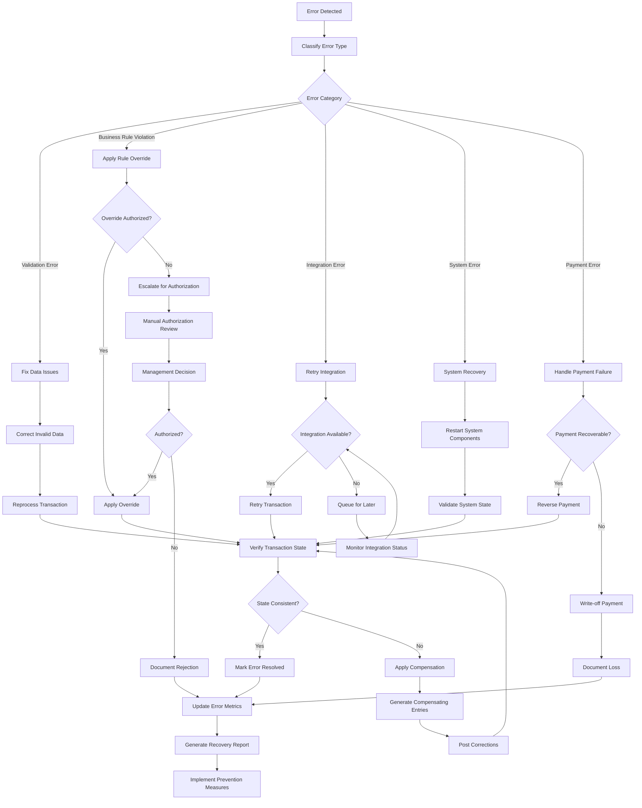

**Commands Involved**:
- `HandleProcessingError` - Process detected errors
- `ClassifyError` - Categorize error types and severity
- `InitiateErrorRecovery` - Begin recovery procedures
- `ApplyCompensation` - Generate compensating transactions
- `ValidateRecovery` - Verify recovery success
- `EscalateError` - Route to manual intervention
- `DocumentErrorResolution` - Record resolution details

**Events Involved**:
- `ProcessingErrorOccurred` - Error detection confirmed
- `ErrorClassified` - Error type and severity determined
- `ErrorRecoveryInitiated` - Recovery procedures started
- `CompensationApplied` - Compensating transactions created
- `RecoveryValidated` - Recovery success verified
- `ErrorEscalated` - Manual intervention required
- `ErrorResolutionDocumented` - Resolution recorded

**Business Rules**:
- All errors classified by type, severity, and financial impact
- Recovery procedures must maintain financial accuracy
- Compensation entries preserve double-entry bookkeeping
- Critical errors require immediate escalation
- Error resolution includes root cause analysis and prevention

---

## Data Import and Migration Workflows

### 16. Bulk Data Import Workflow

**Description**: High-volume data import including file validation, business rule checking, batch processing, and comprehensive error handling with rollback capabilities.

**State Transitions**:
`File Uploaded` → `Validating` → `Processing` → `Reconciling` → `Completed` → `Archived`

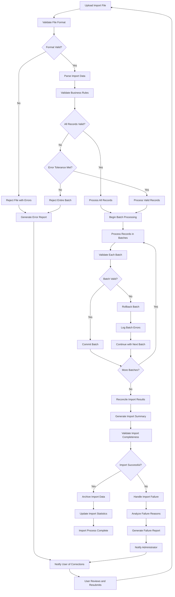

**Commands Involved**:
- `InitiateImport` - Begin import process
- `ValidateImportFile` - Check file format and structure
- `ProcessImportBatch` - Handle batch of records
- `ValidateBusinessRules` - Check data against business rules
- `RollbackImport` - Reverse failed import
- `CompleteImport` - Finalize successful import
- `ArchiveImportData` - Preserve import history

**Events Involved**:
- `ImportInitiated` - Process started
- `ImportFileValidated` - File format verified
- `ImportBatchProcessed` - Batch handled successfully
- `BusinessRulesValidated` - Rules compliance verified
- `ImportRolledBack` - Failed import reversed
- `ImportCompleted` - Process finished successfully
- `ImportDataArchived` - Historical data preserved

**Business Rules**:
- Import file must conform to published format specifications
- All imported records must pass business rule validation
- Error tolerance configurable per import type and criticality
- Failed imports provide detailed error reporting for correction
- Import audit trail preserved for compliance and troubleshooting

---

## Summary

The Accounts Payable domain orchestrates **16 primary workflows** that collectively manage:

- **Invoice Operations**: Receipt, validation, approval, and payment authorization with comprehensive audit trails
- **Payment Processing**: Scheduling, execution, confirmation, and reconciliation across multiple payment methods
- **Vendor Management**: Onboarding, performance monitoring, classification, and lifecycle management
- **Three-Way Matching**: Purchase order, receipt, and invoice coordination with variance resolution
- **Approval Operations**: Multi-level authorization with delegation, escalation, and override capabilities
- **Recurring Operations**: Template-based automation for recurring invoices and payments
- **Tax and Compliance**: 1099 processing, regulatory monitoring, and violation response
- **Document Management**: Invoice document capture, storage, and retrieval with retention compliance
- **Period-End Operations**: Comprehensive closing procedures with accrual and reconciliation
- **Cash Management**: Forecasting, liquidity planning, and payment optimization
- **Integration Operations**: Real-time coordination with purchasing, GL, and other modules
- **Data Operations**: Bulk import processing with validation and error handling
- **Error Recovery**: Comprehensive error handling with compensation and system restoration

Each workflow maintains strict consistency boundaries, implements comprehensive audit trails, and supports sophisticated accounts payable operations including:

- **Multi-method payment processing** (checks, ACH, wire, virtual cards)
- **Advanced approval workflows** with delegation and escalation
- **Three-way matching** with configurable tolerance and variance resolution
- **Vendor relationship management** with performance monitoring and classification
- **Regulatory compliance** with continuous monitoring and violation response
- **Cash flow optimization** with early payment discount analysis
- **Real-time integration** with purchasing, general ledger, and cash management
- **Sophisticated error handling** with recovery and compensation mechanisms

The workflows collectively ensure enterprise-grade accounts payable operations with complete traceability, regulatory compliance, fraud prevention, and operational excellence while maintaining data integrity, financial accuracy, and seamless integration with other Accountex modules for comprehensive ERP functionality.