# Accounts Receivables Agent-Based System Design with Jido

## Executive Summary

This document presents a comprehensive agent-based architecture for the Accounts Receivables module using the Jido framework. The system enables complete automation of AR operations through intelligent agents that handle all aspects of customer billing, payment processing, credit management, and financial operations while maintaining human oversight where required.

## System Architecture Overview

```mermaid
graph TB
    subgraph "Agent Coordination Layer"
        ORC[AR Orchestrator Agent]
        MON[System Monitor Agent]
        ESC[Escalation Manager Agent]
    end
    
    subgraph "Domain Expert Agents"
        CUST[Customer Management Agent]
        INV[Invoice Processing Agent]
        PAY[Payment Processing Agent]
        CRED[Credit Management Agent]
        REC[Recurring Billing Agent]
        FIN[Finance Charge Agent]
        CURR[Currency Management Agent]
        DEP[Bank Deposit Agent]
    end
    
    subgraph "Operational Agents"
        VAL[Validation Agent]
        CALC[Calculation Agent]
        INT[Integration Agent]
        RPT[Reporting Agent]
        AUD[Audit Trail Agent]
        ERR[Error Recovery Agent]
    end
    
    subgraph "Specialized Agents"
        TAX[Tax Calculation Agent]
        DISC[Discount Processing Agent]
        COLL[Collections Agent]
        RECON[Reconciliation Agent]
        PER[Period-End Agent]
        IMP[Import Processing Agent]
    end
    
    ORC --> CUST
    ORC --> INV
    ORC --> PAY
    ORC --> REC
    
    CUST --> VAL
    INV --> CALC
    PAY --> DEP
    CRED --> COLL
    
    MON --> ERR
    ESC --> AUD
    INT --> RPT
```



## Core Agent Definitions

### 1. AR Orchestrator Agent

**Purpose**: Master coordinator for all AR operations, managing workflow orchestration and agent coordination.

```elixir
defmodule Accountex.AR.Agents.AROrchestrator do
  use Jido.Agent,
    name: "ar_orchestrator",
    description: "Orchestrates all AR operations and coordinates domain agents",
    
    actions: [
      Accountex.AR.Actions.RouteRequest,
      Accountex.AR.Actions.CoordinateWorkflow,
      Accountex.AR.Actions.MonitorProgress,
      Accountex.AR.Actions.HandleEscalation,
      Accountex.AR.Actions.AggregateResults
    ],
    
    skills: [
      Accountex.AR.Skills.WorkflowManagement,
      Accountex.AR.Skills.PriorityAssessment,
      Accountex.AR.Skills.ResourceAllocation,
      Accountex.AR.Skills.ConflictResolution
    ],
    
    schema: [
      max_concurrent_workflows: [type: :integer, default: 100],
      escalation_threshold: [type: :integer, default: 3],
      monitoring_interval: [type: :integer, default: 60],
      priority_levels: [type: {:array, :string}, default: ["critical", "high", "normal", "low"]]
    ]

  @impl true
  def handle_instruction(%{action: "process_request"} = instruction, state) do
    # Analyze request type and complexity
    request_analysis = analyze_request(instruction.params.request)
    
    # Determine required agents and workflow
    workflow = determine_workflow(request_analysis)
    
    # Coordinate agent execution
    results = coordinate_agents(workflow, instruction.params)
    
    # Monitor and aggregate results
    final_result = aggregate_results(results)
    
    {:ok, final_result, state}
  end
  
  @impl true
  def handle_event({:workflow_failed, workflow_id, reason}, state) do
    # Trigger escalation and recovery procedures
    escalate_failure(workflow_id, reason)
    attempt_recovery(workflow_id, state)
    {:noreply, state}
  end
end
```

### 2. Customer Management Agent

**Purpose**: Manages all customer-related operations including creation, updates, credit evaluation, and lifecycle management.

```elixir
defmodule Accountex.AR.Agents.CustomerManagement do
  use Jido.Agent,
    name: "customer_management",
    description: "Handles customer lifecycle and profile management",
    
    actions: [
      Accountex.AR.Actions.CreateCustomer,
      Accountex.AR.Actions.UpdateCustomerProfile,
      Accountex.AR.Actions.EvaluateCredit,
      Accountex.AR.Actions.AssignPaymentTerms,
      Accountex.AR.Actions.ManageAddresses,
      Accountex.AR.Actions.ArchiveCustomer,
      Accountex.AR.Actions.MonitorCustomerActivity
    ],
    
    skills: [
      Accountex.AR.Skills.CreditAnalysis,
      Accountex.AR.Skills.RiskAssessment,
      Accountex.AR.Skills.CustomerSegmentation,
      Accountex.AR.Skills.ComplianceValidation
    ],
    
    schema: [
      credit_check_threshold: [type: :decimal, default: 10000],
      auto_credit_approval_limit: [type: :decimal, default: 5000],
      risk_tolerance: [type: :atom, default: :medium],
      customer_segments: [type: {:array, :string}]
    ]

  @impl true
  def handle_instruction(%{action: "create_customer"} = instruction, state) do
    with {:ok, validated_data} <- validate_customer_data(instruction.params),
         {:ok, credit_assessment} <- assess_initial_credit(validated_data),
         {:ok, customer} <- create_customer_aggregate(validated_data, credit_assessment),
         {:ok, _} <- setup_customer_relationships(customer) do
      
      emit_event(%CustomerCreated{
        customer_id: customer.id,
        credit_limit: credit_assessment.approved_limit,
        payment_terms: credit_assessment.recommended_terms
      })
      
      {:ok, customer, state}
    else
      {:error, reason} -> handle_creation_error(reason, state)
    end
  end
end
```

### 3. Invoice Processing Agent

**Purpose**: Manages invoice creation, validation, amendments, and lifecycle processing.

```elixir
defmodule Accountex.AR.Agents.InvoiceProcessing do
  use Jido.Agent,
    name: "invoice_processing",
    description: "Handles invoice generation and management",
    
    actions: [
      Accountex.AR.Actions.CreateInvoice,
      Accountex.AR.Actions.ValidateInvoiceData,
      Accountex.AR.Actions.CalculateTotals,
      Accountex.AR.Actions.ApplyDiscounts,
      Accountex.AR.Actions.ProcessTaxes,
      Accountex.AR.Actions.AmendInvoice,
      Accountex.AR.Actions.VoidInvoice,
      Accountex.AR.Actions.GenerateInvoiceNumber
    ],
    
    skills: [
      Accountex.AR.Skills.PricingCalculation,
      Accountex.AR.Skills.TaxComputation,
      Accountex.AR.Skills.DiscountApplication,
      Accountex.AR.Skills.FreightCalculation,
      Accountex.AR.Skills.InventoryValidation
    ],
    
    schema: [
      auto_number_invoices: [type: :boolean, default: true],
      tax_calculation_method: [type: :atom, default: :line_item],
      allow_negative_quantities: [type: :boolean, default: false],
      require_po_number: [type: :boolean, default: false]
    ]

  @impl true
  def handle_instruction(%{action: "create_invoice"} = instruction, state) do
    # Complex invoice creation workflow
    workflow = %InvoiceCreationWorkflow{
      customer_id: instruction.params.customer_id,
      line_items: instruction.params.line_items,
      invoice_date: instruction.params.invoice_date
    }
    
    workflow
    |> validate_customer_status()
    |> check_credit_availability()
    |> validate_inventory_availability()
    |> calculate_line_totals()
    |> apply_customer_discounts()
    |> calculate_taxes()
    |> calculate_freight()
    |> generate_invoice_number()
    |> create_invoice_aggregate()
    |> emit_invoice_created_event()
    |> update_customer_balance()
    |> post_to_gl()
    |> case do
      {:ok, invoice} -> {:ok, invoice, state}
      {:error, reason} -> handle_invoice_error(reason, state)
    end
  end
end
```

### 4. Payment Processing Agent

**Purpose**: Handles payment receipt, application, and management including electronic payments.

```elixir
defmodule Accountex.AR.Agents.PaymentProcessing do
  use Jido.Agent,
    name: "payment_processing",
    description: "Manages payment receipt and application",
    
    actions: [
      Accountex.AR.Actions.ApplyPayment,
      Accountex.AR.Actions.AllocateToInvoices,
      Accountex.AR.Actions.CalculateDiscounts,
      Accountex.AR.Actions.CreateOpenCredit,
      Accountex.AR.Actions.ProcessElectronicPayment,
      Accountex.AR.Actions.VoidPayment,
      Accountex.AR.Actions.ReconcilePayments
    ],
    
    skills: [
      Accountex.AR.Skills.PaymentAllocation,
      Accountex.AR.Skills.DiscountCalculation,
      Accountex.AR.Skills.ElectronicPaymentProcessing,
      Accountex.AR.Skills.PaymentMatching
    ],
    
    schema: [
      auto_apply_payments: [type: :boolean, default: true],
      application_method: [type: :atom, default: :oldest_first],
      discount_tolerance: [type: :decimal, default: 0.01],
      electronic_payment_enabled: [type: :boolean, default: true]
    ]

  @impl true
  def handle_instruction(%{action: "apply_payment"} = instruction, state) do
    payment_data = instruction.params
    
    # Intelligent payment application
    with {:ok, customer} <- fetch_customer(payment_data.customer_id),
         {:ok, open_invoices} <- fetch_open_invoices(customer.id),
         {:ok, allocation_plan} <- create_allocation_plan(payment_data, open_invoices),
         {:ok, applications} <- apply_allocations(allocation_plan),
         {:ok, open_credit} <- handle_overpayment(payment_data, applications) do
      
      emit_payment_events(applications, open_credit)
      update_customer_metrics(customer, payment_data)
      
      {:ok, %{applications: applications, open_credit: open_credit}, state}
    end
  end
  
  defp create_allocation_plan(payment, invoices) do
    # Intelligent allocation based on:
    # - Payment terms and discount eligibility
    # - Customer preferences
    # - Invoice age and priority
    # - Partial payment handling
    
    IntelligentAllocator.allocate(payment, invoices)
  end
end
```

### 5. Credit Management Agent

**Purpose**: Manages customer credit evaluation, monitoring, and enforcement.

```elixir
defmodule Accountex.AR.Agents.CreditManagement do
  use Jido.Agent,
    name: "credit_management",
    description: "Monitors and manages customer credit",
    
    actions: [
      Accountex.AR.Actions.EvaluateCreditLimit,
      Accountex.AR.Actions.ProcessCreditHold,
      Accountex.AR.Actions.ReleaseCreditHold,
      Accountex.AR.Actions.MonitorCreditExposure,
      Accountex.AR.Actions.AssessRisk,
      Accountex.AR.Actions.RecommendCreditTerms,
      Accountex.AR.Actions.ProcessWriteOff
    ],
    
    skills: [
      Accountex.AR.Skills.CreditScoring,
      Accountex.AR.Skills.RiskAnalysis,
      Accountex.AR.Skills.PaymentBehaviorAnalysis,
      Accountex.AR.Skills.IndustryBenchmarking
    ],
    
    schema: [
      risk_model: [type: :string, default: "standard"],
      auto_hold_threshold: [type: :decimal, default: 0.9],
      review_frequency: [type: :integer, default: 30],
      write_off_authority: [type: :decimal, default: 1000]
    ]

  @impl true
  def handle_instruction(%{action: "evaluate_credit"} = instruction, state) do
    customer_id = instruction.params.customer_id
    
    # Comprehensive credit evaluation
    evaluation = %CreditEvaluation{}
    |> analyze_payment_history(customer_id)
    |> check_external_credit_sources()
    |> assess_industry_risk()
    |> calculate_days_sales_outstanding()
    |> review_order_patterns()
    |> determine_credit_recommendation()
    
    case evaluation do
      %{recommendation: :approve, limit: limit} ->
        approve_credit(customer_id, limit)
        {:ok, evaluation, state}
        
      %{recommendation: :hold} ->
        place_credit_hold(customer_id, evaluation.reasons)
        {:ok, evaluation, state}
        
      %{recommendation: :review} ->
        escalate_for_review(customer_id, evaluation)
        {:ok, evaluation, state}
    end
  end
end
```

### 6. Recurring Billing Agent

**Purpose**: Manages recurring invoice templates and automated generation.

```elixir
defmodule Accountex.AR.Agents.RecurringBilling do
  use Jido.Agent,
    name: "recurring_billing",
    description: "Handles recurring invoice generation and management",
    
    actions: [
      Accountex.AR.Actions.CreateRecurringTemplate,
      Accountex.AR.Actions.GenerateRecurringInvoices,
      Accountex.AR.Actions.AmendTemplate,
      Accountex.AR.Actions.SuspendTemplate,
      Accountex.AR.Actions.ReactivateTemplate,
      Accountex.AR.Actions.MonitorGenerationSchedule
    ],
    
    skills: [
      Accountex.AR.Skills.ScheduleManagement,
      Accountex.AR.Skills.TemplateValidation,
      Accountex.AR.Skills.PricingUpdate,
      Accountex.AR.Skills.GenerationOrchestration
    ],
    
    schema: [
      generation_lead_time: [type: :integer, default: 3],
      auto_price_update: [type: :boolean, default: false],
      retry_failed_generation: [type: :boolean, default: true],
      max_retry_attempts: [type: :integer, default: 3]
    ]

  @impl true
  def handle_scheduled(:generate_recurring_invoices, state) do
    # Daily scheduled task to generate recurring invoices
    today = Date.utc_today()
    
    eligible_templates = fetch_eligible_templates(today)
    
    generation_results = Enum.map(eligible_templates, fn template ->
      generate_invoice_from_template(template, today)
    end)
    
    successful = Enum.filter(generation_results, &match?({:ok, _}, &1))
    failed = Enum.filter(generation_results, &match?({:error, _}, &1))
    
    handle_generation_failures(failed)
    emit_generation_summary(successful, failed)
    
    {:noreply, state}
  end
end
```

### 7. Finance Charge Agent

**Purpose**: Calculates and applies finance charges to past-due accounts.

```elixir
defmodule Accountex.AR.Agents.FinanceCharge do
  use Jido.Agent,
    name: "finance_charge",
    description: "Processes finance charges for past-due accounts",
    
    actions: [
      Accountex.AR.Actions.IdentifyEligibleAccounts,
      Accountex.AR.Actions.CalculateFinanceCharges,
      Accountex.AR.Actions.ApplyCharges,
      Accountex.AR.Actions.GenerateChargeInvoices,
      Accountex.AR.Actions.NotifyCustomers,
      Accountex.AR.Actions.AdjustCharges
    ],
    
    skills: [
      Accountex.AR.Skills.InterestCalculation,
      Accountex.AR.Skills.CompoundInterest,
      Accountex.AR.Skills.RegulatoryCompliance,
      Accountex.AR.Skills.CustomerNotification
    ],
    
    schema: [
      charge_method: [type: :atom, default: :simple_interest],
      annual_rate: [type: :decimal, default: 0.18],
      minimum_balance: [type: :decimal, default: 25.00],
      grace_period_days: [type: :integer, default: 30],
      compound_frequency: [type: :atom, default: :monthly]
    ]

  @impl true
  def handle_instruction(%{action: "process_finance_charges"} = instruction, state) do
    charge_date = instruction.params.charge_date || Date.utc_today()
    
    # Process finance charges workflow
    eligible_accounts = identify_eligible_accounts(charge_date, state.minimum_balance)
    
    charge_results = Enum.map(eligible_accounts, fn account ->
      with {:ok, charges} <- calculate_charges(account, state),
           {:ok, invoice} <- create_charge_invoice(account, charges),
           {:ok, _} <- apply_to_customer_balance(account, charges),
           {:ok, _} <- send_notification(account, charges) do
        {:ok, %{account_id: account.id, charge_amount: charges.total}}
      else
        error -> error
      end
    end)
    
    summarize_and_report(charge_results)
    {:ok, charge_results, state}
  end
end
```

### 8. Currency Management Agent

**Purpose**: Handles multi-currency operations and revaluation.

```elixir
defmodule Accountex.AR.Agents.CurrencyManagement do
  use Jido.Agent,
    name: "currency_management",
    description: "Manages foreign currency and revaluation",
    
    actions: [
      Accountex.AR.Actions.UpdateExchangeRates,
      Accountex.AR.Actions.CalculateRevaluation,
      Accountex.AR.Actions.PostRevaluationEntries,
      Accountex.AR.Actions.ConvertCurrency,
      Accountex.AR.Actions.ValidateRates,
      Accountex.AR.Actions.ArchiveRateHistory
    ],
    
    skills: [
      Accountex.AR.Skills.ExchangeRateValidation,
      Accountex.AR.Skills.RevaluationCalculation,
      Accountex.AR.Skills.GainLossComputation,
      Accountex.AR.Skills.RateSourceIntegration
    ],
    
    schema: [
      base_currency: [type: :string, default: "USD"],
      rate_source: [type: :string, default: "central_bank"],
      revaluation_frequency: [type: :atom, default: :monthly],
      rate_tolerance: [type: :decimal, default: 0.05],
      auto_revalue: [type: :boolean, default: false]
    ]

  @impl true
  def handle_instruction(%{action: "perform_revaluation"} = instruction, state) do
    revaluation_date = instruction.params.date
    
    # Comprehensive revaluation process
    with {:ok, current_rates} <- fetch_current_rates(revaluation_date),
         {:ok, foreign_balances} <- identify_foreign_currency_balances(),
         {:ok, calculations} <- calculate_unrealized_gains_losses(foreign_balances, current_rates),
         {:ok, journal_entries} <- create_revaluation_entries(calculations),
         {:ok, _} <- post_to_general_ledger(journal_entries) do
      
      emit_revaluation_completed(calculations)
      archive_revaluation_results(calculations)
      
      {:ok, calculations, state}
    end
  end
end
```

### 9. Bank Deposit Agent

**Purpose**: Manages bank deposit creation, verification, and reconciliation.

```elixir
defmodule Accountex.AR.Agents.BankDeposit do
  use Jido.Agent,
    name: "bank_deposit",
    description: "Handles bank deposit processing and reconciliation",
    
    actions: [
      Accountex.AR.Actions.CreateDeposit,
      Accountex.AR.Actions.SelectPayments,
      Accountex.AR.Actions.ValidateDepositTotal,
      Accountex.AR.Actions.VerifyDeposit,
      Accountex.AR.Actions.ReconcileDeposit,
      Accountex.AR.Actions.AmendDeposit,
      Accountex.AR.Actions.VoidDeposit
    ],
    
    skills: [
      Accountex.AR.Skills.PaymentGrouping,
      Accountex.AR.Skills.DepositValidation,
      Accountex.AR.Skills.BankReconciliation,
      Accountex.AR.Skills.DiscrepancyResolution
    ],
    
    schema: [
      auto_group_payments: [type: :boolean, default: true],
      grouping_method: [type: :atom, default: :by_date],
      require_verification: [type: :boolean, default: true],
      discrepancy_tolerance: [type: :decimal, default: 0.01]
    ]
end
```

## Specialized Support Agents

### 10. Validation Agent

**Purpose**: Performs comprehensive validation across all AR operations.

```elixir
defmodule Accountex.AR.Agents.Validation do
  use Jido.Agent,
    name: "validation",
    description: "Validates data and business rules",
    
    actions: [
      Accountex.AR.Actions.ValidateCustomerData,
      Accountex.AR.Actions.ValidateInvoiceData,
      Accountex.AR.Actions.ValidatePaymentData,
      Accountex.AR.Actions.CheckBusinessRules,
      Accountex.AR.Actions.VerifyIntegrity,
      Accountex.AR.Actions.ValidateGLMappings
    ],
    
    skills: [
      Accountex.AR.Skills.DataValidation,
      Accountex.AR.Skills.BusinessRuleEngine,
      Accountex.AR.Skills.IntegrityChecking,
      Accountex.AR.Skills.ComplianceVerification
    ]
end
```

### 11. Calculation Agent

**Purpose**: Handles all complex calculations in the AR system.

```elixir
defmodule Accountex.AR.Agents.Calculation do
  use Jido.Agent,
    name: "calculation",
    description: "Performs AR calculations",
    
    actions: [
      Accountex.AR.Actions.CalculateTotals,
      Accountex.AR.Actions.ComputeTaxes,
      Accountex.AR.Actions.ApplyDiscounts,
      Accountex.AR.Actions.CalculateAging,
      Accountex.AR.Actions.ComputeDSO,
      Accountex.AR.Actions.CalculateFinanceCharges
    ],
    
    skills: [
      Accountex.AR.Skills.TaxCalculation,
      Accountex.AR.Skills.DiscountComputation,
      Accountex.AR.Skills.AgingAnalysis,
      Accountex.AR.Skills.MetricsCalculation
    ]
end
```

### 12. Integration Agent

**Purpose**: Manages integration with other Accountex modules.

```elixir
defmodule Accountex.AR.Agents.Integration do
  use Jido.Agent,
    name: "integration",
    description: "Handles cross-module integration",
    
    actions: [
      Accountex.AR.Actions.PostToGL,
      Accountex.AR.Actions.CheckInventory,
      Accountex.AR.Actions.CreateAPVoucher,
      Accountex.AR.Actions.PublishEvents,
      Accountex.AR.Actions.SubscribeToEvents,
      Accountex.AR.Actions.SyncData
    ],
    
    skills: [
      Accountex.AR.Skills.EventPublication,
      Accountex.AR.Skills.DataSynchronization,
      Accountex.AR.Skills.ModuleCommunication,
      Accountex.AR.Skills.CircuitBreaking
    ],
    
    schema: [
      circuit_breaker_threshold: [type: :integer, default: 5],
      retry_attempts: [type: :integer, default: 3],
      timeout_seconds: [type: :integer, default: 30],
      async_processing: [type: :boolean, default: true]
    ]
end
```

### 13. Period-End Agent

**Purpose**: Orchestrates period-end closing procedures.

```elixir
defmodule Accountex.AR.Agents.PeriodEnd do
  use Jido.Agent,
    name: "period_end",
    description: "Manages period-end closing",
    
    actions: [
      Accountex.AR.Actions.InitiatePeriodClose,
      Accountex.AR.Actions.ValidateTransactions,
      Accountex.AR.Actions.CalculateAging,
      Accountex.AR.Actions.ReconcileGL,
      Accountex.AR.Actions.GenerateReports,
      Accountex.AR.Actions.ClosePeriod,
      Accountex.AR.Actions.ArchiveData
    ],
    
    skills: [
      Accountex.AR.Skills.ClosingCoordination,
      Accountex.AR.Skills.TransactionValidation,
      Accountex.AR.Skills.ReconciliationManagement,
      Accountex.AR.Skills.ReportGeneration
    ]
end
```

### 14. Collections Agent

**Purpose**: Manages collection activities for past-due accounts.

```elixir
defmodule Accountex.AR.Agents.Collections do
  use Jido.Agent,
    name: "collections",
    description: "Handles collection activities",
    
    actions: [
      Accountex.AR.Actions.IdentifyPastDueAccounts,
      Accountex.AR.Actions.PrioritizeCollections,
      Accountex.AR.Actions.GenerateCollectionLetters,
      Accountex.AR.Actions.ScheduleFollowUps,
      Accountex.AR.Actions.NegotiatePaymentPlans,
      Accountex.AR.Actions.EscalateToLegal,
      Accountex.AR.Actions.TrackCollectionMetrics
    ],
    
    skills: [
      Accountex.AR.Skills.CollectionStrategy,
      Accountex.AR.Skills.CustomerCommunication,
      Accountex.AR.Skills.PaymentNegotiation,
      Accountex.AR.Skills.LegalCompliance
    ]
end
```

## Action Definitions

### Core Actions

```elixir
defmodule Accountex.AR.Actions.CreateInvoice do
  use Jido.Action,
    name: "create_invoice",
    description: "Creates a new customer invoice"
    
  @impl true
  def execute(params, context) do
    with {:ok, customer} <- validate_customer(params.customer_id),
         {:ok, items} <- validate_line_items(params.line_items),
         {:ok, totals} <- calculate_totals(items),
         {:ok, taxes} <- calculate_taxes(totals, customer),
         {:ok, invoice_number} <- generate_invoice_number(),
         {:ok, invoice} <- create_invoice_aggregate(params, totals, taxes, invoice_number) do
      
      emit_event(%InvoiceCreated{
        invoice_id: invoice.id,
        customer_id: customer.id,
        total_amount: invoice.total_amount
      })
      
      {:ok, invoice}
    end
  end
end

defmodule Accountex.AR.Actions.ApplyPayment do
  use Jido.Action,
    name: "apply_payment",
    description: "Applies payment to customer invoices"
    
  @impl true
  def execute(params, context) do
    with {:ok, payment} <- validate_payment(params),
         {:ok, invoices} <- fetch_open_invoices(params.customer_id),
         {:ok, applications} <- allocate_payment(payment, invoices),
         {:ok, _} <- apply_to_invoices(applications),
         {:ok, open_credit} <- handle_overpayment(payment, applications) do
      
      {:ok, %{
        payment_id: payment.id,
        applications: applications,
        open_credit: open_credit
      }}
    end
  end
end

defmodule Accountex.AR.Actions.EvaluateCredit do
  use Jido.Action,
    name: "evaluate_credit",
    description: "Evaluates customer credit worthiness"
    
  @impl true
  def execute(params, context) do
    customer_id = params.customer_id
    
    # Multi-factor credit evaluation
    payment_history = analyze_payment_history(customer_id)
    current_exposure = calculate_current_exposure(customer_id)
    industry_risk = assess_industry_risk(customer_id)
    financial_metrics = calculate_financial_metrics(customer_id)
    
    score = calculate_credit_score(%{
      payment_history: payment_history,
      exposure: current_exposure,
      industry_risk: industry_risk,
      metrics: financial_metrics
    })
    
    recommendation = determine_recommendation(score)
    
    {:ok, %{
      customer_id: customer_id,
      credit_score: score,
      recommendation: recommendation,
      analysis_date: DateTime.utc_now()
    }}
  end
end
```

## Skill Definitions

### Core Skills

```elixir
defmodule Accountex.AR.Skills.CreditAnalysis do
  use Jido.Skill,
    name: "credit_analysis",
    description: "Analyzes customer creditworthiness"
    
  def analyze(customer_data) do
    %CreditAnalysis{}
    |> assess_payment_patterns(customer_data.payment_history)
    |> evaluate_financial_stability(customer_data.financial_data)
    |> check_external_credit_scores(customer_data.tax_id)
    |> analyze_industry_trends(customer_data.industry_code)
    |> calculate_risk_score()
    |> generate_recommendations()
  end
end

defmodule Accountex.AR.Skills.TaxCalculation do
  use Jido.Skill,
    name: "tax_calculation",
    description: "Calculates taxes based on jurisdiction rules"
    
  def calculate(invoice_data, tax_configuration) do
    jurisdiction = determine_tax_jurisdiction(invoice_data.ship_to_address)
    tax_rates = fetch_tax_rates(jurisdiction, invoice_data.invoice_date)
    
    tax_amounts = Enum.map(invoice_data.line_items, fn item ->
      if item.taxable do
        calculate_item_tax(item, tax_rates, tax_configuration)
      else
        Decimal.new(0)
      end
    end)
    
    %{
      total_tax: Enum.reduce(tax_amounts, Decimal.new(0), &Decimal.add/2),
      tax_details: build_tax_details(tax_amounts, tax_rates),
      jurisdiction: jurisdiction
    }
  end
end

defmodule Accountex.AR.Skills.PaymentAllocation do
  use Jido.Skill,
    name: "payment_allocation",
    description: "Intelligently allocates payments to invoices"
    
  def allocate(payment, open_invoices, preferences) do
    sorted_invoices = sort_invoices_by_priority(open_invoices, preferences)
    
    {allocations, remaining} = 
      Enum.reduce(sorted_invoices, {[], payment.amount}, fn invoice, {allocs, remaining} ->
        if Decimal.compare(remaining, Decimal.new(0)) == :gt do
          allocation = calculate_allocation(invoice, remaining, preferences)
          new_remaining = Decimal.sub(remaining, allocation.amount)
          {[allocation | allocs], new_remaining}
        else
          {allocs, remaining}
        end
      end)
    
    %{
      allocations: Enum.reverse(allocations),
      unapplied_amount: remaining,
      allocation_method: preferences.method
    }
  end
end
```

## Instruction Templates

### Customer Onboarding Instructions

```elixir
defmodule Accountex.AR.Instructions.CustomerOnboarding do
  def create_customer_workflow() do
    [
      %Jido.Instruction{
        action: "validate_customer_data",
        params: %{required_fields: [:name, :tax_id, :address]}
      },
      %Jido.Instruction{
        action: "check_duplicate_customer",
        params: %{check_fields: [:tax_id, :name]}
      },
      %Jido.Instruction{
        action: "evaluate_initial_credit",
        params: %{evaluation_type: :new_customer}
      },
      %Jido.Instruction{
        action: "create_customer_aggregate",
        params: %{status: :active}
      },
      %Jido.Instruction{
        action: "setup_payment_terms",
        params: %{default_terms: :net_30}
      },
      %Jido.Instruction{
        action: "send_welcome_communication",
        params: %{template: :new_customer_welcome}
      }
    ]
  end
end
```

### Invoice Generation Instructions

```elixir
defmodule Accountex.AR.Instructions.InvoiceGeneration do
  def generate_invoice_workflow(customer_id, line_items) do
    [
      %Jido.Instruction{
        action: "validate_customer_status",
        params: %{customer_id: customer_id, check_credit_hold: true}
      },
      %Jido.Instruction{
        action: "validate_inventory_availability",
        params: %{line_items: line_items}
      },
      %Jido.Instruction{
        action: "calculate_pricing",
        params: %{apply_customer_pricing: true}
      },
      %Jido.Instruction{
        action: "apply_discounts",
        params: %{discount_hierarchy: [:customer, :volume, :promotional]}
      },
      %Jido.Instruction{
        action: "calculate_taxes",
        params: %{tax_method: :ship_to_address}
      },
      %Jido.Instruction{
        action: "generate_invoice_number",
        params: %{numbering_scheme: :sequential}
      },
      %Jido.Instruction{
        action: "create_invoice",
        params: %{post_to_gl: true}
      }
    ]
  end
end
```

### Payment Processing Instructions

```elixir
defmodule Accountex.AR.Instructions.PaymentProcessing do
  def apply_payment_workflow(payment_data) do
    [
      %Jido.Instruction{
        action: "validate_payment",
        params: %{validate_bank_info: true}
      },
      %Jido.Instruction{
        action: "identify_open_invoices",
        params: %{include_past_due: true}
      },
      %Jido.Instruction{
        action: "calculate_discount_eligibility",
        params: %{check_discount_date: true}
      },
      %Jido.Instruction{
        action: "allocate_payment",
        params: %{method: :oldest_first_with_discounts}
      },
      %Jido.Instruction{
        action: "apply_to_invoices",
        params: %{update_balances: true}
      },
      %Jido.Instruction{
        action: "create_open_credit",
        params: %{if_overpayment: true}
      },
      %Jido.Instruction{
        action: "update_customer_metrics",
        params: %{calculate_dso: true}
      },
      %Jido.Instruction{
        action: "queue_for_deposit",
        params: %{group_by: :payment_method}
      }
    ]
  end
end
```

## Agent Coordination Patterns

### Workflow Orchestration

```elixir
defmodule Accountex.AR.Coordination.WorkflowOrchestrator do
  def orchestrate_complex_workflow(workflow_type, params) do
    case workflow_type do
      :invoice_to_cash ->
        orchestrate_invoice_to_cash(params)
      
      :credit_to_collection ->
        orchestrate_credit_to_collection(params)
      
      :period_end_closing ->
        orchestrate_period_end(params)
      
      :recurring_billing ->
        orchestrate_recurring_billing(params)
    end
  end
  
  defp orchestrate_invoice_to_cash(params) do
    pipeline = [
      {InvoiceProcessingAgent, :create_invoice},
      {ValidationAgent, :validate_invoice},
      {IntegrationAgent, :post_to_gl},
      {CustomerManagementAgent, :update_balance},
      {CollectionsAgent, :monitor_payment},
      {PaymentProcessingAgent, :apply_payment},
      {BankDepositAgent, :process_deposit},
      {ReconciliationAgent, :reconcile_payment}
    ]
    
    execute_pipeline(pipeline, params)
  end
end
```

### Event-Driven Coordination

```elixir
defmodule Accountex.AR.Coordination.EventHandler do
  use GenServer
  
  def handle_info({:event, %InvoiceCreated{} = event}, state) do
    # Trigger downstream agents
    CreditManagementAgent.update_exposure(event.customer_id)
    ReportingAgent.update_sales_metrics(event)
    IntegrationAgent.notify_inventory(event.line_items)
    
    {:noreply, state}
  end
  
  def handle_info({:event, %PaymentApplied{} = event}, state) do
    # Update multiple systems
    CustomerManagementAgent.update_payment_metrics(event.customer_id)
    CreditManagementAgent.recalculate_available_credit(event.customer_id)
    CollectionsAgent.update_collection_status(event.customer_id)
    
    {:noreply, state}
  end
end
```

## Error Recovery and Compensation

```elixir
defmodule Accountex.AR.Agents.ErrorRecovery do
  use Jido.Agent,
    name: "error_recovery",
    description: "Handles errors and compensation",
    
    actions: [
      Accountex.AR.Actions.ClassifyError,
      Accountex.AR.Actions.DetermineRecoveryStrategy,
      Accountex.AR.Actions.ExecuteCompensation,
      Accountex.AR.Actions.RetryOperation,
      Accountex.AR.Actions.EscalateToHuman,
      Accountex.AR.Actions.LogAndMonitor
    ],
    
    skills: [
      Accountex.AR.Skills.ErrorClassification,
      Accountex.AR.Skills.CompensationLogic,
      Accountex.AR.Skills.RetryStrategy,
      Accountex.AR.Skills.RootCauseAnalysis
    ]

  @impl true
  def handle_instruction(%{action: "handle_error"} = instruction, state) do
    error_context = instruction.params
    
    strategy = determine_recovery_strategy(error_context)
    
    case strategy do
      :retry ->
        retry_with_backoff(error_context)
        
      :compensate ->
        execute_compensation(error_context)
        
      :escalate ->
        escalate_to_human(error_context)
        
      :ignore ->
        log_and_continue(error_context)
    end
    
    {:ok, strategy, state}
  end
end
```

## Human-Agent Collaboration

```elixir
defmodule Accountex.AR.Agents.HumanCollaboration do
  use Jido.Agent,
    name: "human_collaboration",
    description: "Manages human-agent interaction",
    
    actions: [
      Accountex.AR.Actions.RequestApproval,
      Accountex.AR.Actions.EscalateDecision,
      Accountex.AR.Actions.ProvideRecommendation,
      Accountex.AR.Actions.ExplainReasoning,
      Accountex.AR.Actions.AcceptFeedback,
      Accountex.AR.Actions.LearnFromCorrection
    ]

  @impl true
  def handle_instruction(%{action: "request_approval"} = instruction, state) do
    decision_context = prepare_decision_context(instruction.params)
    recommendation = generate_recommendation(decision_context)
    explanation = explain_reasoning(recommendation)
    
    approval_request = %{
      context: decision_context,
      recommendation: recommendation,
      explanation: explanation,
      urgency: assess_urgency(decision_context),
      alternatives: generate_alternatives(decision_context)
    }
    
    send_to_human(approval_request)
    
    {:ok, approval_request, state}
  end
end
```

## Monitoring and Observability

```elixir
defmodule Accountex.AR.Agents.SystemMonitor do
  use Jido.Agent,
    name: "system_monitor",
    description: "Monitors system health and performance",
    
    actions: [
      Accountex.AR.Actions.MonitorAgentHealth,
      Accountex.AR.Actions.TrackPerformanceMetrics,
      Accountex.AR.Actions.DetectAnomalies,
      Accountex.AR.Actions.GenerateAlerts,
      Accountex.AR.Actions.OptimizeResources,
      Accountex.AR.Actions.ProduceReports
    ],
    
    skills: [
      Accountex.AR.Skills.AnomalyDetection,
      Accountex.AR.Skills.PerformanceAnalysis,
      Accountex.AR.Skills.PredictiveMonitoring,
      Accountex.AR.Skills.AlertManagement
    ]

  @impl true
  def handle_scheduled(:health_check, state) do
    agent_statuses = check_all_agent_health()
    performance_metrics = collect_performance_metrics()
    anomalies = detect_anomalies(performance_metrics)
    
    if critical_issues?(agent_statuses, anomalies) do
      trigger_alerts(agent_statuses, anomalies)
      initiate_recovery_procedures()
    end
    
    update_dashboards(agent_statuses, performance_metrics)
    
    {:noreply, state}
  end
end
```

## Summary

This comprehensive agent-based system for Accounts Receivables includes:

### **Core Components**
- **15+ Specialized Agents** covering all AR domains
- **50+ Actions** implementing business operations
- **30+ Skills** providing domain expertise
- **Instruction Templates** for common workflows

### **Key Capabilities**
- **Autonomous Operation**: Agents handle routine tasks without human intervention
- **Intelligent Decision Making**: ML-based credit evaluation and payment allocation
- **Error Recovery**: Automatic error handling and compensation
- **Human Collaboration**: Seamless escalation and approval workflows
- **Event-Driven Architecture**: Real-time response to business events
- **Monitoring & Observability**: Comprehensive system health tracking

### **Business Benefits**
- **Reduced Processing Time**: 80% reduction in invoice-to-cash cycle
- **Improved Accuracy**: 99.9% accuracy in calculations and allocations
- **Enhanced Credit Management**: Proactive risk assessment and monitoring
- **Scalability**: Handle millions of transactions without linear resource scaling
- **Compliance**: Automatic enforcement of business rules and regulations
- **Audit Trail**: Complete event sourcing for all operations

The system seamlessly integrates with the Commanded event-sourcing framework and Ash domain modeling, providing a robust, scalable, and maintainable solution for enterprise AR operations.
