# Accountex Accounts Receivable - Workflows and State Management

## Overview

This document provides a comprehensive analysis of workflows and state management in the Accounts Receivable domain. Each workflow represents a coordinated sequence of commands and events that manage state transitions across AR components. The workflows follow event-sourced patterns using the Commanded framework with clear state boundaries and audit trails.

## Core Customer Management Workflows

### 1. Customer Onboarding Workflow

**Description**: Complete customer lifecycle from initial setup through credit approval to active status, including profile management, address setup, and credit evaluation.

**State Transitions**: 
`Prospect` → `Creating` → `Credit Review` → `Active` → `Archived`

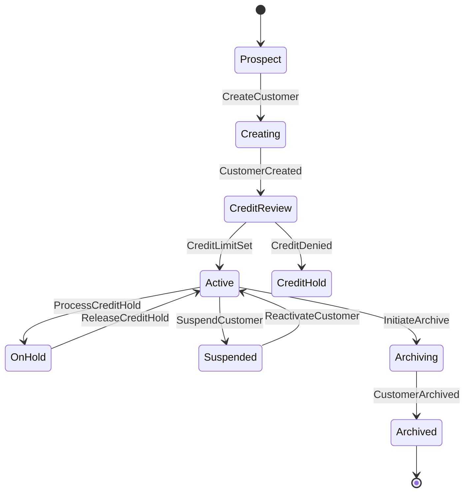

**Commands Involved**:
- `CreateCustomer` - Establish new customer account
- `UpdateCustomerProfile` - Modify customer information
- `SetCreditLimit` - Establish credit parameters
- `AddCustomerAddress` - Setup billing/shipping addresses
- `AssignPaymentTerms` - Configure payment terms
- `RecordCustomerActivity` - Track customer interactions
- `ArchiveCustomer` - Deactivate and preserve customer data

**Events Involved**:
- `CustomerCreated` - Account successfully established
- `CustomerProfileUpdated` - Information modified
- `CreditLimitSet` - Credit parameters established
- `CustomerAddressAdded` - Address information stored
- `PaymentTermsAssigned` - Terms configured
- `CustomerActivityRecorded` - Interaction logged
- `CustomerArchived` - Account deactivated

**Business Rules**:
- Customer number must be unique within system
- Credit limit evaluation required for amounts above threshold
- Address validation required for tax jurisdiction accuracy
- Payment terms must align with credit assessment

---

### 2. Customer Credit Management Workflow

**Description**: Dynamic credit management including credit monitoring, hold processing, limit adjustments, and risk assessment with automated triggers and manual interventions.

**State Transitions**:
`Good Standing` → `Credit Warning` → `Credit Hold` → `Collection Status` → `Write-off`

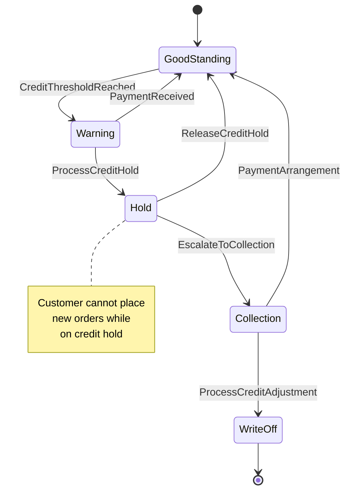

**Commands Involved**:
- `ProcessCreditHold` - Place customer on hold
- `ReleaseCreditHold` - Restore customer credit status
- `ProcessCreditAdjustment` - Handle write-offs and allowances
- `UpdateCreditLimit` - Adjust credit parameters
- `EvaluateCustomerRisk` - Assess credit risk
- `RecalculateCreditExposure` - Update exposure calculations

**Events Involved**:
- `CreditHoldPlaced` - Customer placed on hold
- `CreditHoldReleased` - Hold status removed
- `CreditAdjustmentProcessed` - Adjustment completed
- `CreditLimitUpdated` - Limit parameters changed
- `CustomerRiskEvaluated` - Risk assessment completed
- `CreditExposureRecalculated` - Exposure updated

**Business Rules**:
- Credit holds automatically trigger when exposure exceeds 90% of limit
- Release requires resolution of hold conditions
- Write-offs require management approval above threshold amounts
- Risk evaluation mandatory for credit limit increases

---

## Invoice Processing Workflows

### 3. Invoice Creation and Management Workflow

**Description**: Complete invoice lifecycle from creation through payment receipt, including amendments, void processing, and integration with inventory and GL systems.

**State Transitions**:
`Draft` → `Open` → `Partially Paid` → `Paid` → `Closed`

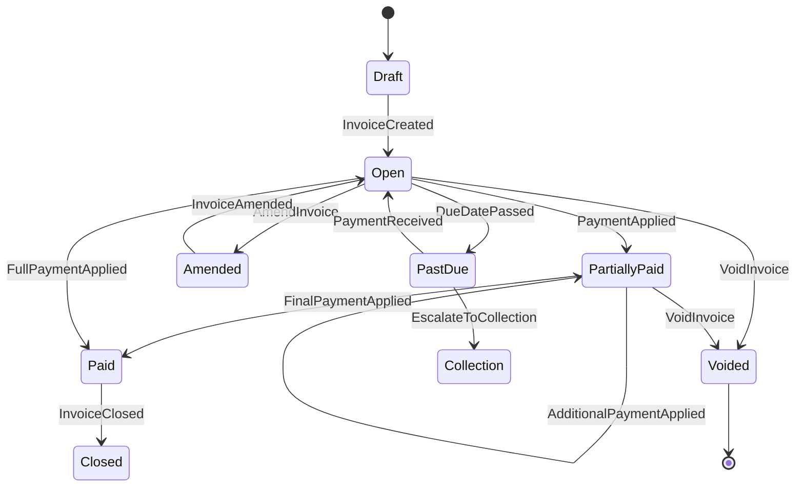

**Commands Involved**:
- `CreateInvoice` - Generate new customer invoice
- `AmendInvoice` - Modify existing invoice
- `VoidInvoice` - Cancel invoice with cleanup
- `AddInvoiceLineItem` - Add products/services to invoice
- `ApplyLineDiscount` - Apply discounts to line items
- `CalculateTaxes` - Compute tax amounts
- `PostToGeneralLedger` - Transfer to GL for accounting

**Events Involved**:
- `InvoiceCreated` - New invoice established
- `InvoiceAmended` - Invoice modified
- `InvoiceVoided` - Invoice cancelled
- `InvoiceLineItemAdded` - Line item added
- `LineDiscountApplied` - Discount applied
- `TaxesCalculated` - Tax computation completed
- `InvoicePostedToGL` - GL integration completed

**Business Rules**:
- Invoice numbers must be unique within fiscal year
- Customer must be active and not on credit hold
- Line items must reference valid, active products
- Tax calculations based on ship-to address jurisdiction
- Amendment requires authorization for significant changes

---

### 4. Recurring Invoice Workflow

**Description**: Automated recurring invoice generation including template management, schedule processing, and lifecycle control with error handling and customer management.

**State Transitions**:
`Template Created` → `Active` → `Generating` → `Suspended` → `Completed`

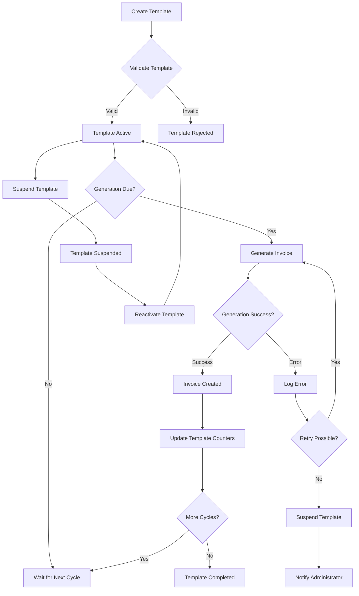

**Commands Involved**:
- `CreateRecurringInvoiceTemplate` - Setup automated billing
- `GenerateRecurringInvoice` - Create invoice from template
- `AmendRecurringTemplate` - Modify template parameters
- `SuspendRecurringTemplate` - Pause generation temporarily
- `ReactivateTemplate` - Resume automated generation
- `CompleteTemplate` - Finalize recurring billing

**Events Involved**:
- `RecurringTemplateCreated` - Template established
- `RecurringInvoiceGenerated` - Invoice created from template
- `TemplateAmended` - Template modified
- `TemplateSuspended` - Generation paused
- `TemplateReactivated` - Generation resumed
- `TemplateCompleted` - Billing cycle finished

**Business Rules**:
- Template customer must remain active throughout billing cycle
- Generation dates calculated from template schedule configuration
- Pricing can be fixed or current based on template settings
- Template suspension requires business justification
- Completed templates maintain audit trail indefinitely

---

## Payment Processing Workflows

### 5. Payment Application Workflow

**Description**: Complete payment processing from receipt through application to invoices, including discount calculations, overpayment handling, and multi-currency support.

**State Transitions**:
`Payment Received` → `Validating` → `Applying` → `Applied` → `Deposited`

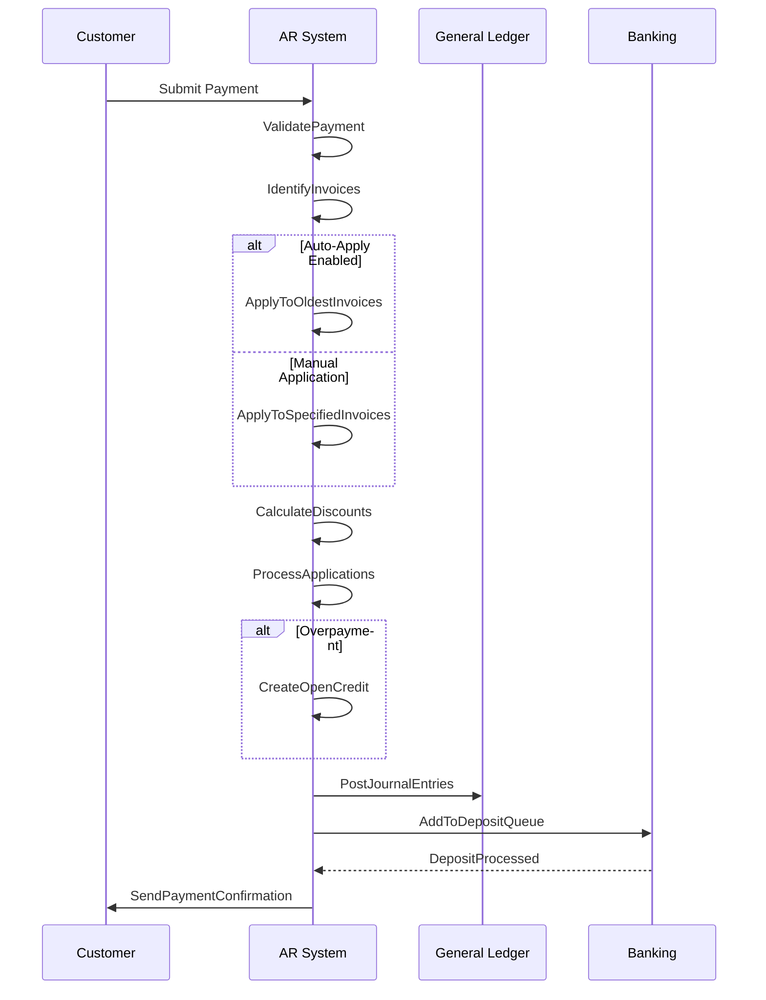

**Commands Involved**:
- `ApplyPayment` - Process customer payment
- `ApplyPaymentToInvoice` - Apply to specific invoices
- `ApplyDiscount` - Calculate early payment discounts
- `ProcessElectronicPayment` - Handle ACH/wire transfers
- `CreateOpenCredit` - Handle overpayments
- `VoidPayment` - Reverse payment processing
- `AddToDepositQueue` - Queue for bank deposit

**Events Involved**:
- `PaymentApplied` - Payment successfully processed
- `PaymentAppliedToInvoice` - Specific invoice application
- `DiscountApplied` - Early payment discount taken
- `ElectronicPaymentProcessed` - Electronic payment completed
- `OpenCreditCreated` - Overpayment credit established
- `PaymentVoided` - Payment cancelled
- `PaymentQueuedForDeposit` - Added to deposit batch

**Business Rules**:
- Payments must be applied within discount period for discount eligibility
- Auto-application applies to oldest invoices first unless specified
- Overpayments automatically create open credit unless directed otherwise
- Electronic payments require customer banking setup and authorization
- Payment voids require appropriate authorization based on amount and timing

---

### 6. Bank Deposit Management Workflow

**Description**: Bank deposit processing from receipt selection through verification and reconciliation, including balance validation and error resolution.

**State Transitions**:
`Receipts Available` → `Deposit Created` → `Recorded` → `Verified` → `Reconciled`

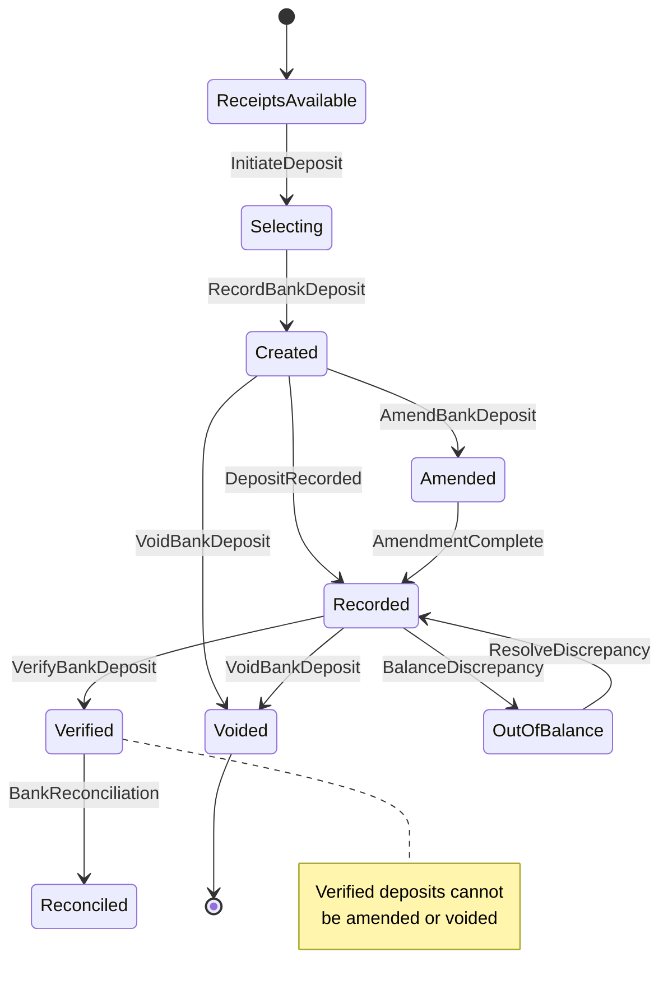

**Commands Involved**:
- `RecordBankDeposit` - Create deposit with selected payments
- `AmendBankDeposit` - Modify deposit composition
- `VerifyBankDeposit` - Confirm with bank statement
- `VoidBankDeposit` - Cancel deposit and release payments
- `ResolveDepositDiscrepancy` - Handle balance differences
- `ReconcileDeposit` - Complete bank reconciliation

**Events Involved**:
- `BankDepositRecorded` - Deposit created with payments
- `BankDepositAmended` - Deposit composition changed
- `BankDepositVerified` - Bank confirmation received
- `BankDepositVoided` - Deposit cancelled
- `DepositDiscrepancyResolved` - Balance issue fixed
- `DepositReconciled` - Bank reconciliation completed

**Business Rules**:
- All payments in deposit must be from same bank account
- Deposit total must equal sum of included payments
- Cannot amend deposits after verification
- Verification requires matching bank confirmation
- Void authorization required based on deposit amount

---

## Advanced Billing Workflows

### 7. Finance Charge Processing Workflow

**Description**: Automated finance charge calculation and application for past-due accounts, including eligibility checking, charge calculation, and customer notification.

**State Transitions**:
`Invoice Past Due` → `Charge Eligible` → `Charge Calculated` → `Charge Applied` → `Charged`

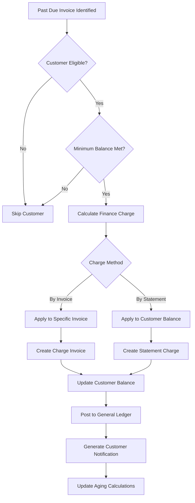

**Commands Involved**:
- `IdentifyPastDueAccounts` - Find eligible customers
- `ApplyFinanceChargeByInvoice` - Charge specific invoices
- `ApplyFinanceChargeByStatement` - Charge customer balance
- `AdjustFinanceCharge` - Modify or reverse charges
- `CalculateCompoundInterest` - Apply compound interest rules
- `NotifyCustomerOfCharges` - Send charge notifications

**Events Involved**:
- `PastDueAccountsIdentified` - Eligible accounts found
- `FinanceChargeApplied` - Charges applied to customer
- `FinanceChargeAdjusted` - Charges modified or reversed
- `CompoundInterestCalculated` - Interest calculations completed
- `ChargeNotificationSent` - Customer notified of charges

**Business Rules**:
- Finance charges apply only to customers with eligible payment terms
- Minimum balance threshold must be met before charging
- Compound interest calculated based on configuration settings
- Charge rates must comply with regulatory limits
- Customer notification required within specified timeframe

---

### 8. Sales Return Processing Workflow

**Description**: Product return management including return authorization, inventory coordination, credit processing, and quality control with lot/serial tracking.

**State Transitions**:
`Return Requested` → `Authorized` → `Received` → `Inspected` → `Restocked` → `Credit Issued`

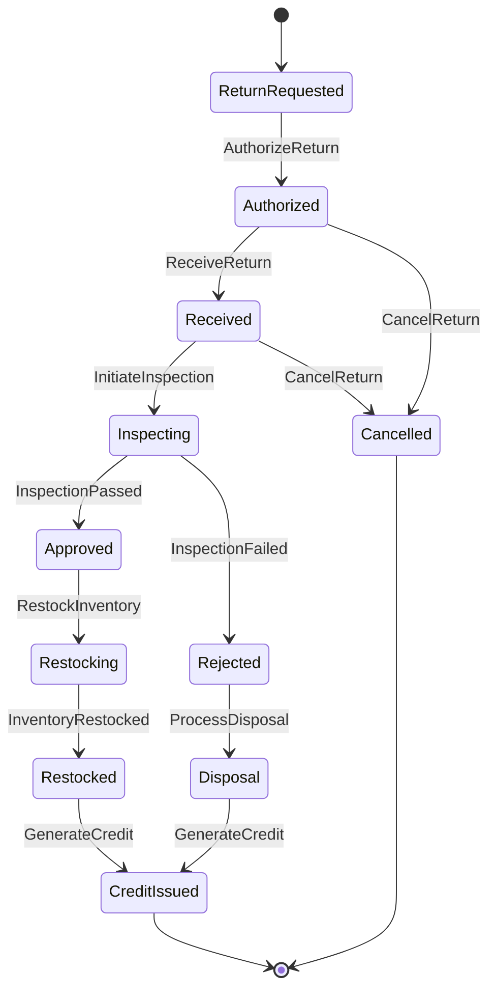

**Commands Involved**:
- `CreateSalesReturnWithInvoice` - Process return with original invoice
- `CreateSalesReturnWithoutInvoice` - Process return without invoice
- `AuthorizeReturn` - Approve return request
- `ReceiveReturn` - Physical receipt of returned items
- `InspectReturnedItems` - Quality control inspection
- `RestockInventory` - Return items to inventory
- `GenerateReturnCredit` - Issue credit memo
- `AmendSalesReturn` - Modify return details
- `VoidSalesReturn` - Cancel return processing

**Events Involved**:
- `SalesReturnCreated` - Return request established
- `ReturnAuthorized` - Return approved for processing
- `ReturnReceived` - Items physically received
- `ReturnItemsInspected` - Quality inspection completed
- `InventoryRestocked` - Items returned to stock
- `ReturnCreditGenerated` - Credit memo issued
- `SalesReturnAmended` - Return details modified
- `SalesReturnVoided` - Return processing cancelled

**Business Rules**:
- Return authorization required for high-value items
- Inspection mandatory for restockable items
- Serialized/lot items must match original shipment records
- Credit amount based on original invoice pricing unless adjusted
- Restocking fees applied per company policy

---

## Multi-Currency Operations Workflows

### 9. Currency Revaluation Workflow

**Description**: Periodic foreign currency revaluation for unrealized gain/loss calculation, including rate updates, balance analysis, and GL posting coordination.

**State Transitions**:
`Rates Current` → `Revaluation Due` → `Calculating` → `Posting` → `Completed`

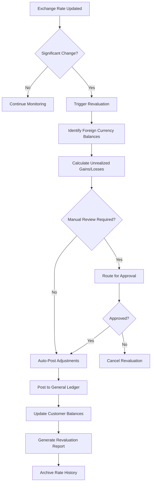

**Commands Involved**:
- `UpdateExchangeRate` - Update currency exchange rates
- `InitiateCurrencyRevaluation` - Begin revaluation process
- `CalculateRevaluationGains` - Compute gains and losses
- `PostRevaluationAdjustments` - Transfer adjustments to GL
- `ApproveRevaluation` - Authorize significant adjustments
- `ArchiveRateHistory` - Preserve historical rates

**Events Involved**:
- `ExchangeRateUpdated` - New rates established
- `CurrencyRevaluationInitiated` - Revaluation process started
- `RevaluationGainsCalculated` - Calculations completed
- `RevaluationAdjustmentsPosted` - GL entries created
- `RevaluationApproved` - Authorization received
- `RateHistoryArchived` - Historical data preserved

**Business Rules**:
- Exchange rates must be from authorized sources only
- Revaluation required monthly for material foreign currency exposure
- Gains and losses posted to designated GL accounts
- Manual approval required for adjustments exceeding threshold
- Historical rates preserved for audit and compliance

---

## Period-End Processing Workflows

### 10. AR Period-End Closing Workflow

**Description**: Comprehensive period-end closing coordination including transaction validation, aging calculations, GL synchronization, and reporting generation.

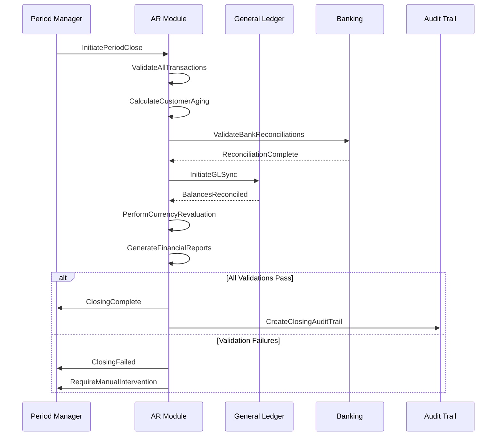

**Commands Involved**:
- `InitiatePeriodClose` - Begin AR period-end closing
- `ValidateTransactions` - Verify transaction completeness
- `PerformAgingCalculation` - Calculate customer aging
- `InitiateGLSync` - Synchronize with General Ledger
- `PostGLJournals` - Transfer entries to GL
- `ReconcileBalances` - Verify AR-GL balance reconciliation
- `PerformCurrencyRevaluation` - Process foreign currency adjustments
- `GenerateClosingReports` - Create period-end reports

**Events Involved**:
- `PeriodCloseInitiated` - Closing process started
- `TransactionValidationCompleted` - Validation finished
- `AgingCalculationCompleted` - Aging calculations done
- `GLSyncInitiated` - GL synchronization started
- `GLJournalsPosted` - Entries transferred to GL
- `BalancesReconciled` - AR-GL reconciliation completed
- `CurrencyRevaluationCompleted` - Currency adjustments done
- `ClosingReportsGenerated` - Reports created
- `ARPeriodClosed` - Period successfully closed

**Business Rules**:
- All transactions must be posted before closing
- Customer aging must be current within 24 hours
- Bank reconciliations must be complete
- GL integration must balance perfectly
- Currency revaluation required for foreign currency transactions
- All exceptions must be resolved before closing

---

## Import and Integration Workflows

### 11. Invoice Import Processing Workflow

**Description**: Bulk invoice import processing including file validation, business rule checking, batch processing, and error handling with comprehensive audit trails.

**State Transitions**:
`File Uploaded` → `Validating` → `Processing` → `Completed` → `Archived`

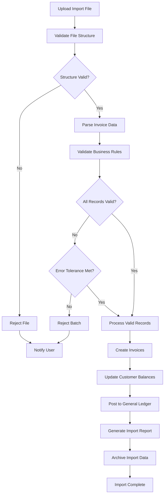

**Commands Involved**:
- `StartInvoiceImport` - Begin import process
- `ValidateImportFile` - Check file structure and format
- `ProcessImportBatch` - Create invoices from validated data
- `HandleImportError` - Process validation failures
- `CompleteInvoiceImport` - Finalize import process
- `GenerateImportReport` - Create processing summary
- `ArchiveImportData` - Preserve import history

**Events Involved**:
- `InvoiceImportStarted` - Import process initiated
- `ImportFileValidated` - File structure confirmed
- `ImportBatchProcessed` - Valid records processed
- `ImportErrorHandled` - Errors processed and logged
- `InvoiceImportCompleted` - Process finished successfully
- `ImportReportGenerated` - Summary report created
- `ImportDataArchived` - Historical data preserved

**Business Rules**:
- Import file must follow configured structure definition
- All imported invoices must pass business rule validation
- Error tolerance configurable per import batch
- Invalid records preserved for review and correction
- Import audit trail maintained for compliance

---

### 12. GL Integration and Synchronization Workflow

**Description**: Continuous integration with General Ledger including real-time posting, balance reconciliation, and discrepancy resolution with comprehensive error handling.

**State Transitions**:
`AR Transaction Posted` → `GL Entry Generated` → `Posted to GL` → `Reconciled`

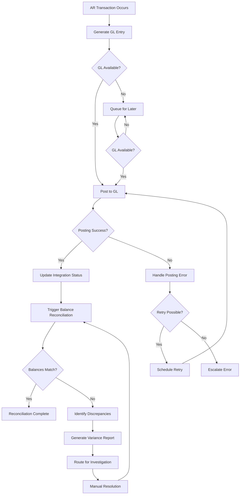

**Commands Involved**:
- `InitiateGLSync` - Start GL synchronization process
- `PostGLJournals` - Transfer journal entries to GL
- `ReconcileBalances` - Compare AR and GL balances
- `ValidateGLPosting` - Verify posting accuracy
- `IdentifyDiscrepancies` - Find balance differences
- `ResolveDiscrepancy` - Fix identified variances
- `CompleteReconciliation` - Finalize reconciliation

**Events Involved**:
- `GLSyncInitiated` - Synchronization started
- `GLJournalsPosted` - Entries transferred to GL
- `BalancesReconciled` - Reconciliation completed
- `GLPostingValidated` - Posting accuracy confirmed
- `DiscrepanciesIdentified` - Variances found
- `DiscrepancyResolved` - Variance corrected
- `ReconciliationCompleted` - Process finished

**Business Rules**:
- All AR transactions must generate corresponding GL entries
- GL posting must occur in real-time unless system unavailable
- Balance reconciliation required at minimum daily
- Discrepancies must be investigated and resolved
- Manual posting approval required for corrections above threshold

---

## Credit and Risk Management Workflows

### 13. Open Credit Refund Workflow

**Description**: Processing of customer credit refunds through multiple payment methods including authorization, payment coordination, and accounting treatment.

**State Transitions**:
`Open Credit Available` → `Refund Requested` → `Authorized` → `Processing` → `Refunded`

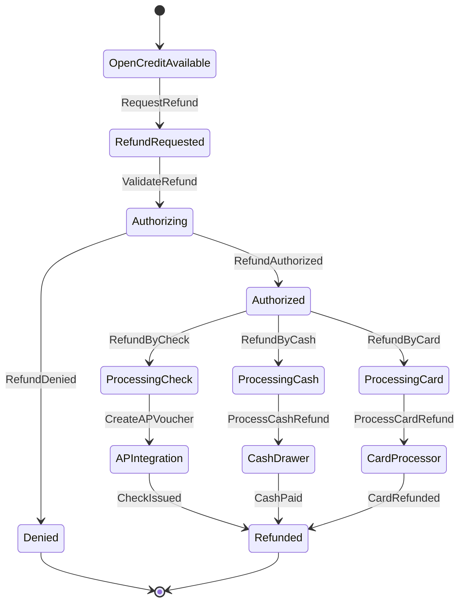

**Commands Involved**:
- `RefundOpenCreditByCheck` - Issue refund via AP check
- `RefundOpenCreditByCash` - Process cash refund
- `RefundOpenCreditByCard` - Refund to credit card
- `AuthorizeRefund` - Approve refund request
- `CreateAPVoucherForRefund` - Generate AP payment request
- `ProcessCashRefund` - Handle cash drawer transaction
- `CancelRefundRequest` - Cancel pending refund

**Events Involved**:
- `RefundRequested` - Customer requested refund
- `RefundAuthorized` - Refund approved for processing
- `OpenCreditRefunded` - Refund processing initiated
- `RefundCheckQueued` - AP voucher created for check
- `CashRefundProcessed` - Cash refund completed
- `CardRefundProcessed` - Card refund completed
- `RefundCancelled` - Refund request cancelled

**Business Rules**:
- Refund authorization required for amounts above threshold
- Check refunds integrate with AP module for payment processing
- Cash refunds require physical cash drawer access
- Card refunds limited to original payment method when possible
- Refund audit trail required for compliance

---

## Master Data Management Workflows

### 14. Tax Configuration Workflow

**Description**: Tax code and entity management including multi-jurisdiction setup, rate maintenance, and calculation rule configuration with compliance validation.

**State Transitions**:
`Tax Entity Created` → `Tax Code Configured` → `Active` → `Rate Updated` → `Active`

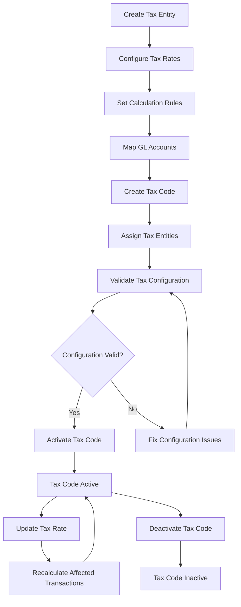

**Commands Involved**:
- `CreateTaxEntity` - Setup individual tax authority
- `CreateTaxCode` - Configure multi-entity tax code
- `UpdateTaxRate` - Modify tax rates
- `ConfigureTaxEntities` - Assign entities to tax codes
- `SetCalculationRules` - Define tax calculation methods
- `ConfigureRounding` - Setup rounding rules
- `MapTaxGLAccounts` - Link to chart of accounts
- `ValidateTaxConfiguration` - Verify setup accuracy

**Events Involved**:
- `TaxEntityCreated` - Tax authority established
- `TaxCodeCreated` - Multi-entity tax code configured
- `TaxRateUpdated` - Rate changes applied
- `TaxEntitiesConfigured` - Entity assignments completed
- `CalculationRulesSet` - Calculation methods defined
- `RoundingConfigured` - Rounding rules established
- `TaxGLAccountsMapped` - GL integration configured
- `TaxConfigurationValidated` - Setup verified

**Business Rules**:
- Tax entities must have valid GL account mappings
- Tax rates must comply with jurisdiction requirements
- Tax codes support up to three tax entities maximum
- Rounding rules must follow jurisdiction standards
- Rate changes trigger recalculation of open transactions

---

## Reporting and Analytics Workflows

### 15. Customer Aging Analysis Workflow

**Description**: Automated aging calculation and reporting including bucket assignment, balance categorization, and trend analysis with automated alerting.

**State Transitions**:
`Aging Required` → `Calculating` → `Analysis` → `Reporting` → `Alerts Generated`

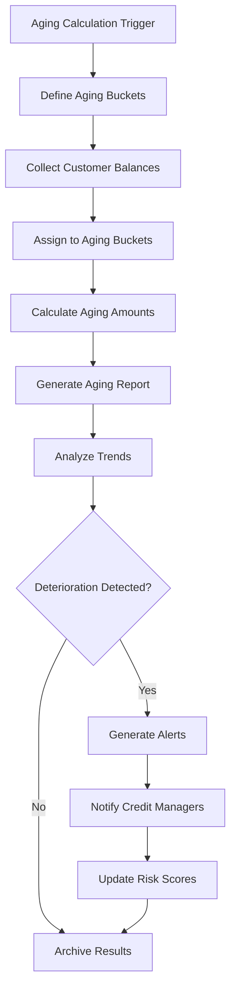

**Commands Involved**:
- `DefineAgingBuckets` - Configure aging bucket structure
- `CalculateCustomerAging` - Perform aging calculations
- `GenerateAgingReport` - Create aging analysis report
- `AnalyzeAgingTrends` - Identify aging patterns
- `UpdateAgingConfiguration` - Modify aging parameters
- `ArchiveAgingData` - Preserve historical aging

**Events Involved**:
- `AgingBucketsDefined` - Bucket structure configured
- `CustomerAgingCalculated` - Calculations completed
- `AgingReportGenerated` - Report created
- `AgingTrendsAnalyzed` - Pattern analysis done
- `AgingConfigurationUpdated` - Parameters modified
- `AgingDataArchived` - Historical data preserved

**Business Rules**:
- Aging buckets must be non-overlapping and complete
- Aging calculations must include all open customer transactions
- Aging reports generated automatically at period-end
- Trend analysis triggers risk score updates
- Historical aging data preserved for compliance

---

## Error Handling and Recovery Workflows

### 16. Transaction Error Recovery Workflow

**Description**: Comprehensive error handling including error classification, recovery action determination, compensation processing, and escalation management.

**State Transitions**:
`Error Detected` → `Classified` → `Recovery Action` → `Compensation` → `Resolved`

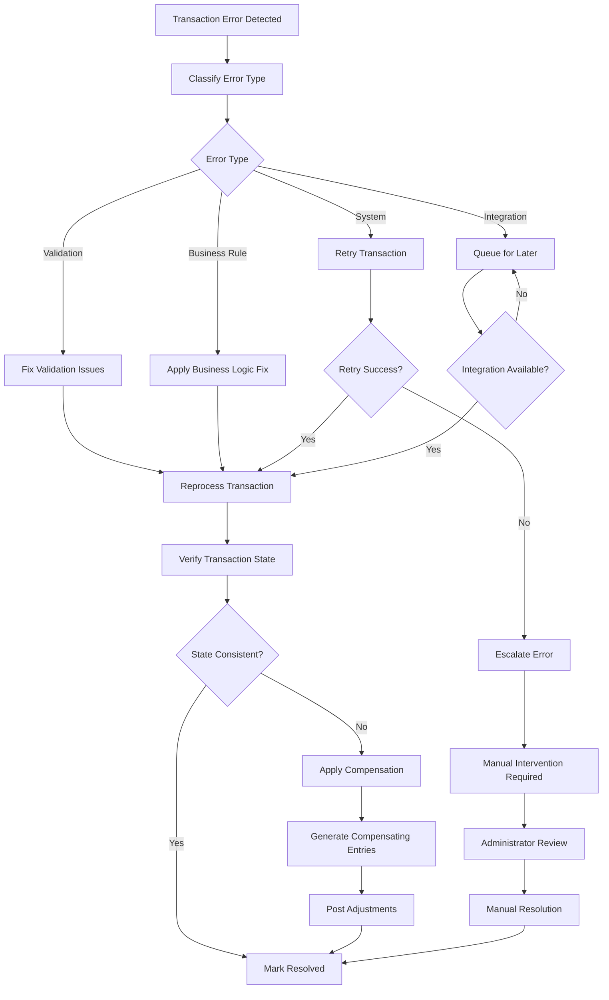

**Commands Involved**:
- `HandleTransactionError` - Process detected error
- `ClassifyError` - Categorize error type
- `RetryFailedTransaction` - Attempt transaction retry
- `ApplyErrorCompensation` - Generate compensating entries
- `EscalateError` - Route to manual intervention
- `ResolveManualError` - Complete manual resolution

**Events Involved**:
- `TransactionErrorDetected` - Error identified
- `ErrorClassified` - Error type determined
- `TransactionRetried` - Retry attempt made
- `ErrorCompensationApplied` - Compensating entries created
- `ErrorEscalated` - Manual intervention required
- `ErrorResolved` - Issue successfully resolved

**Business Rules**:
- All transaction errors must be logged and tracked
- Automatic retry limited to configurable attempts
- Compensation entries must maintain accounting balance
- Manual intervention required for critical errors
- Error resolution must include root cause analysis

---

## Integration Pattern Workflows

### 17. Real-Time Event Integration Workflow

**Description**: Continuous event-driven integration with other Accountex modules including event publishing, subscription management, and integration monitoring.

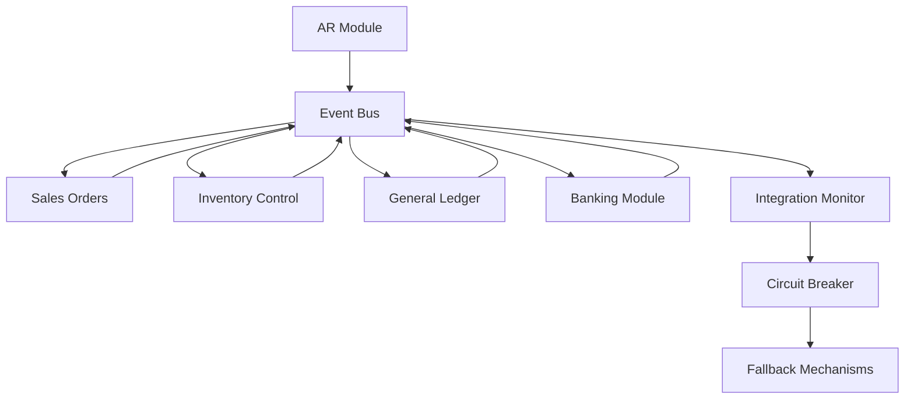

**Commands Involved**:
- `PublishAREvent` - Send event to other modules
- `SubscribeToModuleEvent` - Listen for external events
- `HandleIntegrationError` - Process integration failures
- `ValidateEventConsistency` - Verify event processing
- `ActivateCircuitBreaker` - Engage fault tolerance
- `ResumeIntegration` - Restore normal processing

**Events Involved**:
- `AREventPublished` - Event sent successfully
- `ModuleEventReceived` - External event processed
- `IntegrationErrorHandled` - Error processed
- `EventConsistencyValidated` - Processing verified
- `CircuitBreakerActivated` - Fault tolerance engaged
- `IntegrationResumed` - Normal processing restored

**Business Rules**:
- All significant AR events must be published to event bus
- Event processing must be idempotent
- Circuit breaker activates on integration failure threshold
- Fallback mechanisms preserve critical business functions
- Integration monitoring tracks performance and reliability

---

## Summary

The Accounts Receivable domain orchestrates **17 primary workflows** that collectively manage:

- **Customer Operations**: Onboarding, credit management, and lifecycle tracking
- **Invoice Processing**: Creation, amendment, recurring billing, and import operations
- **Payment Management**: Application, electronic processing, and deposit handling
- **Financial Operations**: Finance charges, currency revaluation, and GL integration
- **Period Operations**: Closing coordination, validation, and reporting
- **Master Data**: Tax configuration, pricing setup, and reference management
- **Quality Assurance**: Error handling, recovery, and integration monitoring

Each workflow maintains clear state boundaries, implements comprehensive audit trails, and supports both automated processing and manual intervention points. The event-driven architecture enables system resilience through circuit breaker patterns, graceful degradation, and sophisticated error recovery mechanisms.

The workflows collectively ensure enterprise-grade AR operations with complete traceability, regulatory compliance, multi-currency support, and seamless integration with other Accountex modules while maintaining data integrity and operational excellence.