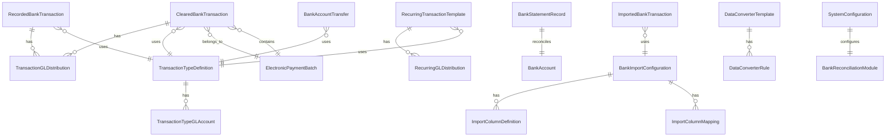

# Bank Reconciliation Domain Design for Accountex

## Domain Overview

The Bank Reconciliation module manages the reconciliation of bank transactions, including cleared checks, deposits, transfers, and electronic payments. It handles both manual transaction recording and automated bank statement imports while maintaining proper audit trails and GL integration.

## Mermaid Domain Diagram



## Resources

### 1. ClearedBankTransaction

Represents bank transactions that have been cleared or reconciled.

```elixir
defmodule Accountex.BankReconciliation.ClearedBankTransaction do
  use Ash.Resource,
    domain: Accountex.BankReconciliation,
    data_layer: AshPostgres.DataLayer

  postgres do
    table "cleared_bank_transactions"
    repo Accountex.Repo
  end

  attributes do
    uuid_v7_primary_key :id

    attribute :bank_account_number, :string, allow_nil?: false
    attribute :transaction_reference_number, :string, allow_nil?: false
    attribute :transaction_type_code, :string, allow_nil?: false
    attribute :transaction_category, :string, allow_nil?: false
    attribute :check_number, :string
    attribute :deposit_number, :string
    attribute :transaction_description, :string, allow_nil?: false
    attribute :reference_identifier, :string
    attribute :electronic_payment_description, :string
    attribute :source_module, :string, allow_nil?: false
    attribute :positive_pay_batch_number, :string
    attribute :positive_pay_export_filename, :string
    attribute :electronic_payment_batch_id, :uuid
    attribute :payment_method_type, :string
    attribute :match_unique_identifier, :string
    attribute :transaction_created_date, :datetime, allow_nil?: false
    attribute :transaction_date, :date, allow_nil?: false
    attribute :cancellation_date, :date
    attribute :statement_ending_date, :date
    attribute :positive_pay_sent_date, :datetime
    attribute :void_date, :datetime
    attribute :is_voided, :boolean, default: false
    attribute :is_cancelled, :boolean, default: false
    attribute :is_combined_for_reconciliation, :boolean, default: false
    attribute :transaction_amount, :decimal, allow_nil?: false
    attribute :exchange_rate, :decimal, default: Decimal.new(1)
  end

  relationships do
    belongs_to :transaction_type_definition, Accountex.BankReconciliation.TransactionTypeDefinition
    belongs_to :electronic_payment_batch, Accountex.BankReconciliation.ElectronicPaymentBatch
    has_many :transaction_gl_distributions, Accountex.BankReconciliation.TransactionGLDistribution
  end
end
```

### 2. RecordedBankTransaction

Represents newly recorded bank transactions before clearing.

```elixir
defmodule Accountex.BankReconciliation.RecordedBankTransaction do
  use Ash.Resource,
    domain: Accountex.BankReconciliation,
    data_layer: AshPostgres.DataLayer

  postgres do
    table "recorded_bank_transactions"
    repo Accountex.Repo
  end

  attributes do
    uuid_v7_primary_key :id
    
    attribute :bank_account_number, :string, allow_nil?: false
    attribute :transaction_number, :string, allow_nil?: false
    attribute :transaction_type_code, :string, allow_nil?: false
    attribute :transaction_category, :string, allow_nil?: false
    attribute :check_number, :string
    attribute :deposit_number, :string
    attribute :payee_description, :string, allow_nil?: false
    attribute :reference_information, :string
    attribute :import_unique_identifier, :string
    attribute :created_date, :datetime, allow_nil?: false
    attribute :transaction_date, :date, allow_nil?: false
    attribute :is_current, :boolean, default: true
    attribute :is_voided, :boolean, default: false
    attribute :memo_notes, :text
    attribute :transaction_amount, :decimal, allow_nil?: false
    attribute :currency_exchange_rate, :decimal, default: Decimal.new(1)
  end

  relationships do
    belongs_to :transaction_type_definition, Accountex.BankReconciliation.TransactionTypeDefinition
    has_many :transaction_gl_distributions, Accountex.BankReconciliation.TransactionGLDistribution
  end
end
```

### 3. BankAccountTransfer

Manages transfers between bank accounts.

```elixir
defmodule Accountex.BankReconciliation.BankAccountTransfer do
  use Ash.Resource,
    domain: Accountex.BankReconciliation,
    data_layer: AshPostgres.DataLayer

  postgres do
    table "bank_account_transfers"
    repo Accountex.Repo
  end

  attributes do
    uuid_v7_primary_key :id
    
    attribute :source_bank_account, :string, allow_nil?: false
    attribute :source_transaction_number, :string, allow_nil?: false
    attribute :target_bank_account, :string, allow_nil?: false
    attribute :target_transaction_number, :string, allow_nil?: false
    attribute :transaction_type_code, :string, allow_nil?: false
    attribute :transfer_type, :string, allow_nil?: false
    attribute :transfer_description, :string, allow_nil?: false
    attribute :reference_note, :string
    attribute :posted_to_general_ledger, :string, default: ""
    attribute :import_unique_identifier, :string
    attribute :created_date, :datetime, allow_nil?: false
    attribute :transfer_date, :date, allow_nil?: false
    attribute :is_current_transfer, :boolean, default: true
    attribute :transfer_to_gl_enabled, :boolean, default: true
    attribute :is_voided, :boolean, default: false
    attribute :memo_text, :text
    attribute :source_amount, :decimal, allow_nil?: false
    attribute :target_amount, :decimal, allow_nil?: false
    attribute :source_exchange_rate, :decimal, default: Decimal.new(1)
    attribute :target_exchange_rate, :decimal, default: Decimal.new(1)
  end

  relationships do
    belongs_to :transaction_type_definition, Accountex.BankReconciliation.TransactionTypeDefinition
  end
end
```

### 4. RecurringTransactionTemplate

Templates for automatically generated recurring transactions.

```elixir
defmodule Accountex.BankReconciliation.RecurringTransactionTemplate do
  use Ash.Resource,
    domain: Accountex.BankReconciliation,
    data_layer: AshPostgres.DataLayer

  postgres do
    table "recurring_transaction_templates"
    repo Accountex.Repo
  end

  attributes do
    uuid_v7_primary_key :id
    
    attribute :bank_account_number, :string, allow_nil?: false
    attribute :transaction_identifier, :string, allow_nil?: false
    attribute :transaction_type_code, :string, allow_nil?: false
    attribute :transaction_category, :string, allow_nil?: false
    attribute :target_bank_account, :string
    attribute :transaction_description, :string, allow_nil?: false
    attribute :reference_text, :string
    attribute :status_indicator, :string, allow_nil?: false
    attribute :recurrence_pattern, :string, allow_nil?: false
    attribute :tax_code_reference, :string
    attribute :general_ledger_account, :string, allow_nil?: false
    attribute :created_date, :datetime, allow_nil?: false
    attribute :next_recurrence_date, :date, allow_nil?: false
    attribute :last_recurrence_date, :date
    attribute :end_recurrence_date, :date
    attribute :recur_on_last_day_of_month, :boolean, default: false
    attribute :transfer_to_general_ledger, :boolean, default: false
    attribute :notes_memo, :text
    attribute :recurrence_cycle_count, :integer, default: 0
    attribute :tax_version_number, :integer, default: 0
    attribute :source_transaction_amount, :decimal, allow_nil?: false
    attribute :target_transaction_amount, :decimal
    attribute :tax_amount_one, :decimal, default: Decimal.new(0)
    attribute :tax_amount_two, :decimal, default: Decimal.new(0)
    attribute :tax_amount_three, :decimal, default: Decimal.new(0)
  end

  relationships do
    belongs_to :transaction_type_definition, Accountex.BankReconciliation.TransactionTypeDefinition
    has_many :recurring_gl_distributions, Accountex.BankReconciliation.RecurringGLDistribution
  end
end
```

### 5. BankStatementRecord

Records bank statement information for reconciliation.

```elixir
defmodule Accountex.BankReconciliation.BankStatementRecord do
  use Ash.Resource,
    domain: Accountex.BankReconciliation,
    data_layer: AshPostgres.DataLayer

  postgres do
    table "bank_statement_records"
    repo Accountex.Repo
  end

  attributes do
    uuid_v7_primary_key :id
    
    attribute :bank_account_number, :string, allow_nil?: false
    attribute :statement_ending_date, :date, allow_nil?: false
    attribute :is_reconciled, :boolean, default: false
    attribute :ending_statement_balance, :decimal, allow_nil?: false
    attribute :verified_deposits_count, :integer, default: 0
    attribute :verified_deposits_total, :decimal, default: Decimal.new(0)
    attribute :cancelled_checks_count, :integer, default: 0
    attribute :cancelled_checks_total, :decimal, default: Decimal.new(0)
    attribute :statement_deposits_count, :integer, default: 0
    attribute :statement_deposits_total, :decimal, default: Decimal.new(0)
    attribute :statement_checks_count, :integer, default: 0
    attribute :statement_checks_total, :decimal, default: Decimal.new(0)
  end
end
```

### 6. TransactionTypeDefinition

Defines transaction types and their properties.

```elixir
defmodule Accountex.BankReconciliation.TransactionTypeDefinition do
  use Ash.Resource,
    domain: Accountex.BankReconciliation,
    data_layer: AshPostgres.DataLayer

  postgres do
    table "transaction_type_definitions"
    repo Accountex.Repo
  end

  attributes do
    uuid_v7_primary_key :id
    
    attribute :type_code, :string, allow_nil?: false
    attribute :type_description, :string, allow_nil?: false
    attribute :transaction_category, :string, allow_nil?: false
    attribute :status_indicator, :string, allow_nil?: false
    attribute :created_date, :datetime, allow_nil?: false
    attribute :requires_check_or_deposit_number, :boolean, default: true
  end

  relationships do
    has_many :transaction_type_gl_accounts, Accountex.BankReconciliation.TransactionTypeGLAccount
  end
end
```

### 7. TransactionGLDistribution

GL distribution records for transactions.

```elixir
defmodule Accountex.BankReconciliation.TransactionGLDistribution do
  use Ash.Resource,
    domain: Accountex.BankReconciliation,
    data_layer: AshPostgres.DataLayer

  postgres do
    table "transaction_gl_distributions"
    repo Accountex.Repo
  end

  attributes do
    uuid_v7_primary_key :id
    
    attribute :bank_account_number, :string, allow_nil?: false
    attribute :transaction_number, :string, allow_nil?: false
    attribute :transaction_category, :string, allow_nil?: false
    attribute :tax_code_reference, :string
    attribute :general_ledger_account, :string, allow_nil?: false
    attribute :posted_to_gl_indicator, :string, default: ""
    attribute :line_item_description, :string
    attribute :transaction_date, :date, allow_nil?: false
    attribute :is_voided, :boolean, default: false
    attribute :tax_version_number, :integer, default: 0
    attribute :distribution_amount, :decimal, allow_nil?: false
    attribute :tax_amount_one, :decimal, default: Decimal.new(0)
    attribute :tax_amount_two, :decimal, default: Decimal.new(0)
    attribute :tax_amount_three, :decimal, default: Decimal.new(0)
  end

  relationships do
    belongs_to :cleared_bank_transaction, Accountex.BankReconciliation.ClearedBankTransaction
    belongs_to :recorded_bank_transaction, Accountex.BankReconciliation.RecordedBankTransaction
  end
end
```

### 8. RecurringGLDistribution

GL distributions for recurring transaction templates.

```elixir
defmodule Accountex.BankReconciliation.RecurringGLDistribution do
  use Ash.Resource,
    domain: Accountex.BankReconciliation,
    data_layer: AshPostgres.DataLayer

  postgres do
    table "recurring_gl_distributions"
    repo Accountex.Repo
  end

  attributes do
    uuid_v7_primary_key :id
    
    attribute :bank_account_number, :string, allow_nil?: false
    attribute :transaction_category, :string, allow_nil?: false
    attribute :transaction_number, :string, allow_nil?: false
    attribute :transaction_type_code, :string, allow_nil?: false
    attribute :tax_code_reference, :string
    attribute :general_ledger_account, :string, allow_nil?: false
    attribute :created_date, :datetime, allow_nil?: false
    attribute :tax_version_number, :integer, default: 0
    attribute :source_transaction_amount, :decimal, allow_nil?: false
    attribute :tax_amount_one, :decimal, default: Decimal.new(0)
    attribute :tax_amount_two, :decimal, default: Decimal.new(0)
    attribute :tax_amount_three, :decimal, default: Decimal.new(0)
  end

  relationships do
    belongs_to :recurring_transaction_template, Accountex.BankReconciliation.RecurringTransactionTemplate
  end
end
```

### 9. TransactionTypeGLAccount

GL account mappings for transaction types.

```elixir
defmodule Accountex.BankReconciliation.TransactionTypeGLAccount do
  use Ash.Resource,
    domain: Accountex.BankReconciliation,
    data_layer: AshPostgres.DataLayer

  postgres do
    table "transaction_type_gl_accounts"
    repo Accountex.Repo
  end

  attributes do
    uuid_v7_primary_key :id
    
    attribute :transaction_type_code, :string, allow_nil?: false
    attribute :gl_reference_account, :string, allow_nil?: false
    attribute :distribution_percentage, :decimal, allow_nil?: false
  end

  relationships do
    belongs_to :transaction_type_definition, Accountex.BankReconciliation.TransactionTypeDefinition
  end
end
```

### 10. ElectronicPaymentBatch

Manages batches of electronic payments.

```elixir
defmodule Accountex.BankReconciliation.ElectronicPaymentBatch do
  use Ash.Resource,
    domain: Accountex.BankReconciliation,
    data_layer: AshPostgres.DataLayer

  postgres do
    table "electronic_payment_batches"
    repo Accountex.Repo
  end

  attributes do
    uuid_v7_primary_key :id
    
    attribute :batch_number, :string, allow_nil?: false
    attribute :bank_account_number, :string, allow_nil?: false
    attribute :source_module, :string, allow_nil?: false
    attribute :batch_filename, :string, allow_nil?: false
    attribute :deposit_number, :string, allow_nil?: false
    attribute :transaction_date, :date, allow_nil?: false
    attribute :void_date, :datetime
    attribute :batch_total_amount, :decimal, allow_nil?: false
    attribute :is_voided, :boolean, default: false
  end

  relationships do
    has_many :cleared_bank_transactions, Accountex.BankReconciliation.ClearedBankTransaction
  end
end
```

### 11. BankImportConfiguration

Configuration for importing bank data.

```elixir
defmodule Accountex.BankReconciliation.BankImportConfiguration do
  use Ash.Resource,
    domain: Accountex.BankReconciliation,
    data_layer: AshPostgres.DataLayer

  postgres do
    table "bank_import_configurations"
    repo Accountex.Repo
  end

  attributes do
    uuid_v7_primary_key :id
    
    attribute :import_code, :string, allow_nil?: false
    attribute :delimiter_type, :string, allow_nil?: false
    attribute :configuration_description, :string, allow_nil?: false
    attribute :file_type_indicator, :string, allow_nil?: false
    attribute :custom_delimiter, :string
    attribute :custom_text_qualifier, :string
    attribute :text_qualifier, :string, allow_nil?: false
    attribute :column_count, :integer, allow_nil?: false
    attribute :start_line_number, :integer, allow_nil?: false
    attribute :configuration_remarks, :text
    attribute :imported_data_template, :text
  end

  relationships do
    has_many :import_column_definitions, Accountex.BankReconciliation.ImportColumnDefinition
    has_many :import_column_mappings, Accountex.BankReconciliation.ImportColumnMapping
  end
end
```

### 12. ImportColumnDefinition

Column definitions for import files.

```elixir
defmodule Accountex.BankReconciliation.ImportColumnDefinition do
  use Ash.Resource,
    domain: Accountex.BankReconciliation,
    data_layer: AshPostgres.DataLayer

  postgres do
    table "import_column_definitions"
    repo Accountex.Repo
  end

  attributes do
    uuid_v7_primary_key :id
    
    attribute :import_configuration_code, :string, allow_nil?: false
    attribute :column_field_identifier, :string, allow_nil?: false
    attribute :column_name, :string, allow_nil?: false
    attribute :column_data_type, :string, allow_nil?: false
    attribute :column_number, :integer, allow_nil?: false
    attribute :column_width, :integer, allow_nil?: false
  end

  relationships do
    belongs_to :bank_import_configuration, Accountex.BankReconciliation.BankImportConfiguration
  end
end
```

### 13. ImportColumnMapping

Mapping between import columns and system fields.

```elixir
defmodule Accountex.BankReconciliation.ImportColumnMapping do
  use Ash.Resource,
    domain: Accountex.BankReconciliation,
    data_layer: AshPostgres.DataLayer

  postgres do
    table "import_column_mappings"
    repo Accountex.Repo
  end

  attributes do
    uuid_v7_primary_key :id
    
    attribute :import_configuration_code, :string, allow_nil?: false
    attribute :column_field_identifier, :string, allow_nil?: false
    attribute :import_column_name, :string, allow_nil?: false
    attribute :system_column_one, :string, allow_nil?: false
    attribute :system_column_two, :string
    attribute :column_data_type, :string, allow_nil?: false
    attribute :converter_code, :string
    attribute :reverse_sign_indicator, :boolean, default: false
  end

  relationships do
    belongs_to :bank_import_configuration, Accountex.BankReconciliation.BankImportConfiguration
  end
end
```

### 14. ImportedBankTransaction

Temporarily stored imported transactions.

```elixir
defmodule Accountex.BankReconciliation.ImportedBankTransaction do
  use Ash.Resource,
    domain: Accountex.BankReconciliation,
    data_layer: AshPostgres.DataLayer

  postgres do
    table "imported_bank_transactions"
    repo Accountex.Repo
  end

  attributes do
    uuid_v7_primary_key :id
    
    attribute :import_unique_identifier, :string, allow_nil?: false
    attribute :bank_account_number, :string, allow_nil?: false
    attribute :transaction_number, :string, allow_nil?: false
    attribute :transaction_type_code, :string, allow_nil?: false
    attribute :transaction_category, :string, allow_nil?: false
    attribute :check_number, :string
    attribute :deposit_number, :string
    attribute :transaction_description, :string, allow_nil?: false
    attribute :reference_field, :string
    attribute :electronic_payment_description, :string
    attribute :source_system, :string, allow_nil?: false
    attribute :positive_pay_batch, :string
    attribute :positive_pay_filename, :string
    attribute :electronic_batch_number, :string
    attribute :payment_type, :string
    attribute :match_identifier, :string
    attribute :created_date, :datetime, allow_nil?: false
    attribute :transaction_date, :date
    attribute :cancellation_date, :date
    attribute :statement_end_date, :date
    attribute :positive_pay_send_date, :datetime
    attribute :void_date, :datetime
    attribute :is_voided, :boolean, default: false
    attribute :is_cancelled, :boolean, default: false
    attribute :is_combined_reconciliation, :boolean, default: false
    attribute :transaction_amount, :decimal, allow_nil?: false
    attribute :exchange_rate, :decimal, default: Decimal.new(1)
  end
end
```

### 15. DataConverterTemplate

Templates for data conversion during import.

```elixir
defmodule Accountex.BankReconciliation.DataConverterTemplate do
  use Ash.Resource,
    domain: Accountex.BankReconciliation,
    data_layer: AshPostgres.DataLayer

  postgres do
    table "data_converter_templates"
    repo Accountex.Repo
  end

  attributes do
    uuid_v7_primary_key :id
    
    attribute :converter_code, :string, allow_nil?: false
    attribute :converter_description, :string, allow_nil?: false
    attribute :converter_type, :string, allow_nil?: false
  end

  relationships do
    has_many :data_converter_rules, Accountex.BankReconciliation.DataConverterRule
  end
end
```

### 16. DataConverterRule

Individual conversion rules.

```elixir
defmodule Accountex.BankReconciliation.DataConverterRule do
  use Ash.Resource,
    domain: Accountex.BankReconciliation,
    data_layer: AshPostgres.DataLayer

  postgres do
    table "data_converter_rules"
    repo Accountex.Repo
  end

  attributes do
    uuid_v7_primary_key :id
    
    attribute :converter_code, :string, allow_nil?: false
    attribute :search_keyword, :string, allow_nil?: false
    attribute :match_option, :string, allow_nil?: false
    attribute :converted_value, :string, allow_nil?: false
  end

  relationships do
    belongs_to :data_converter_template, Accountex.BankReconciliation.DataConverterTemplate
  end
end
```

### 17. SystemConfiguration

System-wide configuration for the Bank Reconciliation module.

```elixir
defmodule Accountex.BankReconciliation.SystemConfiguration do
  use Ash.Resource,
    domain: Accountex.BankReconciliation,
    data_layer: AshPostgres.DataLayer

  postgres do
    table "system_configurations"
    repo Accountex.Repo
  end

  attributes do
    uuid_v7_primary_key :id
    
    attribute :module_setup_indicator, :string, allow_nil?: false
    attribute :current_period, :string, allow_nil?: false
    attribute :recurring_transaction_counter, :string
    attribute :check_clearing_account, :string
    attribute :other_disbursements_account, :string
    attribute :deposit_clearing_account, :string
    attribute :other_receipts_account, :string
    attribute :next_electronic_batch_number, :string
    attribute :default_verification_date_basis, :string, default: "S"
    attribute :recurring_start_date, :date
    attribute :recurring_end_date, :date
    attribute :disbursement_purge_date, :date
    attribute :receipt_purge_date, :date
    attribute :transfer_purge_date, :date
    attribute :statement_purge_date, :date
    attribute :import_purge_date, :date
    attribute :unreconciled_hide_date, :date
    attribute :last_transfer_date, :datetime
    attribute :use_ap_vendor_name_for_transfer, :boolean, default: false
    attribute :use_pr_employee_name_for_transfer, :boolean, default: false
    attribute :show_disbursement_message, :boolean, default: true
    attribute :show_receipt_message, :boolean, default: true
    attribute :show_transfer_message, :boolean, default: true
    attribute :require_record_count, :boolean, default: true
    attribute :disallow_check_recording, :boolean, default: false
    attribute :disallow_deposit_recording, :boolean, default: false
    attribute :posting_to_gl_mode, :integer, default: 0
    attribute :history_retention_months, :integer, default: 0
  end
end
```

## Domain Definition

```elixir
defmodule Accountex.BankReconciliation do
  use Ash.Domain

  resources do
    resource Accountex.BankReconciliation.ClearedBankTransaction
    resource Accountex.BankReconciliation.RecordedBankTransaction
    resource Accountex.BankReconciliation.BankAccountTransfer
    resource Accountex.BankReconciliation.RecurringTransactionTemplate
    resource Accountex.BankReconciliation.BankStatementRecord
    resource Accountex.BankReconciliation.TransactionTypeDefinition
    resource Accountex.BankReconciliation.TransactionGLDistribution
    resource Accountex.BankReconciliation.RecurringGLDistribution
    resource Accountex.BankReconciliation.TransactionTypeGLAccount
    resource Accountex.BankReconciliation.ElectronicPaymentBatch
    resource Accountex.BankReconciliation.BankImportConfiguration
    resource Accountex.BankReconciliation.ImportColumnDefinition
    resource Accountex.BankReconciliation.ImportColumnMapping
    resource Accountex.BankReconciliation.ImportedBankTransaction
    resource Accountex.BankReconciliation.DataConverterTemplate
    resource Accountex.BankReconciliation.DataConverterRule
    resource Accountex.BankReconciliation.SystemConfiguration
  end

  # Code interfaces for each resource using pluralized names
  
  # Cleared Bank Transactions
  cleared_bank_transactions do
    get :get_cleared_bank_transaction, [:id]
    read :list_cleared_bank_transactions
    create :create_cleared_bank_transaction
    update :update_cleared_bank_transaction, [:id]
    destroy :delete_cleared_bank_transaction, [:id]
  end

  # Recorded Bank Transactions
  recorded_bank_transactions do
    get :get_recorded_bank_transaction, [:id]
    read :list_recorded_bank_transactions
    create :create_recorded_bank_transaction
    update :update_recorded_bank_transaction, [:id]
    destroy :delete_recorded_bank_transaction, [:id]
  end

  # Bank Account Transfers
  bank_account_transfers do
    get :get_bank_account_transfer, [:id]
    read :list_bank_account_transfers
    create :create_bank_account_transfer
    update :update_bank_account_transfer, [:id]
    destroy :delete_bank_account_transfer, [:id]
  end

  # Recurring Transaction Templates
  recurring_transaction_templates do
    get :get_recurring_transaction_template, [:id]
    read :list_recurring_transaction_templates
    create :create_recurring_transaction_template
    update :update_recurring_transaction_template, [:id]
    destroy :delete_recurring_transaction_template, [:id]
  end

  # Bank Statement Records
  bank_statement_records do
    get :get_bank_statement_record, [:id]
    read :list_bank_statement_records
    create :create_bank_statement_record
    update :update_bank_statement_record, [:id]
    destroy :delete_bank_statement_record, [:id]
  end

  # Transaction Type Definitions
  transaction_type_definitions do
    get :get_transaction_type_definition, [:id]
    read :list_transaction_type_definitions
    create :create_transaction_type_definition
    update :update_transaction_type_definition, [:id]
    destroy :delete_transaction_type_definition, [:id]
  end

  # Transaction GL Distributions
  transaction_gl_distributions do
    get :get_transaction_gl_distribution, [:id]
    read :list_transaction_gl_distributions
    create :create_transaction_gl_distribution
    update :update_transaction_gl_distribution, [:id]
    destroy :delete_transaction_gl_distribution, [:id]
  end

  # Recurring GL Distributions
  recurring_gl_distributions do
    get :get_recurring_gl_distribution, [:id]
    read :list_recurring_gl_distributions
    create :create_recurring_gl_distribution
    update :update_recurring_gl_distribution, [:id]
    destroy :delete_recurring_gl_distribution, [:id]
  end

  # Transaction Type GL Accounts
  transaction_type_gl_accounts do
    get :get_transaction_type_gl_account, [:id]
    read :list_transaction_type_gl_accounts
    create :create_transaction_type_gl_account
    update :update_transaction_type_gl_account, [:id]
    destroy :delete_transaction_type_gl_account, [:id]
  end

  # Electronic Payment Batches
  electronic_payment_batches do
    get :get_electronic_payment_batch, [:id]
    read :list_electronic_payment_batches
    create :create_electronic_payment_batch
    update :update_electronic_payment_batch, [:id]
    destroy :delete_electronic_payment_batch, [:id]
  end

  # Bank Import Configurations
  bank_import_configurations do
    get :get_bank_import_configuration, [:id]
    read :list_bank_import_configurations
    create :create_bank_import_configuration
    update :update_bank_import_configuration, [:id]
    destroy :delete_bank_import_configuration, [:id]
  end

  # Import Column Definitions
  import_column_definitions do
    get :get_import_column_definition, [:id]
    read :list_import_column_definitions
    create :create_import_column_definition
    update :update_import_column_definition, [:id]
    destroy :delete_import_column_definition, [:id]
  end

  # Import Column Mappings
  import_column_mappings do
    get :get_import_column_mapping, [:id]
    read :list_import_column_mappings
    create :create_import_column_mapping
    update :update_import_column_mapping, [:id]
    destroy :delete_import_column_mapping, [:id]
  end

  # Imported Bank Transactions
  imported_bank_transactions do
    get :get_imported_bank_transaction, [:id]
    read :list_imported_bank_transactions
    create :create_imported_bank_transaction
    update :update_imported_bank_transaction, [:id]
    destroy :delete_imported_bank_transaction, [:id]
  end

  # Data Converter Templates
  data_converter_templates do
    get :get_data_converter_template, [:id]
    read :list_data_converter_templates
    create :create_data_converter_template
    update :update_data_converter_template, [:id]
    destroy :delete_data_converter_template, [:id]
  end

  # Data Converter Rules
  data_converter_rules do
    get :get_data_converter_rule, [:id]
    read :list_data_converter_rules
    create :create_data_converter_rule
    update :update_data_converter_rule, [:id]
    destroy :delete_data_converter_rule, [:id]
  end

  # System Configurations
  system_configurations do
    get :get_system_configuration, [:id]
    read :list_system_configurations
    create :create_system_configuration
    update :update_system_configuration, [:id]
  end
end
```

## Key Design Decisions

### Naming Conventions
- All resource names use full, descriptive names rather than abbreviated codes
- Field names follow snake_case convention and are semantically meaningful
- Foreign key fields follow the pattern: `{resource_name}_id`
- Boolean fields are prefixed with `is_` or similar descriptive prefixes

### Data Types
- Primary keys use UUID v7 for distributed system compatibility
- Monetary values use `:decimal` type for precision
- Dates and timestamps are properly typed as `:date` or `:datetime`
- Status and type fields use `:string` to allow for flexible categorization

### Relationships
- All foreign key relationships are properly defined using Ash relationships
- Many-to-many relationships are handled through join resources
- Polymorphic relationships (like GL distributions) reference multiple parent types

### Module Structure
- Top-level namespace: `Accountex`
- Domain module: `Accountex.BankReconciliation`
- Each resource is a separate module within the domain namespace
- Clear separation between different functional areas (transactions, imports, configuration)

## Integration Points

This Bank Reconciliation domain integrates with:
- **General Ledger (GL)**: Through GL account references and distributions
- **Accounts Payable (AP)**: Via source module indicators and vendor payments
- **Accounts Receivable (AR)**: Via deposit processing
- **Payroll (PR)**: Via employee payment processing
- **Bank Account Management**: Through bank account references

The domain is designed to be loaded dynamically at runtime and can operate independently while maintaining necessary connections to other accounting modules through well-defined interfaces.
