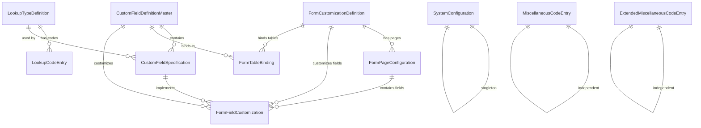

Based on the AccountMate 12 Custom Field Manager Database Reference Guide, I'll create an Ash domain and resources structure for the Accountex system.

## Domain Overview

The Custom Field Manager domain handles dynamic field definitions, lookup configurations, and form customizations within the accounting system.

## Mermaid Diagram



## Ash Domain Definition

```elixir
defmodule Accountex.CustomFieldManager do
  use Ash.Domain
  
  resources do
    resource Accountex.CustomFieldManager.CustomFieldDefinitionMaster
    resource Accountex.CustomFieldManager.CustomFieldSpecification
    resource Accountex.CustomFieldManager.LookupTypeDefinition
    resource Accountex.CustomFieldManager.LookupCodeEntry
    resource Accountex.CustomFieldManager.FormCustomizationDefinition
    resource Accountex.CustomFieldManager.FormPageConfiguration
    resource Accountex.CustomFieldManager.FormFieldCustomization
    resource Accountex.CustomFieldManager.FormTableBinding
    resource Accountex.CustomFieldManager.SystemConfiguration
    resource Accountex.CustomFieldManager.MiscellaneousCodeEntry
    resource Accountex.CustomFieldManager.ExtendedMiscellaneousCodeEntry
  end
end
```

## Resource Definitions

### 1. CustomFieldDefinitionMaster

```elixir
defmodule Accountex.CustomFieldManager.CustomFieldDefinitionMaster do
  use Ash.Resource,
    domain: Accountex.CustomFieldManager,
    data_layer: AshPostgres.DataLayer
  
  postgres do
    table "custom_field_definition_masters"
    repo Accountex.Repo
  end
  
  attributes do
    uuid_primary_key :id
    
    attribute :table_name, :string do
      allow_nil? false
    end
    
    attribute :table_description, :string do
      allow_nil? false
    end
    
    attribute :parent_table_name, :string do
      allow_nil? false
    end
    
    attribute :parent_primary_key_field_name, :string do
      allow_nil? false
    end
    
    timestamps()
  end
  
  relationships do
    has_many :custom_field_specifications, Accountex.CustomFieldManager.CustomFieldSpecification
    has_many :form_table_bindings, Accountex.CustomFieldManager.FormTableBinding
    has_many :form_field_customizations, Accountex.CustomFieldManager.FormFieldCustomization
  end
  
  actions do
    defaults [:create, :read, :update, :destroy]
  end
  
  code_interface do
    define :list_custom_field_definition_masters, action: :read
    define :get_custom_field_definition_master, action: :read, get?: true
    define :create_custom_field_definition_master, action: :create
    define :update_custom_field_definition_master, action: :update
    define :destroy_custom_field_definition_master, action: :destroy
  end
end
```

### 2. CustomFieldSpecification

```elixir
defmodule Accountex.CustomFieldManager.CustomFieldSpecification do
  use Ash.Resource,
    domain: Accountex.CustomFieldManager,
    data_layer: AshPostgres.DataLayer
  
  postgres do
    table "custom_field_specifications"
    repo Accountex.Repo
  end
  
  attributes do
    uuid_primary_key :id
    
    attribute :field_name, :string do
      allow_nil? false
    end
    
    attribute :field_caption, :string do
      allow_nil? false
    end
    
    attribute :data_type_name, :string do
      allow_nil? false
    end
    
    attribute :default_value, :string
    attribute :input_mask_pattern, :string
    
    attribute :is_nullable, :boolean do
      default false
    end
    
    attribute :has_lookup, :boolean do
      default false
    end
    
    attribute :field_length, :integer do
      allow_nil? false
    end
    
    attribute :decimal_places, :integer do
      allow_nil? false
      default 0
    end
    
    timestamps()
  end
  
  relationships do
    belongs_to :custom_field_definition_master, Accountex.CustomFieldManager.CustomFieldDefinitionMaster do
      allow_nil? false
    end
    
    belongs_to :lookup_type_definition, Accountex.CustomFieldManager.LookupTypeDefinition
    
    has_many :form_field_customizations, Accountex.CustomFieldManager.FormFieldCustomization
  end
  
  actions do
    defaults [:create, :read, :update, :destroy]
  end
  
  code_interface do
    define :list_custom_field_specifications, action: :read
    define :get_custom_field_specification, action: :read, get?: true
    define :create_custom_field_specification, action: :create
    define :update_custom_field_specification, action: :update
    define :destroy_custom_field_specification, action: :destroy
  end
end
```

### 3. LookupTypeDefinition

```elixir
defmodule Accountex.CustomFieldManager.LookupTypeDefinition do
  use Ash.Resource,
    domain: Accountex.CustomFieldManager,
    data_layer: AshPostgres.DataLayer
  
  postgres do
    table "lookup_type_definitions"
    repo Accountex.Repo
  end
  
  attributes do
    uuid_primary_key :id
    
    attribute :lookup_type_code, :string do
      allow_nil? false
    end
    
    attribute :lookup_type_description, :string do
      allow_nil? false
    end
    
    attribute :is_active, :boolean do
      default true
    end
    
    timestamps()
  end
  
  relationships do
    has_many :lookup_code_entries, Accountex.CustomFieldManager.LookupCodeEntry
    has_many :custom_field_specifications, Accountex.CustomFieldManager.CustomFieldSpecification
  end
  
  actions do
    defaults [:create, :read, :update, :destroy]
  end
  
  code_interface do
    define :list_lookup_type_definitions, action: :read
    define :get_lookup_type_definition, action: :read, get?: true
    define :create_lookup_type_definition, action: :create
    define :update_lookup_type_definition, action: :update
    define :destroy_lookup_type_definition, action: :destroy
  end
end
```

### 4. LookupCodeEntry

```elixir
defmodule Accountex.CustomFieldManager.LookupCodeEntry do
  use Ash.Resource,
    domain: Accountex.CustomFieldManager,
    data_layer: AshPostgres.DataLayer
  
  postgres do
    table "lookup_code_entries"
    repo Accountex.Repo
  end
  
  attributes do
    uuid_primary_key :id
    
    attribute :lookup_code, :string do
      allow_nil? false
    end
    
    attribute :lookup_code_description, :string do
      allow_nil? false
    end
    
    attribute :is_active, :boolean do
      default true
    end
    
    timestamps()
  end
  
  relationships do
    belongs_to :lookup_type_definition, Accountex.CustomFieldManager.LookupTypeDefinition do
      allow_nil? false
    end
  end
  
  actions do
    defaults [:create, :read, :update, :destroy]
  end
  
  code_interface do
    define :list_lookup_code_entries, action: :read
    define :get_lookup_code_entry, action: :read, get?: true
    define :create_lookup_code_entry, action: :create
    define :update_lookup_code_entry, action: :update
    define :destroy_lookup_code_entry, action: :destroy
  end
end
```

### 5. FormCustomizationDefinition

```elixir
defmodule Accountex.CustomFieldManager.FormCustomizationDefinition do
  use Ash.Resource,
    domain: Accountex.CustomFieldManager,
    data_layer: AshPostgres.DataLayer
  
  postgres do
    table "form_customization_definitions"
    repo Accountex.Repo
  end
  
  attributes do
    uuid_primary_key :id
    
    attribute :form_identifier, :string do
      allow_nil? false
    end
    
    timestamps()
  end
  
  relationships do
    has_many :form_page_configurations, Accountex.CustomFieldManager.FormPageConfiguration
    has_many :form_field_customizations, Accountex.CustomFieldManager.FormFieldCustomization
    has_many :form_table_bindings, Accountex.CustomFieldManager.FormTableBinding
  end
  
  actions do
    defaults [:create, :read, :update, :destroy]
  end
  
  code_interface do
    define :list_form_customization_definitions, action: :read
    define :get_form_customization_definition, action: :read, get?: true
    define :create_form_customization_definition, action: :create
    define :update_form_customization_definition, action: :update
    define :destroy_form_customization_definition, action: :destroy
  end
end
```

### 6. FormPageConfiguration

```elixir
defmodule Accountex.CustomFieldManager.FormPageConfiguration do
  use Ash.Resource,
    domain: Accountex.CustomFieldManager,
    data_layer: AshPostgres.DataLayer
  
  postgres do
    table "form_page_configurations"
    repo Accountex.Repo
  end
  
  attributes do
    uuid_primary_key :id
    
    attribute :page_tab_caption, :string do
      allow_nil? false
    end
    
    attribute :page_number, :integer do
      allow_nil? false
    end
    
    timestamps()
  end
  
  relationships do
    belongs_to :form_customization_definition, Accountex.CustomFieldManager.FormCustomizationDefinition do
      allow_nil? false
    end
    
    has_many :form_field_customizations, Accountex.CustomFieldManager.FormFieldCustomization
  end
  
  actions do
    defaults [:create, :read, :update, :destroy]
  end
  
  code_interface do
    define :list_form_page_configurations, action: :read
    define :get_form_page_configuration, action: :read, get?: true
    define :create_form_page_configuration, action: :create
    define :update_form_page_configuration, action: :update
    define :destroy_form_page_configuration, action: :destroy
  end
end
```

### 7. FormFieldCustomization

```elixir
defmodule Accountex.CustomFieldManager.FormFieldCustomization do
  use Ash.Resource,
    domain: Accountex.CustomFieldManager,
    data_layer: AshPostgres.DataLayer
  
  postgres do
    table "form_field_customizations"
    repo Accountex.Repo
  end
  
  attributes do
    uuid_primary_key :id
    
    attribute :is_editable, :boolean do
      default false
    end
    
    attribute :is_visible, :boolean do
      default false
    end
    
    attribute :field_sequence_number, :integer do
      allow_nil? false
    end
    
    attribute :field_settings, :map do
      default %{}
    end
    
    timestamps()
  end
  
  relationships do
    belongs_to :form_customization_definition, Accountex.CustomFieldManager.FormCustomizationDefinition do
      allow_nil? false
    end
    
    belongs_to :custom_field_definition_master, Accountex.CustomFieldManager.CustomFieldDefinitionMaster do
      allow_nil? false
    end
    
    belongs_to :custom_field_specification, Accountex.CustomFieldManager.CustomFieldSpecification do
      allow_nil? false
    end
    
    belongs_to :form_page_configuration, Accountex.CustomFieldManager.FormPageConfiguration do
      allow_nil? false
    end
  end
  
  actions do
    defaults [:create, :read, :update, :destroy]
  end
  
  code_interface do
    define :list_form_field_customizations, action: :read
    define :get_form_field_customization, action: :read, get?: true
    define :create_form_field_customization, action: :create
    define :update_form_field_customization, action: :update
    define :destroy_form_field_customization, action: :destroy
  end
end
```

### 8. FormTableBinding

```elixir
defmodule Accountex.CustomFieldManager.FormTableBinding do
  use Ash.Resource,
    domain: Accountex.CustomFieldManager,
    data_layer: AshPostgres.DataLayer
  
  postgres do
    table "form_table_bindings"
    repo Accountex.Repo
  end
  
  attributes do
    uuid_primary_key :id
    
    attribute :linked_field_name, :string do
      allow_nil? false
    end
    
    timestamps()
  end
  
  relationships do
    belongs_to :custom_field_definition_master, Accountex.CustomFieldManager.CustomFieldDefinitionMaster do
      allow_nil? false
    end
    
    belongs_to :form_customization_definition, Accountex.CustomFieldManager.FormCustomizationDefinition do
      allow_nil? false
    end
  end
  
  actions do
    defaults [:create, :read, :update, :destroy]
  end
  
  code_interface do
    define :list_form_table_bindings, action: :read
    define :get_form_table_binding, action: :read, get?: true
    define :create_form_table_binding, action: :create
    define :update_form_table_binding, action: :update
    define :destroy_form_table_binding, action: :destroy
  end
end
```

### 9. SystemConfiguration

```elixir
defmodule Accountex.CustomFieldManager.SystemConfiguration do
  use Ash.Resource,
    domain: Accountex.CustomFieldManager,
    data_layer: AshPostgres.DataLayer
  
  postgres do
    table "system_configurations"
    repo Accountex.Repo
  end
  
  attributes do
    uuid_primary_key :id
    
    attribute :custom_field_setup_status, :string do
      allow_nil? false
    end
    
    attribute :database_container_version, :string do
      allow_nil? false
    end
    
    timestamps()
  end
  
  actions do
    defaults [:create, :read, :update]
  end
  
  code_interface do
    define :list_system_configurations, action: :read
    define :get_system_configuration, action: :read, get?: true
    define :create_system_configuration, action: :create
    define :update_system_configuration, action: :update
  end
end
```

### 10. MiscellaneousCodeEntry

```elixir
defmodule Accountex.CustomFieldManager.MiscellaneousCodeEntry do
  use Ash.Resource,
    domain: Accountex.CustomFieldManager,
    data_layer: AshPostgres.DataLayer
  
  postgres do
    table "miscellaneous_code_entries"
    repo Accountex.Repo
  end
  
  attributes do
    uuid_primary_key :id
    
    attribute :miscellaneous_type_code, :string do
      allow_nil? false
    end
    
    attribute :miscellaneous_code, :string do
      allow_nil? false
    end
    
    attribute :miscellaneous_description, :string do
      allow_nil? false
    end
    
    attribute :foreign_language_description, :string
    
    attribute :is_active, :boolean do
      default true
    end
    
    timestamps()
  end
  
  actions do
    defaults [:create, :read, :update, :destroy]
  end
  
  code_interface do
    define :list_miscellaneous_code_entries, action: :read
    define :get_miscellaneous_code_entry, action: :read, get?: true
    define :create_miscellaneous_code_entry, action: :create
    define :update_miscellaneous_code_entry, action: :update
    define :destroy_miscellaneous_code_entry, action: :destroy
  end
end
```

### 11. ExtendedMiscellaneousCodeEntry

```elixir
defmodule Accountex.CustomFieldManager.ExtendedMiscellaneousCodeEntry do
  use Ash.Resource,
    domain: Accountex.CustomFieldManager,
    data_layer: AshPostgres.DataLayer
  
  postgres do
    table "extended_miscellaneous_code_entries"
    repo Accountex.Repo
  end
  
  attributes do
    uuid_primary_key :id
    
    attribute :extended_type_code, :string do
      allow_nil? false
    end
    
    attribute :extended_code, :string do
      allow_nil? false
    end
    
    attribute :extended_description, :string do
      allow_nil? false
    end
    
    attribute :extended_foreign_description, :string
    
    attribute :is_active, :boolean do
      default true
    end
    
    timestamps()
  end
  
  actions do
    defaults [:create, :read, :update, :destroy]
  end
  
  code_interface do
    define :list_extended_miscellaneous_code_entries, action: :read
    define :get_extended_miscellaneous_code_entry, action: :read, get?: true
    define :create_extended_miscellaneous_code_entry, action: :create
    define :update_extended_miscellaneous_code_entry, action: :update
    define :destroy_extended_miscellaneous_code_entry, action: :destroy
  end
end
```

## Notes

1. All primary keys have been converted to UUID7 type for better distributed system compatibility
2. Field names have been expanded to be more semantically meaningful
3. The `timestamps()` macro adds `inserted_at` and `updated_at` fields automatically
4. Code interfaces use pluralized resource names as requested
5. Table names in PostgreSQL use snake_case format derived from the resource name
6. All relationships are properly defined based on the data integrity rules from the original document
7. The `map` type is used for the settings field to store JSON data
8. Boolean fields replace the original `smallint` flags for better type safety