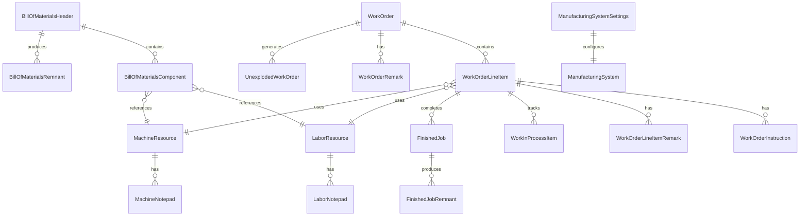

# Accountex Manufacturing Domain - Ash Resources Design Document

## Domain Overview

The Manufacturing domain manages the production lifecycle including bill of materials, work orders, work-in-process tracking, finished goods, and resource management (labor and machines).

## Mermaid Domain Diagram



## Resources

### 1. BillOfMaterialsHeader

```elixir
defmodule Accountex.Manufacturing.BillOfMaterialsHeader do
  use Ash.Resource,
    domain: Accountex.Manufacturing,
    data_layer: AshPostgres.DataLayer

  postgres do
    table "bill_of_materials_headers"
    repo Accountex.Repo
  end

  attributes do
    uuid_primary_key :id

    attribute :parent_item_number, :string, allow_nil?: false
    attribute :parent_specification_code_1, :string
    attribute :parent_specification_code_2, :string
    attribute :creation_date, :datetime, allow_nil?: false
    attribute :is_current_version, :boolean, default: false
    attribute :version_number, :integer, allow_nil?: false
    attribute :last_modified_timestamp, :datetime, allow_nil?: false
    attribute :version_remarks, :string
    attribute :header_status, :string, allow_nil?: false
  end

  relationships do
    has_many :components, Accountex.Manufacturing.BillOfMaterialsComponent
    has_many :remnants, Accountex.Manufacturing.BillOfMaterialsRemnant
  end

  actions do
    defaults [:read]
    
    create :create do
      accept [:parent_item_number, :parent_specification_code_1, :parent_specification_code_2, :version_remarks]
    end
    
    update :update do
      accept [:version_remarks]
    end
    
    update :activate_version do
      change set_attribute(:is_current_version, true)
    end
  end
end
```

### 2. BillOfMaterialsComponent

```elixir
defmodule Accountex.Manufacturing.BillOfMaterialsComponent do
  use Ash.Resource,
    domain: Accountex.Manufacturing,
    data_layer: AshPostgres.DataLayer

  postgres do
    table "bill_of_materials_components"
    repo Accountex.Repo
  end

  attributes do
    uuid_primary_key :id

    attribute :parent_item_number, :string, allow_nil?: false
    attribute :parent_specification_code_1, :string
    attribute :parent_specification_code_2, :string
    attribute :component_item_number, :string, allow_nil?: false
    attribute :component_specification_code_1, :string
    attribute :component_specification_code_2, :string
    attribute :component_description, :string, allow_nil?: false
    attribute :unit_of_measure, :string
    attribute :component_type, :atom, allow_nil?: false, constraints: [one_of: [:inventory, :machine, :labor]]
    attribute :creation_date, :datetime, allow_nil?: false
    attribute :quantity_decimal_places, :integer, default: 0
    attribute :step_number, :integer
    attribute :setup_time_minutes, :decimal
    attribute :teardown_time_minutes, :decimal
    attribute :required_quantity, :decimal, allow_nil?: false
    attribute :production_rate, :decimal, allow_nil?: false
    attribute :conversion_factor, :decimal
  end

  relationships do
    belongs_to :bill_of_materials_header, Accountex.Manufacturing.BillOfMaterialsHeader
    belongs_to :labor_resource, Accountex.Manufacturing.LaborResource
    belongs_to :machine_resource, Accountex.Manufacturing.MachineResource
  end

  actions do
    defaults [:read, :create, :update, :destroy]
  end
end
```

### 3. WorkOrder

```elixir
defmodule Accountex.Manufacturing.WorkOrder do
  use Ash.Resource,
    domain: Accountex.Manufacturing,
    data_layer: AshPostgres.DataLayer

  postgres do
    table "work_orders"
    repo Accountex.Repo
  end

  attributes do
    uuid_primary_key :id

    attribute :work_order_number, :string, allow_nil?: false
    attribute :revision_number, :string
    attribute :warehouse_code, :string, allow_nil?: false
    attribute :sales_order_number, :string
    attribute :customer_number, :string
    attribute :entered_by_user, :string, allow_nil?: false
    attribute :order_date, :date
    attribute :requested_date, :date
    attribute :creation_date, :datetime, allow_nil?: false
    attribute :is_on_hold, :boolean, default: false
    attribute :is_exploded, :boolean, default: false
    attribute :is_printed, :boolean, default: false
    attribute :uses_multiple_request_dates, :boolean, default: false
  end

  relationships do
    has_many :line_items, Accountex.Manufacturing.WorkOrderLineItem
    has_many :remarks, Accountex.Manufacturing.WorkOrderRemark
    has_many :unexploded_orders, Accountex.Manufacturing.UnexplodedWorkOrder
  end

  actions do
    defaults [:read]
    
    create :create do
      accept [:work_order_number, :warehouse_code, :sales_order_number, :customer_number, :order_date, :requested_date]
    end
    
    update :update do
      accept [:requested_date, :is_on_hold]
    end
    
    update :explode do
      change set_attribute(:is_exploded, true)
    end
  end
end
```

### 4. WorkOrderLineItem

```elixir
defmodule Accountex.Manufacturing.WorkOrderLineItem do
  use Ash.Resource,
    domain: Accountex.Manufacturing,
    data_layer: AshPostgres.DataLayer

  postgres do
    table "work_order_line_items"
    repo Accountex.Repo
  end

  attributes do
    uuid_primary_key :id

    attribute :job_number, :string
    attribute :sales_order_number, :string
    attribute :customer_number, :string
    attribute :parent_level, :string, allow_nil?: false
    attribute :parent_node, :string
    attribute :component_level, :string
    attribute :component_node, :string
    attribute :line_item_key, :string
    attribute :master_parent_item_number, :string, allow_nil?: false
    attribute :component_item_number, :string, allow_nil?: false
    attribute :component_specification_code_1, :string
    attribute :component_specification_code_2, :string
    attribute :component_description, :string, allow_nil?: false
    attribute :component_class, :string
    attribute :component_shift, :string
    attribute :component_type, :atom, allow_nil?: false, constraints: [one_of: [:inventory, :machine, :labor]]
    attribute :processing_method, :string
    attribute :order_date, :datetime, allow_nil?: false
    attribute :requested_date, :datetime, allow_nil?: false
    attribute :work_in_process_start_date, :datetime
    attribute :finish_date, :datetime
    attribute :posting_date, :datetime
    attribute :is_parent_item, :boolean, default: false
    attribute :is_completed, :boolean, default: false
    attribute :routing_slip_printed, :boolean, default: false
    attribute :quantity_decimal_places, :integer
    attribute :step_number, :integer
    attribute :setup_time_minutes, :decimal
    attribute :teardown_time_minutes, :decimal
    attribute :manufacturing_quantity, :decimal, allow_nil?: false
    attribute :finished_quantity, :decimal
    attribute :work_in_process_quantity, :decimal
    attribute :used_quantity, :decimal
    attribute :released_quantity, :decimal
    attribute :conversion_quantity, :decimal
    attribute :allocated_quantity, :decimal
    attribute :standard_cost, :decimal
    attribute :actual_parent_finish_cost, :decimal
    attribute :actual_component_finish_cost, :decimal
    attribute :actual_parent_wip_cost, :decimal
    attribute :actual_component_wip_cost, :decimal
    attribute :sequence_number, :integer, allow_nil?: false
    attribute :scrap_quantity, :decimal
  end

  relationships do
    belongs_to :work_order, Accountex.Manufacturing.WorkOrder
    has_many :instructions, Accountex.Manufacturing.WorkOrderInstruction
    has_many :remarks, Accountex.Manufacturing.WorkOrderLineItemRemark
    has_many :work_in_process_items, Accountex.Manufacturing.WorkInProcessItem
    has_many :finished_jobs, Accountex.Manufacturing.FinishedJob
  end

  actions do
    defaults [:read, :create, :update]
  end
end
```

### 5. WorkInProcessItem

```elixir
defmodule Accountex.Manufacturing.WorkInProcessItem do
  use Ash.Resource,
    domain: Accountex.Manufacturing,
    data_layer: AshPostgres.DataLayer

  postgres do
    table "work_in_process_items"
    repo Accountex.Repo
  end

  attributes do
    uuid_primary_key :id

    attribute :wip_number, :string
    attribute :job_number, :string, allow_nil?: false
    attribute :sales_order_number, :string
    attribute :customer_number, :string
    attribute :parent_level, :string, allow_nil?: false
    attribute :parent_node, :string
    attribute :component_level, :string, allow_nil?: false
    attribute :component_node, :string
    attribute :line_item_key, :string
    attribute :master_parent_item_number, :string, allow_nil?: false
    attribute :component_item_number, :string, allow_nil?: false
    attribute :component_specification_code_1, :string
    attribute :component_specification_code_2, :string
    attribute :component_description, :string, allow_nil?: false
    attribute :serial_number, :string
    attribute :lot_number, :string
    attribute :component_shift, :string
    attribute :component_type, :atom, allow_nil?: false, constraints: [one_of: [:inventory, :machine, :labor]]
    attribute :posted_to_gl, :boolean, default: false
    attribute :bin_location, :string, allow_nil?: false
    attribute :order_date, :datetime, allow_nil?: false
    attribute :requested_date, :datetime, allow_nil?: false
    attribute :wip_start_date, :datetime, allow_nil?: false
    attribute :item_date, :datetime
    attribute :posting_date, :datetime, allow_nil?: false
    attribute :is_voided, :boolean, default: false
    attribute :is_parent_item, :boolean, default: false
    attribute :routing_slip_printed, :boolean, default: false
    attribute :quantity_decimal_places, :integer
    attribute :step_number, :integer
    attribute :setup_time_minutes, :decimal
    attribute :teardown_time_minutes, :decimal
    attribute :wip_quantity, :decimal, allow_nil?: false
    attribute :reserved_quantity, :decimal
    attribute :allocated_quantity, :decimal
    attribute :unit_cost, :decimal
    attribute :setup_cost, :decimal
    attribute :teardown_cost, :decimal
    attribute :production_cost, :decimal
    attribute :extended_amount, :decimal
  end

  relationships do
    belongs_to :work_order, Accountex.Manufacturing.WorkOrder
    belongs_to :work_order_line_item, Accountex.Manufacturing.WorkOrderLineItem
  end

  actions do
    defaults [:read, :create, :update]
    
    update :void do
      change set_attribute(:is_voided, true)
    end
  end
end
```

### 6. FinishedJob

```elixir
defmodule Accountex.Manufacturing.FinishedJob do
  use Ash.Resource,
    domain: Accountex.Manufacturing,
    data_layer: AshPostgres.DataLayer

  postgres do
    table "finished_jobs"
    repo Accountex.Repo
  end

  attributes do
    uuid_primary_key :id

    attribute :wip_number, :string
    attribute :finish_number, :string
    attribute :job_number, :string, allow_nil?: false
    attribute :sales_order_number, :string
    attribute :customer_number, :string
    attribute :parent_level, :string, allow_nil?: false
    attribute :parent_node, :string
    attribute :component_level, :string
    attribute :component_node, :string
    attribute :line_item_key, :string
    attribute :master_parent_item_number, :string, allow_nil?: false
    attribute :component_item_number, :string, allow_nil?: false
    attribute :component_specification_code_1, :string
    attribute :component_specification_code_2, :string
    attribute :component_description, :string, allow_nil?: false
    attribute :serial_number, :string
    attribute :lot_number, :string
    attribute :component_shift, :string, allow_nil?: false
    attribute :component_type, :atom, allow_nil?: false, constraints: [one_of: [:inventory, :machine, :labor]]
    attribute :posted_to_gl, :boolean, default: false
    attribute :bin_location, :string, allow_nil?: false
    attribute :source_number, :string
    attribute :order_date, :datetime, allow_nil?: false
    attribute :requested_date, :datetime, allow_nil?: false
    attribute :wip_start_date, :datetime, allow_nil?: false
    attribute :finish_date, :datetime, allow_nil?: false
    attribute :item_date, :datetime
    attribute :posting_date, :datetime, allow_nil?: false
    attribute :is_parent_item, :boolean, default: false
    attribute :is_voided, :boolean, default: false
    attribute :label_printed, :boolean, default: false
    attribute :quantity_decimal_places, :integer
    attribute :setup_time_minutes, :decimal
    attribute :teardown_time_minutes, :decimal
    attribute :finished_quantity, :decimal, allow_nil?: false
    attribute :used_quantity, :decimal
    attribute :released_to_stock_quantity, :decimal
    attribute :unit_cost, :decimal
    attribute :setup_cost, :decimal
    attribute :teardown_cost, :decimal
    attribute :production_cost, :decimal
    attribute :cost_variance, :decimal
    attribute :overhead_cost, :decimal
    attribute :extended_amount, :decimal
    attribute :scrap_amount, :decimal
    attribute :scrap_quantity, :decimal
  end

  relationships do
    belongs_to :work_order, Accountex.Manufacturing.WorkOrder
    belongs_to :work_order_line_item, Accountex.Manufacturing.WorkOrderLineItem
    has_many :remnants, Accountex.Manufacturing.FinishedJobRemnant
  end

  actions do
    defaults [:read, :create, :update]
    
    update :void do
      change set_attribute(:is_voided, true)
    end
  end
end
```

### 7. LaborResource

```elixir
defmodule Accountex.Manufacturing.LaborResource do
  use Ash.Resource,
    domain: Accountex.Manufacturing,
    data_layer: AshPostgres.DataLayer

  postgres do
    table "labor_resources"
    repo Accountex.Repo
  end

  attributes do
    uuid_primary_key :id

    attribute :labor_code, :string, allow_nil?: false
    attribute :labor_description, :string, allow_nil?: false
    attribute :employee_identification_number, :string, allow_nil?: false
    attribute :labor_class, :string
    attribute :work_shift, :string
    attribute :gl_account_code, :string, allow_nil?: false
    attribute :resource_status, :atom, allow_nil?: false, constraints: [one_of: [:active, :inactive]]
    attribute :creation_date, :datetime, allow_nil?: false
    attribute :production_rate_per_hour, :decimal, allow_nil?: false
    attribute :setup_time_minutes, :decimal
    attribute :teardown_time_minutes, :decimal
    attribute :total_time_worked, :decimal
    attribute :total_time_allocated, :decimal
    attribute :setup_cost_per_hour, :decimal
    attribute :teardown_cost_per_hour, :decimal
    attribute :labor_cost_per_hour, :decimal
  end

  relationships do
    has_one :notepad, Accountex.Manufacturing.LaborNotepad
  end

  actions do
    defaults [:read, :create, :update]
  end
end
```

### 8. MachineResource

```elixir
defmodule Accountex.Manufacturing.MachineResource do
  use Ash.Resource,
    domain: Accountex.Manufacturing,
    data_layer: AshPostgres.DataLayer

  postgres do
    table "machine_resources"
    repo Accountex.Repo
  end

  attributes do
    uuid_primary_key :id

    attribute :machine_code, :string, allow_nil?: false
    attribute :machine_description, :string, allow_nil?: false
    attribute :machine_identification_number, :string, allow_nil?: false
    attribute :machine_class, :string, allow_nil?: false
    attribute :work_shift, :string, allow_nil?: false
    attribute :gl_account_code, :string
    attribute :resource_status, :atom, allow_nil?: false, constraints: [one_of: [:active, :inactive]]
    attribute :creation_date, :datetime, allow_nil?: false
    attribute :check_on_hand_quantity, :boolean, default: false
    attribute :production_rate_per_hour, :decimal
    attribute :setup_time_minutes, :decimal
    attribute :teardown_time_minutes, :decimal
    attribute :time_between_overhaul_hours, :decimal
    attribute :total_time_used, :decimal
    attribute :total_time_allocated, :decimal
    attribute :setup_cost_per_hour, :decimal
    attribute :teardown_cost_per_hour, :decimal
    attribute :machine_cost_per_hour, :decimal
  end

  relationships do
    has_one :notepad, Accountex.Manufacturing.MachineNotepad
  end

  actions do
    defaults [:read, :create, :update]
  end
end
```

### 9. ManufacturingSystemSettings

```elixir
defmodule Accountex.Manufacturing.ManufacturingSystemSettings do
  use Ash.Resource,
    domain: Accountex.Manufacturing,
    data_layer: AshPostgres.DataLayer

  postgres do
    table "manufacturing_system_settings"
    repo Accountex.Repo
  end

  attributes do
    uuid_primary_key :id

    attribute :setup_status, :string, allow_nil?: false
    attribute :current_period, :string, allow_nil?: false
    attribute :next_work_order_number, :string, allow_nil?: false
    attribute :next_job_number, :string, allow_nil?: false
    attribute :inventory_wip_gl_account, :string, allow_nil?: false
    attribute :machine_wip_gl_account, :string, allow_nil?: false
    attribute :labor_wip_gl_account, :string, allow_nil?: false
    attribute :machine_clearing_gl_account, :string, allow_nil?: false
    attribute :labor_clearing_gl_account, :string, allow_nil?: false
    attribute :product_variance_gl_account, :string, allow_nil?: false
    attribute :overhead_allowance_gl_account, :string, allow_nil?: false
    attribute :work_order_report_option, :atom, constraints: [one_of: [:preprinted, :blank_form]]
    attribute :routing_slip_report_option, :atom, constraints: [one_of: [:preprinted, :blank_form]]
    attribute :production_slip_report_option, :atom, constraints: [one_of: [:preprinted, :blank_form]]
    attribute :scrap_expense_gl_account, :string
    attribute :work_order_purge_date, :datetime
    attribute :inventory_adjustment_purge_date, :datetime
    attribute :last_transfer_date, :datetime
    attribute :print_logo_on_work_orders, :boolean, default: false
    attribute :print_company_name_on_work_orders, :boolean, default: false
    attribute :double_space_work_order_lines, :boolean, default: false
    attribute :print_logo_on_routing_slips, :boolean, default: false
    attribute :print_company_name_on_routing_slips, :boolean, default: false
    attribute :double_space_routing_slip_lines, :boolean, default: false
    attribute :print_logo_on_production_slips, :boolean, default: false
    attribute :print_company_name_on_production_slips, :boolean, default: false
    attribute :double_space_production_slip_lines, :boolean, default: false
    attribute :copy_line_item_descriptions, :boolean, default: true
    attribute :copy_work_order_line_remarks, :boolean, default: true
    attribute :print_work_order_after_creation, :boolean, default: true
    attribute :print_routing_slip_after_creation, :boolean, default: false
    attribute :print_production_slip_after_creation, :boolean, default: false
    attribute :overwrite_work_order_header, :boolean, default: true
    attribute :create_work_orders_from_sales_orders, :boolean, default: true
    attribute :use_existing_on_hand_quantity, :boolean, default: true
    attribute :check_on_hand_quantity, :boolean, default: true
    attribute :allow_negative_on_hand_quantity, :boolean, default: false
    attribute :require_work_in_process, :boolean, default: true
    attribute :default_serial_numbers, :boolean, default: true
    attribute :auto_generate_work_order_numbers, :boolean, default: false
    attribute :copy_sales_order_descriptions, :boolean, default: true
    attribute :copy_sales_order_remarks, :boolean, default: true
    attribute :copy_sales_order_backorder_quantity, :boolean, default: true
    attribute :allow_multiple_request_dates, :boolean, default: false
    attribute :post_work_in_process_option, :atom, constraints: [one_of: [:no_posting, :always_post, :prompt]]
    attribute :explode_work_orders_option, :atom, constraints: [one_of: [:no_explosion, :always_explode, :prompt]]
    attribute :standard_cost_usage_option, :atom, constraints: [one_of: [:actual_cost, :standard_cost, :standard_for_masters_only]]
    attribute :overhead_cost_calculation_option, :atom, constraints: [one_of: [:no_calculation, :flat_amount, :percentage_rate]]
    attribute :post_proportional_components_option, :atom, constraints: [one_of: [:no_proportionate, :always_proportionate, :prompt]]
    attribute :work_order_copy_labels, :string
    attribute :routing_slip_copy_labels, :string
    attribute :production_slip_copy_labels, :string
  end

  actions do
    defaults [:read, :update]
  end
end
```

## Domain Module

```elixir
defmodule Accountex.Manufacturing do
  use Ash.Domain

  resources do
    resource Accountex.Manufacturing.BillOfMaterialsHeader
    resource Accountex.Manufacturing.BillOfMaterialsComponent
    resource Accountex.Manufacturing.BillOfMaterialsRemnant
    resource Accountex.Manufacturing.WorkOrder
    resource Accountex.Manufacturing.WorkOrderLineItem
    resource Accountex.Manufacturing.WorkOrderRemark
    resource Accountex.Manufacturing.WorkOrderInstruction
    resource Accountex.Manufacturing.WorkOrderLineItemRemark
    resource Accountex.Manufacturing.WorkInProcessItem
    resource Accountex.Manufacturing.FinishedJob
    resource Accountex.Manufacturing.FinishedJobRemnant
    resource Accountex.Manufacturing.LaborResource
    resource Accountex.Manufacturing.LaborNotepad
    resource Accountex.Manufacturing.MachineResource
    resource Accountex.Manufacturing.MachineNotepad
    resource Accountex.Manufacturing.UnexplodedWorkOrder
    resource Accountex.Manufacturing.UnexplodedWorkOrderRemark
    resource Accountex.Manufacturing.ManufacturingSystemSettings
    resource Accountex.Manufacturing.ManufacturingRemark
  end

  # Bill of Materials Operations
  def bill_of_materials_headers, do: Accountex.Manufacturing.BillOfMaterialsHeader
  def bill_of_materials_components, do: Accountex.Manufacturing.BillOfMaterialsComponent
  def bill_of_materials_remnants, do: Accountex.Manufacturing.BillOfMaterialsRemnant

  # Work Order Operations
  def work_orders, do: Accountex.Manufacturing.WorkOrder
  def work_order_line_items, do: Accountex.Manufacturing.WorkOrderLineItem
  def work_order_remarks, do: Accountex.Manufacturing.WorkOrderRemark
  def work_order_instructions, do: Accountex.Manufacturing.WorkOrderInstruction
  def work_order_line_item_remarks, do: Accountex.Manufacturing.WorkOrderLineItemRemark

  # Production Tracking Operations
  def work_in_process_items, do: Accountex.Manufacturing.WorkInProcessItem
  def finished_jobs, do: Accountex.Manufacturing.FinishedJob
  def finished_job_remnants, do: Accountex.Manufacturing.FinishedJobRemnant

  # Resource Management Operations
  def labor_resources, do: Accountex.Manufacturing.LaborResource
  def machine_resources, do: Accountex.Manufacturing.MachineResource
  
  # System Configuration
  def manufacturing_system_settings, do: Accountex.Manufacturing.ManufacturingSystemSettings
end
```

## Key Design Decisions

1. **UUID7 Primary Keys**: All resources use UUID7 for the primary key field named `id` for better distributed system compatibility.

2. **Semantic Field Names**: All field names have been renamed to be semantically meaningful:
   - `citemno` → `parent_item_number` or `component_item_number`
   - `nqty` → `required_quantity`
   - `dorder` → `order_date`
   - etc.

3. **Proper Relationships**: Foreign key relationships are established using `belongs_to` with properly named fields ending in `_id`.

4. **Component Types**: The component type field uses atoms with constraints for type safety (`:inventory`, `:machine`, `:labor`).

5. **Table Naming**: PostgreSQL tables use snake_case plural forms of the semantic resource names.

6. **Domain Interface**: The domain module provides clean interfaces using pluralized resource names for accessing resources.

This design provides a clean, maintainable structure for the Manufacturing module while preserving all the business logic and relationships from the original data dictionary.