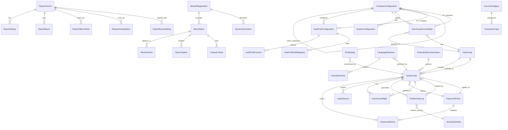

# Accountex System Manager - Ash Domain Specification

## Domain Overview

The System Manager domain handles core system configuration, user management, security, auditing, and reporting infrastructure for the Accountex ERP system.

## Mermaid Domain Diagram



## Domain Module

```elixir
defmodule Accountex.SystemManager do
  use Ash.Domain

  resources do
    # Core System Resources
    resource Accountex.SystemManager.CompanyConfiguration
    resource Accountex.SystemManager.SystemConfiguration
    resource Accountex.SystemManager.SystemInformation
    resource Accountex.SystemManager.ModuleRegistration

    # User & Security Resources
    resource Accountex.SystemManager.SystemUser
    resource Accountex.SystemManager.UserGroup
    resource Accountex.SystemManager.UserGroupAccessRight
    resource Accountex.SystemManager.UserAccessRight
    resource Accountex.SystemManager.LoginSession
    resource Accountex.SystemManager.PasswordPolicy
    resource Accountex.SystemManager.PasswordHistory
    resource Accountex.SystemManager.ExtendedSecurityFeature

    # Audit Resources
    resource Accountex.SystemManager.ActivityDefinition
    resource Accountex.SystemManager.AuditTrailConfiguration
    resource Accountex.SystemManager.AuditTrailFunction
    resource Accountex.SystemManager.AuditActivityLog
    resource Accountex.SystemManager.AuditTrailFieldMapping

    # Report Resources
    resource Accountex.SystemManager.ReportControl
    resource Accountex.SystemManager.ReportSetting
    resource Accountex.SystemManager.ReportMacro
    resource Accountex.SystemManager.ReportExportSetting
    resource Accountex.SystemManager.ReportFilterCriteria
    resource Accountex.SystemManager.ReportSortingOption

    # UI Customization Resources
    resource Accountex.SystemManager.GridSetting
    resource Accountex.SystemManager.ShortcutPane
    resource Accountex.SystemManager.MenuOption
    resource Accountex.SystemManager.SearchOption
    resource Accountex.SystemManager.LookupCriteria

    # Localization Resources
    resource Accountex.SystemManager.LanguageSelection
    resource Accountex.SystemManager.TranslationEntry

    # Financial Resources
    resource Accountex.SystemManager.AccountCategory
    resource Accountex.SystemManager.TransactionType
  end
end
```

## Core Resources

### CompanyConfiguration

```elixir
defmodule Accountex.SystemManager.CompanyConfiguration do
  use Ash.Resource,
    domain: Accountex.SystemManager,
    data_layer: AshPostgres.DataLayer

  postgres do
    table "company_configurations"
    repo Accountex.Repo
  end

  attributes do
    uuid_primary_key :id
    
    attribute :company_identifier, :string, allow_nil?: false
    attribute :company_name, :string, allow_nil?: false
    attribute :database_name, :string, allow_nil?: false
    attribute :server_name, :string
    attribute :server_identifier, :string
    attribute :server_password, :string, sensitive?: true
    
    # Address fields
    attribute :address_line_one, :string
    attribute :address_line_two, :string
    attribute :city_name, :string
    attribute :state_province, :string
    attribute :postal_code, :string
    attribute :country_name, :string
    attribute :phone_number, :string
    attribute :fax_number, :string
    
    # Financial settings
    attribute :home_currency_code, :string, default: "USD"
    attribute :tax_type_code, :string
    attribute :date_format_pattern, :string
    attribute :thousand_separator_char, :string, default: ","
    attribute :decimal_separator_char, :string, default: "."
    
    # Fiscal year settings
    attribute :first_day_fiscal_year, :date
    attribute :number_accounting_periods, :integer, default: 12
    attribute :interval_type_code, :string, default: "M"
    attribute :interval_value, :integer, default: 1
    
    # Display settings
    attribute :company_logo, :binary
    attribute :logo_image_height, :integer
    attribute :logo_image_width, :integer
    attribute :logo_image_position, :integer
    attribute :show_on_desktop, :boolean, default: false
    
    # System fields
    attribute :status_code, :string
    attribute :parent_company_id, :uuid
    attribute :error_log_directory_path, :string
    attribute :attachment_directory_path, :string
    
    timestamps()
  end

  relationships do
    belongs_to :parent_company, Accountex.SystemManager.CompanyConfiguration do
      source_attribute :parent_company_id
      destination_attribute :id
    end
    
    has_many :audit_trail_configurations, Accountex.SystemManager.AuditTrailConfiguration do
      source_attribute :id
      destination_attribute :company_configuration_id
    end
    
    has_many :user_group_access_rights, Accountex.SystemManager.UserGroupAccessRight do
      source_attribute :id
      destination_attribute :company_configuration_id
    end
  end

  actions do
    defaults [:read, :update, :destroy]
    
    create :create do
      primary? true
      
      argument :company_identifier, :string, allow_nil?: false
      argument :company_name, :string, allow_nil?: false
      argument :database_name, :string, allow_nil?: false
    end
  end
end
```

### SystemUser

```elixir
defmodule Accountex.SystemManager.SystemUser do
  use Ash.Resource,
    domain: Accountex.SystemManager,
    data_layer: AshPostgres.DataLayer

  postgres do
    table "system_users"
    repo Accountex.Repo
  end

  attributes do
    uuid_primary_key :id
    
    attribute :user_identifier, :string, allow_nil?: false
    attribute :user_name, :string, allow_nil?: false
    attribute :full_name, :string, allow_nil?: false
    attribute :encrypted_password, :string, sensitive?: true
    
    # Access settings
    attribute :access_log_enabled, :boolean, default: false
    attribute :access_log_data, :text
    attribute :maintenance_flag, :boolean, default: false
    
    # Account status
    attribute :status_code, :string
    attribute :account_disabled, :boolean, default: false
    attribute :account_locked, :boolean, default: false
    attribute :allow_multiple_logins, :boolean, default: false
    
    # Password settings
    attribute :change_password_next_login, :boolean, default: false
    attribute :user_cannot_change_password, :boolean, default: false
    attribute :password_never_expires, :boolean, default: false
    
    # Login tracking
    attribute :first_login_datetime, :utc_datetime_usec
    attribute :last_login_datetime, :utc_datetime_usec
    attribute :login_retry_count, :integer, default: 0
    
    # Preferences
    attribute :preferred_language_code, :string, default: "EN"
    attribute :last_company_id, :uuid
    attribute :last_module_code, :string
    attribute :last_warehouse_code, :string
    
    timestamps()
  end

  relationships do
    belongs_to :user_group, Accountex.SystemManager.UserGroup do
      source_attribute :user_group_id
      destination_attribute :id
    end
    
    has_many :password_histories, Accountex.SystemManager.PasswordHistory do
      source_attribute :id
      destination_attribute :system_user_id
    end
    
    has_many :login_sessions, Accountex.SystemManager.LoginSession do
      source_attribute :id
      destination_attribute :system_user_id
    end
    
    has_many :user_access_rights, Accountex.SystemManager.UserAccessRight do
      source_attribute :id
      destination_attribute :system_user_id
    end
    
    has_many :audit_activity_logs, Accountex.SystemManager.AuditActivityLog do
      source_attribute :id
      destination_attribute :system_user_id
    end
  end

  actions do
    defaults [:read, :update, :destroy]
    
    create :create do
      primary? true
      
      argument :user_identifier, :string, allow_nil?: false
      argument :user_name, :string, allow_nil?: false
      argument :full_name, :string, allow_nil?: false
      argument :password, :string, allow_nil?: false
      
      change fn changeset, _ ->
        password = Ash.Changeset.get_argument(changeset, :password)
        encrypted = encrypt_password(password) # Implementation needed
        Ash.Changeset.change_attribute(changeset, :encrypted_password, encrypted)
      end
    end
    
    update :change_password do
      argument :current_password, :string, allow_nil?: false
      argument :new_password, :string, allow_nil?: false
      
      # Validation and encryption logic needed
    end
    
    update :lock_account do
      change set_attribute(:account_locked, true)
    end
    
    update :unlock_account do
      change set_attribute(:account_locked, false)
      change set_attribute(:login_retry_count, 0)
    end
  end
end
```

### AuditActivityLog

```elixir
defmodule Accountex.SystemManager.AuditActivityLog do
  use Ash.Resource,
    domain: Accountex.SystemManager,
    data_layer: AshPostgres.DataLayer

  postgres do
    table "audit_activity_logs"
    repo Accountex.Repo
  end

  attributes do
    uuid_primary_key :id
    
    attribute :unique_identifier, :string, allow_nil?: false
    attribute :primary_key_field_name, :string, allow_nil?: false
    attribute :primary_key_field_value, :string, allow_nil?: false
    attribute :audit_field_name, :string, allow_nil?: false
    attribute :old_field_value, :string
    attribute :new_field_value, :string
    attribute :utc_timestamp, :utc_datetime_usec, allow_nil?: false
    attribute :time_difference_minutes, :integer, default: 0
    
    timestamps()
  end

  relationships do
    belongs_to :system_user, Accountex.SystemManager.SystemUser do
      source_attribute :system_user_id
      destination_attribute :id
      allow_nil?: false
    end
  end

  actions do
    defaults [:read]
    
    create :log_activity do
      primary? true
      
      argument :system_user_id, :uuid, allow_nil?: false
      argument :primary_key_field_name, :string, allow_nil?: false
      argument :primary_key_field_value, :string, allow_nil?: false
      argument :audit_field_name, :string, allow_nil?: false
      argument :old_field_value, :string
      argument :new_field_value, :string
      
      change set_attribute(:utc_timestamp, DateTime.utc_now())
    end
  end
end
```

### ReportControl

```elixir
defmodule Accountex.SystemManager.ReportControl do
  use Ash.Resource,
    domain: Accountex.SystemManager,
    data_layer: AshPostgres.DataLayer

  postgres do
    table "report_controls"
    repo Accountex.Repo
  end

  attributes do
    uuid_primary_key :id
    
    attribute :report_identifier, :string, allow_nil?: false
    attribute :function_identifier, :string, allow_nil?: false
    attribute :query_program_name, :string
    attribute :help_context_id, :integer
    attribute :default_macro_name, :string
    
    # Report options
    attribute :notes_content, :text
    attribute :secondary_sort_enabled, :boolean, default: false
    attribute :transaction_printable, :boolean, default: false
    attribute :print_notes_enabled, :boolean, default: false
    attribute :print_criteria_enabled, :boolean, default: false
    attribute :notes_button_enabled, :boolean, default: false
    attribute :batch_button_enabled, :boolean, default: false
    attribute :time_prep_options_enabled, :boolean, default: false
    
    # Report driver settings
    attribute :report_driver_type, :integer, default: 1
    attribute :default_font_name, :string
    attribute :default_sort_expression, :string
    
    # Email/Export settings
    attribute :individual_subject_line, :string
    attribute :individual_export_filename, :string
    attribute :multiple_subject_line, :string
    attribute :multiple_export_filename, :string
    
    attribute :owner_code, :string, default: "AM"
    
    timestamps()
  end

  relationships do
    has_many :report_settings, Accountex.SystemManager.ReportSetting do
      source_attribute :id
      destination_attribute :report_control_id
    end
    
    has_many :report_macros, Accountex.SystemManager.ReportMacro do
      source_attribute :id
      destination_attribute :report_control_id
    end
    
    has_many :report_filter_criteria, Accountex.SystemManager.ReportFilterCriteria do
      source_attribute :id
      destination_attribute :report_control_id
    end
    
    has_many :report_sorting_options, Accountex.SystemManager.ReportSortingOption do
      source_attribute :id
      destination_attribute :report_control_id
    end
  end

  actions do
    defaults [:read, :create, :update, :destroy]
  end
end
```


## Code Interfaces

The domain module would include these code interfaces for common operations:

```elixir
defmodule Accountex.SystemManager do
  # ... resource definitions ...
  
  # Company Configuration interfaces
  def company_configurations_list(opts \\ []), do: Accountex.SystemManager.CompanyConfiguration.read!(opts)
  def company_configurations_get!(id), do: Accountex.SystemManager.CompanyConfiguration.get!(id)
  def company_configurations_create!(params), do: Accountex.SystemManager.CompanyConfiguration.create!(params)
  def company_configurations_update!(record, params), do: Accountex.SystemManager.CompanyConfiguration.update!(record, params)
  def company_configurations_destroy!(record), do: Accountex.SystemManager.CompanyConfiguration.destroy!(record)
  
  # System User interfaces
  def system_users_list(opts \\ []), do: Accountex.SystemManager.SystemUser.read!(opts)
  def system_users_get!(id), do: Accountex.SystemManager.SystemUser.get!(id)
  def system_users_create!(params), do: Accountex.SystemManager.SystemUser.create!(params)
  def system_users_change_password!(user, params), do: Accountex.SystemManager.SystemUser.change_password!(user, params)
  def system_users_lock_account!(user), do: Accountex.SystemManager.SystemUser.lock_account!(user)
  def system_users_unlock_account!(user), do: Accountex.SystemManager.SystemUser.unlock_account!(user)
  
  # Audit Activity Log interfaces
  def audit_activity_logs_list(opts \\ []), do: Accountex.SystemManager.AuditActivityLog.read!(opts)
  def audit_activity_logs_log_activity!(params), do: Accountex.SystemManager.AuditActivityLog.log_activity!(params)
  
  # Report Control interfaces
  def report_controls_list(opts \\ []), do: Accountex.SystemManager.ReportControl.read!(opts)
  def report_controls_get!(id), do: Accountex.SystemManager.ReportControl.get!(id)
  def report_controls_create!(params), do: Accountex.SystemManager.ReportControl.create!(params)
  def report_controls_update!(record, params), do: Accountex.SystemManager.ReportControl.update!(record, params)
end
```

## Additional Resources

Due to space constraints, I've shown the pattern for core resources. The remaining resources would follow similar patterns:

- **UserGroup**: Manages user groups with login time restrictions and access controls
- **PasswordPolicy**: Defines password requirements and expiration rules
- **AuditTrailConfiguration**: Configures which fields to track for audit purposes
- **MenuOption**: Defines menu structure and available functions
- **GridSetting**: Stores user-specific grid column preferences
- **LanguageSelection**: Available languages for the system
- **TransactionType**: Defines transaction types used throughout the system

Each resource would have appropriate attributes matching the semantically correct long names, proper relationships, and relevant actions for their domain operations.