# Accountex General Ledger - Workflows and State Management

## Overview

This document provides a comprehensive analysis of workflows and state management in the General Ledger domain. Each workflow represents a coordinated sequence of commands and events that manage state transitions across GL components. The workflows follow event-sourced patterns using the Commanded framework with strict double-entry bookkeeping principles and comprehensive audit trails.

## Core Accounting Workflows

### 1. Chart of Accounts Management Workflow

**Description**: Complete account lifecycle management including account creation, hierarchical organization, status management, and deactivation with proper validation and audit requirements.

**State Transitions**: 
`Account Proposed` → `Creating` → `Active` → `Modified` → `Inactive` → `Archived`

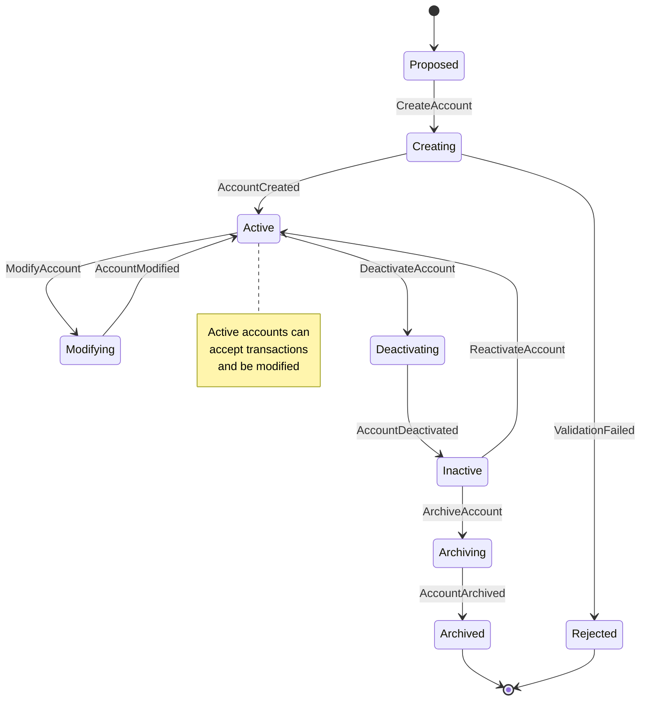

**Commands Involved**:
- `CreateAccount` - Establish new GL account
- `ModifyAccount` - Update account properties
- `DeactivateAccount` - Safely deactivate account
- `ConfigureHierarchy` - Setup account relationships
- `ValidateAccountStructure` - Verify account integrity
- `ReactivateAccount` - Restore deactivated account
- `ArchiveAccount` - Permanently archive account

**Events Involved**:
- `AccountCreated` - Account successfully established
- `AccountModified` - Account properties updated
- `AccountDeactivated` - Account safely deactivated
- `HierarchyConfigured` - Account relationships established
- `AccountStructureValidated` - Integrity verified
- `AccountReactivated` - Deactivated account restored
- `AccountArchived` - Account permanently archived

**Business Rules**:
- Account codes must be unique within chart of accounts
- Account hierarchy must maintain logical consistency
- System accounts cannot be modified or deactivated
- Deactivation requires zero balance and no active transactions
- Account modifications preserve referential integrity

---

### 2. Journal Entry Processing Workflow

**Description**: Complete journal entry lifecycle from creation through posting with strict double-entry validation, approval workflows, and immutability enforcement.

**State Transitions**:
`Draft` → `Validating` → `Approved` → `Posting` → `Posted` → `Immutable`

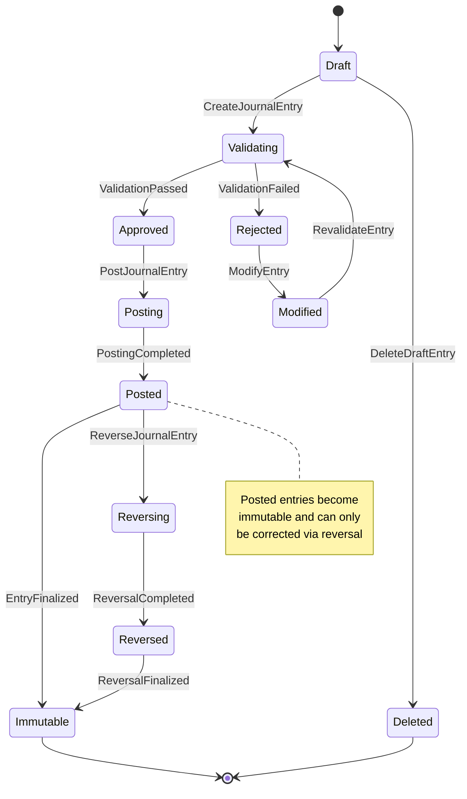

**Commands Involved**:
- `CreateJournalEntry` - Create new journal entry
- `ValidateEntry` - Verify entry meets business rules
- `PostJournalEntry` - Finalize entry to general ledger
- `ReverseJournalEntry` - Create reversing entry
- `CreateRecurringEntry` - Setup recurring journal template
- `ProcessRecurringBatch` - Generate recurring entries
- `DeleteDraftEntry` - Remove draft entry

**Events Involved**:
- `JournalEntryCreated` - Entry successfully created
- `EntryValidated` - Business rules verified
- `JournalEntryPosted` - Entry permanently recorded
- `JournalEntryReversed` - Reversing entry created
- `RecurringEntryTemplateCreated` - Template established
- `RecurringBatchProcessed` - Batch entries generated
- `DraftEntryDeleted` - Draft entry removed

**Business Rules**:
- Total debits must equal total credits exactly
- All referenced accounts must be active and valid
- Posting dates must fall within open fiscal periods
- Posted entries become immutable and require reversal for corrections
- Recurring entries follow configured schedule and approval requirements

---

### 3. Fiscal Period Management Workflow

**Description**: Fiscal period operations including sequential opening, transaction processing coordination, and comprehensive closing procedures with multi-module coordination.

**State Transitions**:
`Period Planned` → `Opening` → `Open` → `Processing` → `Pre-Closing` → `Closed` → `Archived`

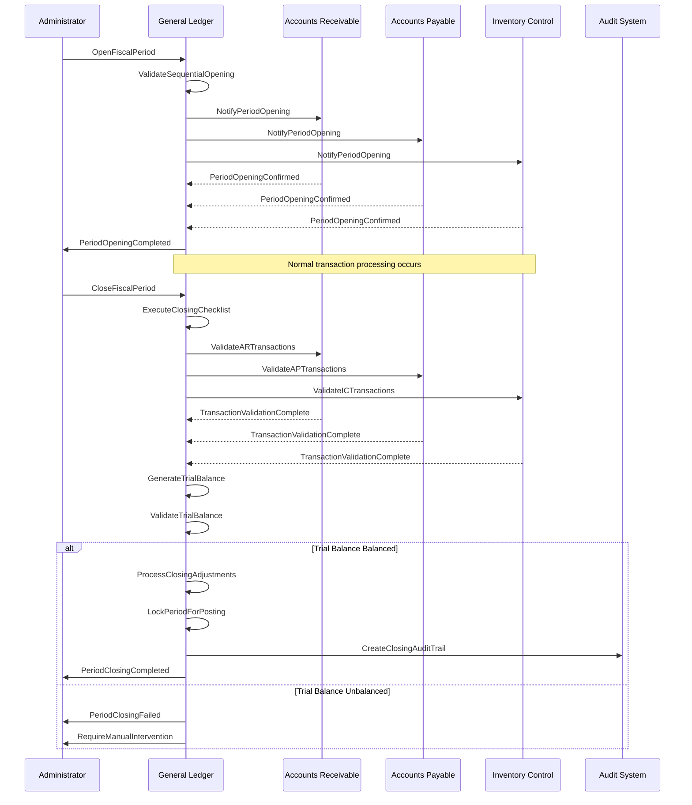

**Commands Involved**:
- `OpenFiscalPeriod` - Create and open new period
- `CloseFiscalPeriod` - Close period with validation
- `ReopenPeriod` - Reopen closed period for corrections
- `RestrictPeriod` - Apply module-specific restrictions
- `ExecuteYearEndClose` - Perform year-end procedures
- `ValidateClosingRequirements` - Check closing prerequisites
- `ProcessAdjustments` - Handle period-end adjustments

**Events Involved**:
- `FiscalPeriodOpened` - Period successfully opened
- `PeriodClosed` - Period successfully closed
- `PeriodReopened` - Closed period reopened
- `PeriodRestricted` - Restrictions applied
- `YearEndCloseCompleted` - Year-end procedures finished
- `ClosingRequirementsValidated` - Prerequisites verified
- `AdjustmentsProcessed` - Period adjustments completed

**Business Rules**:
- Periods must open in sequential order within fiscal year
- All transactions must be posted before closing
- Sub-ledger reconciliation required before closing
- Trial balance must balance before period can close
- Year-end closing requires all monthly periods closed

---

### 4. Budget Management Workflow

**Description**: Budget lifecycle including creation, approval, monitoring, and variance analysis with automated alerting and corrective action coordination.

**State Transitions**:
`Budget Preparation` → `Submitted` → `Approved` → `Active` → `Monitoring` → `Closed`

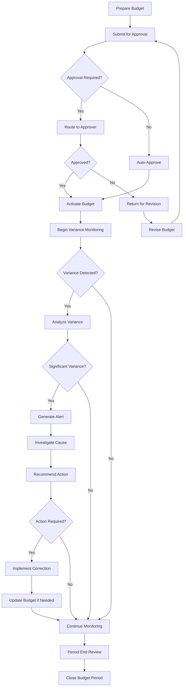

**Commands Involved**:
- `CreateBudget` - Establish new budget
- `SubmitBudget` - Submit for approval workflow
- `ApproveBudget` - Authorize budget activation
- `RevisieBudget` - Modify existing budget
- `MonitorBudgetPerformance` - Track actual vs. budget
- `CalculateVariances` - Compute budget variances
- `AlertVariance` - Notify of significant variances
- `CloseBudgetPeriod` - Finalize budget period

**Events Involved**:
- `BudgetCreated` - Budget successfully created
- `BudgetSubmitted` - Budget sent for approval
- `BudgetApproved` - Budget authorized for use
- `BudgetAmended` - Budget modifications completed
- `BudgetPerformanceMonitored` - Monitoring executed
- `VariancesCalculated` - Variance analysis completed
- `VarianceAlerted` - Stakeholders notified
- `BudgetPeriodClosed` - Budget period finalized

**Business Rules**:
- Budget approval required for amounts exceeding thresholds
- Variance monitoring must be continuous during active periods
- Significant variances trigger investigation workflows
- Budget revisions require appropriate authorization
- Actual spending cannot exceed budget without override approval

---

## Advanced Processing Workflows

### 5. Multi-Currency Operations Workflow

**Description**: Foreign currency transaction processing including exchange rate management, currency translation, revaluation processing, and gain/loss recognition.

**State Transitions**:
`Rate Update Required` → `Rate Validated` → `Revaluation Due` → `Processing` → `Adjustments Posted`

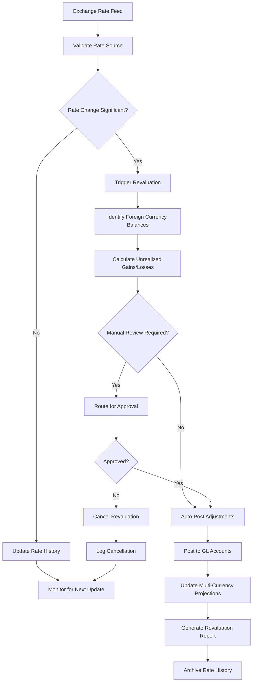

**Commands Involved**:
- `UpdateExchangeRate` - Update currency exchange rates
- `ProcessCurrencyRevaluation` - Calculate unrealized gains/losses
- `CalculateTranslationGainLoss` - Compute currency translation effects
- `SetTranslationMethod` - Configure translation methodology
- `PostRevaluationAdjustments` - Create GL entries for adjustments
- `ValidateRateSource` - Verify rate authenticity
- `ArchiveExchangeRates` - Preserve rate history

**Events Involved**:
- `ExchangeRateUpdated` - New rates established
- `CurrencyRevaluationProcessed` - Revaluation completed
- `TranslationGainLossCalculated` - Translation effects computed
- `TranslationMethodSet` - Methodology configured
- `RevaluationAdjustmentsPosted` - GL adjustments created
- `RateSourceValidated` - Rate authenticity verified
- `ExchangeRatesArchived` - Historical rates preserved

**Business Rules**:
- Exchange rates must be from authorized and validated sources
- Revaluation required when rate changes exceed threshold percentage
- Translation gains and losses posted to designated GL accounts
- Historical rates preserved for audit and compliance requirements
- Revaluation frequency follows accounting standards and policy

---

### 6. Sub-Ledger Integration Workflow

**Description**: Real-time integration with subsidiary ledgers including transaction validation, automatic posting, reconciliation processing, and error handling with fallback mechanisms.

**State Transitions**:
`Transaction Received` → `Validating` → `Posted to GL` → `Reconciled` → `Archived`

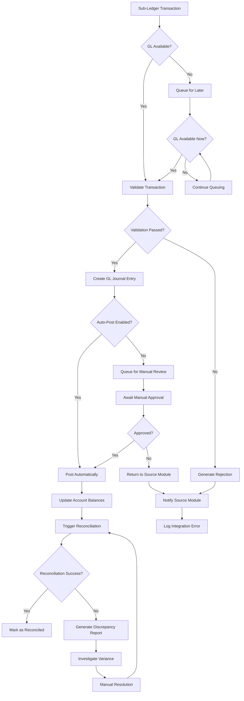

**Commands Involved**:
- `ProcessSubLedgerTransaction` - Handle incoming transaction
- `ValidateSubLedgerEntry` - Verify transaction validity
- `ReconcileWithSubLedger` - Compare balances
- `HandleIntegrationError` - Process integration failures
- `QueueForLaterProcessing` - Handle temporary unavailability
- `ValidateConsistency` - Check data consistency
- `ResolveDiscrepancy` - Fix identified variances

**Events Involved**:
- `SubLedgerTransactionReceived` - Transaction received from module
- `SubLedgerEntryValidated` - Transaction validation completed
- `ReconciledWithSubLedger` - Balance reconciliation successful
- `IntegrationErrorHandled` - Error processed and resolved
- `TransactionQueued` - Transaction queued for later
- `ConsistencyValidated` - Data consistency verified
- `DiscrepancyResolved` - Variance corrected

**Business Rules**:
- All sub-ledger transactions must generate balanced GL entries
- Integration operates in real-time when modules available
- Reconciliation required at minimum daily frequency
- Transaction queuing preserves chronological order
- Error handling includes automatic retry with exponential backoff

---

### 7. Trial Balance and Financial Reporting Workflow

**Description**: Automated trial balance generation and financial statement preparation including balance validation, comparative analysis, and regulatory compliance formatting.

**State Transitions**:
`Reporting Required` → `Calculating` → `Validating` → `Formatting` → `Published` → `Archived`

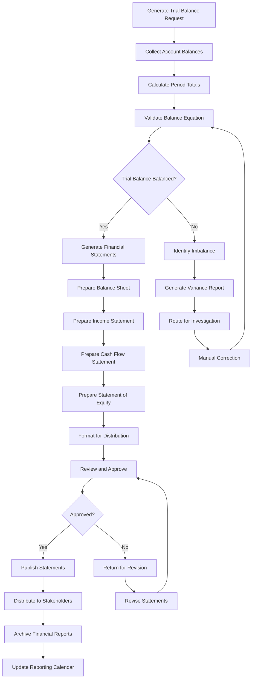

**Commands Involved**:
- `GenerateTrialBalance` - Create trial balance report
- `ValidateTrialBalance` - Verify balance accuracy
- `PrepareBalanceSheet` - Generate balance sheet
- `PrepareIncomeStatement` - Create income statement
- `PrepareCashFlowStatement` - Generate cash flow statement
- `GenerateComparatives` - Create comparative reports
- `ExportTrialBalance` - Export for external use
- `ArchiveFinancialReports` - Preserve historical reports

**Events Involved**:
- `TrialBalanceCalculated` - Trial balance computation completed
- `TrialBalanceValidated` - Balance accuracy verified
- `BalanceSheetPrepared` - Balance sheet generated
- `IncomeStatementPrepared` - Income statement created
- `CashFlowStatementPrepared` - Cash flow statement generated
- `ComparativeGenerated` - Comparative reports created
- `TrialBalanceExported` - Export completed
- `FinancialReportsArchived` - Reports preserved

**Business Rules**:
- Trial balance must mathematically balance before statement generation
- Financial statements must follow regulatory formatting requirements
- Comparative periods must use consistent accounting methods
- Statement approval required before external distribution
- Audit trail maintained for all report generation activities

---

## Complex Process Workflows

### 8. Year-End Closing Workflow

**Description**: Comprehensive year-end closing including income account closure, retained earnings calculation, tax provision processing, and new year initialization.

**State Transitions**:
`Year-End Initiated` → `Pre-Closing` → `Income Closure` → `Adjustments` → `Statements` → `Year Closed`

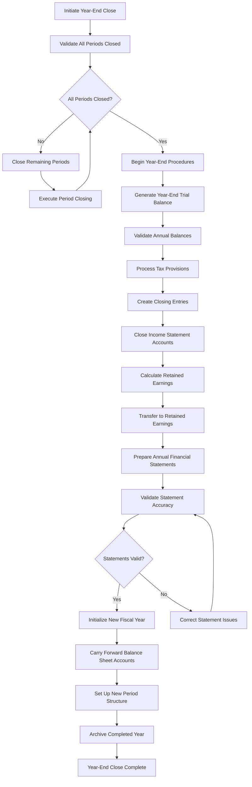

**Commands Involved**:
- `ExecuteYearEndClose` - Begin year-end procedures
- `CloseIncomeAccounts` - Transfer income accounts to retained earnings
- `CalculateRetainedEarnings` - Compute retained earnings adjustment
- `ProcessTaxProvisions` - Handle tax provision adjustments
- `InitializeNewYear` - Setup new fiscal year structure
- `ValidateYearEndBalances` - Verify year-end accuracy
- `ArchiveCompletedYear` - Preserve closed year data

**Events Involved**:
- `YearEndCloseInitiated` - Year-end procedures started
- `IncomeAccountsClosed` - Income accounts zeroed out
- `RetainedEarningsCalculated` - Retained earnings computed
- `TaxProvisionsProcessed` - Tax adjustments completed
- `NewYearInitialized` - New fiscal year created
- `YearEndBalancesValidated` - Accuracy verified
- `CompletedYearArchived` - Historical data preserved

**Business Rules**:
- All fiscal periods must be closed before year-end procedures
- Income statement accounts must close to retained earnings
- Tax provisions must be complete and accurate
- Balance sheet accounts carry forward to new year
- New year initialization creates base period structure

---

### 9. Allocation and Distribution Workflow

**Description**: Automated cost and revenue allocation including rule configuration, calculation processing, and journal entry generation with validation and audit requirements.

**State Transitions**:
`Allocation Configured` → `Processing Due` → `Calculating` → `Posting` → `Reconciled` → `Archived`

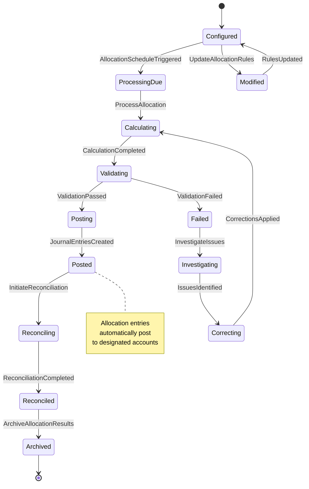

**Commands Involved**:
- `ConfigureAllocation` - Setup allocation rules and parameters
- `ProcessAllocation` - Execute allocation calculation and posting
- `ValidateAllocationRules` - Verify allocation configuration
- `RecalculateAllocation` - Reprocess allocation with corrections
- `UpdateDistributionRules` - Modify distribution parameters
- `ArchiveAllocationHistory` - Preserve allocation records
- `MonitorAllocationPerformance` - Track allocation effectiveness

**Events Involved**:
- `AllocationConfigured` - Rules successfully established
- `AllocationProcessed` - Calculation and posting completed
- `AllocationRulesValidated` - Configuration verified
- `AllocationRecalculated` - Corrected allocation processed
- `DistributionRulesUpdated` - Parameters modified
- `AllocationHistoryArchived` - Records preserved
- `AllocationPerformanceMonitored` - Effectiveness tracked

**Business Rules**:
- Allocation rules must be mathematically sound and total 100%
- Source accounts must have sufficient balances for allocation
- Target accounts must be valid and active for posting
- Allocation calculations must maintain double-entry balance
- Allocation audit trail required for compliance and review

---

### 10. Consolidation Processing Workflow

**Description**: Multi-company consolidation including subsidiary data aggregation, inter-company elimination, currency translation, and consolidated statement preparation.

**State Transitions**:
`Consolidation Required` → `Data Gathering` → `Eliminations` → `Translation` → `Consolidated` → `Reported`

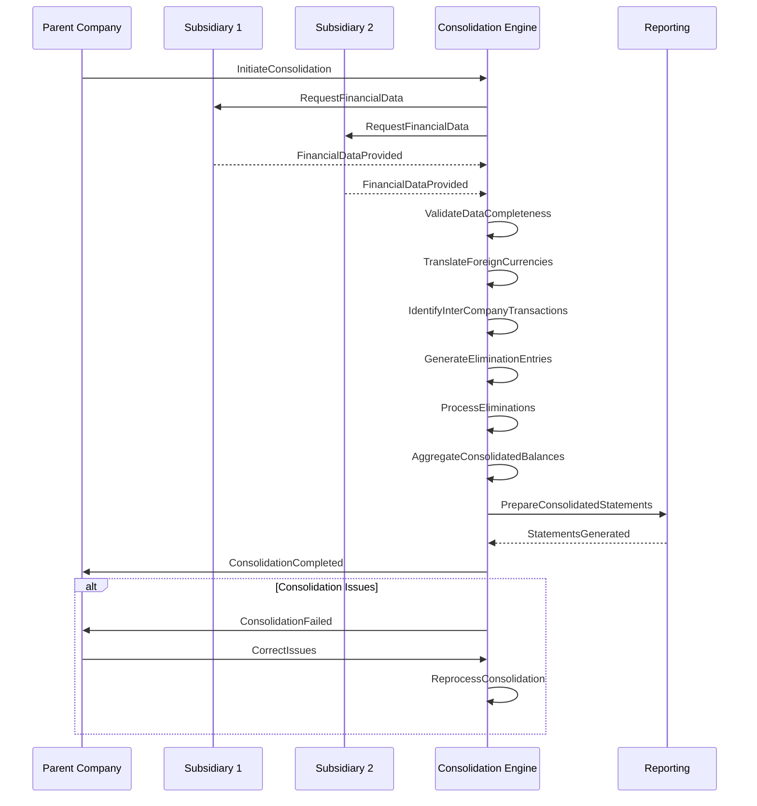

**Commands Involved**:
- `InitiateConsolidation` - Begin consolidation process
- `ProcessConsolidation` - Execute consolidation procedures
- `GenerateEliminations` - Create inter-company eliminations
- `TranslateForeignSubs` - Convert foreign subsidiary currencies
- `PrepareConsolidatedStatements` - Create consolidated reports
- `ValidateConsolidation` - Verify consolidation accuracy
- `ArchiveConsolidationData` - Preserve consolidation records

**Events Involved**:
- `ConsolidationInitiated` - Process started
- `ConsolidationProcessed` - Procedures completed
- `EliminationsGenerated` - Inter-company entries created
- `ForeignSubsTranslated` - Currency conversion completed
- `ConsolidatedStatementsPrepared` - Reports generated
- `ConsolidationValidated` - Accuracy verified
- `ConsolidationDataArchived` - Records preserved

**Business Rules**:
- All subsidiary periods must be closed before consolidation
- Inter-company transactions must be completely eliminated
- Foreign subsidiaries require currency translation using appropriate methods
- Consolidation must maintain mathematical accuracy across all levels
- Consolidated statements follow applicable reporting standards

---

## Automation and Intelligence Workflows

### 11. Intelligent Journal Validation Workflow

**Description**: AI-powered journal entry validation including pattern recognition, anomaly detection, fraud prevention, and automated approval routing with machine learning.

**State Transitions**:
`Journal Submitted` → `AI Analysis` → `Pattern Recognition` → `Risk Assessment` → `Routing Decision`

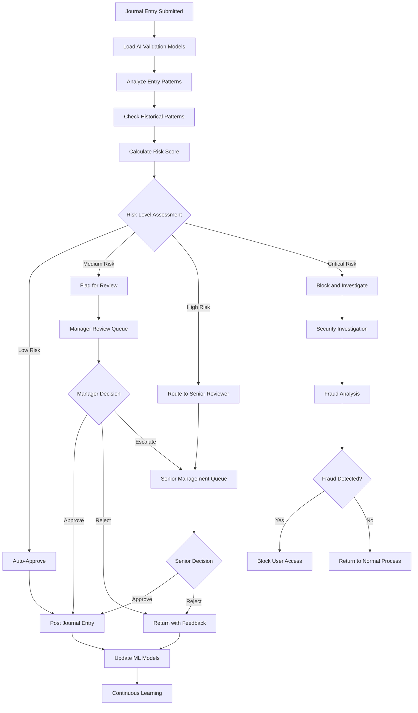

**Commands Involved**:
- `ValidateWithAI` - Apply AI validation models
- `AnalyzeEntryPatterns` - Examine entry characteristics
- `DetectAnomalies` - Identify unusual patterns
- `CalculateRiskScore` - Assess fraud and error risk
- `RouteForApproval` - Send to appropriate reviewer
- `LearnFromFeedback` - Update ML models
- `BlockSuspiciousEntry` - Prevent posting of risky entries

**Events Involved**:
- `AIValidationCompleted` - AI analysis finished
- `EntryPatternsAnalyzed` - Pattern analysis completed
- `AnomaliesDetected` - Unusual patterns identified
- `RiskScoreCalculated` - Risk assessment completed
- `EntryRoutedForApproval` - Sent to reviewer
- `FeedbackLearned` - ML models updated
- `SuspiciousEntryBlocked` - Risky entry prevented

**Business Rules**:
- AI validation supplements but does not replace human oversight
- Risk scoring based on multiple factors including amount, accounts, and patterns
- Machine learning models require periodic retraining with validated data
- High-risk entries require manual review regardless of AI recommendations
- Fraud detection triggers immediate investigation and potential access restrictions

---

### 12. Automated Reconciliation Workflow

**Description**: Intelligent reconciliation processing including automated matching, exception handling, and continuous monitoring with machine learning enhancement.

**State Transitions**:
`Reconciliation Due` → `Auto-Matching` → `Exception Handling` → `Manual Review` → `Completed`

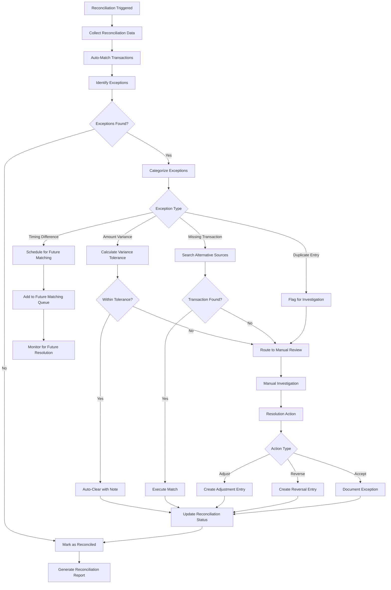

**Commands Involved**:
- `InitiateReconciliation` - Begin reconciliation process
- `ProcessAutoMatching` - Execute automated matching
- `ResolveException` - Handle reconciliation exceptions
- `CompleteReconciliation` - Finalize reconciliation process
- `ScheduleFutureMatching` - Queue timing differences
- `CreateAdjustmentEntry` - Generate correcting entries
- `DocumentException` - Record unresolved items

**Events Involved**:
- `ReconciliationInitiated` - Process started
- `AutoMatchingProcessed` - Automated matching completed
- `ExceptionResolved` - Exception handled successfully
- `ReconciliationCompleted` - Process finished
- `FutureMatchingScheduled` - Items queued for later
- `AdjustmentEntryCreated` - Correcting entry generated
- `ExceptionDocumented` - Unresolved item recorded

**Business Rules**:
- Automated matching uses configurable tolerance levels
- Timing differences automatically queue for future periods
- Amount variances require investigation above threshold levels
- Manual resolution requires appropriate authorization
- All reconciliation activities maintain comprehensive audit trails

---

## Error Recovery and System Maintenance Workflows

### 13. Error Handling and Recovery Workflow

**Description**: Comprehensive error management including error classification, recovery strategy determination, compensation processing, and system integrity restoration.

**State Transitions**:
`Error Detected` → `Classified` → `Recovery Planning` → `Compensation` → `Validation` → `Resolved`

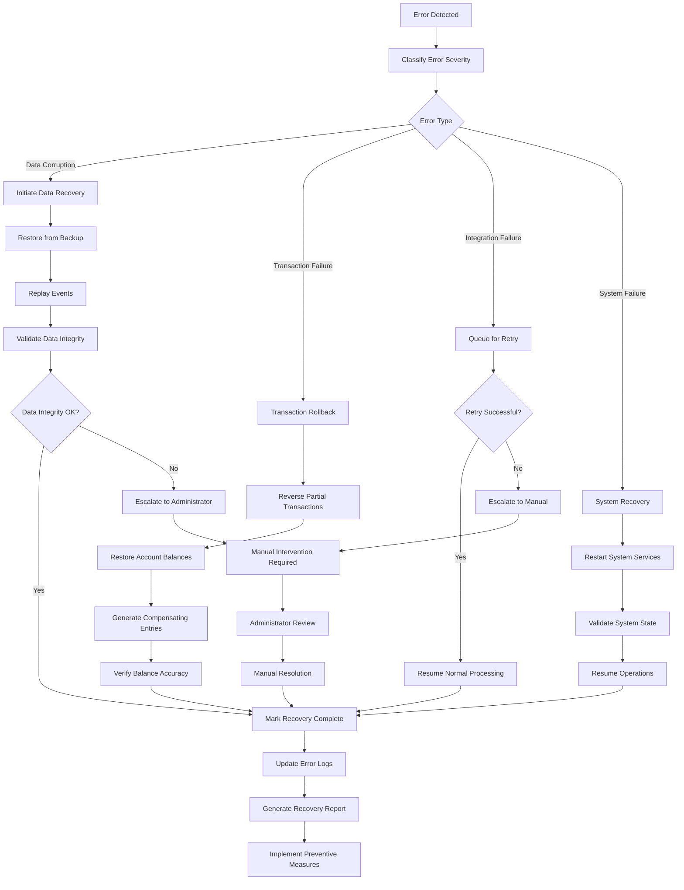

**Commands Involved**:
- `HandleGLError` - Process detected errors
- `ClassifyError` - Categorize error types and severity
- `RecoverFromProcessingFailure` - Execute recovery procedures
- `RestoreDataIntegrity` - Fix data corruption issues
- `GenerateCompensatingEntries` - Create offsetting transactions
- `ValidateRecovery` - Verify recovery success
- `EscalateError` - Route to manual intervention

**Events Involved**:
- `GLErrorOccurred` - Error detection confirmed
- `ErrorClassified` - Error type and severity determined
- `ProcessingFailureRecovered` - Recovery procedures completed
- `DataIntegrityRestored` - Corruption issues fixed
- `CompensatingEntriesGenerated` - Offsetting transactions created
- `RecoveryValidated` - Recovery success verified
- `ErrorEscalated` - Manual intervention required

**Business Rules**:
- All errors must be classified by type, severity, and impact
- Recovery procedures must preserve double-entry bookkeeping principles
- Data integrity validation required after all recovery actions
- Compensating entries must maintain mathematical balance
- Critical errors require immediate escalation and investigation

---

### 14. System Maintenance and Optimization Workflow

**Description**: Scheduled maintenance operations including database optimization, performance tuning, archive processing, and system health monitoring.

**State Transitions**:
`Maintenance Scheduled` → `System Preparation` → `Maintenance Active` → `Validation` → `Normal Operations`

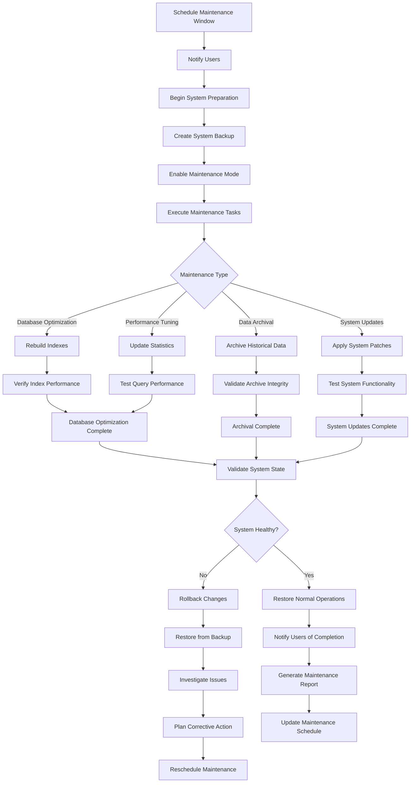

**Commands Involved**:
- `ScheduleMaintenanceWindow` - Plan maintenance activities
- `ExecuteMaintenanceTasks` - Perform maintenance operations
- `OptimizeDatabasePerformance` - Improve database efficiency
- `ArchiveHistoricalData` - Move old data to archive storage
- `ValidateSystemIntegrity` - Verify system health
- `RollbackMaintenance` - Reverse failed maintenance
- `GenerateMaintenanceReport` - Document maintenance results

**Events Involved**:
- `MaintenanceScheduled` - Maintenance window planned
- `MaintenanceTasksExecuted` - Operations completed
- `DatabasePerformanceOptimized` - Efficiency improved
- `HistoricalDataArchived` - Archive processing completed
- `SystemIntegrityValidated` - Health verification completed
- `MaintenanceRolledBack` - Failed maintenance reversed
- `MaintenanceReportGenerated` - Documentation created

**Business Rules**:
- Maintenance windows must be scheduled during low-activity periods
- System backup required before any maintenance operations
- All maintenance must include rollback procedures
- System integrity validation mandatory after maintenance
- Maintenance impact on business operations must be minimized

---

## Integration and Communication Workflows

### 15. Real-Time Event Broadcasting Workflow

**Description**: Event-driven integration coordination across all Accountex modules including event publishing, subscription management, and circuit breaker implementation.

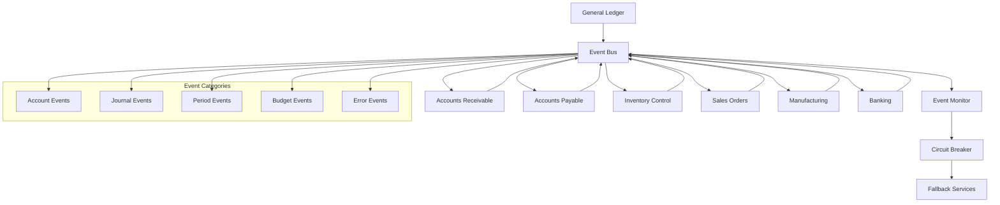

**Commands Involved**:
- `PublishGLEvent` - Send event to other modules
- `SubscribeToModuleEvent` - Listen for external events
- `HandleEventFailure` - Process event handling errors
- `ActivateCircuitBreaker` - Engage fault tolerance
- `ProcessEventBacklog` - Handle queued events
- `ValidateEventConsistency` - Verify event processing integrity
- `ResumeEventProcessing` - Restore normal operation

**Events Involved**:
- `GLEventPublished` - Event sent successfully
- `ModuleEventReceived` - External event processed
- `EventFailureHandled` - Processing error managed
- `CircuitBreakerActivated` - Fault tolerance engaged
- `EventBacklogProcessed` - Queued events handled
- `EventConsistencyValidated` - Processing verified
- `EventProcessingResumed` - Normal operation restored

**Business Rules**:
- All significant GL events must be published to event bus
- Event processing must be idempotent to handle duplicates
- Circuit breaker activates on integration failure thresholds
- Event ordering preserved for financially dependent operations
- Fallback mechanisms ensure critical GL functions remain available

---

## Summary

The General Ledger domain orchestrates **15 primary workflows** that collectively manage:

- **Chart Operations**: Account creation, modification, hierarchical organization, and lifecycle management
- **Transaction Processing**: Journal entry creation, validation, posting, and reversal with strict controls
- **Period Management**: Fiscal period opening, closing, and year-end procedures with validation
- **Budget Operations**: Budget creation, approval, monitoring, and variance analysis
- **Integration Operations**: Sub-ledger coordination, reconciliation, and data consistency
- **Multi-Currency Operations**: Exchange rate management, revaluation, and currency translation
- **Consolidation Operations**: Multi-company aggregation with elimination and reporting
- **Allocation Operations**: Automated cost and revenue distribution with audit trails
- **Reporting Operations**: Trial balance generation and financial statement preparation
- **Intelligence Operations**: AI-powered validation, pattern recognition, and anomaly detection
- **Reconciliation Operations**: Automated matching, exception handling, and variance resolution
- **Maintenance Operations**: System optimization, archival, and performance tuning
- **Error Recovery**: Comprehensive error handling with compensation and restoration
- **Event Coordination**: Real-time integration with circuit breaker and fallback mechanisms

Each workflow maintains strict double-entry bookkeeping principles, implements comprehensive audit trails, and supports both automated processing and manual oversight. The event-driven architecture enables system resilience through sophisticated error recovery, graceful degradation when modules are unavailable, and intelligent automation that learns from user patterns.

The workflows collectively ensure enterprise-grade general ledger operations with complete regulatory compliance, multi-currency support, sophisticated reporting capabilities, and seamless integration with other Accountex modules while maintaining the fundamental principles of financial accounting accuracy, auditability, and data integrity.