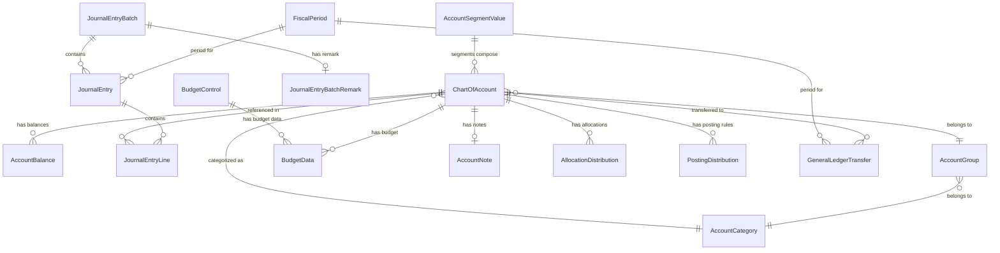

# Accountex General Ledger Domain Specification

## Domain Overview

The General Ledger domain manages financial accounting records including chart of accounts, journal entries, account balances, budgets, and financial periods.

## Domain Diagram



## Domain Module

```elixir
defmodule Accountex.GeneralLedger do
  use Ash.Domain
  
  resources do
    resource Accountex.GeneralLedger.ChartOfAccount
    resource Accountex.GeneralLedger.AccountBalance
    resource Accountex.GeneralLedger.AccountGroup
    resource Accountex.GeneralLedger.AccountCategory
    resource Accountex.GeneralLedger.AccountSegmentValue
    resource Accountex.GeneralLedger.JournalEntryBatch
    resource Accountex.GeneralLedger.JournalEntry
    resource Accountex.GeneralLedger.JournalEntryLine
    resource Accountex.GeneralLedger.UnpostedJournalEntryLine
    resource Accountex.GeneralLedger.GeneralLedgerTransfer
    resource Accountex.GeneralLedger.GeneralLedgerTransaction
    resource Accountex.GeneralLedger.BudgetControl
    resource Accountex.GeneralLedger.BudgetData
    resource Accountex.GeneralLedger.AccountNote
    resource Accountex.GeneralLedger.JournalEntryBatchRemark
    resource Accountex.GeneralLedger.AllocationDistribution
    resource Accountex.GeneralLedger.PostingDistribution
    resource Accountex.GeneralLedger.FiscalPeriod
    resource Accountex.GeneralLedger.GeneralLedgerSystem
    resource Accountex.GeneralLedger.CashFlowReportCaption
    resource Accountex.GeneralLedger.BatchPeriodClosingSetup
    resource Accountex.GeneralLedger.BatchTransferToGLSetup
    resource Accountex.GeneralLedger.ConsolidationDailyExchangeRate
    resource Accountex.GeneralLedger.ConsolidationExchangeRate
    resource Accountex.GeneralLedger.AccountMapping
    resource Accountex.GeneralLedger.BudgetTransfer
    resource Accountex.GeneralLedger.FundAccountSegmentValue
  end
end
```

## Resources

### Core Resources

#### ChartOfAccount Resource

```elixir
defmodule Accountex.GeneralLedger.ChartOfAccount do
  use Ash.Resource,
    domain: Accountex.GeneralLedger,
    data_layer: AshPostgres.DataLayer
  
  postgres do
    table "chart_of_accounts"
    repo Accountex.Repo
  end
  
  attributes do
    uuid_primary_key :id
    
    attribute :account_identifier, :string, allow_nil?: false
    attribute :account_description, :string, allow_nil?: false
    attribute :foreign_language_description, :string
    attribute :account_status, :atom do
      constraints one_of: [:active, :inactive]
      default :active
    end
    attribute :account_type, :atom do
      constraints one_of: [:posting, :allocation]
      default :posting
    end
    attribute :cash_flow_category_primary, :string
    attribute :cash_flow_category_secondary, :string
    attribute :ratio_analysis_identifier, :string
    attribute :gst_tax_identifier, :string
    attribute :pst_tax_identifier, :string
    attribute :fund_type_code, :string
    attribute :schedule_of_changes_column_identifier, :string
    attribute :summary_statement_identifier, :string
    attribute :consolidating_parent_account_identifier, :string
    attribute :sales_tax_code_identifier, :string
    attribute :bas_tax_code, :string
    attribute :equity_account_for_oci_identifier, :string
    attribute :is_cash_account, :boolean, default: false
    attribute :typical_debit_entry, :boolean, default: true
    attribute :allow_auto_distribution, :boolean, default: false
    
    # Summary transfer flags for various modules
    attribute :ar_summary_transfer_enabled, :boolean, default: false
    attribute :ap_summary_transfer_enabled, :boolean, default: false
    attribute :pr_summary_transfer_enabled, :boolean, default: false
    attribute :br_summary_transfer_enabled, :boolean, default: false
    attribute :jc_summary_transfer_enabled, :boolean, default: false
    attribute :mi_summary_transfer_enabled, :boolean, default: false
    attribute :ic_summary_transfer_enabled, :boolean, default: false
    attribute :re_summary_transfer_enabled, :boolean, default: false
    attribute :ra_summary_transfer_enabled, :boolean, default: false
    
    timestamps()
  end
  
  relationships do
    belongs_to :account_category, Accountex.GeneralLedger.AccountCategory
    belongs_to :account_group, Accountex.GeneralLedger.AccountGroup
    
    has_many :account_balances, Accountex.GeneralLedger.AccountBalance
    has_many :journal_entry_lines, Accountex.GeneralLedger.JournalEntryLine
    has_one :account_note, Accountex.GeneralLedger.AccountNote
    has_many :allocation_distributions, Accountex.GeneralLedger.AllocationDistribution
    has_many :posting_distributions, Accountex.GeneralLedger.PostingDistribution
  end
  
  actions do
    defaults [:read, :destroy]
    
    create :create do
      primary? true
    end
    
    update :update do
      primary? true
    end
  end
  
  code_interface do
    define :list_chart_of_accounts, action: :read
    define :get_chart_of_account, action: :read, get_by: [:id]
    define :create_chart_of_account, action: :create
    define :update_chart_of_account, action: :update
    define :delete_chart_of_account, action: :destroy
  end
end
```

#### AccountBalance Resource

```elixir
defmodule Accountex.GeneralLedger.AccountBalance do
  use Ash.Resource,
    domain: Accountex.GeneralLedger,
    data_layer: AshPostgres.DataLayer
  
  postgres do
    table "account_balances"
    repo Accountex.Repo
  end
  
  attributes do
    uuid_primary_key :id
    
    attribute :fiscal_year, :string, allow_nil?: false
    
    # Period balances (0-13, where 0 is beginning balance, 13 is year-end adjustment)
    for period <- 0..13 do
      attribute :"cash_flow_period_#{period}_amount", :decimal, default: Decimal.new(0)
      attribute :"home_currency_period_#{period}_amount", :decimal, default: Decimal.new(0)
    end
    
    timestamps()
  end
  
  relationships do
    belongs_to :chart_of_account, Accountex.GeneralLedger.ChartOfAccount
  end
  
  actions do
    defaults [:read, :create, :update]
  end
  
  code_interface do
    define :list_account_balances, action: :read
    define :get_account_balance, action: :read, get_by: [:id]
    define :create_account_balance, action: :create
    define :update_account_balance, action: :update
  end
end
```

#### AccountCategory Resource

```elixir
defmodule Accountex.GeneralLedger.AccountCategory do
  use Ash.Resource,
    domain: Accountex.GeneralLedger,
    data_layer: AshPostgres.DataLayer
  
  postgres do
    table "account_categories"
    repo Accountex.Repo
  end
  
  attributes do
    uuid_primary_key :id
    
    attribute :category_identifier, :string, allow_nil?: false
    attribute :category_type_description, :string, allow_nil?: false
    attribute :category_description, :string
    attribute :foreign_language_description, :string
    attribute :statement_sequence, :string
    
    timestamps()
  end
  
  relationships do
    has_many :account_groups, Accountex.GeneralLedger.AccountGroup
    has_many :chart_of_accounts, Accountex.GeneralLedger.ChartOfAccount
  end
  
  actions do
    defaults [:read, :create, :update, :destroy]
  end
  
  code_interface do
    define :list_account_categories, action: :read
    define :get_account_category, action: :read, get_by: [:id]
    define :create_account_category, action: :create
    define :update_account_category, action: :update
    define :delete_account_category, action: :destroy
  end
end
```

#### AccountGroup Resource

```elixir
defmodule Accountex.GeneralLedger.AccountGroup do
  use Ash.Resource,
    domain: Accountex.GeneralLedger,
    data_layer: AshPostgres.DataLayer
  
  postgres do
    table "account_groups"
    repo Accountex.Repo
  end
  
  attributes do
    uuid_primary_key :id
    
    attribute :group_identifier, :string, allow_nil?: false
    attribute :group_description, :string, allow_nil?: false
    attribute :reporting_level, :integer do
      allow_nil? false
      constraints min: 1, max: 4
      default 1
    end
    
    timestamps()
  end
  
  relationships do
    belongs_to :account_category, Accountex.GeneralLedger.AccountCategory
    has_many :chart_of_accounts, Accountex.GeneralLedger.ChartOfAccount
  end
  
  actions do
    defaults [:read, :create, :update, :destroy]
  end
  
  code_interface do
    define :list_account_groups, action: :read
    define :get_account_group, action: :read, get_by: [:id]
    define :create_account_group, action: :create
    define :update_account_group, action: :update
    define :delete_account_group, action: :destroy
  end
end
```

#### AccountSegmentValue Resource

```elixir
defmodule Accountex.GeneralLedger.AccountSegmentValue do
  use Ash.Resource,
    domain: Accountex.GeneralLedger,
    data_layer: AshPostgres.DataLayer
  
  postgres do
    table "account_segment_values"
    repo Accountex.Repo
  end
  
  attributes do
    uuid_primary_key :id
    
    attribute :segment_number, :string, allow_nil?: false
    attribute :segment_value, :string, allow_nil?: false
    attribute :segment_description, :string, allow_nil?: false
    attribute :foreign_language_description, :string
    attribute :default_group_identifier, :string
    attribute :default_cash_flow_primary, :string
    attribute :default_cash_flow_secondary, :string
    attribute :default_ratio_identifier, :string
    attribute :fund_type, :string
    attribute :schedule_of_changes_column_identifier, :string
    attribute :summary_statement_identifier, :string
    attribute :fund_balance_account_identifier, :string
    attribute :interfund_balance_account_identifier, :string
    attribute :accounts_payable_account_identifier, :string
    attribute :cash_account_identifier, :string
    attribute :finance_charge_account_identifier, :string
    attribute :deferred_expense_account_identifier, :string
    attribute :default_debit_entry, :boolean, default: true
    
    timestamps()
  end
  
  actions do
    defaults [:read, :create, :update, :destroy]
  end
  
  code_interface do
    define :list_account_segment_values, action: :read
    define :get_account_segment_value, action: :read, get_by: [:id]
    define :create_account_segment_value, action: :create
    define :update_account_segment_value, action: :update
    define :delete_account_segment_value, action: :destroy
  end
end
```

### Journal Entry Resources

#### JournalEntryBatch Resource

```elixir
defmodule Accountex.GeneralLedger.JournalEntryBatch do
  use Ash.Resource,
    domain: Accountex.GeneralLedger,
    data_layer: AshPostgres.DataLayer
  
  postgres do
    table "journal_entry_batches"
    repo Accountex.Repo
  end
  
  attributes do
    uuid_primary_key :id
    
    attribute :batch_number, :string, allow_nil?: false
    attribute :entered_by_user, :string, allow_nil?: false
    attribute :batch_description, :string
    attribute :next_journal_identifier, :string, default: "0001"
    attribute :retained_earnings_account_identifier, :string
    attribute :recurring_cycle, :atom do
      constraints one_of: [:monthly, :bimonthly, :quarterly, :semi_annually, :annually, :weekly]
    end
    attribute :batch_status, :atom do
      constraints one_of: [:unposted, :posted, :voided]
      default :unposted
    end
    attribute :source_module, :string, default: "GL"
    attribute :recurring_status, :atom do
      constraints one_of: [:active, :inactive]
    end
    attribute :currency_code, :string, allow_nil?: false
    attribute :date_created, :utc_datetime, allow_nil?: false
    attribute :date_posted, :utc_datetime
    attribute :next_recurring_date, :utc_datetime
    attribute :last_recurring_date, :utc_datetime
    attribute :end_recurring_date, :utc_datetime
    attribute :use_last_day_of_month, :boolean, default: false
    attribute :is_posted, :boolean, default: false
    attribute :number_of_cycles, :integer, default: 0
    attribute :journal_entry_count, :integer, default: 0
    attribute :control_total_amount, :decimal, default: Decimal.new(0)
    attribute :batch_total_amount, :decimal, default: Decimal.new(0)
    attribute :cash_flow_batch_total, :decimal, default: Decimal.new(0)
    attribute :foreign_currency_batch_total, :decimal, default: Decimal.new(0)
    attribute :journal_entry_type, :atom do
      constraints one_of: [:standard, :prior_year_adjustment, :recurring_template]
      default :standard
    end
    attribute :exchange_rate, :decimal, default: Decimal.new(1)
    attribute :cash_flow_exchange_rate, :decimal, default: Decimal.new(0)
    
    timestamps()
  end
  
  relationships do
    has_many :journal_entries, Accountex.GeneralLedger.JournalEntry
    has_one :journal_entry_batch_remark, Accountex.GeneralLedger.JournalEntryBatchRemark
  end
  
  actions do
    defaults [:read, :create, :update]
    
    update :post do
      change set_attribute(:batch_status, :posted)
      change set_attribute(:is_posted, true)
      change set_attribute(:date_posted, &DateTime.utc_now/0)
    end
    
    update :void do
      change set_attribute(:batch_status, :voided)
    end
  end
  
  code_interface do
    define :list_journal_entry_batches, action: :read
    define :get_journal_entry_batch, action: :read, get_by: [:id]
    define :create_journal_entry_batch, action: :create
    define :update_journal_entry_batch, action: :update
    define :post_journal_entry_batch, action: :post
    define :void_journal_entry_batch, action: :void
  end
end
```

#### JournalEntry Resource

```elixir
defmodule Accountex.GeneralLedger.JournalEntry do
  use Ash.Resource,
    domain: Accountex.GeneralLedger,
    data_layer: AshPostgres.DataLayer
  
  postgres do
    table "journal_entries"
    repo Accountex.Repo
  end
  
  attributes do
    uuid_primary_key :id
    
    attribute :journal_identifier, :string, allow_nil?: false
    attribute :journal_description, :string
    attribute :journal_reference, :string
    attribute :currency_code, :string, allow_nil?: false
    attribute :transaction_date, :utc_datetime, allow_nil?: false
    attribute :reverse_journal_entry_date, :utc_datetime
    attribute :journal_amount, :decimal, allow_nil?: false
    attribute :cash_flow_journal_amount, :decimal, default: Decimal.new(0)
    attribute :foreign_currency_journal_amount, :decimal, default: Decimal.new(0)
    attribute :exchange_rate, :decimal, default: Decimal.new(1)
    attribute :cash_flow_exchange_rate, :decimal, default: Decimal.new(0)
    
    timestamps()
  end
  
  relationships do
    belongs_to :journal_entry_batch, Accountex.GeneralLedger.JournalEntryBatch
    has_many :journal_entry_lines, Accountex.GeneralLedger.JournalEntryLine
  end
  
  actions do
    defaults [:read, :create, :update, :destroy]
  end
  
  code_interface do
    define :list_journal_entries, action: :read
    define :get_journal_entry, action: :read, get_by: [:id]
    define :create_journal_entry, action: :create
    define :update_journal_entry, action: :update
    define :delete_journal_entry, action: :destroy
  end
end
```

#### JournalEntryLine Resource

```elixir
defmodule Accountex.GeneralLedger.JournalEntryLine do
  use Ash.Resource,
    domain: Accountex.GeneralLedger,
    data_layer: AshPostgres.DataLayer
  
  postgres do
    table "journal_entry_lines"
    repo Accountex.Repo
  end
  
  attributes do
    uuid_primary_key :id
    
    attribute :line_description, :string
    attribute :line_reference, :string
    attribute :fiscal_year, :string, allow_nil?: false
    attribute :fiscal_period, :string, allow_nil?: false
    attribute :interfund_identifier, :string
    attribute :transaction_date, :utc_datetime, allow_nil?: false
    attribute :debit_amount, :decimal, default: Decimal.new(0)
    attribute :credit_amount, :decimal, default: Decimal.new(0)
    attribute :foreign_debit_amount, :decimal, default: Decimal.new(0)
    attribute :foreign_credit_amount, :decimal, default: Decimal.new(0)
    attribute :sequence_number, :integer, allow_nil?: false
    
    timestamps()
  end
  
  relationships do
    belongs_to :journal_entry_batch, Accountex.GeneralLedger.JournalEntryBatch
    belongs_to :journal_entry, Accountex.GeneralLedger.JournalEntry
    belongs_to :chart_of_account, Accountex.GeneralLedger.ChartOfAccount
  end
  
  actions do
    defaults [:read, :create, :update, :destroy]
  end
  
  code_interface do
    define :list_journal_entry_lines, action: :read
    define :get_journal_entry_line, action: :read, get_by: [:id]
    define :create_journal_entry_line, action: :create
    define :update_journal_entry_line, action: :update
    define :delete_journal_entry_line, action: :destroy
  end
end
```

#### UnpostedJournalEntryLine Resource

```elixir
defmodule Accountex.GeneralLedger.UnpostedJournalEntryLine do
  use Ash.Resource,
    domain: Accountex.GeneralLedger,
    data_layer: AshPostgres.DataLayer
  
  postgres do
    table "unposted_journal_entry_lines"
    repo Accountex.Repo
  end
  
  attributes do
    uuid_primary_key :id
    
    attribute :line_description, :string
    attribute :line_reference, :string
    attribute :fiscal_year, :string, allow_nil?: false
    attribute :fiscal_period, :string, allow_nil?: false
    attribute :interfund_identifier, :string
    attribute :transaction_date, :utc_datetime, allow_nil?: false
    attribute :debit_amount, :decimal, default: Decimal.new(0)
    attribute :credit_amount, :decimal, default: Decimal.new(0)
    attribute :foreign_debit_amount, :decimal, default: Decimal.new(0)
    attribute :foreign_credit_amount, :decimal, default: Decimal.new(0)
    attribute :sequence_number, :integer, allow_nil?: false
    
    timestamps()
  end
  
  relationships do
    belongs_to :journal_entry_batch, Accountex.GeneralLedger.JournalEntryBatch
    belongs_to :journal_entry, Accountex.GeneralLedger.JournalEntry
    belongs_to :chart_of_account, Accountex.GeneralLedger.ChartOfAccount
  end
  
  actions do
    defaults [:read, :create, :update, :destroy]
    
    action :post_to_journal do
      # Convert to posted journal entry line
    end
  end
  
  code_interface do
    define :list_unposted_journal_entry_lines, action: :read
    define :get_unposted_journal_entry_line, action: :read, get_by: [:id]
    define :create_unposted_journal_entry_line, action: :create
    define :update_unposted_journal_entry_line, action: :update
    define :delete_unposted_journal_entry_line, action: :destroy
    define :post_unposted_journal_entry_line, action: :post_to_journal
  end
end
```

### Transfer and Transaction Resources

#### GeneralLedgerTransfer Resource

```elixir
defmodule Accountex.GeneralLedger.GeneralLedgerTransfer do
  use Ash.Resource,
    domain: Accountex.GeneralLedger,
    data_layer: AshPostgres.DataLayer
  
  postgres do
    table "general_ledger_transfers"
    repo Accountex.Repo
  end
  
  attributes do
    uuid_primary_key :id
    
    attribute :transfer_description, :string, allow_nil?: false
    attribute :transfer_reference, :string, allow_nil?: false
    attribute :currency_code, :string, allow_nil?: false
    attribute :fiscal_year, :string, allow_nil?: false
    attribute :fiscal_period, :string, allow_nil?: false
    attribute :closed_year, :string
    attribute :closed_period, :string
    attribute :transfer_status, :string
    attribute :source_module, :string, allow_nil?: false
    attribute :object_number, :string
    attribute :master_entity_number, :string
    attribute :master_entity_name, :string
    attribute :transaction_number, :string
    attribute :transaction_type, :string
    attribute :interfund_identifier, :string
    attribute :pr_attribute_1, :string
    attribute :pr_attribute_2, :string
    attribute :pr_attribute_3, :string
    attribute :pr_attribute_4, :string
    attribute :transfer_date, :utc_datetime, allow_nil?: false
    attribute :transfer_amount, :decimal, allow_nil?: false
    attribute :cash_flow_transfer_amount, :decimal, default: Decimal.new(0)
    attribute :foreign_transfer_amount, :decimal, default: Decimal.new(0)
    attribute :exchange_rate, :decimal, default: Decimal.new(1)
    attribute :cash_flow_exchange_rate, :decimal, default: Decimal.new(0)
    attribute :sequence_number, :integer, allow_nil?: false
    
    timestamps()
  end
  
  relationships do
    belongs_to :journal_entry_batch, Accountex.GeneralLedger.JournalEntryBatch
    belongs_to :journal_entry, Accountex.GeneralLedger.JournalEntry
    belongs_to :chart_of_account, Accountex.GeneralLedger.ChartOfAccount
  end
  
  actions do
    defaults [:read, :create, :update]
  end
  
  code_interface do
    define :list_general_ledger_transfers, action: :read
    define :get_general_ledger_transfer, action: :read, get_by: [:id]
    define :create_general_ledger_transfer, action: :create
    define :update_general_ledger_transfer, action: :update
  end
end
```

#### GeneralLedgerTransaction Resource

```elixir
defmodule Accountex.GeneralLedger.GeneralLedgerTransaction do
  use Ash.Resource,
    domain: Accountex.GeneralLedger,
    data_layer: AshPostgres.DataLayer
  
  postgres do
    table "general_ledger_transactions"
    repo Accountex.Repo
  end
  
  attributes do
    uuid_primary_key :id
    
    attribute :transaction_description, :string
    attribute :transaction_reference, :string
    attribute :currency_code, :string, allow_nil?: false
    attribute :fiscal_year, :string, allow_nil?: false
    attribute :fiscal_period, :string, allow_nil?: false
    attribute :closed_year, :string
    attribute :closed_period, :string
    attribute :transaction_status, :atom do
      constraints one_of: [:standard, :voided, :reversed]
      default :standard
    end
    attribute :source_module, :string
    attribute :object_number, :string
    attribute :master_entity_number, :string
    attribute :master_entity_name, :string
    attribute :transaction_number, :string
    attribute :transaction_type, :string
    attribute :interfund_identifier, :string
    attribute :pr_attribute_1, :string
    attribute :pr_attribute_2, :string
    attribute :pr_attribute_3, :string
    attribute :pr_attribute_4, :string
    attribute :transaction_date, :utc_datetime, allow_nil?: false
    attribute :transaction_amount, :decimal, allow_nil?: false
    attribute :cash_flow_transaction_amount, :decimal, default: Decimal.new(0)
    attribute :foreign_transaction_amount, :decimal, default: Decimal.new(0)
    attribute :exchange_rate, :decimal, default: Decimal.new(1)
    attribute :cash_flow_exchange_rate, :decimal, default: Decimal.new(0)
    attribute :sequence_number, :integer, allow_nil?: false
    
    timestamps()
  end
  
  relationships do
    belongs_to :journal_entry_batch, Accountex.GeneralLedger.JournalEntryBatch
    belongs_to :journal_entry, Accountex.GeneralLedger.JournalEntry
    belongs_to :chart_of_account, Accountex.GeneralLedger.ChartOfAccount
  end
  
  actions do
    defaults [:read, :create]
    
    update :void do
      change set_attribute(:transaction_status, :voided)
    end
    
    update :reverse do
      change set_attribute(:transaction_status, :reversed)
    end
  end
  
  code_interface do
    define :list_general_ledger_transactions, action: :read
    define :get_general_ledger_transaction, action: :read, get_by: [:id]
    define :create_general_ledger_transaction, action: :create
    define :void_general_ledger_transaction, action: :void
    define :reverse_general_ledger_transaction, action: :reverse
  end
end
```

### Budget Resources

#### BudgetControl Resource

```elixir
defmodule Accountex.GeneralLedger.BudgetControl do
  use Ash.Resource,
    domain: Accountex.GeneralLedger,
    data_layer: AshPostgres.DataLayer
  
  postgres do
    table "budget_controls"
    repo Accountex.Repo
  end
  
  attributes do
    uuid_primary_key :id
    
    attribute :budget_identifier, :string, allow_nil?: false
    attribute :budget_year, :string, allow_nil?: false
    attribute :budget_description, :string, allow_nil?: false
    attribute :include_year_end_adjustments, :boolean, default: false
    
    timestamps()
  end
  
  relationships do
    has_many :budget_data, Accountex.GeneralLedger.BudgetData
  end
  
  actions do
    defaults [:read, :create, :update, :destroy]
  end
  
  code_interface do
    define :list_budget_controls, action: :read
    define :get_budget_control, action: :read, get_by: [:id]
    define :create_budget_control, action: :create
    define :update_budget_control, action: :update
    define :delete_budget_control, action: :destroy
  end
end
```

#### BudgetData Resource

```elixir
defmodule Accountex.GeneralLedger.BudgetData do
  use Ash.Resource,
    domain: Accountex.GeneralLedger,
    data_layer: AshPostgres.DataLayer
  
  postgres do
    table "budget_data"
    repo Accountex.Repo
  end
  
  attributes do
    uuid_primary_key :id
    
    # Period budget amounts (0-13, where 0 is beginning balance, 13 is year-end adjustment)
    for period <- 0..13 do
      attribute :"period_#{period}_budget_amount", :decimal, default: Decimal.new(0)
    end
    
    timestamps()
  end
  
  relationships do
    belongs_to :budget_control, Accountex.GeneralLedger.BudgetControl
    belongs_to :chart_of_account, Accountex.GeneralLedger.ChartOfAccount
  end
  
  actions do
    defaults [:read, :create, :update, :destroy]
  end
  
  code_interface do
    define :list_budget_data, action: :read
    define :get_budget_data, action: :read, get_by: [:id]
    define :create_budget_data, action: :create
    define :update_budget_data, action: :update
    define :delete_budget_data, action: :destroy
  end
end
```

#### BudgetTransfer Resource

```elixir
defmodule Accountex.GeneralLedger.BudgetTransfer do
  use Ash.Resource,
    domain: Accountex.GeneralLedger,
    data_layer: AshPostgres.DataLayer
  
  postgres do
    table "budget_transfers"
    repo Accountex.Repo
  end
  
  attributes do
    uuid_primary_key :id
    
    attribute :subsidiary_company_identifier, :string, allow_nil?: false
    attribute :subsidiary_budget_identifier, :string, allow_nil?: false
    attribute :parent_budget_identifier, :string, allow_nil?: false
    attribute :account_identifier, :string, allow_nil?: false
    attribute :fiscal_year, :string, allow_nil?: false
    attribute :fiscal_period, :string, allow_nil?: false
    attribute :subsidiary_currency_code, :string, allow_nil?: false
    attribute :home_transaction_amount, :decimal, allow_nil?: false
    attribute :foreign_transaction_amount, :decimal, allow_nil?: false
    attribute :exchange_rate, :decimal, allow_nil?: false
    
    timestamps()
  end
  
  actions do
    defaults [:read, :create, :update]
  end
  
  code_interface do
    define :list_budget_transfers, action: :read
    define :get_budget_transfer, action: :read, get_by: [:id]
    define :create_budget_transfer, action: :create
    define :update_budget_transfer, action: :update
  end
end
```

### Supporting Resources

#### AccountNote Resource

```elixir
defmodule Accountex.GeneralLedger.AccountNote do
  use Ash.Resource,
    domain: Accountex.GeneralLedger,
    data_layer: AshPostgres.DataLayer
  
  postgres do
    table "account_notes"
    repo Accountex.Repo
  end
  
  attributes do
    uuid_primary_key :id
    
    attribute :note_content, :text
    
    timestamps()
  end
  
  relationships do
    belongs_to :chart_of_account, Accountex.GeneralLedger.ChartOfAccount
  end
  
  actions do
    defaults [:read, :create, :update, :destroy]
  end
  
  code_interface do
    define :list_account_notes, action: :read
    define :get_account_note, action: :read, get_by: [:id]
    define :create_account_note, action: :create
    define :update_account_note, action: :update
    define :delete_account_note, action: :destroy
  end
end
```

#### JournalEntryBatchRemark Resource

```elixir
defmodule Accountex.GeneralLedger.JournalEntryBatchRemark do
  use Ash.Resource,
    domain: Accountex.GeneralLedger,
    data_layer: AshPostgres.DataLayer
  
  postgres do
    table "journal_entry_batch_remarks"
    repo Accountex.Repo
  end
  
  attributes do
    uuid_primary_key :id
    
    attribute :remark_text, :text
    
    timestamps()
  end
  
  relationships do
    belongs_to :journal_entry_batch, Accountex.GeneralLedger.JournalEntryBatch
  end
  
  actions do
    defaults [:read, :create, :update, :destroy]
  end
  
  code_interface do
    define :list_journal_entry_batch_remarks, action: :read
    define :get_journal_entry_batch_remark, action: :read, get_by: [:id]
    define :create_journal_entry_batch_remark, action: :create
    define :update_journal_entry_batch_remark, action: :update
    define :delete_journal_entry_batch_remark, action: :destroy
  end
end
```

#### AllocationDistribution Resource

```elixir
defmodule Accountex.GeneralLedger.AllocationDistribution do
  use Ash.Resource,
    domain: Accountex.GeneralLedger,
    data_layer: AshPostgres.DataLayer
  
  postgres do
    table "allocation_distributions"
    repo Accountex.Repo
  end
  
  attributes do
    uuid_primary_key :id
    
    attribute :distribution_account_identifier, :string, allow_nil?: false
    attribute :interfund_identifier, :string
    attribute :debit_percentage, :decimal do
      allow_nil? false
      constraints min: 0, max: 100
      default Decimal.new(0)
    end
    attribute :credit_percentage, :decimal do
      allow_nil? false
      constraints min: 0, max: 100
      default Decimal.new(0)
    end
    
    timestamps()
  end
  
  relationships do
    belongs_to :chart_of_account, Accountex.GeneralLedger.ChartOfAccount
  end
  
  actions do
    defaults [:read, :create, :update, :destroy]
  end
  
  code_interface do
    define :list_allocation_distributions, action: :read
    define :get_allocation_distribution, action: :read, get_by: [:id]
    define :create_allocation_distribution, action: :create
    define :update_allocation_distribution, action: :update
    define :delete_allocation_distribution, action: :destroy
  end
end
```

#### PostingDistribution Resource

```elixir
defmodule Accountex.GeneralLedger.PostingDistribution do
  use Ash.Resource,
    domain: Accountex.GeneralLedger,
    data_layer: AshPostgres.DataLayer
  
  postgres do
    table "posting_distributions"
    repo Accountex.Repo
  end
  
  attributes do
    uuid_primary_key :id
    
    attribute :distribution_account_identifier, :string, allow_nil?: false
    attribute :distribution_percentage, :decimal do
      allow_nil? false
      constraints min: 0, max: 100
      default Decimal.new(0)
    end
    
    timestamps()
  end
  
  relationships do
    belongs_to :chart_of_account, Accountex.GeneralLedger.ChartOfAccount
  end
  
  actions do
    defaults [:read, :create, :update, :destroy]
  end
  
  code_interface do
    define :list_posting_distributions, action: :read
    define :get_posting_distribution, action: :read, get_by: [:id]
    define :create_posting_distribution, action: :create
    define :update_posting_distribution, action: :update
    define :delete_posting_distribution, action: :destroy
  end
end
```

#### AccountMapping Resource

```elixir
defmodule Accountex.GeneralLedger.AccountMapping do
  use Ash.Resource,
    domain: Accountex.GeneralLedger,
    data_layer: AshPostgres.DataLayer
  
  postgres do
    table "account_mappings"
    repo Accountex.Repo
  end
  
  attributes do
    uuid_primary_key :id
    
    attribute :old_account_identifier, :string, allow_nil?: false
    attribute :new_account_identifier, :string, allow_nil?: false
    
    timestamps()
  end
  
  actions do
    defaults [:read, :create, :update, :destroy]
  end
  
  code_interface do
    define :list_account_mappings, action: :read
    define :get_account_mapping, action: :read, get_by: [:id]
    define :create_account_mapping, action: :create
    define :update_account_mapping, action: :update
    define :delete_account_mapping, action: :destroy
  end
end
```

### System Configuration Resources

#### GeneralLedgerSystem Resource

```elixir
defmodule Accountex.GeneralLedger.GeneralLedgerSystem do
  use Ash.Resource,
    domain: Accountex.GeneralLedger,
    data_layer: AshPostgres.DataLayer
  
  postgres do
    table "general_ledger_system"
    repo Accountex.Repo
  end
  
  attributes do
    uuid_primary_key :id
    
    attribute :gl_setup_status, :string
    attribute :current_fiscal_year, :string, allow_nil?: false
    attribute :next_batch_number, :string
    attribute :retained_earnings_account_identifier, :string, allow_nil?: false
    attribute :translation_adjustment_account_identifier, :string
    attribute :default_period, :string
    attribute :purge_year, :string
    attribute :unrestricted_fund_balance_account, :string
    attribute :temporarily_restricted_fund_balance_account, :string
    attribute :permanently_restricted_fund_balance_account, :string
    attribute :schedule_of_changes_fund_order, :string
    attribute :exchange_gain_loss_account_identifier, :string
    attribute :equity_account_for_oci, :string
    
    # Feature flags
    attribute :use_auto_batch_numbering, :boolean, default: false
    attribute :automatic_fund_balance, :boolean, default: false
    attribute :use_ratio_analysis_feature, :boolean, default: false
    attribute :use_cash_flow_feature, :boolean, default: false
    attribute :use_schedule_of_changes_reports, :boolean, default: false
    attribute :use_summary_statement_report, :boolean, default: false
    attribute :use_multi_currency, :boolean, default: false
    
    # Module transfer permissions
    attribute :allow_ap_transfer, :boolean, default: false
    attribute :allow_ar_transfer, :boolean, default: false
    attribute :allow_pr_transfer, :boolean, default: false
    attribute :allow_br_transfer, :boolean, default: false
    attribute :allow_jc_transfer, :boolean, default: false
    attribute :allow_mi_transfer, :boolean, default: false
    attribute :allow_ic_transfer, :boolean, default: false
    attribute :allow_re_transfer, :boolean, default: false
    attribute :allow_ra_transfer, :boolean, default: false
    
    attribute :income_statement_format, :integer, default: 1
    attribute :statement_of_activities_format, :integer, default: 1
    attribute :major_segment_identifier, :integer, default: 1
    attribute :fund_segment_identifier, :integer, default: 0
    attribute :default_worksheet_type, :integer, default: 1
    attribute :automatic_post_journal_batch, :integer, default: 1
    attribute :segment_definition, :text
    attribute :schedule_of_changes_column_description, :text
    attribute :user_defined_fund_type_description, :text
    attribute :default_transaction_date_during_je, :integer, default: 0
    
    timestamps()
  end
  
  actions do
    defaults [:read, :update]
    
    create :initialize do
      primary? true
    end
  end
  
  code_interface do
    define :get_general_ledger_systems, action: :read
    define :get_general_ledger_system, action: :read, get_by: [:id]
    define :initialize_general_ledger_system, action: :initialize
    define :update_general_ledger_system, action: :update
  end
end
```

#### FiscalPeriod Resource

```elixir
defmodule Accountex.GeneralLedger.FiscalPeriod do
  use Ash.Resource,
    domain: Accountex.GeneralLedger,
    data_layer: AshPostgres.DataLayer
  
  postgres do
    table "fiscal_periods"
    repo Accountex.Repo
  end
  
  attributes do
    uuid_primary_key :id
    
    attribute :fiscal_year, :string, allow_nil?: false
    attribute :period_number, :string, allow_nil?: false
    attribute :consolidating_fiscal_year, :string
    attribute :consolidating_period, :string
    attribute :period_description, :string, allow_nil?: false
    attribute :period_begin_date, :date, allow_nil?: false
    attribute :period_end_date, :date, allow_nil?: false
    
    # Module restriction flags
    attribute :restrict_gl, :boolean, default: false
    attribute :restrict_ap, :boolean, default: false
    attribute :restrict_ar, :boolean, default: false
    attribute :restrict_pr, :boolean, default: false
    attribute :restrict_mi, :boolean, default: false
    attribute :restrict_ic, :boolean, default: false
    attribute :restrict_jc, :boolean, default: false
    attribute :restrict_br, :boolean, default: false
    attribute :restrict_cl, :boolean, default: false
    attribute :restrict_re, :boolean, default: false
    attribute :restrict_ra, :boolean, default: false
    attribute :restrict_vt1, :boolean, default: false
    attribute :restrict_vt2, :boolean, default: false
    attribute :restrict_vt3, :boolean, default: false
    
    timestamps()
  end
  
  actions do
    defaults [:read, :create, :update]
    
    update :close_period do
      change set_attribute(:restrict_gl, true)
      change set_attribute(:restrict_ap, true)
      change set_attribute(:restrict_ar, true)
      change set_attribute(:restrict_pr, true)
      change set_attribute(:restrict_mi, true)
    end
  end
  
  code_interface do
    define :list_fiscal_periods, action: :read
    define :get_fiscal_period, action: :read, get_by: [:id]
    define :create_fiscal_period, action: :create
    define :update_fiscal_period, action: :update
    define :close_fiscal_period, action: :close_period
  end
end
```

#### CashFlowReportCaption Resource

```elixir
defmodule Accountex.GeneralLedger.CashFlowReportCaption do
  use Ash.Resource,
    domain: Accountex.GeneralLedger,
    data_layer: AshPostgres.DataLayer
  
  postgres do
    table "cash_flow_report_captions"
    repo Accountex.Repo
  end
  
  attributes do
    uuid_primary_key :id
    
    attribute :cash_flow_method, :atom do
      constraints one_of: [:direct, :indirect]
      default :direct
    end
    attribute :default_caption_description, :string, allow_nil?: false
    attribute :user_defined_caption_description, :string
    
    timestamps()
  end
  
  actions do
    defaults [:read, :create, :update, :destroy]
  end
  
  code_interface do
    define :list_cash_flow_report_captions, action: :read
    define :get_cash_flow_report_caption, action: :read, get_by: [:id]
    define :create_cash_flow_report_caption, action: :create
    define :update_cash_flow_report_caption, action: :update
    define :delete_cash_flow_report_caption, action: :destroy
  end
end
```

### Batch Processing Resources

#### BatchPeriodClosingSetup Resource

```elixir
defmodule Accountex.GeneralLedger.BatchPeriodClosingSetup do
  use Ash.Resource,
    domain: Accountex.GeneralLedger,
    data_layer: AshPostgres.DataLayer
  
  postgres do
    table "batch_period_closing_setups"
    repo Accountex.Repo
  end
  
  attributes do
    uuid_primary_key :id
    
    attribute :user_identifier, :string, allow_nil?: false
    attribute :email_recipient, :string
    attribute :is_active, :boolean, default: false
    attribute :email_log_on_failure, :boolean, default: false
    attribute :failure_action, :atom do
      constraints one_of: [:proceed_on_failure, :stop_on_failure]
      default :proceed_on_failure
    end
    
    timestamps()
  end
  
  actions do
    defaults [:read, :create, :update, :destroy]
  end
  
  code_interface do
    define :list_batch_period_closing_setups, action: :read
    define :get_batch_period_closing_setup, action: :read, get_by: [:id]
    define :create_batch_period_closing_setup, action: :create
    define :update_batch_period_closing_setup, action: :update
    define :delete_batch_period_closing_setup, action: :destroy
  end
end
```

#### BatchTransferToGLSetup Resource

```elixir
defmodule Accountex.GeneralLedger.BatchTransferToGLSetup do
  use Ash.Resource,
    domain: Accountex.GeneralLedger,
    data_layer: AshPostgres.DataLayer
  
  postgres do
    table "batch_transfer_to_gl_setups"
    repo Accountex.Repo
  end
  
  attributes do
    uuid_primary_key :id
    
    attribute :job_name, :string, allow_nil?: false
    attribute :user_identifier, :string, allow_nil?: false
    attribute :email_recipient, :string
    attribute :is_active, :boolean, default: false
    attribute :email_error_log_on_failure, :boolean, default: false
    attribute :failure_action, :atom do
      constraints one_of: [:proceed_on_failure, :stop_on_failure]
      default :proceed_on_failure
    end
    
    timestamps()
  end
  
  actions do
    defaults [:read, :create, :update, :destroy]
  end
  
  code_interface do
    define :list_batch_transfer_to_gl_setups, action: :read
    define :get_batch_transfer_to_gl_setup, action: :read, get_by: [:id]
    define :create_batch_transfer_to_gl_setup, action: :create
    define :update_batch_transfer_to_gl_setup, action: :update
    define :delete_batch_transfer_to_gl_setup, action: :destroy
  end
end
```

### Consolidation Resources

#### ConsolidationDailyExchangeRate Resource

```elixir
defmodule Accountex.GeneralLedger.ConsolidationDailyExchangeRate do
  use Ash.Resource,
    domain: Accountex.GeneralLedger,
    data_layer: AshPostgres.DataLayer
  
  postgres do
    table "consolidation_daily_exchange_rates"
    repo Accountex.Repo
  end
  
  attributes do
    uuid_primary_key :id
    
    attribute :currency_code, :string, allow_nil?: false
    attribute :fiscal_year, :string, allow_nil?: false
    attribute :transaction_date, :date, allow_nil?: false
    attribute :exchange_rate, :decimal, allow_nil?: false
    attribute :consolidated_companies, :text
    
    timestamps()
  end
  
  actions do
    defaults [:read, :create, :update, :destroy]
  end
  
  code_interface do
    define :list_consolidation_daily_exchange_rates, action: :read
    define :get_consolidation_daily_exchange_rate, action: :read, get_by: [:id]
    define :create_consolidation_daily_exchange_rate, action: :create
    define :update_consolidation_daily_exchange_rate, action: :update
    define :delete_consolidation_daily_exchange_rate, action: :destroy
  end
end
```

#### ConsolidationExchangeRate Resource

```elixir
defmodule Accountex.GeneralLedger.ConsolidationExchangeRate do
  use Ash.Resource,
    domain: Accountex.GeneralLedger,
    data_layer: AshPostgres.DataLayer
  
  postgres do
    table "consolidation_exchange_rates"
    repo Accountex.Repo
  end
  
  attributes do
    uuid_primary_key :id
    
    attribute :currency_code, :string, allow_nil?: false
    attribute :fiscal_year, :string, allow_nil?: false
    attribute :average_exchange_rate, :decimal, allow_nil?: false
    attribute :closing_exchange_rate, :decimal, allow_nil?: false
    attribute :consolidated_companies, :text
    
    timestamps()
  end
  
  actions do
    defaults [:read, :create, :update, :destroy]
  end
  
  code_interface do
    define :list_consolidation_exchange_rates, action: :read
    define :get_consolidation_exchange_rate, action: :read, get_by: [:id]
    define :create_consolidation_exchange_rate, action: :create
    define :update_consolidation_exchange_rate, action: :update
    define :delete_consolidation_exchange_rate, action: :destroy
  end
end
```

#### FundAccountSegmentValue Resource

```elixir
defmodule Accountex.GeneralLedger.FundAccountSegmentValue do
  use Ash.Resource,
    domain: Accountex.GeneralLedger,
    data_layer: AshPostgres.DataLayer
  
  postgres do
    table "fund_account_segment_values"
    repo Accountex.Repo
  end
  
  attributes do
    uuid_primary_key :id
    
    attribute :segment_identifier, :string, allow_nil?: false
    attribute :segment_value, :string, allow_nil?: false
    attribute :segment_description, :string, allow_nil?: false
    attribute :foreign_language_description, :string
    
    timestamps()
  end
  
  actions do
    defaults [:read, :create, :update, :destroy]
  end
  
  code_interface do
    define :list_fund_account_segment_values, action: :read
    define :get_fund_account_segment_value, action: :read, get_by: [:id]
    define :create_fund_account_segment_value, action: :create
    define :update_fund_account_segment_value, action: :update
    define :delete_fund_account_segment_value, action: :destroy
  end
end
```

## Notes

1. All resources use UUID7 as the primary key (`id` field)
2. Field names follow snake_case convention and are semantically meaningful
3. Table names in PostgreSQL are pluralized snake_case versions of the resource names
4. All foreign key relationships use the long resource name followed by `_id`
5. Code interfaces use pluralized resource names for list operations
6. Timestamps are automatically included for audit purposes
7. The domain supports multi-currency operations with exchange rate tracking
8. Period-based accounting is supported with 13 periods (12 regular + year-end adjustment)
9. Module restriction flags allow for period-based access control
10. Consolidation features support parent-subsidiary accounting structures
