# Accountex Inventory Control - Workflows and State Management

## Overview

This document provides a comprehensive analysis of workflows and state management in the Inventory Control domain. Each workflow represents a coordinated sequence of commands and events that manage state transitions across inventory components. The workflows follow event-sourced patterns using the Commanded framework with sophisticated costing methods, multi-location tracking, and comprehensive audit trails.

## Core Item Management Workflows

### 1. Item Lifecycle Management Workflow

**Description**: Complete item lifecycle from creation through active use to deactivation and archival, including specification management, status transitions, and configuration validation.

**State Transitions**: 
`Proposed` → `Creating` → `Active` → `Modified` → `Inactive` → `Discontinued` → `Archived`

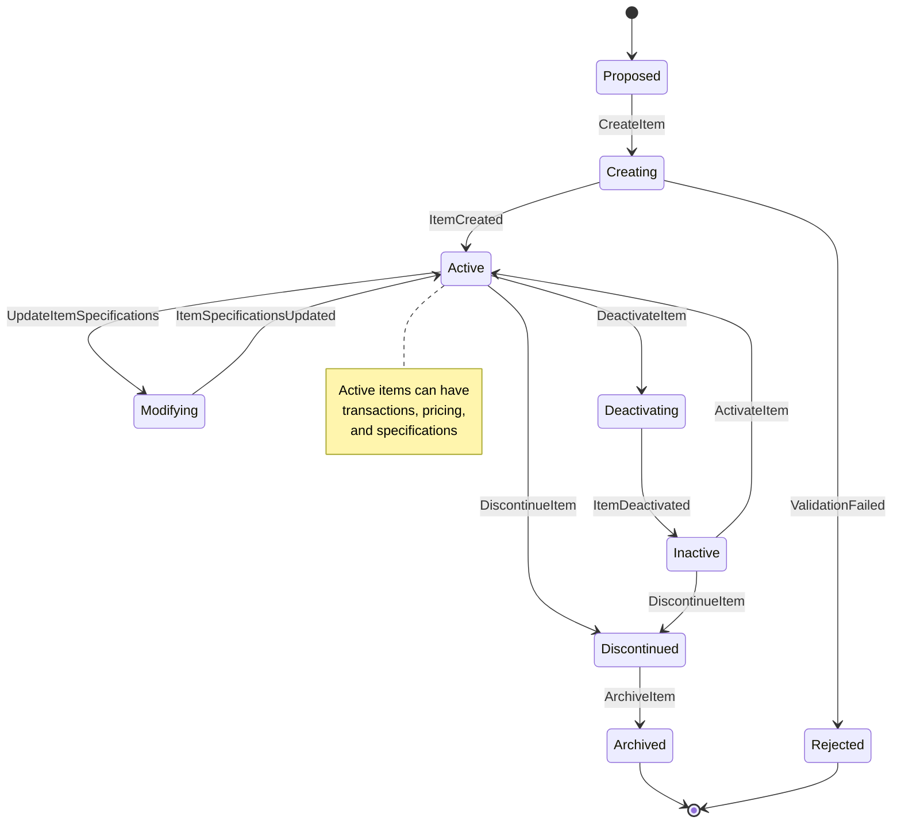
```mermaid
stateDiagram-v2
    [*] --> Proposed
    Proposed --> Creating: CreateItem
    Creating --> Active: ItemCreated
    Active --> Modifying: UpdateItemSpecifications
    Modifying --> Active: ItemSpecificationsUpdated
    Active --> Deactivating: DeactivateItem
    Deactivating --> Inactive: ItemDeactivated
    Inactive --> Active: ActivateItem
    Active --> Discontinued: DiscontinueItem
    Inactive --> Discontinued: DiscontinueItem
    Discontinued --> Archived: ArchiveItem
    Archived --> [*]
    
    Creating --> Rejected: ValidationFailed
    Rejected --> [*]
    
    note right of Active
        Active items can have
        transactions, pricing,
        and specifications
    end note
```

**Commands Involved**:
- `CreateItem` - Establish new inventory item
- `UpdateItemSpecifications` - Modify item attributes and configurations
- `ActivateItem` - Enable item for transactions
- `DeactivateItem` - Disable item while preserving history
- `DiscontinueItem` - Mark item as discontinued
- `ArchiveItem` - Permanently archive historical item
- `ValidateItemConfiguration` - Verify item setup completeness

**Events Involved**:
- `ItemCreated` - Item successfully established
- `ItemSpecificationsUpdated` - Configuration modified
- `ItemStatusChanged` - Status transition completed
- `ItemActivated` - Item enabled for operations
- `ItemDeactivated` - Item disabled
- `ItemDiscontinued` - Item marked as discontinued
- `ItemArchived` - Item permanently archived

**Business Rules**:
- SKU must be unique across all item types
- Costing method cannot be changed after transactions exist
- Deactivation requires zero inventory across all locations
- Discontinuation requires management approval for active items
- Archive retention follows regulatory compliance requirements

---

### 2. Inventory Item Configuration Workflow

**Description**: Complex item configuration including costing method setup, lot/serial control, kit component definition, and pricing structure establishment.

**State Transitions**:
`Basic Configuration` → `Advanced Setup` → `Validation` → `Pricing Setup` → `Fully Configured`

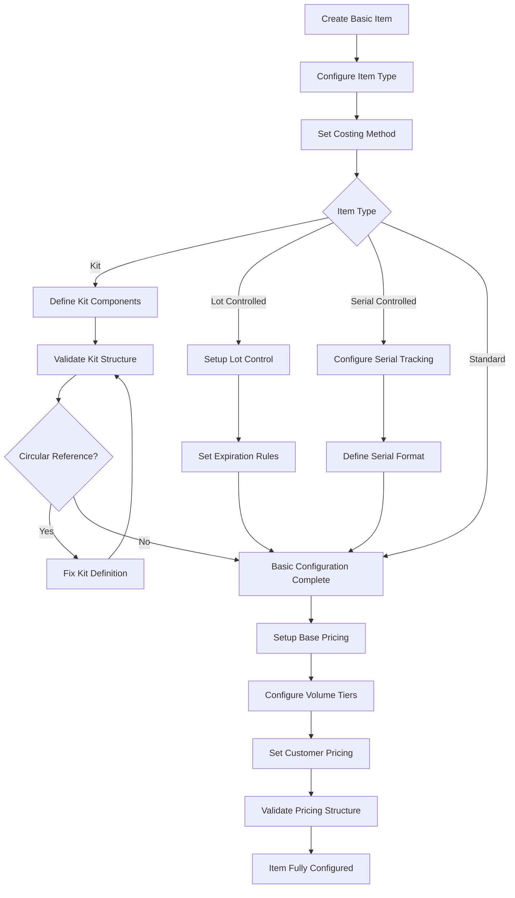
```mermaid
flowchart TD
    A[Create Basic Item] --> B[Configure Item Type]
    B --> C[Set Costing Method]
    C --> D{Item Type}
    
    D -->|Kit| E[Define Kit Components]
    D -->|Lot Controlled| F[Setup Lot Control]
    D -->|Serial Controlled| G[Configure Serial Tracking]
    D -->|Standard| H[Basic Configuration Complete]
    
    E --> I[Validate Kit Structure]
    I --> J{Circular Reference?}
    J -->|Yes| K[Fix Kit Definition]
    J -->|No| H
    K --> I
    
    F --> L[Set Expiration Rules]
    L --> H
    
    G --> M[Define Serial Format]
    M --> H
    
    H --> N[Setup Base Pricing]
    N --> O[Configure Volume Tiers]
    O --> P[Set Customer Pricing]
    P --> Q[Validate Pricing Structure]
    Q --> R[Item Fully Configured]
```

**Commands Involved**:
- `ConfigureItemType` - Set item classification and behavior
- `SetCostingMethod` - Define cost calculation approach
- `ConfigureKitComponents` - Setup kit component relationships
- `SetupLotControl` - Configure lot tracking requirements
- `ConfigureSerialTracking` - Setup serial number management
- `SetBasePrice` - Establish base item pricing
- `ConfigureVolumeDiscounts` - Setup quantity-based pricing tiers

**Events Involved**:
- `ItemTypeConfigured` - Classification established
- `CostingMethodSet` - Cost calculation configured
- `KitComponentsConfigured` - Kit structure defined
- `LotControlSetup` - Lot tracking configured
- `SerialTrackingConfigured` - Serial management setup
- `BasePriceSet` - Base pricing established
- `VolumeDiscountsConfigured` - Tiered pricing setup

**Business Rules**:
- Item type determines available configuration options
- Kit components cannot create circular references
- Lot control requires expiration date management for perishables
- Serial format must be unique and follow organizational standards
- Pricing structure must maintain minimum margin requirements

---

## Inventory Movement Workflows

### 3. Stock Receipt and Putaway Workflow

**Description**: Inventory receipt processing including goods receipt, quality inspection, cost calculation, lot/serial assignment, and optimal putaway location determination.

**State Transitions**:
`Receipt Expected` → `Receiving` → `Inspecting` → `Costing` → `Putaway` → `Available`

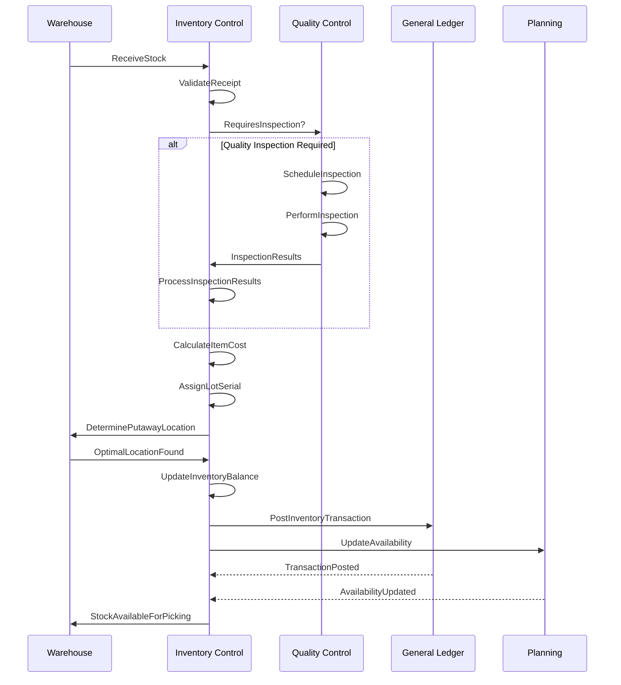
```mermaid
sequenceDiagram
    participant WMS as Warehouse
    participant IC as Inventory Control
    participant QC as Quality Control
    participant GL as General Ledger
    participant Planning as Planning
    
    WMS->>IC: ReceiveStock
    IC->>IC: ValidateReceipt
    IC->>QC: RequiresInspection?
    
    alt Quality Inspection Required
        QC->>QC: ScheduleInspection
        QC->>QC: PerformInspection
        QC->>IC: InspectionResults
        IC->>IC: ProcessInspectionResults
    end
    
    IC->>IC: CalculateItemCost
    IC->>IC: AssignLotSerial
    IC->>WMS: DeterminePutawayLocation
    WMS->>IC: OptimalLocationFound
    IC->>IC: UpdateInventoryBalance
    IC->>GL: PostInventoryTransaction
    IC->>Planning: UpdateAvailability
    
    GL-->>IC: TransactionPosted
    Planning-->>IC: AvailabilityUpdated
    IC->>WMS: StockAvailableForPicking
```

**Commands Involved**:
- `ReceiveStock` - Process incoming inventory
- `ValidateReceipt` - Verify receipt accuracy and completeness
- `CalculateItemCost` - Compute cost using configured method
- `AssignLotSerial` - Assign tracking numbers for controlled items
- `DeterminePutawayLocation` - Find optimal storage location
- `UpdateInventoryBalance` - Adjust inventory quantities
- `PostInventoryTransaction` - Create GL entries

**Events Involved**:
- `StockReceived` - Receipt processing completed
- `ReceiptValidated` - Receipt accuracy verified
- `ItemCostCalculated` - Cost calculation completed
- `LotSerialAssigned` - Tracking numbers assigned
- `PutawayLocationDetermined` - Storage location identified
- `InventoryBalanceUpdated` - Quantities adjusted
- `InventoryTransactionPosted` - GL entries created

**Business Rules**:
- Receipt quantities must match source document within tolerance
- Quality inspection required for items with quality control flags
- Cost calculation follows item's configured costing method
- Lot/serial assignment mandatory for controlled items
- Putaway location optimization considers accessibility and turnover

---

### 4. Stock Issue and Allocation Workflow

**Description**: Inventory issue processing including allocation verification, picking optimization, lot/serial selection, cost consumption, and availability updates.

**State Transitions**:
`Issue Required` → `Allocating` → `Picking` → `Issuing` → `Costing` → `Available Updated`

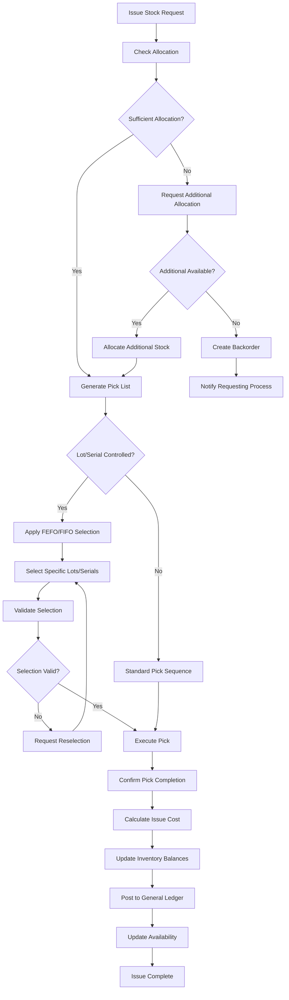
```mermaid
flowchart TD
    A[Issue Stock Request] --> B[Check Allocation]
    B --> C{Sufficient Allocation?}
    C -->|Yes| D[Generate Pick List]
    C -->|No| E[Request Additional Allocation]
    
    E --> F{Additional Available?}
    F -->|Yes| G[Allocate Additional Stock]
    F -->|No| H[Create Backorder]
    
    G --> D
    H --> I[Notify Requesting Process]
    
    D --> J{Lot/Serial Controlled?}
    J -->|Yes| K[Apply FEFO/FIFO Selection]
    J -->|No| L[Standard Pick Sequence]
    
    K --> M[Select Specific Lots/Serials]
    M --> N[Validate Selection]
    N --> O{Selection Valid?}
    O -->|No| P[Request Reselection]
    O -->|Yes| Q[Execute Pick]
    
    L --> Q
    P --> M
    
    Q --> R[Confirm Pick Completion]
    R --> S[Calculate Issue Cost]
    S --> T[Update Inventory Balances]
    T --> U[Post to General Ledger]
    U --> V[Update Availability]
    V --> W[Issue Complete]
```

**Commands Involved**:
- `IssueStock` - Process inventory issue request
- `ValidateAllocation` - Verify sufficient allocation exists
- `GeneratePickList` - Create picking instructions
- `SelectLotSerial` - Choose specific lot/serial numbers
- `ExecutePick` - Perform physical picking
- `CalculateIssueCost` - Compute cost of goods issued
- `UpdateAvailability` - Refresh availability calculations

**Events Involved**:
- `StockIssued` - Issue processing completed
- `AllocationValidated` - Allocation sufficiency verified
- `PickListGenerated` - Pick instructions created
- `LotSerialSelected` - Specific items chosen
- `PickExecuted` - Physical picking completed
- `IssueCostCalculated` - Cost computation finished
- `AvailabilityUpdated` - Current availability refreshed

**Business Rules**:
- Issue quantity cannot exceed allocated quantity without override
- FEFO (First Expired First Out) mandatory for lot-controlled items
- Serial number selection must match exact quantities
- Cost calculation uses FIFO/LIFO/Average per item configuration
- High-value issues require additional authorization

---

### 5. Inter-Warehouse Transfer Workflow

**Description**: Complex transfer processing including authorization, in-transit tracking, cross-company handling, and variance resolution with comprehensive audit trails.

**State Transitions**:
`Transfer Requested` → `Approved` → `Shipped` → `In Transit` → `Received` → `Completed`

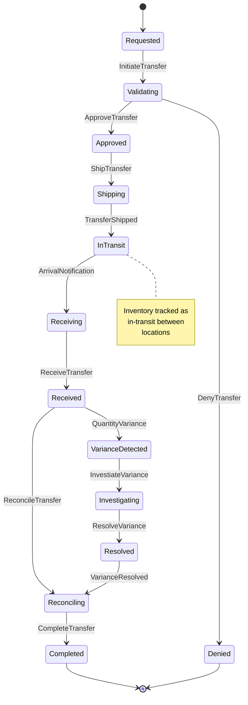
```mermaid
stateDiagram-v2
    [*] --> Requested
    Requested --> Validating: InitiateTransfer
    Validating --> Approved: ApproveTransfer
    Validating --> Denied: DenyTransfer
    Approved --> Shipping: ShipTransfer
    Shipping --> InTransit: TransferShipped
    InTransit --> Receiving: ArrivalNotification
    Receiving --> Received: ReceiveTransfer
    Received --> Reconciling: ReconcileTransfer
    Reconciling --> Completed: CompleteTransfer
    
    Received --> VarianceDetected: QuantityVariance
    VarianceDetected --> Investigating: InvestiateVariance
    Investigating --> Resolved: ResolveVariance
    Resolved --> Reconciling: VarianceResolved
    
    Denied --> [*]
    Completed --> [*]
    
    note right of InTransit
        Inventory tracked as
        in-transit between
        locations
    end note
```

**Commands Involved**:
- `InitiateTransfer` - Begin transfer process
- `ApproveTransfer` - Authorize transfer execution
- `ShipTransfer` - Process shipment from source
- `ReceiveTransfer` - Accept transfer at destination
- `ReconcileTransfer` - Resolve any variances
- `CompleteTransfer` - Finalize transfer lifecycle
- `InvestigateVariance` - Analyze transfer discrepancies
- `ResolveVariance` - Correct identified issues

**Events Involved**:
- `TransferInitiated` - Transfer process started
- `TransferApproved` - Authorization received
- `TransferShipped` - Shipment processed from source
- `TransferReceived` - Goods received at destination
- `TransferReconciled` - Variances resolved
- `TransferCompleted` - Lifecycle completed
- `VarianceInvestigated` - Discrepancies analyzed
- `VarianceResolved` - Issues corrected

**Business Rules**:
- Cross-company transfers require inter-company agreement setup
- In-transit inventory tracked separately from on-hand quantities
- Transfer variances above tolerance trigger investigation workflow
- High-value transfers require insurance and enhanced tracking
- Transfer completion updates availability at both locations

---

## Physical Counting Workflows

### 6. Physical Count Management Workflow

**Description**: Comprehensive physical counting including count planning, execution coordination, variance analysis, and adjustment processing with multi-round counting support.

**State Transitions**:
`Count Planned` → `Count Active` → `Counted` → `Variance Analysis` → `Adjustments` → `Count Closed`

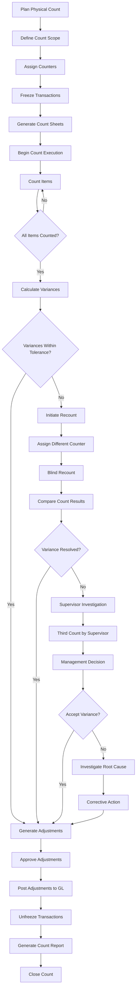
```mermaid
flowchart TD
    A[Plan Physical Count] --> B[Define Count Scope]
    B --> C[Assign Counters]
    C --> D[Freeze Transactions]
    D --> E[Generate Count Sheets]
    E --> F[Begin Count Execution]
    
    F --> G[Count Items]
    G --> H{All Items Counted?}
    H -->|No| G
    H -->|Yes| I[Calculate Variances]
    
    I --> J{Variances Within Tolerance?}
    J -->|Yes| K[Generate Adjustments]
    J -->|No| L[Initiate Recount]
    
    L --> M[Assign Different Counter]
    M --> N[Blind Recount]
    N --> O[Compare Count Results]
    O --> P{Variance Resolved?}
    P -->|Yes| K
    P -->|No| Q[Supervisor Investigation]
    
    Q --> R[Third Count by Supervisor]
    R --> S[Management Decision]
    S --> T{Accept Variance?}
    T -->|Yes| K
    T -->|No| U[Investigate Root Cause]
    
    U --> V[Corrective Action]
    V --> K
    
    K --> W[Approve Adjustments]
    W --> X[Post Adjustments to GL]
    X --> Y[Unfreeze Transactions]
    Y --> Z[Generate Count Report]
    Z --> AA[Close Count]
```

**Commands Involved**:
- `InitiatePhysicalCount` - Begin count process
- `AssignCounters` - Allocate counting resources
- `FreezeTransactions` - Prevent transactions during count
- `RecordCountedQuantity` - Capture count results
- `CalculateVariances` - Determine count differences
- `InitiateRecount` - Trigger additional counting
- `FinalizeCount` - Complete count process
- `PostCountAdjustments` - Create adjustment entries

**Events Involved**:
- `PhysicalCountStarted` - Count process initiated
- `CountersAssigned` - Resources allocated
- `TransactionsFrozen` - Transaction restrictions applied
- `ItemCounted` - Individual item count recorded
- `VariancesCalculated` - Count differences determined
- `RecountInitiated` - Additional counting triggered
- `CountCompleted` - Count process finished
- `CountAdjustmentsPosted` - Adjustments processed

**Business Rules**:
- Count accuracy requirements vary by ABC classification
- Blind counting required for high-value items
- Variance tolerances configurable by item value and type
- Supervisor approval required for variances exceeding limits
- All count activities maintain complete audit trail

---

### 7. Cycle Count Optimization Workflow

**Description**: Continuous cycle counting program including ABC classification, count frequency optimization, performance tracking, and accuracy improvement.

**State Transitions**:
`ABC Classification` → `Count Scheduling` → `Count Execution` → `Performance Analysis` → `Optimization`

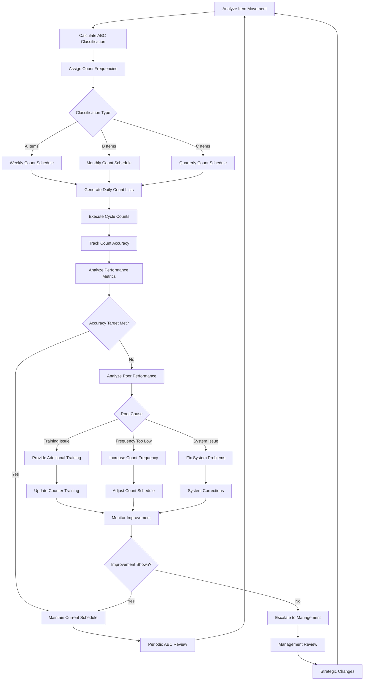
```mermaid
flowchart TD
    A[Analyze Item Movement] --> B[Calculate ABC Classification]
    B --> C[Assign Count Frequencies]
    C --> D{Classification Type}
    
    D -->|A Items| E[Weekly Count Schedule]
    D -->|B Items| F[Monthly Count Schedule]
    D -->|C Items| G[Quarterly Count Schedule]
    
    E --> H[Generate Daily Count Lists]
    F --> H
    G --> H
    
    H --> I[Execute Cycle Counts]
    I --> J[Track Count Accuracy]
    J --> K[Analyze Performance Metrics]
    K --> L{Accuracy Target Met?}
    
    L -->|Yes| M[Maintain Current Schedule]
    L -->|No| N[Analyze Poor Performance]
    
    N --> O{Root Cause}
    O -->|Training Issue| P[Provide Additional Training]
    O -->|Frequency Too Low| Q[Increase Count Frequency]
    O -->|System Issue| R[Fix System Problems]
    
    P --> S[Update Counter Training]
    Q --> T[Adjust Count Schedule]
    R --> U[System Corrections]
    
    S --> V[Monitor Improvement]
    T --> V
    U --> V
    
    V --> W{Improvement Shown?}
    W -->|Yes| M
    W -->|No| X[Escalate to Management]
    
    M --> Y[Periodic ABC Review]
    Y --> A
    
    X --> Z[Management Review]
    Z --> AA[Strategic Changes]
    AA --> A
```

**Commands Involved**:
- `UpdateABCClassification` - Refresh item classifications
- `ScheduleCycleCount` - Plan cycle counting activities
- `AssignCounter` - Allocate counting resources
- `CompleteCycleCount` - Finalize cycle count
- `AnalyzeCountPerformance` - Evaluate counting effectiveness
- `OptimizeCountFrequency` - Adjust counting schedules
- `TrainCounter` - Provide counter education

**Events Involved**:
- `ABCClassificationUpdated` - Classifications refreshed
- `CycleCountScheduled` - Counting planned
- `CounterAssigned` - Resources allocated
- `CycleCountCompleted` - Count finished
- `CountPerformanceAnalyzed` - Effectiveness evaluated
- `CountFrequencyOptimized` - Schedules adjusted
- `CounterTrained` - Education provided

**Business Rules**:
- ABC classification based on annual dollar usage
- A-items require more frequent counting than B and C items
- Count accuracy tracked with statistical process control
- Poor performance triggers root cause analysis
- Counter training mandatory for accuracy improvement

---

## Kit and Assembly Workflows

### 8. Kit Definition and Management Workflow

**Description**: Kit item configuration including component definition, substitution rules, assembly instructions, and cost calculation with circular reference prevention.

**State Transitions**:
`Kit Proposed` → `Components Defined` → `Validated` → `Costed` → `Active` → `Modified`

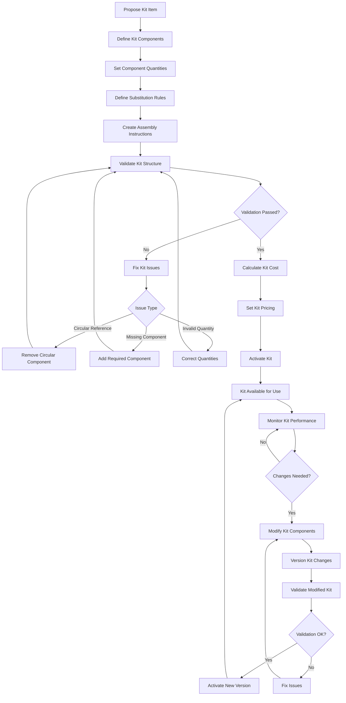
```mermaid
flowchart TD
    A[Propose Kit Item] --> B[Define Kit Components]
    B --> C[Set Component Quantities]
    C --> D[Define Substitution Rules]
    D --> E[Create Assembly Instructions]
    E --> F[Validate Kit Structure]
    
    F --> G{Validation Passed?}
    G -->|No| H[Fix Kit Issues]
    G -->|Yes| I[Calculate Kit Cost]
    
    H --> J{Issue Type}
    J -->|Circular Reference| K[Remove Circular Component]
    J -->|Missing Component| L[Add Required Component]
    J -->|Invalid Quantity| M[Correct Quantities]
    
    K --> F
    L --> F
    M --> F
    
    I --> N[Set Kit Pricing]
    N --> O[Activate Kit]
    O --> P[Kit Available for Use]
    
    P --> Q[Monitor Kit Performance]
    Q --> R{Changes Needed?}
    R -->|Yes| S[Modify Kit Components]
    R -->|No| Q
    
    S --> T[Version Kit Changes]
    T --> U[Validate Modified Kit]
    U --> V{Validation OK?}
    V -->|Yes| W[Activate New Version]
    V -->|No| X[Fix Issues]
    
    W --> P
    X --> S
```

**Commands Involved**:
- `DefineKitComponents` - Establish kit component structure
- `ValidateKitStructure` - Verify kit integrity
- `CalculateKitCost` - Compute kit cost from components
- `SetKitPricing` - Establish kit selling prices
- `ActivateKit` - Enable kit for transactions
- `ModifyKitComponents` - Update kit structure
- `VersionKit` - Create new kit version

**Events Involved**:
- `KitComponentsDefined` - Component structure established
- `KitStructureValidated` - Integrity verified
- `KitCostCalculated` - Cost computation completed
- `KitPricingSet` - Selling prices established
- `KitActivated` - Kit enabled for use
- `KitComponentsModified` - Structure updated
- `KitVersionCreated` - New version established

**Business Rules**:
- Kit components must exist as valid inventory items
- Circular references prevented through validation
- Component quantities must be positive decimal values
- Kit cost calculation includes component costs plus assembly labor
- Kit pricing must maintain minimum margin requirements

---

### 9. Kit Assembly Processing Workflow

**Description**: Kit assembly execution including component availability checking, reservation, consumption tracking, assembly coordination, and finished goods receipt.

**State Transitions**:
`Assembly Requested` → `Components Reserved` → `Assembling` → `Quality Check` → `Assembly Complete`

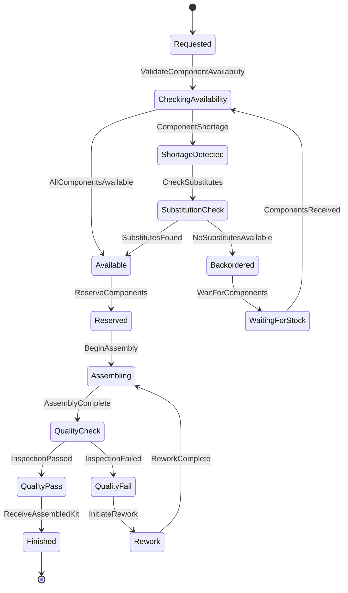
```mermaid
stateDiagram-v2
    [*] --> Requested
    Requested --> CheckingAvailability: ValidateComponentAvailability
    CheckingAvailability --> Available: AllComponentsAvailable
    CheckingAvailability --> ShortageDetected: ComponentShortage
    
    ShortageDetected --> SubstitutionCheck: CheckSubstitutes
    SubstitutionCheck --> Available: SubstitutesFound
    SubstitutionCheck --> Backordered: NoSubstitutesAvailable
    
    Available --> Reserved: ReserveComponents
    Reserved --> Assembling: BeginAssembly
    Assembling --> QualityCheck: AssemblyComplete
    QualityCheck --> QualityPass: InspectionPassed
    QualityCheck --> QualityFail: InspectionFailed
    
    QualityFail --> Rework: InitiateRework
    Rework --> Assembling: ReworkComplete
    
    QualityPass --> Finished: ReceiveAssembledKit
    Finished --> [*]
    
    Backordered --> WaitingForStock: WaitForComponents
    WaitingForStock --> CheckingAvailability: ComponentsReceived
```

**Commands Involved**:
- `ValidateComponentAvailability` - Check component stock levels
- `ReserveComponents` - Allocate components for assembly
- `BeginAssembly` - Start assembly process
- `ConsumeComponents` - Issue components for assembly
- `PerformQualityCheck` - Inspect assembled kit
- `ReceiveAssembledKit` - Add finished kit to inventory
- `HandleAssemblyException` - Process assembly failures

**Events Involved**:
- `ComponentAvailabilityValidated` - Stock levels verified
- `ComponentsReserved` - Components allocated for assembly
- `AssemblyBegun` - Assembly process started
- `ComponentsConsumed` - Components issued for assembly
- `QualityCheckPerformed` - Inspection completed
- `AssembledKitReceived` - Finished kit added to inventory
- `AssemblyExceptionHandled` - Failure processed

**Business Rules**:
- All kit components must be available before assembly begins
- Component consumption follows lot/serial tracking requirements
- Quality inspection mandatory for kits with quality control
- Assembly cost includes component costs plus labor and overhead
- Failed assemblies require root cause analysis and corrective action

---

## Costing and Valuation Workflows

### 10. Cost Calculation and Maintenance Workflow

**Description**: Sophisticated cost management including multiple costing methods, cost layer maintenance, variance analysis, and standard cost updates with audit requirements.

**State Transitions**:
`Cost Required` → `Method Applied` → `Calculated` → `Validated` → `Posted` → `Variance Analyzed`

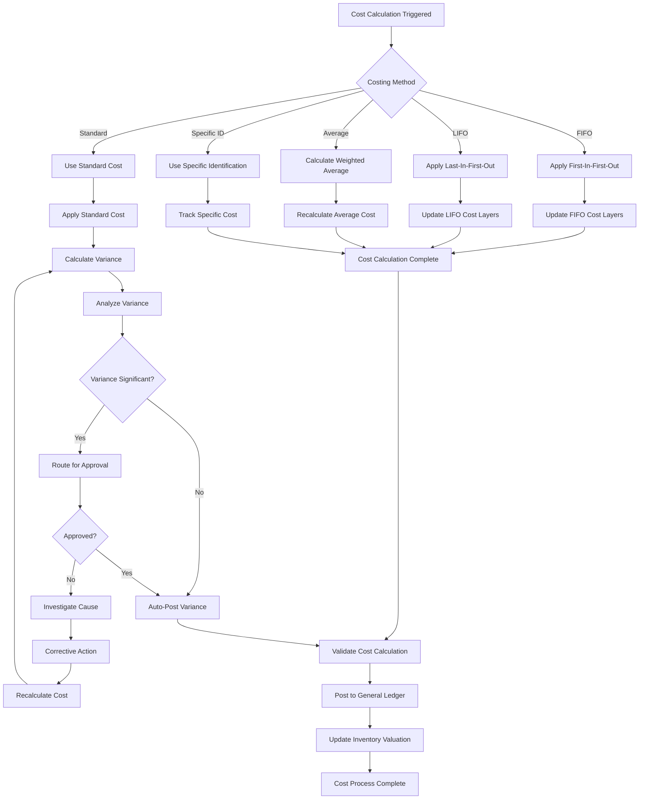
```mermaid
flowchart TD
    A[Cost Calculation Triggered] --> B{Costing Method}
    
    B -->|FIFO| C[Apply First-In-First-Out]
    B -->|LIFO| D[Apply Last-In-First-Out]
    B -->|Average| E[Calculate Weighted Average]
    B -->|Standard| F[Use Standard Cost]
    B -->|Specific ID| G[Use Specific Identification]
    
    C --> H[Update FIFO Cost Layers]
    D --> I[Update LIFO Cost Layers]
    E --> J[Recalculate Average Cost]
    F --> K[Apply Standard Cost]
    G --> L[Track Specific Cost]
    
    H --> M[Cost Calculation Complete]
    I --> M
    J --> M
    K --> N[Calculate Variance]
    L --> M
    
    N --> O[Analyze Variance]
    O --> P{Variance Significant?}
    P -->|Yes| Q[Route for Approval]
    P -->|No| R[Auto-Post Variance]
    
    Q --> S{Approved?}
    S -->|Yes| R
    S -->|No| T[Investigate Cause]
    
    T --> U[Corrective Action]
    U --> V[Recalculate Cost]
    V --> N
    
    M --> W[Validate Cost Calculation]
    R --> W
    W --> X[Post to General Ledger]
    X --> Y[Update Inventory Valuation]
    Y --> Z[Cost Process Complete]
```

**Commands Involved**:
- `CalculateItemCost` - Compute cost using configured method
- `UpdateCostLayers` - Maintain FIFO/LIFO cost layers
- `RecalculateAverageCost` - Compute weighted average
- `UpdateStandardCost` - Revise standard cost
- `ProcessCostVariance` - Handle cost differences
- `ValidateCostCalculation` - Verify calculation accuracy
- `PostCostToGL` - Create general ledger entries

**Events Involved**:
- `ItemCostCalculated` - Cost computation completed
- `CostLayersUpdated` - FIFO/LIFO layers maintained
- `AverageCostRecalculated` - Weighted average computed
- `StandardCostUpdated` - Standard cost revised
- `CostVarianceProcessed` - Variance handled
- `CostCalculationValidated` - Accuracy verified
- `CostPostedToGL` - GL entries created

**Business Rules**:
- Costing method must remain consistent for item unless approved change
- Cost layers maintained in chronological order for FIFO/LIFO
- Average cost recalculated on every receipt transaction
- Standard cost changes require financial management approval
- Cost variances above threshold require investigation and approval

---

### 11. Inventory Valuation and Revaluation Workflow

**Description**: Periodic inventory valuation including market value assessment, lower-of-cost-or-market analysis, obsolescence reserves, and revaluation processing.

**State Transitions**:
`Valuation Required` → `Market Analysis` → `LCM Calculation` → `Obsolescence Review` → `Valuation Complete`

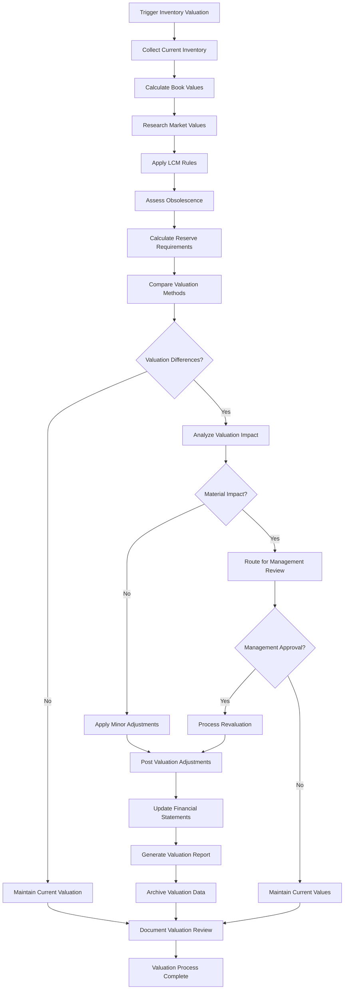
```mermaid
flowchart TD
    A[Trigger Inventory Valuation] --> B[Collect Current Inventory]
    B --> C[Calculate Book Values]
    C --> D[Research Market Values]
    D --> E[Apply LCM Rules]
    E --> F[Assess Obsolescence]
    F --> G[Calculate Reserve Requirements]
    G --> H[Compare Valuation Methods]
    
    H --> I{Valuation Differences?}
    I -->|No| J[Maintain Current Valuation]
    I -->|Yes| K[Analyze Valuation Impact]
    
    K --> L{Material Impact?}
    L -->|No| M[Apply Minor Adjustments]
    L -->|Yes| N[Route for Management Review]
    
    N --> O{Management Approval?}
    O -->|Yes| P[Process Revaluation]
    O -->|No| Q[Maintain Current Values]
    
    M --> R[Post Valuation Adjustments]
    P --> R
    R --> S[Update Financial Statements]
    S --> T[Generate Valuation Report]
    T --> U[Archive Valuation Data]
    
    J --> V[Document Valuation Review]
    Q --> V
    U --> V
    V --> W[Valuation Process Complete]
```

**Commands Involved**:
- `CalculateInventoryValuation` - Perform comprehensive valuation
- `AssessMarketValue` - Research current market prices
- `ApplyLCMRules` - Apply lower-of-cost-or-market
- `CalculateObsolescenceReserve` - Assess obsolete inventory
- `ProcessRevaluation` - Handle valuation adjustments
- `GenerateValuationReport` - Create valuation documentation
- `ArchiveValuationData` - Preserve valuation history

**Events Involved**:
- `InventoryValuationCalculated` - Valuation computation completed
- `MarketValueAssessed` - Market prices researched
- `LCMRulesApplied` - LCM analysis completed
- `ObsolescenceReserveCalculated` - Obsolete inventory assessed
- `RevaluationProcessed` - Valuation adjustments handled
- `ValuationReportGenerated` - Documentation created
- `ValuationDataArchived` - History preserved

**Business Rules**:
- Valuation performed monthly or as required by accounting standards
- Market values must be from reliable, independent sources
- LCM rules applied consistently across all inventory
- Obsolescence assessment based on movement history and condition
- Valuation changes require appropriate financial approval

---

## Quality and Compliance Workflows

### 12. Quality Control Inspection Workflow

**Description**: Quality inspection process including inspection planning, test execution, result evaluation, and disposition determination with lot/batch coordination.

**State Transitions**:
`Inspection Required` → `Scheduled` → `Testing` → `Evaluation` → `Disposition` → `Released/Quarantined`

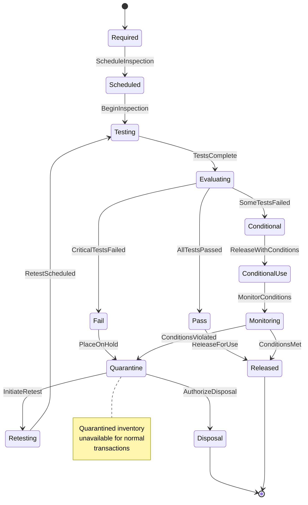
```mermaid
stateDiagram-v2
    [*] --> Required
    Required --> Scheduled: ScheduleInspection
    Scheduled --> Testing: BeginInspection
    Testing --> Evaluating: TestsComplete
    Evaluating --> Pass: AllTestsPassed
    Evaluating --> Conditional: SomeTestsFailed
    Evaluating --> Fail: CriticalTestsFailed
    
    Pass --> Released: ReleaseForUse
    Conditional --> ConditionalUse: ReleaseWithConditions
    Fail --> Quarantine: PlaceOnHold
    
    Quarantine --> Retesting: InitiateRetest
    Retesting --> Testing: RetestScheduled
    
    Quarantine --> Disposal: AuthorizeDisposal
    Disposal --> [*]
    
    ConditionalUse --> Monitoring: MonitorConditions
    Monitoring --> Released: ConditionsMet
    Monitoring --> Quarantine: ConditionsViolated
    
    Released --> [*]
    
    note right of Quarantine
        Quarantined inventory
        unavailable for normal
        transactions
    end note
```

**Commands Involved**:
- `ScheduleInspection` - Plan quality inspection
- `BeginInspection` - Start inspection process
- `RecordTestResults` - Capture test data
- `EvaluateResults` - Determine pass/fail status
- `ReleaseForUse` - Make available for transactions
- `PlaceOnQualityHold` - Quarantine inventory
- `AuthorizeDisposal` - Approve disposal of failed items

**Events Involved**:
- `InspectionScheduled` - Inspection planned
- `InspectionBegun` - Testing started
- `TestResultsRecorded` - Test data captured
- `ResultsEvaluated` - Pass/fail determined
- `ItemReleasedForUse` - Made available
- `ItemPlacedOnHold` - Quarantined
- `DisposalAuthorized` - Disposal approved

**Business Rules**:
- Quality inspection required for items with quality control flags
- Test specifications must be current and approved
- Statistical sampling required for large lot quantities
- Failed items cannot be released without retest or disposal
- Quality hold inventory excluded from availability calculations

---

### 13. Lot Traceability and Recall Workflow

**Description**: Comprehensive lot tracking including genealogy maintenance, forward and backward tracing, recall coordination, and regulatory compliance reporting.

**State Transitions**:
`Lot Created` → `Genealogy Building` → `Active Tracking` → `Recall Investigation` → `Recall Executed`

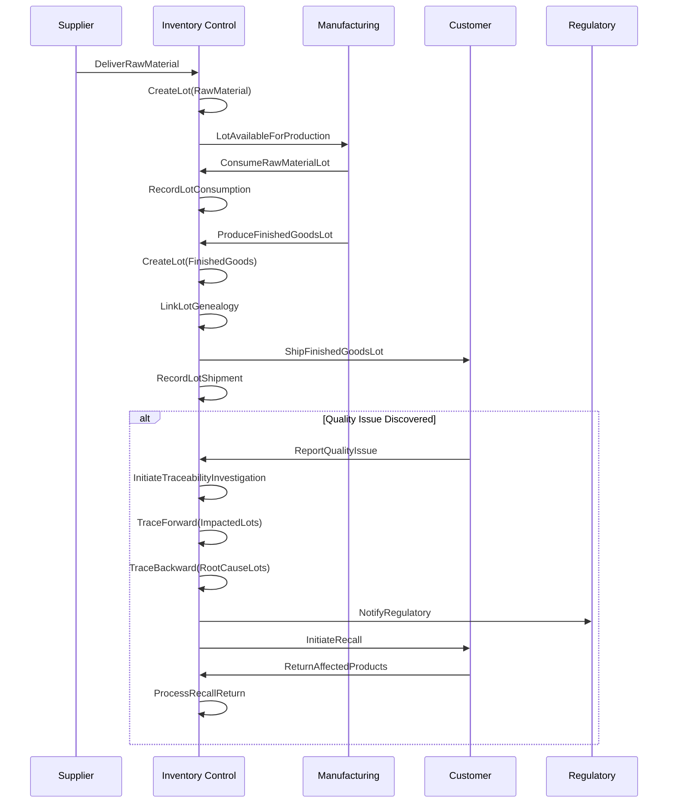
```mermaid
sequenceDiagram
    participant Supplier as Supplier
    participant IC as Inventory Control
    participant Mfg as Manufacturing
    participant Customer as Customer
    participant Regulatory as Regulatory
    
    Supplier->>IC: DeliverRawMaterial
    IC->>IC: CreateLot(RawMaterial)
    IC->>Mfg: LotAvailableForProduction
    
    Mfg->>IC: ConsumeRawMaterialLot
    IC->>IC: RecordLotConsumption
    Mfg->>IC: ProduceFinishedGoodsLot
    IC->>IC: CreateLot(FinishedGoods)
    IC->>IC: LinkLotGenealogy
    
    IC->>Customer: ShipFinishedGoodsLot
    IC->>IC: RecordLotShipment
    
    alt Quality Issue Discovered
        Customer->>IC: ReportQualityIssue
        IC->>IC: InitiateTraceabilityInvestigation
        IC->>IC: TraceForward(ImpactedLots)
        IC->>IC: TraceBackward(RootCauseLots)
        IC->>Regulatory: NotifyRegulatory
        IC->>Customer: InitiateRecall
        Customer->>IC: ReturnAffectedProducts
        IC->>IC: ProcessRecallReturn
    end
```

**Commands Involved**:
- `CreateLot` - Establish new lot with tracking
- `RecordLotConsumption` - Track lot usage in production
- `LinkLotGenealogy` - Connect parent/child lot relationships
- `RecordLotShipment` - Track lot delivery to customers
- `InitiateTraceabilityInvestigation` - Begin tracing process
- `ProcessRecallReturn` - Handle returned recalled products
- `GenerateTraceabilityReport` - Create regulatory documentation

**Events Involved**:
- `LotCreated` - New lot established with tracking
- `LotConsumptionRecorded` - Usage tracked
- `LotGenealogyLinked` - Relationships established
- `LotShipmentRecorded` - Delivery tracked
- `TraceabilityInvestigationInitiated` - Tracing begun
- `RecallReturnProcessed` - Returns handled
- `TraceabilityReportGenerated` - Documentation created

**Business Rules**:
- Complete lot genealogy maintained from raw materials to customers
- Forward tracing identifies all products derived from suspect lot
- Backward tracing identifies root cause materials and suppliers
- Recall processing must meet regulatory timing requirements
- Traceability records preserved for product lifetime plus regulatory period

---

## Procurement and Planning Workflows

### 14. Reorder Point Monitoring Workflow

**Description**: Automated reorder point monitoring including threshold checking, purchase requisition generation, vendor selection, and procurement coordination.

**State Transitions**:
`Normal Stock` → `Approaching Reorder` → `Below Reorder Point` → `Requisition Generated` → `Restocked`

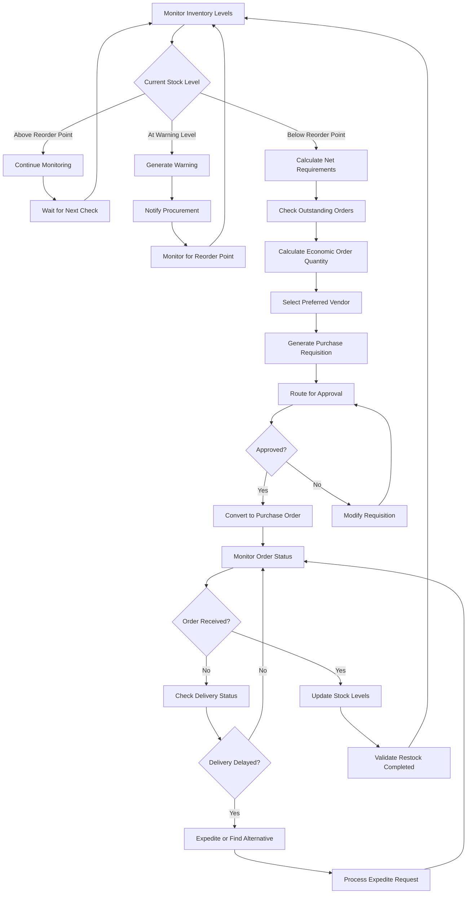
```mermaid
flowchart TD
    A[Monitor Inventory Levels] --> B{Current Stock Level}
    B -->|Above Reorder Point| C[Continue Monitoring]
    B -->|At Warning Level| D[Generate Warning]
    B -->|Below Reorder Point| E[Calculate Net Requirements]
    
    C --> F[Wait for Next Check]
    F --> A
    
    D --> G[Notify Procurement]
    G --> H[Monitor for Reorder Point]
    H --> A
    
    E --> I[Check Outstanding Orders]
    I --> J[Calculate Economic Order Quantity]
    J --> K[Select Preferred Vendor]
    K --> L[Generate Purchase Requisition]
    
    L --> M[Route for Approval]
    M --> N{Approved?}
    N -->|Yes| O[Convert to Purchase Order]
    N -->|No| P[Modify Requisition]
    
    P --> M
    O --> Q[Monitor Order Status]
    Q --> R{Order Received?}
    R -->|Yes| S[Update Stock Levels]
    R -->|No| T[Check Delivery Status]
    
    T --> U{Delivery Delayed?}
    U -->|Yes| V[Expedite or Find Alternative]
    U -->|No| Q
    
    V --> W[Process Expedite Request]
    W --> Q
    
    S --> X[Validate Restock Completed]
    X --> A
```

**Commands Involved**:
- `MonitorInventoryLevels` - Check stock against reorder points
- `GenerateReorderWarning` - Create early warning notifications
- `CalculateNetRequirements` - Determine purchase needs
- `GenerateRequisition` - Create purchase requisition
- `SelectPreferredVendor` - Choose optimal supplier
- `CalculateEOQ` - Determine economic order quantity
- `ExpediteOrder` - Accelerate delivery when needed

**Events Involved**:
- `InventoryLevelsMonitored` - Stock levels checked
- `ReorderWarningGenerated` - Early warning issued
- `NetRequirementsCalculated` - Purchase needs determined
- `RequisitionGenerated` - Purchase request created
- `PreferredVendorSelected` - Supplier chosen
- `EOQCalculated` - Order quantity determined
- `OrderExpedited` - Delivery accelerated

**Business Rules**:
- Reorder point monitoring occurs daily or more frequently for critical items
- Net requirements calculation considers outstanding purchase orders
- EOQ calculation balances ordering costs with carrying costs
- Vendor selection considers price, quality, and delivery performance
- Expediting authorized for stockout prevention

---

### 15. Demand Forecasting and Planning Workflow

**Description**: Advanced demand forecasting including statistical analysis, seasonal adjustments, trend identification, and planning parameter optimization with machine learning.

**State Transitions**:
`Data Collection` → `Statistical Analysis` → `Model Training` → `Forecast Generation` → `Validation` → `Implementation`

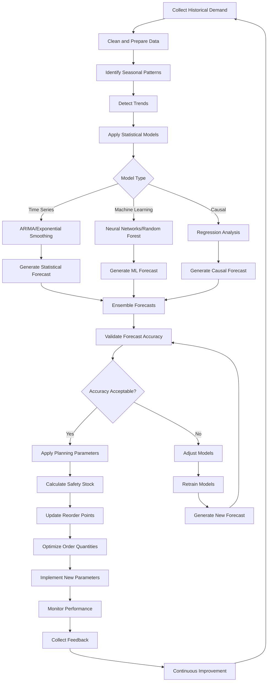
```mermaid
flowchart TD
    A[Collect Historical Demand] --> B[Clean and Prepare Data]
    B --> C[Identify Seasonal Patterns]
    C --> D[Detect Trends]
    D --> E[Apply Statistical Models]
    
    E --> F{Model Type}
    F -->|Time Series| G[ARIMA/Exponential Smoothing]
    F -->|Machine Learning| H[Neural Networks/Random Forest]
    F -->|Causal| I[Regression Analysis]
    
    G --> J[Generate Statistical Forecast]
    H --> K[Generate ML Forecast]
    I --> L[Generate Causal Forecast]
    
    J --> M[Ensemble Forecasts]
    K --> M
    L --> M
    
    M --> N[Validate Forecast Accuracy]
    N --> O{Accuracy Acceptable?}
    O -->|Yes| P[Apply Planning Parameters]
    O -->|No| Q[Adjust Models]
    
    Q --> R[Retrain Models]
    R --> S[Generate New Forecast]
    S --> N
    
    P --> T[Calculate Safety Stock]
    T --> U[Update Reorder Points]
    U --> V[Optimize Order Quantities]
    V --> W[Implement New Parameters]
    W --> X[Monitor Performance]
    X --> Y[Collect Feedback]
    Y --> Z[Continuous Improvement]
    Z --> A
```

**Commands Involved**:
- `GenerateForecast` - Create demand projections
- `AnalyzeDemandPatterns` - Identify seasonal and trend patterns
- `TrainForecastModels` - Update statistical and ML models
- `ValidateForecastAccuracy` - Verify forecast quality
- `OptimizePlanningParameters` - Improve planning settings
- `ImplementPlanningChanges` - Apply optimized parameters
- `MonitorForecastPerformance` - Track forecast effectiveness

**Events Involved**:
- `ForecastGenerated` - Demand projections created
- `DemandPatternsAnalyzed` - Patterns identified
- `ForecastModelsUpdated` - Models retrained
- `ForecastAccuracyValidated` - Quality verified
- `PlanningParametersOptimized` - Settings improved
- `PlanningChangesImplemented` - Parameters applied
- `ForecastPerformanceMonitored` - Effectiveness tracked

**Business Rules**:
- Forecast accuracy measured using MAPE (Mean Absolute Percentage Error)
- Seasonal patterns identified using minimum 24 months historical data
- Machine learning models retrained monthly with new transaction data
- Forecast validation includes holdout testing on recent periods
- Planning parameter changes require performance impact assessment

---

## Integration and Data Management Workflows

### 16. Multi-Module Integration Workflow

**Description**: Real-time integration coordination with other Accountex modules including event publishing, subscription management, and circuit breaker implementation for fault tolerance.

**State Transitions**:
`Event Generated` → `Published` → `Consumed` → `Processed` → `Acknowledged` → `Archived`

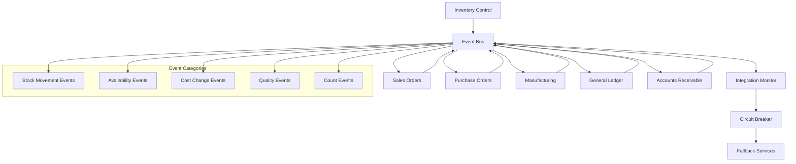
```mermaid
graph TD
    IC[Inventory Control] --> EventBus[Event Bus]
    EventBus --> SO[Sales Orders]
    EventBus --> PO[Purchase Orders]
    EventBus --> MFG[Manufacturing]
    EventBus --> GL[General Ledger]
    EventBus --> AR[Accounts Receivable]
    
    SO --> EventBus
    PO --> EventBus
    MFG --> EventBus
    GL --> EventBus
    AR --> EventBus
    
    EventBus --> Monitor[Integration Monitor]
    Monitor --> CircuitBreaker[Circuit Breaker]
    CircuitBreaker --> Fallback[Fallback Services]
    
    subgraph "Event Categories"
        E1[Stock Movement Events]
        E2[Availability Events]
        E3[Cost Change Events]
        E4[Quality Events]
        E5[Count Events]
    end
    
    EventBus --> E1
    EventBus --> E2
    EventBus --> E3
    EventBus --> E4
    EventBus --> E5
```

**Commands Involved**:
- `PublishInventoryEvent` - Send events to other modules
- `SubscribeToModuleEvent` - Listen for external events
- `HandleIntegrationError` - Process integration failures
- `ActivateCircuitBreaker` - Engage fault tolerance
- `ProcessEventBacklog` - Handle queued events
- `ValidateDataConsistency` - Verify data integrity
- `SyncWithModule` - Coordinate with specific modules

**Events Involved**:
- `InventoryEventPublished` - Event sent successfully
- `ModuleEventReceived` - External event processed
- `IntegrationErrorHandled` - Error managed
- `CircuitBreakerActivated` - Fault tolerance engaged
- `EventBacklogProcessed` - Queue cleared
- `DataConsistencyValidated` - Integrity verified
- `ModuleSyncCompleted` - Synchronization finished

**Business Rules**:
- All significant inventory events published to event bus
- Event processing must be idempotent
- Circuit breaker activates on failure threshold
- Event ordering preserved for dependent operations
- Integration monitoring tracks performance and reliability

---

### 17. Data Import and Migration Workflow

**Description**: Bulk data import including file validation, business rule checking, batch processing, and error handling with rollback capabilities.

**State Transitions**:
`File Uploaded` → `Validating` → `Processing` → `Reconciling` → `Completed` → `Archived`

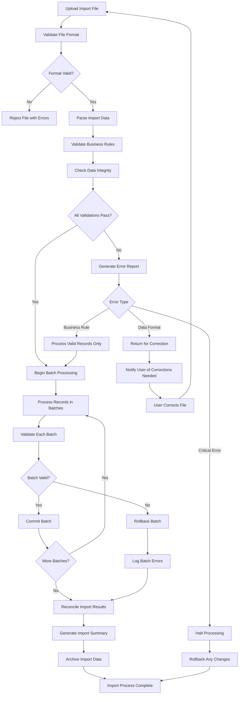
```mermaid
flowchart TD
    A[Upload Import File] --> B[Validate File Format]
    B --> C{Format Valid?}
    C -->|No| D[Reject File with Errors]
    C -->|Yes| E[Parse Import Data]
    
    E --> F[Validate Business Rules]
    F --> G[Check Data Integrity]
    G --> H{All Validations Pass?}
    
    H -->|No| I[Generate Error Report]
    H -->|Yes| J[Begin Batch Processing]
    
    I --> K{Error Type}
    K -->|Data Format| L[Return for Correction]
    K -->|Business Rule| M[Process Valid Records Only]
    K -->|Critical Error| N[Halt Processing]
    
    L --> O[Notify User of Corrections Needed]
    M --> J
    N --> P[Rollback Any Changes]
    
    J --> Q[Process Records in Batches]
    Q --> R[Validate Each Batch]
    R --> S{Batch Valid?}
    S -->|Yes| T[Commit Batch]
    S -->|No| U[Rollback Batch]
    
    T --> V{More Batches?}
    U --> W[Log Batch Errors]
    V -->|Yes| Q
    V -->|No| X[Reconcile Import Results]
    
    W --> X
    X --> Y[Generate Import Summary]
    Y --> Z[Archive Import Data]
    Z --> AA[Import Process Complete]
    
    O --> BB[User Corrects File]
    BB --> A
    P --> AA
```

**Commands Involved**:
- `InitiateImport` - Begin import process
- `ValidateImportFile` - Check file format and structure
- `ProcessImportBatch` - Handle batch of records
- `ValidateBusinessRules` - Check imported data against rules
- `RollbackImport` - Reverse failed import
- `ReconcileImport` - Verify import completeness
- `ArchiveImportData` - Preserve import history

**Events Involved**:
- `ImportInitiated` - Process started
- `ImportFileValidated` - File format verified
- `ImportBatchProcessed` - Batch handled
- `BusinessRulesValidated` - Rules checked
- `ImportRolledBack` - Failed import reversed
- `ImportReconciled` - Completeness verified
- `ImportDataArchived` - History preserved

**Business Rules**:
- Import file must conform to published data format specifications
- All imported items must pass business rule validation
- Batch processing prevents partial failures from corrupting data
- Failed imports provide detailed error reporting for correction
- Import audit trail preserved for compliance and troubleshooting

---

## Error Recovery and System Maintenance Workflows

### 18. Inventory Exception Handling Workflow

**Description**: Comprehensive exception handling including negative inventory prevention, allocation conflicts, cost calculation errors, and data inconsistency resolution.

**State Transitions**:
`Exception Detected` → `Classified` → `Investigation` → `Resolution` → `Prevention` → `Monitoring`

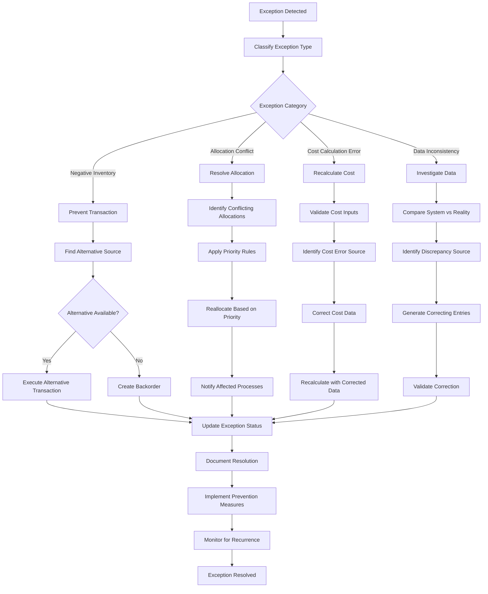
```mermaid
flowchart TD
    A[Exception Detected] --> B[Classify Exception Type]
    B --> C{Exception Category}
    
    C -->|Negative Inventory| D[Prevent Transaction]
    C -->|Allocation Conflict| E[Resolve Allocation]
    C -->|Cost Calculation Error| F[Recalculate Cost]
    C -->|Data Inconsistency| G[Investigate Data]
    
    D --> H[Find Alternative Source]
    H --> I{Alternative Available?}
    I -->|Yes| J[Execute Alternative Transaction]
    I -->|No| K[Create Backorder]
    
    E --> L[Identify Conflicting Allocations]
    L --> M[Apply Priority Rules]
    M --> N[Reallocate Based on Priority]
    N --> O[Notify Affected Processes]
    
    F --> P[Validate Cost Inputs]
    P --> Q[Identify Cost Error Source]
    Q --> R[Correct Cost Data]
    R --> S[Recalculate with Corrected Data]
    
    G --> T[Compare System vs Reality]
    T --> U[Identify Discrepancy Source]
    U --> V[Generate Correcting Entries]
    V --> W[Validate Correction]
    
    J --> X[Update Exception Status]
    K --> X
    O --> X
    S --> X
    W --> X
    
    X --> Y[Document Resolution]
    Y --> Z[Implement Prevention Measures]
    Z --> AA[Monitor for Recurrence]
    AA --> BB[Exception Resolved]
```

**Commands Involved**:
- `HandleInventoryException` - Process detected exception
- `ClassifyException` - Categorize exception type
- `PreventNegativeInventory` - Block invalid transactions
- `ResolveAllocationConflict` - Fix allocation issues
- `RecalculateCost` - Correct cost calculation errors
- `CorrectDataInconsistency` - Fix data integrity issues
- `ImplementPrevention` - Apply preventive measures

**Events Involved**:
- `InventoryExceptionDetected` - Exception identified
- `ExceptionClassified` - Category determined
- `NegativeInventoryPrevented` - Invalid transaction blocked
- `AllocationConflictResolved` - Allocation issues fixed
- `CostRecalculated` - Calculation errors corrected
- `DataInconsistencyCorreted` - Integrity restored
- `PreventionImplemented` - Preventive measures applied

**Business Rules**:
- Negative inventory prevented unless specifically authorized
- Allocation conflicts resolved using configurable priority rules
- Cost calculation errors trigger automatic recalculation
- Data inconsistencies require investigation and correction
- Exception prevention measures implemented to avoid recurrence

---

### 19. Period-End Inventory Processing Workflow

**Description**: Period-end inventory procedures including valuation, cost variance analysis, obsolescence review, and financial statement preparation with audit compliance.

**State Transitions**:
`Period End Triggered` → `Inventory Freeze` → `Valuation` → `Variance Analysis` → `Adjustments` → `Period Closed`

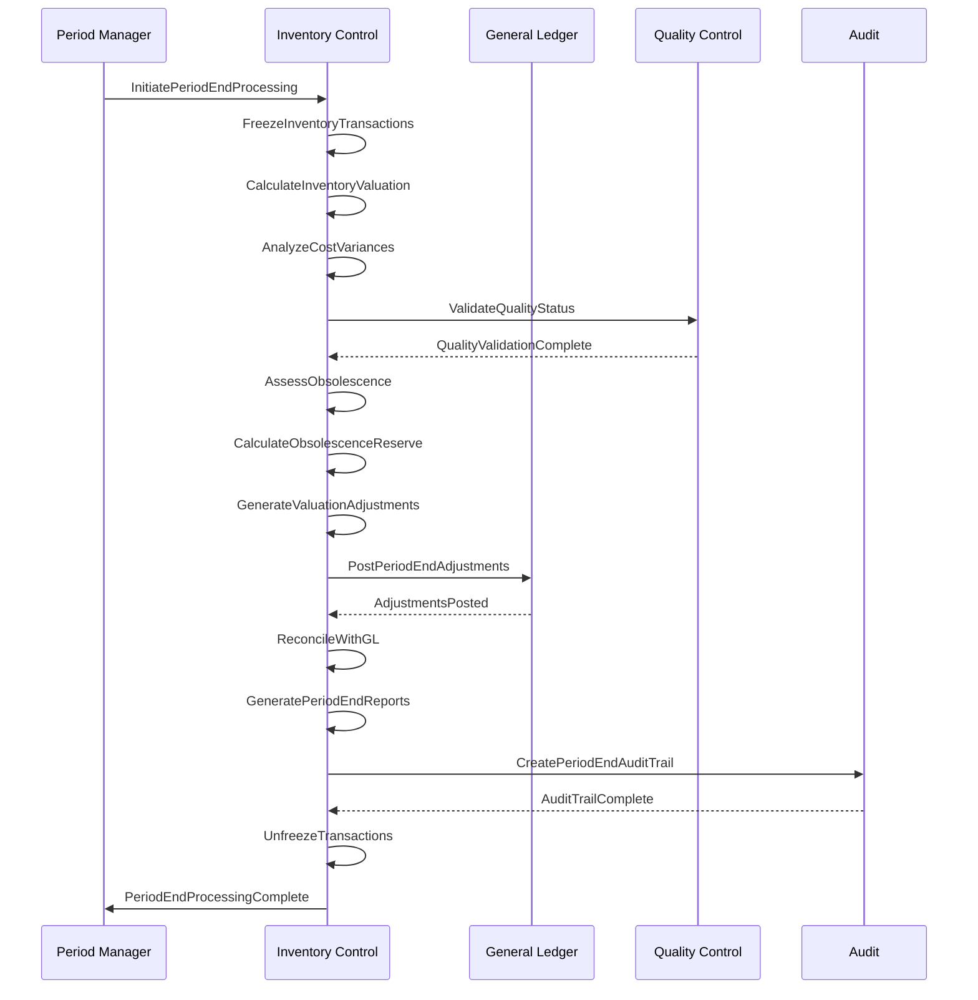
```mermaid
sequenceDiagram
    participant PM as Period Manager
    participant IC as Inventory Control
    participant GL as General Ledger
    participant QC as Quality Control
    participant Audit as Audit
    
    PM->>IC: InitiatePeriodEndProcessing
    IC->>IC: FreezeInventoryTransactions
    IC->>IC: CalculateInventoryValuation
    IC->>IC: AnalyzeCostVariances
    IC->>QC: ValidateQualityStatus
    
    QC-->>IC: QualityValidationComplete
    IC->>IC: AssessObsolescence
    IC->>IC: CalculateObsolescenceReserve
    IC->>IC: GenerateValuationAdjustments
    
    IC->>GL: PostPeriodEndAdjustments
    GL-->>IC: AdjustmentsPosted
    
    IC->>IC: ReconcileWithGL
    IC->>IC: GeneratePeriodEndReports
    IC->>Audit: CreatePeriodEndAuditTrail
    
    Audit-->>IC: AuditTrailComplete
    IC->>IC: UnfreezeTransactions
    IC->>PM: PeriodEndProcessingComplete
```

**Commands Involved**:
- `InitiatePeriodEndProcessing` - Begin period-end procedures
- `FreezeInventoryTransactions` - Prevent new transactions
- `CalculateInventoryValuation` - Perform period-end valuation
- `AnalyzeCostVariances` - Examine cost differences
- `AssessObsolescence` - Evaluate slow-moving inventory
- `GenerateAdjustmentEntries` - Create period-end adjustments
- `ReconcileWithGL` - Verify GL integration
- `UnfreezeTransactions` - Resume normal operations

**Events Involved**:
- `PeriodEndProcessingInitiated` - Procedures started
- `InventoryTransactionsFrozen` - Transactions prevented
- `InventoryValuationCalculated` - Valuation completed
- `CostVariancesAnalyzed` - Variances examined
- `ObsolescenceAssessed` - Slow inventory evaluated
- `AdjustmentEntriesGenerated` - Period adjustments created
- `GLReconciliationCompleted` - Integration verified
- `TransactionsUnfrozen` - Normal operations resumed

**Business Rules**:
- All inventory transactions must be completed before period freeze
- Valuation methods must be consistently applied
- Cost variances above threshold require management review
- Obsolescence assessment based on movement history and condition
- Period-end adjustments require appropriate authorization

---

## Quality and Compliance Workflows

### 20. Regulatory Compliance Monitoring Workflow

**Description**: Continuous compliance monitoring including regulatory requirement tracking, audit preparation, documentation management, and violation response with corrective action coordination.

**State Transitions**:
`Monitoring Active` → `Compliance Check` → `Violation Detected` → `Investigation` → `Corrective Action` → `Compliance Restored`

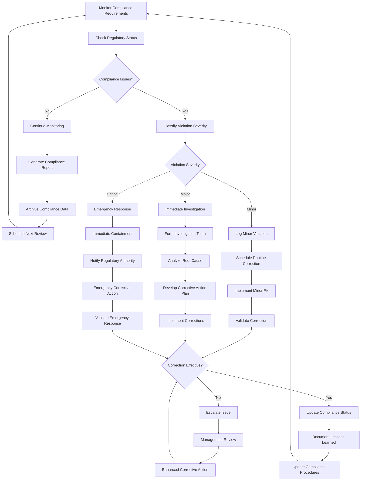
```mermaid
flowchart TD
    A[Monitor Compliance Requirements] --> B[Check Regulatory Status]
    B --> C{Compliance Issues?}
    C -->|No| D[Continue Monitoring]
    C -->|Yes| E[Classify Violation Severity]
    
    D --> F[Generate Compliance Report]
    F --> G[Archive Compliance Data]
    G --> H[Schedule Next Review]
    H --> A
    
    E --> I{Violation Severity}
    I -->|Minor| J[Log Minor Violation]
    I -->|Major| K[Immediate Investigation]
    I -->|Critical| L[Emergency Response]
    
    J --> M[Schedule Routine Correction]
    M --> N[Implement Minor Fix]
    N --> O[Validate Correction]
    
    K --> P[Form Investigation Team]
    P --> Q[Analyze Root Cause]
    Q --> R[Develop Corrective Action Plan]
    R --> S[Implement Corrections]
    
    L --> T[Immediate Containment]
    T --> U[Notify Regulatory Authority]
    U --> V[Emergency Corrective Action]
    V --> W[Validate Emergency Response]
    
    O --> X{Correction Effective?}
    S --> X
    W --> X
    X -->|Yes| Y[Update Compliance Status]
    X -->|No| Z[Escalate Issue]
    
    Z --> AA[Management Review]
    AA --> BB[Enhanced Corrective Action]
    BB --> X
    
    Y --> CC[Document Lessons Learned]
    CC --> DD[Update Compliance Procedures]
    DD --> A
```

**Commands Involved**:
- `MonitorRegulatory` - Check compliance status
- `ClassifyViolation` - Categorize compliance issues
- `InitiateInvestigation` - Begin compliance investigation
- `ImplementCorrectiveAction` - Execute compliance fixes
- `ValidateCompliance` - Verify regulatory adherence
- `UpdateComplianceProcedures` - Improve compliance processes
- `GenerateComplianceReport` - Create regulatory documentation

**Events Involved**:
- `RegulatoryStatusMonitored` - Compliance checked
- `ViolationClassified` - Issue categorized
- `InvestigationInitiated` - Investigation started
- `CorrectiveActionImplemented` - Fixes executed
- `ComplianceValidated` - Adherence verified
- `ComplianceProceduresUpdated` - Processes improved
- `ComplianceReportGenerated` - Documentation created

**Business Rules**:
- Compliance monitoring frequency based on risk assessment
- Violation classification follows regulatory severity guidelines
- Corrective action timing must meet regulatory requirements
- All compliance activities maintain detailed audit trails
- Regulatory reporting follows prescribed formats and schedules

---

## Performance Optimization Workflows

### 21. Warehouse Optimization Workflow

**Description**: Warehouse performance optimization including layout analysis, picking path optimization, capacity utilization, and operational efficiency improvement.

**State Transitions**:
`Performance Analysis` → `Optimization Planning` → `Implementation` → `Monitoring` → `Validation` → `Continuous Improvement`

```mermaid
flowchart TD
    A[Analyze Warehouse Performance] --> B[Measure Key Metrics]
    B --> C[Identify Bottlenecks]
    C --> D[Generate Optimization Plan]
    D --> E{Optimization Type}
    
    E -->|Layout| F[Redesign Warehouse Layout]
    E -->|Picking| G[Optimize Picking Paths]
    E -->|Putaway| H[Improve Putaway Strategy]
    E -->|Capacity| I[Enhance Capacity Utilization]
    
    F --> J[Plan Layout Changes]
    J --> K[Execute Layout Modification]
    K --> L[Update Bin Configurations]
    
    G --> M[Analyze Pick Patterns]
    M --> N[Design Optimal Routes]
    N --> O[Update Pick Sequencing]
    
    H --> P[Analyze Item Velocity]
    P --> Q[Assign Optimal Locations]
    Q --> R[Update Putaway Rules]
    
    I --> S[Analyze Space Utilization]
    S --> T[Optimize Space Allocation]
    T --> U[Update Capacity Constraints]
    
    L --> V[Test New Configuration]
    O --> V
    R --> V
    U --> V
    
    V --> W{Performance Improved?}
    W -->|Yes| X[Document Best Practices]
    W -->|No| Y[Analyze Implementation Issues]
    
    Y --> Z[Adjust Optimization]
    Z --> V
    
    X --> AA[Monitor Sustained Performance]
    AA --> BB[Continuous Monitoring]
    BB --> A
```

**Commands Involved**:
- `AnalyzeWarehousePerformance` - Evaluate operational metrics
- `OptimizeWarehouseLayout` - Improve physical layout
- `OptimizePickingPaths` - Enhance picking efficiency
- `ImprovePutawayStrategy` - Optimize storage strategies
- `UpdateCapacityConstraints` - Modify space utilization
- `ValidateOptimization` - Verify improvement results
- `MonitorPerformanceChanges` - Track optimization effectiveness

**Events Involved**:
- `WarehousePerformanceAnalyzed` - Metrics evaluated
- `WarehouseLayoutOptimized` - Layout improved
- `PickingPathsOptimized` - Efficiency enhanced
- `PutawayStrategyImproved` - Storage optimized
- `CapacityConstraintsUpdated` - Space utilization modified
- `OptimizationValidated` - Results verified
- `PerformanceChangesMonitored` - Effectiveness tracked

**Business Rules**:
- Performance optimization based on measurable metrics
- Layout changes require operational impact assessment
- Picking path optimization considers item velocity and location
- Putaway strategy balances accessibility with space utilization
- Performance monitoring tracks ROI of optimization investments

---

## Summary

The Inventory Control domain orchestrates **21 primary workflows** that collectively manage:

- **Item Operations**: Creation, configuration, lifecycle management, and specification handling
- **Movement Operations**: Receipt, issue, transfer, and adjustment processing with audit trails
- **Count Operations**: Physical counting, cycle counting, variance analysis, and adjustment processing
- **Kit Operations**: Kit definition, component explosion, assembly coordination, and cost calculation
- **Cost Operations**: Multi-method cost calculation, variance analysis, and valuation processing
- **Quality Operations**: Inspection scheduling, test result processing, and disposition management
- **Lot/Serial Operations**: Traceability management, genealogy tracking, and recall coordination
- **Planning Operations**: Demand forecasting, parameter optimization, and procurement coordination
- **Warehouse Operations**: Layout optimization, performance monitoring, and capacity management
- **Pricing Operations**: Base pricing, volume discounts, customer pricing, and margin management
- **Integration Operations**: Multi-module coordination, event processing, and data consistency
- **Compliance Operations**: Regulatory monitoring, violation response, and audit preparation
- **Data Operations**: Import processing, migration handling, and exception management

Each workflow maintains strict consistency boundaries, implements comprehensive audit trails, and supports sophisticated inventory management scenarios including:

- **Multi-location tracking** with bin-level precision
- **Multiple costing methods** (FIFO, LIFO, Average, Standard, Specific ID)
- **Lot and serial traceability** with complete genealogy
- **Kit management** with component explosion and assembly
- **Quality control integration** with inspection workflows
- **Advanced planning** with demand forecasting and optimization
- **Regulatory compliance** with audit trails and reporting
- **Real-time integration** with all other Accountex modules

The workflows provide enterprise-grade inventory control with complete traceability, sophisticated costing, quality assurance, and seamless integration while maintaining data integrity, operational efficiency, and regulatory compliance for complex manufacturing and distribution environments.