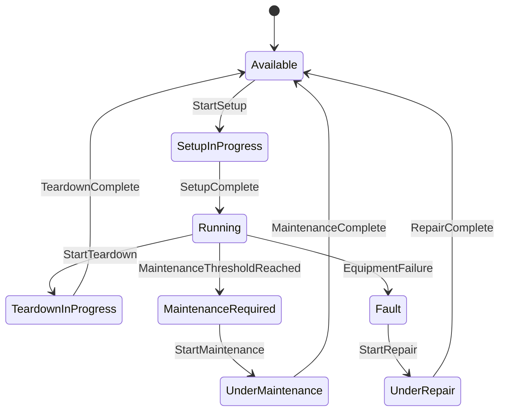

# Accountex Manufacturing Module Business Logic

## 1. Core Manufacturing Processes and Workflows

### 1.1 Work Order Creation and Management

#### Work Order Initialization Logic

- **Creation Methods**: System supports three primary creation pathways:
  - Manual creation with full parameter control
  - Copy from existing work order with automatic field population
  - Generation from open sales orders with quantity and specification inheritance
- **Master Item Configuration**: Each work order can contain unlimited master items with independent production parameters
- **Backorder Integration**: System automatically pulls backorder quantities from sales orders as default manufacturing quantities
- **Hold Management**: Work orders can be placed on hold status pending component availability

#### Work Order Structure

- **Multi-Level Job Hierarchy**: Each master item explodes into unlimited job levels with parent-child relationships
- **Step-Based Manufacturing**: Components assigned sequential step numbers matching actual production flow
- **Production Scheduling**: Support for multiple start dates and request dates per work order line item
- **Resource Allocation**: Automatic allocation of raw materials and subassemblies upon work order explosion

#### Work Order State Management

Work orders maintain the following state transitions:

- **Created** → **Exploded** → **WIP Posted** → **In Process** → **Finished** → **Closed**
- **Void States**: Can be voided entirely or up to specific step numbers
- **Amendment Capability**: Component lists modifiable after explosion
- **Status Tracking**: Real-time status monitoring through multiple report types

### 1.2 Bill of Materials (BOM) Handling

#### BOM Structure and Logic

- **Component Relationships**: Define ratio of component items required to produce one parent item unit
- **Resource Integration**: Machine and labor resources applied through BOM assignments
- **Version Control**: Multiple BOM versions maintained with change tracking and rollback capability
- **Production Rates**: Customizable labor and machine production rates per BOM

#### Component Management Rules

- **Component Types Supported**:
  - Inventory items (raw materials, subassemblies)
  - Machine resources with cost and time tracking
  - Labor resources with skill and rate management
  - Non-stock items for services and intangibles
- **Substitution Logic**: Multiple substitute items definable for each component
- **Step Assignment**: Components assigned to specific manufacturing steps for sequencing
- **Manufacturing Instructions**: Unlimited notes and instructions stored with each BOM

#### BOM Maintenance Logic

- **Dynamic Updates**: BOMs updatable without affecting existing work orders
- **Copy Functionality**: Components and entire BOMs copyable within or across companies
- **Batch Replacement**: Simultaneous replacement of specific components across multiple BOMs
- **Specification Integration**: Separate BOMs for each item specification combination

### 1.3 Work Order Explosion Process

#### Explosion Mechanics

- **Timing Options**:
  - Automatic explosion during work order creation
  - Deferred explosion for faster data entry
- **Multi-Level Processing**: System recursively explodes through unlimited levels
- **Job Hierarchy Generation**: Creates parent-child relationships for all components

#### Explosion Calculation Logic

```elixir
defmodule Accountex.Manufacturing.Explosion do
  def explode_work_order(work_order, master_item) do
    with {:ok, component_quantities} <- calculate_components(master_item, work_order.production_qty),
         {:ok, available} <- check_inventory_availability(component_quantities),
         {:ok, resources} <- calculate_resource_requirements(master_item, work_order.production_qty),
         {:ok, lead_times} <- calculate_lead_times(component_quantities),
         {:ok, job_hierarchy} <- generate_job_hierarchy(component_quantities, work_order) do
      {:ok, %{
        components: component_quantities,
        available_inventory: available,
        resource_requirements: resources,
        lead_time: lead_times,
        job_hierarchy: job_hierarchy
      }}
    end
  end

  defp calculate_components(item, production_qty) do
    item.bill_of_materials
    |> Enum.map(fn component ->
      %{
        item_id: component.item_id,
        required_qty: production_qty * component.ratio,
        step_number: component.step_number
      }
    end)
    |> then(&{:ok, &1})
  end
end
```

#### Explosion Control Features

- **Selective Explosion**: Can explode entire work orders or specific line items
- **Step-Level Control**: Explosion controllable to specific step numbers
- **Material Requirements Planning**: Automatic generation of material requirement projections
- **Subassembly Optimization**: System determines make vs. buy decisions for subassemblies

### 1.4 Work-in-Process (WIP) Posting

#### WIP Posting Logic

- **Posting Options**:
  - Automatic posting upon work order save
  - Manual posting for control
  - Step-by-step posting for gradual processing
  - Job-specific posting without affecting other jobs
- **Cost Application Methods**:
  - Actual cost: Apply actual material, labor, and machine costs
  - Standard cost: Apply predetermined standard costs
  - Hybrid: Actual costs for components, standard for finished items

#### WIP Accounting Rules

```elixir
defmodule Accountex.Manufacturing.WIP do
  def calculate_wip_value(work_order, cost_method) do
    materials = calculate_material_cost(work_order.components, cost_method)
    labor = calculate_labor_cost(work_order.labor_hours, work_order.labor_rate)
    machine = calculate_machine_cost(work_order.machine_hours, work_order.machine_rate)
    overhead = calculate_overhead(materials + labor + machine, work_order.overhead_method)
    
    %{
      materials: materials,
      labor: labor,
      machine: machine,
      overhead: overhead,
      total: materials + labor + machine + overhead
    }
  end
end
```

#### WIP State Management

- **Status Tracking**: Each work order maintains WIP status by component
- **Completion Estimates**: Calculate estimated completion based on historical data
- **Voiding Capability**: WIP voidable entirely or up to specific step numbers
- **General Ledger Integration**: Automatic journal entry generation for WIP transactions

### 1.5 Finished Job Posting

#### Job Completion Processing Logic

- **Completion Options**:
  - Complete entire work order with all subsidiary jobs
  - Selective job completion while others remain in process
  - Step-level completion with remaining components in WIP
  - Quality hold option before inventory release

#### Finished Goods Integration

```elixir
defmodule Accountex.Manufacturing.JobCompletion do
  def complete_job(job, options \\ []) do
    with :ok <- validate_prerequisites(job, options),
         {:ok, variance} <- calculate_cost_variance(job),
         {:ok, _} <- transfer_costs_to_finished_goods(job),
         {:ok, updated_inventory} <- update_inventory_levels(job),
         {:ok, serial_numbers} <- assign_serial_numbers(job, options[:require_serial]),
         {:ok, documentation} <- generate_completion_documents(job) do
      {:ok, %{
        job: job,
        variance: variance,
        inventory: updated_inventory,
        serial_numbers: serial_numbers,
        documentation: documentation
      }}
    end
  end
  
  defp validate_prerequisites(job, options) do
    unless options[:force_complete] do
      prerequisite_jobs_complete?(job)
    else
      :ok
    end
  end
end
```

#### Production Variance Analysis

- **Variance Tracking Components**:
  - Material variance = (Standard Qty × Standard Price) - (Actual Qty × Actual Price)
  - Labor variance = (Standard Hours × Standard Rate) - (Actual Hours × Actual Rate)
  - Overhead variance = Applied Overhead - Actual Overhead
- **Efficiency Metrics**: Track actual vs. expected performance

### 1.6 Multi-Level Manufacturing Components

#### Hierarchical Structure Management

- **Level Processing**: System maintains unlimited parent-child levels
- **Modular BOMs**: Subassemblies managed as independent reusable modules
- **Assembly Hierarchy**: Clear level designation for tracking
- **Dependency Management**: Cross-level dependencies tracked and validated

#### Nested BOM Processing Logic

```elixir
defmodule Accountex.Manufacturing.BOM do
  def explode_component(item, level, quantity) do
    case has_bom?(item) do
      false -> {:ok, []}
      true ->
        item.bill_of_materials
        |> Enum.flat_map(fn component ->
          required_qty = quantity * component.ratio
          
          with {:ok, _} <- allocate_inventory(component, required_qty),
               child_components <- if component.is_assembly do
                 {:ok, children} = explode_component(component, level + 1, required_qty)
                 children
               else
                 []
               end do
            [%{
              item: component,
              level: level,
              quantity: required_qty,
              children: child_components
            }]
          end
        end)
        |> then(&{:ok, &1})
    end
  end
end
```

#### Complex Product Management

- **Multi-Level Costing**: Costs propagate through all component levels
- **Lead Time Cascading**: Cumulative lead times calculated across levels
- **Resource Scheduling**: Machine and labor scheduled considering all levels
- **Selective Manufacturing**: Choose to manufacture or use existing inventory at each level

## 2. Master Data Management

### 2.1 Machine Records

#### Machine Record Structure

```elixir
defmodule Accountex.Manufacturing.Machine do
  use Ash.Resource,
    data_layer: AshPostgres.DataLayer

  attributes do
    uuid_primary_key :id
    attribute :machine_id, :string, allow_nil?: false
    attribute :description, :string
    attribute :production_rate, :decimal
    attribute :cost_per_hour, :decimal
    attribute :work_shifts, {:array, :string}
    attribute :setup_time, :integer
    attribute :teardown_time, :integer
    attribute :maintenance_schedule_hours, :integer
    attribute :current_utilization, :decimal
    attribute :availability_status, :atom do
      constraints one_of: [:available, :busy, :maintenance]
    end
  end
end
```

#### Machine Resource Logic

```elixir
defmodule Accountex.Manufacturing.MachineCapacity do
  def calculate_available_capacity(machine, shift_hours, efficiency_rate) do
    allocated_hours = get_allocated_hours(machine)
    (shift_hours - allocated_hours) * efficiency_rate
  end
  
  def calculate_machine_cost(machine, setup_time, production_time, teardown_time) do
    total_time = setup_time + production_time + teardown_time
    total_time * machine.cost_per_hour
  end
  
  def validate_availability(machine, requested_time) do
    available_capacity = calculate_available_capacity(machine, 8.0, 0.85)
    
    if requested_time <= available_capacity do
      :ok
    else
      {:error, :insufficient_capacity}
    end
  end
end
```

### 2.2 Labor Records

#### Labor Record Structure

```elixir
defmodule Accountex.Manufacturing.Labor do
  use Ash.Resource,
    data_layer: AshPostgres.DataLayer

  attributes do
    uuid_primary_key :id
    attribute :labor_id, :string, allow_nil?: false
    attribute :description, :string
    attribute :skill_level, :string
    attribute :standard_rate, :decimal
    attribute :overtime_rate, :decimal
    attribute :work_shifts, {:array, :string}
    attribute :current_allocation_hours, :decimal
    attribute :skills, {:array, :string}
    attribute :efficiency_factor, :decimal
  end
end
```

#### Labor Cost Application

```elixir
defmodule Accountex.Manufacturing.LaborCost do
  def calculate_labor_cost(labor, hours_worked, is_overtime) do
    rate = if is_overtime, do: labor.overtime_rate, else: labor.standard_rate
    hours_worked * rate * labor.efficiency_factor
  end
  
  def apply_overhead(labor_cost, overhead_method) do
    case overhead_method do
      {:percentage, percent} -> labor_cost * (1 + percent / 100)
      {:fixed_amount, amount} -> labor_cost + amount
    end
  end
  
  def validate_skill_requirements(labor, required_skills) do
    MapSet.subset?(
      MapSet.new(required_skills),
      MapSet.new(labor.skills)
    )
  end
end
```

### 2.3 Inventory Items with Manufacturing Capabilities

#### Manufacturing-Specific Fields

```elixir
defmodule Accountex.Manufacturing.Item do
  use Ash.Resource,
    data_layer: AshPostgres.DataLayer

  attributes do
    uuid_primary_key :id
    attribute :item_id, :string, allow_nil?: false
    attribute :description, :string
    attribute :item_type, :atom do
      constraints one_of: [:raw, :assembly, :finished, :non_stock]
    end
    attribute :manufacturing_lead_time_days, :integer
    attribute :safety_stock, :decimal
    attribute :reorder_point, :decimal
    attribute :reorder_quantity, :decimal
    attribute :cost_method, :atom do
      constraints one_of: [:standard, :average, :fifo, :lifo]
    end
    attribute :make_or_buy, :atom do
      constraints one_of: [:make, :buy, :either]
    end
    attribute :specifications, :map
    attribute :lot_controlled, :boolean, default: false
    attribute :serial_controlled, :boolean, default: false
  end

  relationships do
    has_many :bill_of_materials, Accountex.Manufacturing.BOMComponent
    has_many :substitute_items, Accountex.Manufacturing.SubstituteItem
  end
end
```

#### Manufacturing Item Validation Rules

```elixir
defmodule Accountex.Manufacturing.ItemValidation do
  def validate_item_type_consistency(item, bom_requirements) do
    case {item.item_type, bom_requirements} do
      {:raw, %{can_have_bom: true}} -> {:error, :raw_materials_cannot_have_bom}
      {:finished, %{must_be_component: true}} -> {:error, :finished_goods_cannot_be_component}
      _ -> :ok
    end
  end
  
  def validate_specification_match(item, required_specs) do
    required_specs
    |> Enum.all?(fn {key, value} ->
      Map.get(item.specifications, key) == value
    end)
    |> case do
      true -> :ok
      false -> {:error, :specification_mismatch}
    end
  end
end
```

### 2.4 Inventory Types for Manufacturing

#### Type-Specific Processing Rules

```elixir
defmodule Accountex.Manufacturing.ItemTypeProcessor do
  def process_by_type(item, operation) do
    case item.item_type do
      :raw -> process_raw_material(item, operation)
      :assembly -> process_subassembly(item, operation)
      :finished -> process_finished_good(item, operation)
      :non_stock -> process_non_stock(item, operation)
      _ -> {:error, :unknown_item_type}
    end
  end
  
  defp process_raw_material(item, :allocate) do
    # Vendor management with lead time tracking
    # Automatic allocation to work orders
    # Purchase order integration for replenishment
  end
  
  defp process_subassembly(item, :make_or_buy_decision) do
    cond do
      item.on_hand >= item.required_qty -> {:decision, :use_existing}
      item.make_or_buy == :make -> {:decision, :manufacture}
      item.make_or_buy == :buy -> {:decision, :purchase}
      true -> optimize_make_vs_buy(item)
    end
  end
end
```

### 2.5 System Remarks and Notes

#### Notes Management Structure

```elixir
defmodule Accountex.Manufacturing.SystemRemark do
  use Ash.Resource,
    data_layer: AshPostgres.DataLayer

  attributes do
    uuid_primary_key :id
    attribute :entity_type, :atom do
      constraints one_of: [:machine, :labor, :item, :work_order, :bom]
    end
    attribute :entity_id, :uuid
    attribute :note_type, :atom do
      constraints one_of: [:instruction, :warning, :information]
    end
    attribute :language, :string, default: "en"
    attribute :text, :text
    attribute :attachments, {:array, :string}
    attribute :propagate_to_documents, :boolean, default: false
    attribute :print_on_reports, :boolean, default: true
  end
end
```

## 3. Transaction Flows and State Management

### 3.1 Work Order Lifecycle States

#### State Transition Logic

```elixir
defmodule Accountex.Manufacturing.WorkOrderStateMachine do
  use Ash.Resource,
    data_layer: AshPostgres.DataLayer,
    extensions: [AshStateMachine]

  state_machine do
    initial_states [:created]
    default_initial_state :created

    transitions do
      transition :explode, from: :created, to: :exploded
      transition :post_wip, from: :exploded, to: :wip_posted
      transition :start_production, from: :wip_posted, to: :in_process
      transition :finish, from: :in_process, to: :finished
      transition :close, from: :finished, to: :closed
      transition :void, from: :*, to: :voided
    end
  end

  changes do
    change transition_state(:explode) do
      before_change fn changeset, _ ->
        validate_explosion_requirements(changeset)
      end
    end
    
    change transition_state(:finish) do
      before_change fn changeset, _ ->
        validate_all_jobs_complete(changeset)
      end
    end
  end
end
```

#### State Validation Rules

- Parent items cannot complete until child components finish
- WIP posting required before marking in-process
- Quality hold prevents automatic closure

### 3.2 Component Allocation and Consumption

#### Allocation Logic

```elixir
defmodule Accountex.Manufacturing.ComponentAllocation do
  def allocate_components(work_order) do
    work_order.components
    |> Enum.reduce_while({:ok, []}, fn component, {:ok, allocations} ->
      with {:ok, available_qty} <- get_available_inventory(component.item_id),
           required_qty <- calculate_requirement(component, work_order.quantity),
           {:ok, allocated} <- perform_allocation(component, required_qty, available_qty) do
        {:cont, {:ok, [allocated | allocations]}}
      else
        {:error, :insufficient_inventory} = error when not work_order.allow_overuse ->
          {:halt, error}
        {:error, :insufficient_inventory} ->
          allocated = %{component | allocated_qty: available_qty, shortage: required_qty - available_qty}
          {:cont, {:ok, [allocated | allocations]}}
      end
    end)
  end
  
  defp perform_allocation(component, required_qty, available_qty) do
    allocated = min(required_qty, available_qty)
    
    with :ok <- update_inventory_allocation(component.item_id, allocated) do
      {:ok, %{component | allocated_qty: allocated}}
    end
  end
end
```

#### Consumption Tracking

- **Real-time Updates**: Inventory levels adjusted immediately upon consumption
- **Scrap Recording**: Track waste and remnants during production
- **Lot Tracking**: Maintain lot genealogy through production

### 3.3 Resource Scheduling

#### Scheduling Algorithm

```elixir
defmodule Accountex.Manufacturing.ResourceScheduler do
  def schedule_resources(work_order) do
    work_order.jobs
    |> Enum.reduce({:ok, []}, fn job, {:ok, scheduled_jobs} ->
      with {:ok, machine_slot} <- find_machine_slot(job),
           {:ok, labor_slot} <- find_labor_slot(job),
           {:ok, scheduled_job} <- schedule_job(job, machine_slot, labor_slot) do
        {:ok, [scheduled_job | scheduled_jobs]}
      end
    end)
  end
  
  defp schedule_job(job, machine_slot, labor_slot) do
    scheduled_start = max(machine_slot.start, labor_slot.start)
    duration = max(machine_slot.duration, labor_slot.duration)
    
    job
    |> Map.put(:scheduled_start, scheduled_start)
    |> Map.put(:scheduled_end, DateTime.add(scheduled_start, duration, :minute))
    |> reserve_resources()
  end
  
  defp reserve_resources(job) do
    with :ok <- reserve_machine(job.machine_id, job.scheduled_start, job.scheduled_end),
         :ok <- reserve_labor(job.labor_id, job.scheduled_start, job.scheduled_end) do
      {:ok, job}
    end
  end
end
```

### 3.4 Cost Tracking and Variance

#### Cost Flow Logic

```elixir
defmodule Accountex.Manufacturing.CostFlow do
  defstruct [
    :material_cost,
    :labor_cost,
    :machine_cost,
    :overhead_cost,
    :total_cost
  ]
  
  def calculate_costs(work_order) do
    %__MODULE__{
      material_cost: sum_material_costs(work_order.components),
      labor_cost: sum_labor_costs(work_order.labor_entries),
      machine_cost: sum_machine_costs(work_order.machine_entries),
      overhead_cost: apply_overhead(work_order)
    }
    |> calculate_total()
  end
  
  def calculate_variance(standard_costs, actual_costs) do
    %{
      material: standard_costs.material_cost - actual_costs.material_cost,
      labor: standard_costs.labor_cost - actual_costs.labor_cost,
      overhead: standard_costs.overhead_cost - actual_costs.overhead_cost,
      total: standard_costs.total_cost - actual_costs.total_cost
    }
  end
  
  defp calculate_total(%__MODULE__{} = costs) do
    total = costs.material_cost + costs.labor_cost + costs.machine_cost + costs.overhead_cost
    %{costs | total_cost: total}
  end
end
```

## 4. Integration Points

### 4.1 Inventory Control Integration

#### Integration Logic

```elixir
defmodule Accountex.Manufacturing.InventoryIntegration do
  def handle_inventory_event(event) do
    case event do
      {:component_allocation, params} -> 
        reduce_available_quantity(params)
      
      {:wip_posting, params} -> 
        reduce_on_hand_quantity(params)
      
      {:job_completion, params} -> 
        increase_finished_goods_quantity(params)
      
      {:work_order_void, params} -> 
        reverse_inventory_transactions(params)
    end
  end
  
  defp reduce_available_quantity(%{item_id: item_id, quantity: qty}) do
    Accountex.Inventory.update_item(item_id, %{
      available_quantity: {:decrement, qty}
    })
  end
end
```

### 4.2 Sales Order Integration

#### Make-to-Order Logic

```elixir
defmodule Accountex.Manufacturing.SalesOrderIntegration do
  def create_work_order_from_sales_order(sales_order) do
    work_order_lines = 
      sales_order.line_items
      |> Enum.filter(fn item -> item.item.make_or_buy == :make end)
      |> Enum.map(fn line_item ->
        %{
          item_id: line_item.item_id,
          quantity: line_item.backorder_qty,
          request_date: line_item.required_date,
          sales_order_id: sales_order.id,
          sales_order_line_id: line_item.id
        }
      end)
    
    Accountex.Manufacturing.create_work_order(%{
      source: :sales_order,
      source_id: sales_order.id,
      lines: work_order_lines
    })
  end
end
```

### 4.3 Purchase Order Integration

#### Material Requirements Planning

```elixir
defmodule Accountex.Manufacturing.PurchaseIntegration do
  def generate_purchase_requirements(work_orders) do
    work_orders
    |> Enum.flat_map(&get_all_components/1)
    |> Enum.filter(fn component -> component.item.make_or_buy == :buy end)
    |> Enum.reduce(%{}, fn component, requirements ->
      net_requirement = calculate_net_requirement(component)
      
      if net_requirement > 0 do
        Map.update(requirements, component.item_id, net_requirement, &(&1 + net_requirement))
      else
        requirements
      end
    end)
    |> generate_purchase_orders()
  end
  
  defp calculate_net_requirement(component) do
    component.required_qty - component.available_qty
  end
end
```

### 4.4 General Ledger Integration

#### Journal Entry Generation

```elixir
defmodule Accountex.Manufacturing.GLIntegration do
  def post_manufacturing_transaction(transaction_type, params) do
    journal_entries = 
      case transaction_type do
        :wip_posting ->
          [
            %{account: :wip_inventory, debit: params.amount},
            %{account: :raw_materials_inventory, credit: params.amount}
          ]
        
        :labor_applied ->
          [
            %{account: :wip_inventory, debit: params.labor_amount},
            %{account: :labor_clearing, credit: params.labor_amount}
          ]
        
        :job_completion ->
          [
            %{account: :finished_goods_inventory, debit: params.finished_amount},
            %{account: :wip_inventory, credit: params.finished_amount}
          ]
        
        :variance_recognition ->
          variance_entries(params.variance)
      end
    
    Accountex.GeneralLedger.post_journal_entries(journal_entries)
  end
  
  defp variance_entries(variance) when variance > 0 do
    [
      %{account: :manufacturing_variance, debit: variance},
      %{account: :cost_of_goods_sold, credit: variance}
    ]
  end
  
  defp variance_entries(variance) do
    [
      %{account: :cost_of_goods_sold, debit: abs(variance)},
      %{account: :manufacturing_variance, credit: abs(variance)}
    ]
  end
end
```

### 4.5 Lot Control Integration

#### Lot Tracking Logic

```elixir
defmodule Accountex.Manufacturing.LotControl do
  defstruct [:component_lots, :finished_lot, :genealogy]
  
  def track_lot_usage(work_order) do
    component_lots = record_component_lots(work_order.components)
    finished_lot = generate_finished_lot(work_order)
    
    %__MODULE__{
      component_lots: component_lots,
      finished_lot: finished_lot,
      genealogy: build_genealogy_tree(component_lots, finished_lot)
    }
  end
  
  def build_genealogy_tree(component_lots, finished_lot) do
    %{
      lot_number: finished_lot.number,
      production_date: finished_lot.date,
      components: Enum.map(component_lots, fn lot ->
        %{
          lot_number: lot.number,
          item_id: lot.item_id,
          quantity_used: lot.quantity
        }
      end)
    }
  end
end
```

## 5. Business Rules and Validations

### 5.1 Manufacturing Quantity Calculations

#### Quantity Calculation Rules

```elixir
defmodule Accountex.Manufacturing.QuantityCalculator do
  def calculate_manufacturing_quantities(work_order, bom) do
    bom.components
    |> Enum.map(fn component ->
      gross_requirement = work_order.quantity * component.ratio
      scrap_factor = 1 + (component.scrap_percent / 100)
      net_requirement = Float.ceil(gross_requirement * scrap_factor)
      
      %{component | required_quantity: net_requirement}
    end)
  end
end
```

### 5.2 Component Availability Checking

#### Availability Validation

```elixir
defmodule Accountex.Manufacturing.AvailabilityValidator do
  def validate_component_availability(work_order, system_settings) do
    work_order.components
    |> Enum.reduce_while(:ok, fn component, :ok ->
      available_qty = calculate_available(component)
      
      cond do
        component.required_qty <= available_qty ->
          {:cont, :ok}
        
        system_settings.allow_overuse ->
          shortage = component.required_qty - available_qty
          {:cont, {:ok, :with_shortage, shortage}}
        
        true ->
          {:halt, {:error, {:insufficient_inventory, component.item_id}}}
      end
    end)
  end
  
  defp calculate_available(component) do
    component.on_hand - component.allocated + component.on_order
  end
end
```

### 5.3 Resource Capacity Planning

#### Capacity Validation

```elixir
defmodule Accountex.Manufacturing.CapacityValidator do
  def validate_resource_capacity(work_order) do
    with :ok <- validate_machine_capacity(work_order),
         :ok <- validate_labor_capacity(work_order) do
      :ok
    end
  end
  
  defp validate_machine_capacity(work_order) do
    work_order.machine_requirements
    |> Enum.reduce_while(:ok, fn {machine_id, required_hours}, :ok ->
      available_hours = get_available_capacity(
        machine_id,
        work_order.start_date,
        work_order.end_date
      )
      
      if required_hours <= available_hours do
        {:cont, :ok}
      else
        {:halt, {:error, {:insufficient_capacity, :machine, machine_id}}}
      end
    end)
  end
end
```

### 5.4 Cost Rollup Calculations

#### Cost Aggregation Logic

```elixir
defmodule Accountex.Manufacturing.CostRollup do
  def rollup_costs(item, level \\ 0) do
    case has_bom?(item) do
      false -> 
        %{material: 0, labor: 0, overhead: 0}
      
      true ->
        item.bill_of_materials
        |> Enum.reduce(%{material: 0, labor: 0, overhead: 0}, fn component, acc ->
          component_costs = 
            case component.type do
              :material ->
                %{material: component.quantity * component.unit_cost, labor: 0, overhead: 0}
              
              :labor ->
                %{material: 0, labor: component.hours * component.rate, overhead: 0}
              
              :machine ->
                %{material: 0, labor: 0, overhead: component.hours * component.rate}
            end
          
          sub_costs = 
            if is_assembly?(component) do
              rollup_costs(component, level + 1)
            else
              %{material: 0, labor: 0, overhead: 0}
            end
          
          %{
            material: acc.material + component_costs.material + sub_costs.material,
            labor: acc.labor + component_costs.labor + sub_costs.labor,
            overhead: acc.overhead + component_costs.overhead + sub_costs.overhead
          }
        end)
    end
  end
end
```

### 5.5 Production Scheduling Constraints

#### Scheduling Rules

```elixir
defmodule Accountex.Manufacturing.SchedulingConstraints do
  def validate_constraints(work_order) do
    with :ok <- validate_lead_time_constraint(work_order),
         :ok <- validate_resource_constraint(work_order),
         :ok <- validate_dependency_constraint(work_order),
         :ok <- validate_material_constraint(work_order) do
      :ok
    end
  end
  
  defp validate_lead_time_constraint(work_order) do
    finish_date = DateTime.add(work_order.start_date, work_order.manufacturing_lead_time, :day)
    
    if DateTime.compare(finish_date, work_order.required_date) == :lt do
      :ok
    else
      {:error, :lead_time_exceeds_requirement}
    end
  end
  
  defp validate_dependency_constraint(work_order) do
    # Child jobs must complete before parent jobs
    work_order.job_hierarchy
    |> validate_job_dependencies()
  end
end
```

## 6. Reporting and Analysis Requirements

### 6.1 Work Order Status Tracking

#### Status Report Generation

```elixir
defmodule Accountex.Manufacturing.Reports.WorkOrderStatus do
  def generate_report(filters) do
    work_orders = fetch_work_orders(filters)
    
    work_orders
    |> Enum.map(fn wo ->
      %{
        work_order_id: wo.id,
        item: wo.item.description,
        requested_qty: wo.requested_qty,
        in_process_qty: wo.in_process_qty,
        completed_qty: wo.completed_qty,
        status: wo.status,
        percent_complete: (wo.completed_qty / wo.requested_qty) * 100,
        days_in_process: Date.diff(Date.utc_today(), wo.start_date),
        estimated_completion: calculate_estimated_completion(wo)
      }
    end)
  end
  
  defp calculate_estimated_completion(work_order) do
    percent_remaining = (work_order.requested_qty - work_order.completed_qty) / work_order.requested_qty
    days_needed = work_order.standard_lead_time * percent_remaining
    Date.add(Date.utc_today(), trunc(days_needed))
  end
end
```

### 6.2 Material Requirements Planning

#### MRP Report Logic

```elixir
defmodule Accountex.Manufacturing.Reports.MRP do
  def generate_mrp_report(items, period) do
    items
    |> Enum.map(fn item ->
      gross_requirement = calculate_gross_requirements(item, period)
      scheduled_receipts = calculate_scheduled_receipts(item, period)
      projected_on_hand = item.current_on_hand + scheduled_receipts - gross_requirement
      
      net_requirement = 
        if projected_on_hand < item.safety_stock do
          item.safety_stock - projected_on_hand
        else
          0
        end
      
      planned_order = 
        if net_requirement > 0 do
          Float.ceil(net_requirement / item.order_quantity) * item.order_quantity
        else
          0
        end
      
      %{
        item_id: item.id,
        gross_requirement: gross_requirement,
        scheduled_receipts: scheduled_receipts,
        projected_on_hand: projected_on_hand,
        net_requirement: net_requirement,
        planned_order: planned_order
      }
    end)
  end
end
```

### 6.3 Resource Utilization Analysis

#### Utilization Metrics

```elixir
defmodule Accountex.Manufacturing.Reports.ResourceUtilization do
  def calculate_machine_utilization(machine, period) do
    allocated_hours = get_allocated_hours(machine, period)
    available_hours = get_available_hours(machine, period)
    standard_hours = get_standard_hours(machine, period)
    actual_hours = get_actual_hours(machine, period)
    
    %{
      machine_id: machine.id,
      utilization_rate: (allocated_hours / available_hours) * 100,
      efficiency: (standard_hours / actual_hours) * 100,
      downtime: calculate_downtime(machine, period)
    }
  end
  
  def calculate_labor_utilization(labor, period) do
    %{
      labor_id: labor.id,
      productive_hours: labor.direct_labor_hours / labor.total_hours,
      efficiency: labor.standard_hours / labor.actual_hours,
      overtime_percentage: (labor.overtime_hours / labor.total_hours) * 100
    }
  end
end
```

### 6.4 Production Variance Reporting

#### Variance Analysis

```elixir
defmodule Accountex.Manufacturing.Reports.Variance do
  def calculate_variances(work_order) do
    %{
      material: calculate_material_variance(work_order),
      labor: calculate_labor_variance(work_order),
      overhead: calculate_overhead_variance(work_order)
    }
  end
  
  defp calculate_material_variance(work_order) do
    price_variance = 
      (work_order.standard_price - work_order.actual_price) * work_order.actual_quantity
    
    quantity_variance = 
      (work_order.standard_quantity - work_order.actual_quantity) * work_order.standard_price
    
    %{
      price_variance: price_variance,
      quantity_variance: quantity_variance,
      total: price_variance + quantity_variance
    }
  end
  
  defp calculate_labor_variance(work_order) do
    rate_variance = 
      (work_order.standard_rate - work_order.actual_rate) * work_order.actual_hours
    
    efficiency_variance = 
      (work_order.standard_hours - work_order.actual_hours) * work_order.standard_rate
    
    %{
      rate_variance: rate_variance,
      efficiency_variance: efficiency_variance,
      total: rate_variance + efficiency_variance
    }
  end
end
```

### 6.5 WIP Tracking

#### WIP Analysis

```elixir
defmodule Accountex.Manufacturing.Reports.WIPTracking do
  def analyze_wip(date \\ Date.utc_today()) do
    wip_items = get_wip_items(date)
    
    %{
      total_value: calculate_total_wip_value(wip_items),
      aging: categorize_by_age(wip_items),
      turnover: calculate_wip_turnover(wip_items),
      days_in_wip: 365 / calculate_wip_turnover(wip_items)
    }
  end
  
  defp categorize_by_age(wip_items) do
    wip_items
    |> Enum.group_by(fn item ->
      days = Date.diff(Date.utc_today(), item.start_date)
      
      cond do
        days <= 30 -> :current
        days <= 60 -> :aged
        days <= 90 -> :old
        true -> :very_old
      end
    end)
    |> Enum.map(fn {category, items} ->
      {category, Enum.sum(Enum.map(items, & &1.value))}
    end)
    |> Map.new()
  end
end
```

### 6.6 Manufacturing Performance Metrics

#### KPI Calculations

```elixir
defmodule Accountex.Manufacturing.KPIs do
  def calculate_kpis(period) do
    %{
      first_pass_yield: calculate_first_pass_yield(period),
      oee: calculate_oee(period),
      manufacturing_cost_per_unit: calculate_cost_per_unit(period),
      on_time_delivery: calculate_on_time_delivery(period),
      scrap_rate: calculate_scrap_rate(period),
      inventory_turnover: calculate_inventory_turnover(period)
    }
  end
  
  def calculate_oee(period) do
    availability = calculate_availability(period)
    performance = calculate_performance(period)
    quality = calculate_quality(period)
    
    availability * performance * quality
  end
  
  defp calculate_availability(period) do
    run_time = get_run_time(period)
    planned_production_time = get_planned_production_time(period)
    run_time / planned_production_time
  end
  
  defp calculate_performance(period) do
    actual_output = get_actual_output(period)
    theoretical_output = get_theoretical_output(period)
    actual_output / theoretical_output
  end
  
  defp calculate_quality(period) do
    good_units = get_good_units(period)
    total_units = get_total_units(period)
    good_units / total_units
  end
end
```

## 7. System Configuration and Parameters

### 7.1 Global Manufacturing Settings

```elixir
defmodule Accountex.Manufacturing.Settings do
  use Ash.Resource,
    data_layer: AshPostgres.DataLayer

  attributes do
    uuid_primary_key :id
    attribute :allow_overuse_of_inventory, :boolean, default: false
    attribute :auto_explode_work_orders, :boolean, default: true
    attribute :auto_post_to_wip, :boolean, default: false
    attribute :default_cost_method, :atom do
      constraints one_of: [:standard, :average, :fifo, :lifo]
    end
    attribute :overhead_allocation_method, :atom do
      constraints one_of: [:percentage, :fixed_amount]
    end
    attribute :require_quality_approval, :boolean, default: false
    attribute :enable_multi_level_bom, :boolean, default: true
    attribute :max_bom_depth, :integer, default: 0  # 0 = unlimited
    attribute :default_manufacturing_lead_time_days, :integer, default: 7
    attribute :work_week_definition, :map  # days and hours
  end
end
```

### 7.2 Validation Parameters

```elixir
defmodule Accountex.Manufacturing.ValidationSettings do
  use Ash.Resource,
    data_layer: AshPostgres.DataLayer

  attributes do
    uuid_primary_key :id
    attribute :enforce_component_availability, :boolean, default: true
    attribute :validate_resource_capacity, :boolean, default: true
    attribute :require_approval_for_variance, :boolean, default: false
    attribute :variance_threshold_percent, :decimal, default: 10.0
    attribute :prevent_negative_inventory, :boolean, default: true
    attribute :require_serial_tracking, :boolean, default: false
    attribute :require_lot_tracking, :boolean, default: false
  end
end
```

## 8. Error Handling and Exception Management

### 8.1 Exception Types

```elixir
defmodule Accountex.Manufacturing.Exceptions do
  defmodule InsufficientInventoryError do
    defexception [:item_id, :required, :available, :message]
    
    def exception(opts) do
      %__MODULE__{
        item_id: opts[:item_id],
        required: opts[:required],
        available: opts[:available],
        message: "Insufficient inventory for item #{opts[:item_id]}: required #{opts[:required]}, available #{opts[:available]}"
      }
    end
  end
  
  defmodule ResourceCapacityError do
    defexception [:resource_id, :resource_type, :required_hours, :available_hours, :message]
  end
  
  defmodule CircularBOMError do
    defexception [:item_id, :path, :message]
    
    def exception(opts) do
      %__MODULE__{
        item_id: opts[:item_id],
        path: opts[:path],
        message: "Circular reference detected in BOM for item #{opts[:item_id]}: #{Enum.join(opts[:path], " -> ")}"
      }
    end
  end
  
  defmodule CostCalculationError do
    defexception [:item_id, :reason, :message]
  end
end
```

### 8.2 Transaction Rollback Logic

```elixir
defmodule Accountex.Manufacturing.TransactionRollback do
  def rollback_transaction(transaction) do
    case transaction.type do
      :work_order_explosion ->
        rollback_explosion(transaction)
      
      :wip_posting ->
        rollback_wip_posting(transaction)
      
      :job_completion ->
        rollback_job_completion(transaction)
      
      _ ->
        {:error, :unknown_transaction_type}
    end
  end
  
  defp rollback_explosion(transaction) do
    with :ok <- release_allocated_inventory(transaction.components),
         :ok <- delete_generated_jobs(transaction.jobs) do
      :ok
    end
  end
  
  defp rollback_wip_posting(transaction) do
    with :ok <- reverse_inventory_consumption(transaction.materials),
         :ok <- reverse_labor_application(transaction.labor),
         :ok <- reverse_gl_postings(transaction.journal_entries) do
      :ok
    end
  end
  
  defp rollback_job_completion(transaction) do
    with :ok <- reverse_inventory_increase(transaction.finished_goods),
         :ok <- restore_wip_balance(transaction.wip_reduction),
         :ok <- reverse_variance_postings(transaction.variances) do
      :ok
    end
  end
end
```

## 9. Audit and Compliance

### 9.1 Audit Trail Requirements

```elixir
defmodule Accountex.Manufacturing.AuditLog do
  use Ash.Resource,
    data_layer: AshPostgres.DataLayer

  attributes do
    uuid_primary_key :id
    attribute :transaction_id, :uuid
    attribute :transaction_type, :atom do
      constraints one_of: [:create, :update, :delete, :post]
    end
    attribute :entity_type, :atom do
      constraints one_of: [:work_order, :bom, :job, :component]
    end
    attribute :entity_id, :uuid
    attribute :user_id, :uuid
    attribute :timestamp, :utc_datetime_usec
    attribute :before_value, :map
    attribute :after_value, :map
    attribute :ip_address, :string
    attribute :reason_code, :string
  end
  
  calculations do
    calculate :changes, :map, fn record ->
      MapDiff.diff(record.before_value, record.after_value)
    end
  end
end
```

### 9.2 Compliance Controls

```elixir
defmodule Accountex.Manufacturing.ComplianceControls do
  def validate_lot_traceability(finished_lot) do
    # Complete genealogy from raw materials to finished goods
    genealogy = build_complete_genealogy(finished_lot)
    
    # Support for recalls and quality investigations
    affected_lots = trace_affected_lots(finished_lot)
    
    %{
      genealogy: genealogy,
      affected_lots: affected_lots,
      compliance_status: :compliant
    }
  end
  
  def validate_cost_accounting_compliance(work_order) do
    # GAAP-compliant inventory valuation
    # Proper WIP recognition and reporting
    %{
      valuation_method: work_order.cost_method,
      wip_recognition: :proper,
      gaap_compliant: true
    }
  end
  
  def enforce_quality_checkpoints(job) do
    required_checkpoints = get_required_checkpoints(job)
    completed_checkpoints = get_completed_checkpoints(job)
    
    MapSet.subset?(
      MapSet.new(required_checkpoints),
      MapSet.new(completed_checkpoints)
    )
  end
end
```

---

This comprehensive business logic document defines the core functionality and rules for the Accountex Manufacturing Module using Elixir and Ash framework patterns, providing a complete blueprint for implementation without any UI/UX considerations. The logic focuses on robust manufacturing control, flexible configuration, comprehensive reporting, and seamless integration with other Accountex modules.

# Manufacturing Application Business Logic

## Overview

The Manufacturing application manages the complete production lifecycle from work order creation through finished goods posting. It integrates with Inventory, Sales, and General Ledger applications to provide comprehensive production management capabilities.

## Core Aggregates

### 1. WorkOrder Aggregate

Represents a production request for one or more master items.

#### Commands

##### CreateWorkOrder

- **Input**:
  - work_order_number (optional if auto-generated)
  - order_date
  - request_date
  - warehouse_id
  - sales_order_id (optional)
  - customer_id (optional)
  - system_remark_id (optional)
  - remarks (optional)
  - on_hold (boolean)
  - explode_on_creation (boolean)
  - allow_multiple_request_dates (boolean)
  - master_items (list of items with quantities and request dates)

- **Validations**:
  - Warehouse must exist and be active
  - Sales order must exist if provided
  - Customer must exist if provided
  - Master items must have valid BOM records
  - Request dates must be future or current dates
  - Manufacturing quantities must be positive

- **Events Emitted**:
  - WorkOrderCreated
  - MasterItemAddedToWorkOrder (for each master item)
  - WorkOrderPlacedOnHold (if on_hold = true)

##### AmendWorkOrder

- **Input**:
  - work_order_id
  - updates (fields to update)
  - master_items_to_add (optional)
  - master_items_to_remove (optional)

- **Validations**:
  - Work order must exist and not be voided
  - Cannot amend if all jobs are posted to WIP
  - Cannot change manufacturing quantities for items in WIP
  - Cannot remove master items that are in process or finished

- **Events Emitted**:
  - WorkOrderAmended
  - MasterItemAddedToWorkOrder (for additions)
  - MasterItemRemovedFromWorkOrder (for removals)

##### VoidWorkOrder

- **Input**:
  - work_order_id
  - reason

- **Validations**:
  - Work order must exist
  - No items can be in WIP or finished status
  - Must void all WIP and finished jobs first

- **Events Emitted**:
  - WorkOrderVoided

##### PlaceWorkOrderOnHold

- **Input**:
  - work_order_id
  - reason

- **Validations**:
  - Work order must exist and not be voided
  - Work order must not already be on hold

- **Events Emitted**:
  - WorkOrderPlacedOnHold

##### ReleaseWorkOrderFromHold

- **Input**:
  - work_order_id

- **Validations**:
  - Work order must exist and be on hold

- **Events Emitted**:
  - WorkOrderReleasedFromHold

#### State

```elixir
%WorkOrder{
  id: UUID,
  work_order_number: String,
  order_date: Date,
  request_date: Date,
  warehouse_id: UUID,
  sales_order_id: UUID | nil,
  customer_id: UUID | nil,
  system_remark_id: UUID | nil,
  remarks: String,
  on_hold: boolean,
  exploded: boolean,
  allow_multiple_request_dates: boolean,
  master_items: [%MasterItem{}],
  jobs: [%Job{}],
  status: :draft | :exploded | :in_process | :completed | :voided
}
```

### 2. BillOfMaterials Aggregate

Manages the component structure for manufactured items.

#### Commands

##### CreateBillOfMaterials

- **Input**:
  - parent_item_id
  - components (list of component items with types and quantities)
  - instructions (optional)

- **Validations**:
  - Parent item must exist and be a manufactured item
  - Component items must exist
  - Quantities must be positive
  - Cannot create circular dependencies

- **Events Emitted**:
  - BillOfMaterialsCreated
  - ComponentAddedToBOM (for each component)

##### UpdateBillOfMaterials

- **Input**:
  - bom_id
  - components_to_add
  - components_to_update
  - components_to_remove
  - instructions (optional)

- **Validations**:
  - BOM must exist
  - Cannot update if used in active work orders
  - Must maintain valid component structure

- **Events Emitted**:
  - BillOfMaterialsUpdated
  - ComponentAddedToBOM
  - ComponentUpdatedInBOM
  - ComponentRemovedFromBOM

#### State

```elixir
%BillOfMaterials{
  id: UUID,
  parent_item_id: UUID,
  components: [%Component{}],
  instructions: String,
  active: boolean,
  revision_number: Integer
}

%Component{
  id: UUID,
  type: :inventory | :labor | :machine,
  component_id: UUID,
  quantity: Decimal | nil,
  time_required: Duration | nil,
  setup_time: Duration | nil,
  teardown_time: Duration | nil,
  work_shift_id: UUID | nil
}
```

### 3. WorkOrderExplosion Aggregate

Manages the explosion process that breaks down work orders into manufacturable jobs.

#### Commands

##### ExplodeWorkOrder

- **Input**:
  - work_order_id
  - explosion_options (substitute handling, subassembly options)

- **Validations**:
  - Work order must exist and not be exploded
  - All master items must have valid BOMs
  - Check inventory availability if configured
  - Check machine availability if configured
  - Validate substitute items if needed

- **Events Emitted**:
  - WorkOrderExplosionStarted
  - JobCreated (for each manufacturing job)
  - ComponentAllocated (for each component allocation)
  - SubstituteItemUsed (if substitutes applied)
  - WorkOrderExplosionCompleted

##### ExplodePartialWorkOrder

- **Input**:
  - work_order_id
  - master_item_ids (specific items to explode)

- **Validations**:
  - Work order must exist
  - Specified master items must not already be exploded
  - Same validation as full explosion for selected items

- **Events Emitted**:
  - PartialExplosionStarted
  - JobCreated
  - ComponentAllocated
  - PartialExplosionCompleted

#### State

```elixir
%WorkOrderExplosion{
  id: UUID,
  work_order_id: UUID,
  explosion_date: DateTime,
  jobs: [%Job{}],
  allocations: [%ComponentAllocation{}],
  explosion_levels: Integer,
  status: :in_progress | :completed | :failed
}

%Job{
  id: UUID,
  job_number: String,
  work_order_id: UUID,
  parent_item_id: UUID,
  level: Integer,
  manufacturing_quantity: Decimal,
  components: [%AllocatedComponent{}],
  status: :pending | :in_process | :finished | :voided
}
```

### 4. WorkInProcess Aggregate

Manages items currently being manufactured.

#### Commands

##### PostWorkInProcess

- **Input**:
  - posting_method (:entire_work_order | :by_work_order | :by_job)
  - work_order_id
  - job_id (if by_job)
  - master_item_id (if by_work_order)
  - start_date
  - post_date
  - wip_quantity
  - bin_id
  - component_allocations (bin and quantity overrides)

- **Validations**:
  - Work order must be exploded
  - Job must exist and not be in process
  - WIP quantity cannot exceed backorder quantity
  - Components must have sufficient availability
  - Check for serialized/lot-controlled items
  - Validate machine time availability

- **Events Emitted**:
  - WorkInProcessPosted
  - InventoryAllocated (for each component)
  - MachineTimeScheduled
  - LaborTimeScheduled
  - SerialNumbersAllocated (if applicable)
  - LotNumbersAllocated (if applicable)

##### VoidWorkInProcess

- **Input**:
  - wip_id
  - reason

- **Validations**:
  - WIP record must exist
  - No finished goods posted against this WIP
  - Must handle reversal of allocations

- **Events Emitted**:
  - WorkInProcessVoided
  - InventoryDeallocated
  - MachineTimeCancelled
  - LaborTimeCancelled

#### State

```elixir
%WorkInProcess{
  id: UUID,
  job_id: UUID,
  work_order_id: UUID,
  parent_item_id: UUID,
  start_date: Date,
  post_date: Date,
  wip_quantity: Decimal,
  bin_id: UUID,
  warehouse_id: UUID,
  allocated_components: [%AllocatedComponent{}],
  status: :in_process | :finished | :voided
}

%AllocatedComponent{
  component_type: :inventory | :labor | :machine,
  component_id: UUID,
  allocated_quantity: Decimal | nil,
  allocated_time: Duration | nil,
  bin_id: UUID | nil,
  serial_numbers: [String],
  lot_numbers: [String]
}
```

### 5. FinishedGoods Aggregate

Manages completed manufacturing jobs.

#### Commands

##### PostFinishedJob

- **Input**:
  - posting_method (:entire_work_order | :by_work_order | :by_job)
  - work_order_id
  - job_id (if by_job)
  - master_item_id (if by_work_order)
  - finish_date
  - post_date
  - finished_quantity
  - bin_id
  - overhead_cost (optional)
  - actual_component_usage (optional overrides)
  - release_to_inventory (boolean)

- **Validations**:
  - WIP must exist if WIP required
  - Finished quantity cannot exceed WIP quantity (if WIP required)
  - Components must be available for non-WIP postings
  - Validate serialized/lot-controlled items
  - Check for complete job closure

- **Events Emitted**:
  - FinishedJobPosted
  - InventoryIncreased (for finished items)
  - InventoryConsumed (for components)
  - WIPCompleted
  - WorkOrderCompleted (if all jobs finished)
  - OverheadCostApplied (if applicable)

##### VoidFinishedJob

- **Input**:
  - finished_job_id
  - reason

- **Validations**:
  - Finished job must exist
  - Finished items must still be in inventory
  - Must handle cost reversals

- **Events Emitted**:
  - FinishedJobVoided
  - InventoryReversed
  - CostReversed

#### State

```elixir
%FinishedGoods{
  id: UUID,
  job_id: UUID,
  work_order_id: UUID,
  parent_item_id: UUID,
  finish_date: Date,
  post_date: Date,
  finished_quantity: Decimal,
  bin_id: UUID,
  warehouse_id: UUID,
  overhead_cost: Decimal,
  total_cost: Decimal,
  component_costs: [%ComponentCost{}],
  released_to_inventory: boolean,
  status: :posted | :voided
}
```

## Business Rules

### Work Order Rules

1. **Work Order Number Generation**
   - Can be system-generated or manually entered
   - Must be unique within the system
   - Format configurable in module setup

2. **Master Item Requirements**
   - Must have active BOM before adding to work order
   - Cannot add inactive items
   - Serialized/lot-controlled items require special handling

3. **Hold Status Rules**
   - Work orders on hold cannot be posted to WIP
   - Can still be amended while on hold
   - Must release hold before processing

### Explosion Rules

1. **Component Availability**
   - Check on-hand quantities if configured
   - Allow overuse if configured
   - Handle substitute items when shortages occur

2. **Explosion Levels**
   - Support up to 999 levels of subassemblies
   - Each level represents parent-component relationship
   - Master item is always level 1

3. **Resource Allocation**
   - Inventory items reduce on-hand, increase allocated
   - Machine time checks time before overhaul
   - Labor time checks resource availability

### Work-In-Process Rules

1. **Posting Requirements**
   - Must explode before posting to WIP
   - Cannot post more than manufacturing quantity
   - Serialized items require serial number selection

2. **Partial Processing**
   - Can post partial quantities to WIP
   - Can process by entire order, by item, or by job
   - Once started by job, must continue by job

3. **Component Usage**
   - Can override allocated quantities
   - Must handle setup and teardown times
   - Work shift assignments affect scheduling

### Finished Goods Rules

1. **Completion Requirements**
   - WIP posting required if configured
   - Cannot finish more than WIP quantity (if required)
   - Must handle remaining WIP cancellation

2. **Inventory Release**
   - Optional immediate release to inventory
   - Released items cannot be modified
   - Unreleased allows additional posting

3. **Cost Calculation**
   - Component costs accumulated
   - Overhead calculation methods configurable
   - Total cost includes materials, labor, machine, overhead

## Integration Points

### Inventory Integration

1. **Component Availability**
   - Query current on-hand quantities
   - Check bin-level availability
   - Handle serial/lot number assignments

2. **Inventory Updates**
   - Reduce component quantities
   - Increase finished goods quantities
   - Update allocated quantities

3. **Events to Publish**
   - ComponentsAllocatedForManufacturing
   - FinishedGoodsProduced
   - ComponentsConsumedInProduction

### Sales Order Integration

1. **Work Order Creation**
   - Can create from sales order
   - Link maintains traceability
   - Updates sales order fulfillment status

2. **Events to Subscribe**
   - SalesOrderCreated (for auto work order creation)
   - SalesOrderItemShipped (for completion tracking)

3. **Events to Publish**
   - ManufacturingStartedForSalesOrder
   - ManufacturingCompletedForSalesOrder

### General Ledger Integration

1. **Cost Posting**
   - WIP account postings
   - Finished goods account postings
   - Cost of goods sold calculations

2. **Events to Publish**
   - WorkInProcessCostPosted
   - FinishedGoodsCostPosted
   - ManufacturingVarianceCalculated

### Machine Maintenance Integration

1. **Machine Availability**
   - Check time before overhaul
   - Track machine usage hours
   - Schedule maintenance windows

2. **Events to Subscribe**
   - MachineMaintenanceScheduled
   - MachineStatusChanged

3. **Events to Publish**
   - MachineTimeConsumed
   - MaintenanceThresholdApproaching

## Configuration Requirements

### Module Setup Parameters

1. **Work Order Configuration**
   - Auto-generate work order numbers
   - Allow creation from sales orders
   - Multiple request date handling
   - Default explosion behavior

2. **Inventory Configuration**
   - Check on-hand quantities
   - Allow inventory overuse
   - Use available subassembly quantities
   - Substitute item handling

3. **Processing Configuration**
   - Require WIP for finished jobs
   - Prompt for WIP posting
   - Overhead cost calculation method
   - Machine time validation

4. **Printing Configuration**
   - Work order formats
   - Routing slip options
   - Production slip settings

## Workflow Sequences

### Standard Manufacturing Flow

1. **Create Work Order**
   - Add master items with quantities
   - Set request dates
   - Optional link to sales order

2. **Explode Work Order**
   - Generate jobs for all levels
   - Allocate components
   - Handle substitutions if needed

3. **Post Work-In-Process**
   - Select posting method
   - Allocate specific bins
   - Handle serial/lot numbers

4. **Post Finished Job**
   - Record actual quantities
   - Apply overhead costs
   - Release to inventory

### Partial Processing Flow

1. **Selective Explosion**
   - Choose specific master items
   - Generate jobs for selection only

2. **Job-Level Processing**
   - Post individual jobs to WIP
   - Complete jobs independently
   - Maintain job sequence integrity

### Amendment Flow

1. **Amend Work Order**
   - Add/remove master items
   - Change quantities (if not in WIP)
   - Update dates and remarks

2. **Re-explode if Needed**
   - New items require explosion
   - Maintain existing job numbers

## Error Handling

### Validation Failures

1. **Insufficient Inventory**
   - Option to use substitutes
   - Option to overuse
   - Option to place on hold

2. **Resource Conflicts**
   - Machine unavailability
   - Labor conflicts
   - Time constraint violations

3. **Recovery Procedures**
   - Void and restart transactions
   - Partial completion options
   - Hold for resolution

## Audit and Tracking

### Transaction History

1. **Work Order Changes**
   - Creation and amendments
   - Status changes
   - User and timestamp tracking

2. **Production Tracking**
   - WIP posting history
   - Completion records
   - Cost accumulation trail

3. **Component Usage**
   - Planned vs actual usage
   - Variance tracking
   - Efficiency metrics

## Performance Considerations

1. **Explosion Optimization**
   - Cache BOM structures
   - Batch component checks
   - Parallel job generation

2. **Inventory Updates**
   - Batch allocation updates
   - Optimistic locking for quantities
   - Queue for GL postings

3. **Query Optimization**
   - Index on work order status
   - Composite index on job hierarchy
   - Materialized views for cost rollups

# Manufacturing Business Logic - Part 3 (Chapters 6-8)

## Chapter 6: Posting Finished Jobs

### 6.1 Business Rules and Validations

#### 6.1.1 Pre-Completion Validations

**Required Conditions for Job Completion:**

1. **Work Order Status Validation**
   - Work order must be in "Released" or "In Process" status
   - Cannot complete work orders in "Planned", "Cancelled", or "Closed" status
   - Technical completion flag must not be set

2. **Operation Confirmation Requirements**
   - All required operations must have confirmation entries
   - Operation quantities must match or fall within tolerance limits
   - Labor and machine time must be recorded for time-tracked operations
   - Quality checkpoints must be passed for quality-controlled operations

3. **Quantity Validations**

   ```elixir
   defmodule Manufacturing.Validations.CompletionQuantity do
     def validate_completion_quantity(work_order, completion_qty) do
       with {:ok, _} <- check_minimum_quantity(work_order, completion_qty),
            {:ok, _} <- check_maximum_quantity(work_order, completion_qty),
            {:ok, _} <- check_tolerance_limits(work_order, completion_qty) do
         :ok
       end
     end
     
     defp check_maximum_quantity(%{allow_over_completion: false} = order, qty) do
       max_qty = order.planned_quantity - order.completed_quantity
       if qty <= max_qty, do: {:ok, qty}, else: {:error, :exceeds_order_quantity}
     end
   end
   ```

4. **Component Availability for Backflush**
   - Verify sufficient component inventory for backflush consumption
   - Check reserved materials match requirements
   - Validate substitute materials if primary components unavailable

#### 6.1.2 Cost Validation Rules

**Cost Component Verification:**

```elixir
defmodule Manufacturing.Costing.ValidationRules do
  def validate_cost_components(work_order) do
    %{
      material_costs: validate_material_costs(work_order),
      labor_costs: validate_labor_costs(work_order),
      overhead_costs: calculate_overhead_allocation(work_order),
      total_validation: validate_total_cost_reasonableness(work_order)
    }
  end
  
  defp validate_material_costs(work_order) do
    # Ensure all issued materials have valid costs
    # Check for negative costs or missing cost data
    # Validate against standard costs if using standard costing
  end
  
  defp validate_total_cost_reasonableness(work_order) do
    # Check if total costs fall within expected range
    # Flag significant variances for review
    # Ensure minimum cost thresholds are met
  end
end
```

### 6.2 Commands

#### 6.2.1 Core Completion Commands

```elixir
defmodule Manufacturing.Commands.JobCompletion do
  defmodule CompleteWorkOrder do
    @enforce_keys [:work_order_id, :completed_by, :completion_date, 
                   :completion_quantity, :completion_type]
    defstruct [
      :work_order_id,
      :completed_by,
      :completion_date,
      :completion_quantity,
      :scrap_quantity,
      :completion_type, # :full | :partial
      :quality_data,
      :serial_numbers,
      :lot_numbers,
      :location_id,
      :notes
    ]
  end
  
  defmodule PostFinishedGoods do
    @enforce_keys [:work_order_id, :item_id, :quantity, :location_id]
    defstruct [
      :work_order_id,
      :item_id,
      :quantity,
      :location_id,
      :batch_number,
      :serial_numbers,
      :expiry_date,
      :quality_certificate,
      :cost_data,
      :posting_date
    ]
  end
  
  defmodule ConsumeMaterials do
    @enforce_keys [:work_order_id, :materials]
    defstruct [
      :work_order_id,
      :materials, # List of {item_id, quantity, lot_number}
      :consumption_type, # :backflush | :manual
      :transaction_date,
      :issued_by
    ]
  end
  
  defmodule AllocateOverhead do
    @enforce_keys [:work_order_id, :overhead_amount, :allocation_base]
    defstruct [
      :work_order_id,
      :overhead_amount,
      :allocation_base, # :labor_hours | :machine_hours | :material_cost
      :cost_pools,
      :allocation_date
    ]
  end
  
  defmodule CalculateVariances do
    @enforce_keys [:work_order_id, :variance_type]
    defstruct [
      :work_order_id,
      :variance_type, # :material | :labor | :overhead | :all
      :standard_costs,
      :actual_costs,
      :calculation_date
    ]
  end
end
```

### 6.3 Events

#### 6.3.1 Completion Events

```elixir
defmodule Manufacturing.Events.JobCompletion do
  defmodule WorkOrderCompleted do
    @derive Jason.Encoder
    defstruct [
      :work_order_id,
      :completion_id,
      :completed_by,
      :completion_date,
      :completion_quantity,
      :scrap_quantity,
      :completion_type,
      :final_costs,
      :quality_metrics,
      :timestamp
    ]
  end
  
  defmodule FinishedGoodsPosted do
    @derive Jason.Encoder
    defstruct [
      :posting_id,
      :work_order_id,
      :item_id,
      :quantity,
      :location_id,
      :batch_number,
      :serial_numbers,
      :unit_cost,
      :total_value,
      :gl_entries,
      :posted_at
    ]
  end
  
  defmodule MaterialsConsumed do
    @derive Jason.Encoder
    defstruct [
      :consumption_id,
      :work_order_id,
      :materials, # [{item_id, quantity, cost, lot_number}]
      :consumption_type,
      :total_material_cost,
      :consumed_at
    ]
  end
  
  defmodule VariancesCalculated do
    @derive Jason.Encoder
    defstruct [
      :work_order_id,
      :material_variance,
      :labor_variance,
      :overhead_variance,
      :total_variance,
      :variance_accounts,
      :calculated_at
    ]
  end
  
  defmodule WIPRelieved do
    @derive Jason.Encoder
    defstruct [
      :work_order_id,
      :wip_account,
      :relief_amount,
      :cost_components,
      :gl_entries,
      :relieved_at
    ]
  end
end
```

### 6.4 Workflows

#### 6.4.1 Job Completion Workflow

```elixir
defmodule Manufacturing.Workflows.JobCompletion do
  use Commanded.ProcessManagers.ProcessManager,
    name: "JobCompletionWorkflow",
    router: Manufacturing.Router
    
  defstruct [
    :work_order_id,
    :status,
    :materials_consumed,
    :goods_posted,
    :variances_calculated,
    :gl_posted
  ]
  
  def handle(%__MODULE__{status: :initiated} = state, %WorkOrderCompleted{} = event) do
    [
      %ConsumeMaterials{
        work_order_id: event.work_order_id,
        materials: calculate_material_consumption(event),
        consumption_type: :backflush
      },
      %PostFinishedGoods{
        work_order_id: event.work_order_id,
        item_id: get_finished_item_id(event),
        quantity: event.completion_quantity,
        location_id: get_default_location(event)
      }
    ]
  end
  
  def handle(%__MODULE__{} = state, %MaterialsConsumed{} = event) do
    state = %{state | materials_consumed: true}
    if ready_for_variance_calculation?(state) do
      %CalculateVariances{
        work_order_id: event.work_order_id,
        variance_type: :all
      }
    else
      []
    end
  end
  
  def handle(%__MODULE__{} = state, %FinishedGoodsPosted{} = event) do
    state = %{state | goods_posted: true}
    
    [
      %AllocateOverhead{
        work_order_id: event.work_order_id,
        overhead_amount: calculate_overhead(event),
        allocation_base: get_allocation_base()
      },
      %UpdateInventoryLevels{
        item_id: event.item_id,
        location_id: event.location_id,
        quantity: event.quantity,
        transaction_type: :production_receipt
      }
    ]
  end
  
  def handle(%__MODULE__{} = state, %VariancesCalculated{} = event) do
    %PostToGeneralLedger{
      source: :manufacturing,
      work_order_id: event.work_order_id,
      journal_entries: build_journal_entries(event),
      posting_date: Date.utc_today()
    }
  end
end
```

#### 6.4.2 Cost Rollup Process

```elixir
defmodule Manufacturing.Workflows.CostRollup do
  def execute_cost_rollup(work_order_id) do
    with {:ok, work_order} <- get_work_order(work_order_id),
         {:ok, material_costs} <- calculate_material_costs(work_order),
         {:ok, labor_costs} <- calculate_labor_costs(work_order),
         {:ok, overhead_costs} <- allocate_overhead(work_order),
         {:ok, total_costs} <- sum_cost_components(material_costs, labor_costs, overhead_costs) do
      
      %WorkOrderCosts{
        work_order_id: work_order_id,
        material: material_costs,
        labor: labor_costs,
        overhead: overhead_costs,
        total: total_costs,
        unit_cost: total_costs / work_order.completion_quantity
      }
    end
  end
  
  defp allocate_overhead(work_order) do
    base_value = case work_order.overhead_base do
      :labor_hours -> work_order.total_labor_hours
      :machine_hours -> work_order.total_machine_hours
      :material_cost -> work_order.material_costs
    end
    
    overhead_rate = get_overhead_rate(work_order.cost_center)
    {:ok, base_value * overhead_rate}
  end
end
```

### 6.5 Integration Points

#### 6.5.1 Inventory Module Integration

```elixir
defmodule Manufacturing.Integration.Inventory do
  def update_inventory_for_completion(completion_event) do
    # Relieve WIP inventory
    Inventory.Commands.dispatch(%Inventory.Commands.CreateTransaction{
      transaction_type: :wip_relief,
      item_id: completion_event.wip_item_id,
      quantity: -completion_event.wip_quantity,
      reference: "WO-#{completion_event.work_order_id}",
      cost: completion_event.wip_cost
    })
    
    # Increase finished goods
    Inventory.Commands.dispatch(%Inventory.Commands.CreateTransaction{
      transaction_type: :production_receipt,
      item_id: completion_event.finished_item_id,
      quantity: completion_event.completion_quantity,
      location_id: completion_event.location_id,
      batch_number: completion_event.batch_number,
      serial_numbers: completion_event.serial_numbers,
      unit_cost: completion_event.unit_cost
    })
  end
  
  def handle_serial_number_assignment(work_order_id, serial_numbers) do
    # Register serial numbers in inventory tracking
    Enum.each(serial_numbers, fn serial ->
      Inventory.SerialTracking.register(%{
        serial_number: serial,
        item_id: get_finished_item(work_order_id),
        source: :manufacturing,
        source_ref: work_order_id,
        status: :available
      })
    end)
  end
end
```

#### 6.5.2 General Ledger Integration

```elixir
defmodule Manufacturing.Integration.GeneralLedger do
  def post_completion_entries(completion_data) do
    journal_entries = [
      # Debit Finished Goods
      %GL.JournalEntry{
        account: get_finished_goods_account(completion_data.item_id),
        debit: completion_data.total_cost,
        credit: 0,
        description: "Production completion - WO #{completion_data.work_order_id}"
      },
      # Credit WIP accounts
      %GL.JournalEntry{
        account: get_wip_material_account(),
        debit: 0,
        credit: completion_data.material_cost,
        description: "WIP Material relief - WO #{completion_data.work_order_id}"
      },
      %GL.JournalEntry{
        account: get_wip_labor_account(),
        debit: 0,
        credit: completion_data.labor_cost,
        description: "WIP Labor relief - WO #{completion_data.work_order_id}"
      },
      %GL.JournalEntry{
        account: get_wip_overhead_account(),
        debit: 0,
        credit: completion_data.overhead_cost,
        description: "WIP Overhead relief - WO #{completion_data.work_order_id}"
      }
    ]
    
    # Add variance entries if applicable
    variance_entries = create_variance_entries(completion_data)
    
    GL.Commands.dispatch(%GL.Commands.CreateJournalEntry{
      entries: journal_entries ++ variance_entries,
      source: :manufacturing,
      reference: completion_data.work_order_id,
      posting_date: completion_data.completion_date
    })
  end
end
```

## Chapter 7: Manufacturing Reports

### 7.1 Report Definitions and Business Requirements

#### 7.1.1 Production Reports

```elixir
defmodule Manufacturing.Reports.Production do
  use Manufacturing.Reports.Base
  
  defmodule DailyProductionSummary do
    @behaviour Manufacturing.Reports.ReportBehaviour
    
    def generate(params) do
      %{
        report_date: params.date,
        production_metrics: calculate_production_metrics(params),
        efficiency_indicators: calculate_efficiency(params),
        quality_metrics: calculate_quality_metrics(params),
        variance_summary: calculate_variances(params)
      }
    end
    
    defp calculate_production_metrics(params) do
      %{
        planned_quantity: get_planned_quantity(params.date),
        actual_quantity: get_actual_quantity(params.date),
        attainment_percentage: calculate_attainment(),
        units_per_hour: calculate_throughput(),
        oee: calculate_oee()
      }
    end
  end
  
  defmodule WorkOrderStatusReport do
    def generate(filters \\ %{}) do
      work_orders = fetch_work_orders(filters)
      
      %{
        summary: %{
          total: length(work_orders),
          planned: count_by_status(work_orders, :planned),
          in_progress: count_by_status(work_orders, :in_progress),
          completed: count_by_status(work_orders, :completed),
          overdue: count_overdue(work_orders)
        },
        details: Enum.map(work_orders, &format_work_order/1),
        aging: calculate_aging(work_orders),
        bottlenecks: identify_bottlenecks(work_orders)
      }
    end
  end
end
```

#### 7.1.2 Cost Analysis Reports

```elixir
defmodule Manufacturing.Reports.CostAnalysis do
  defmodule VarianceReport do
    def generate(period) do
      %{
        material_variances: calculate_material_variances(period),
        labor_variances: calculate_labor_variances(period),
        overhead_variances: calculate_overhead_variances(period),
        summary: aggregate_variances(period),
        trends: analyze_variance_trends(period)
      }
    end
    
    defp calculate_material_variances(period) do
      work_orders = get_completed_orders(period)
      
      Enum.map(work_orders, fn order ->
        %{
          work_order_id: order.id,
          price_variance: calculate_price_variance(order),
          usage_variance: calculate_usage_variance(order),
          mix_variance: calculate_mix_variance(order),
          total_variance: calculate_total_material_variance(order)
        }
      end)
    end
    
    defp calculate_price_variance(order) do
      # (Actual Price - Standard Price) × Actual Quantity
      actual_cost = order.actual_material_cost
      standard_cost = order.standard_material_cost * order.actual_material_quantity / order.standard_material_quantity
      actual_cost - standard_cost
    end
  end
  
  defmodule UnitCostReport do
    def generate(item_id, period) do
      %{
        item_id: item_id,
        period: period,
        standard_cost: get_standard_cost(item_id),
        actual_costs: calculate_actual_costs(item_id, period),
        cost_trends: analyze_cost_trends(item_id, period),
        cost_drivers: identify_cost_drivers(item_id, period),
        recommendations: generate_cost_recommendations(item_id)
      }
    end
  end
end
```

#### 7.1.3 Efficiency Reports

```elixir
defmodule Manufacturing.Reports.Efficiency do
  defmodule MachineUtilization do
    def generate(params) do
      machines = get_machines(params.plant_id)
      
      Enum.map(machines, fn machine ->
        %{
          machine_id: machine.id,
          machine_name: machine.name,
          available_time: calculate_available_time(machine, params.period),
          productive_time: calculate_productive_time(machine, params.period),
          downtime: calculate_downtime(machine, params.period),
          utilization_rate: calculate_utilization_rate(machine, params.period),
          oee: calculate_machine_oee(machine, params.period),
          downtime_reasons: analyze_downtime_reasons(machine, params.period)
        }
      end)
    end
  end
  
  defmodule LaborEfficiency do
    def generate(params) do
      %{
        period: params.period,
        department: params.department,
        efficiency_metrics: %{
          standard_hours: calculate_standard_hours(params),
          actual_hours: calculate_actual_hours(params),
          efficiency_percentage: calculate_efficiency_percentage(params),
          productivity_rate: calculate_productivity_rate(params)
        },
        by_employee: calculate_employee_efficiency(params),
        by_operation: calculate_operation_efficiency(params),
        overtime_analysis: analyze_overtime(params)
      }
    end
  end
end
```

### 7.2 Report Generation Commands and Events

```elixir
defmodule Manufacturing.Reports.Commands do
  defmodule GenerateReport do
    @enforce_keys [:report_type, :parameters, :requested_by]
    defstruct [
      :report_type,
      :parameters,
      :requested_by,
      :format, # :pdf | :excel | :json
      :delivery_method, # :email | :download | :api
      :schedule # nil for immediate, cron expression for scheduled
    ]
  end
  
  defmodule ScheduleReport do
    @enforce_keys [:report_type, :schedule, :recipients]
    defstruct [
      :report_type,
      :schedule, # cron expression
      :parameters,
      :recipients,
      :format,
      :active
    ]
  end
end

defmodule Manufacturing.Reports.Events do
  defmodule ReportGenerated do
    @derive Jason.Encoder
    defstruct [
      :report_id,
      :report_type,
      :generated_at,
      :generated_by,
      :file_location,
      :format,
      :parameters
    ]
  end
  
  defmodule ReportScheduled do
    @derive Jason.Encoder
    defstruct [
      :schedule_id,
      :report_type,
      :schedule,
      :created_by,
      :created_at
    ]
  end
end
```

### 7.3 Report Data Aggregation

```elixir
defmodule Manufacturing.Reports.Aggregation do
  def aggregate_production_data(filters) do
    from(wo in WorkOrder,
      left_join: op in Operation, on: op.work_order_id == wo.id,
      left_join: qc in QualityCheck, on: qc.work_order_id == wo.id,
      where: ^apply_filters(filters),
      group_by: [wo.item_id, wo.work_center_id],
      select: %{
        item_id: wo.item_id,
        work_center_id: wo.work_center_id,
        total_quantity: sum(wo.completion_quantity),
        total_scrap: sum(wo.scrap_quantity),
        avg_cycle_time: avg(op.actual_time),
        quality_rate: avg(qc.pass_rate),
        period: ^filters.period
      }
    )
    |> Repo.all()
  end
  
  def calculate_kpis(period) do
    %{
      oee: calculate_overall_oee(period),
      first_pass_yield: calculate_fpy(period),
      cycle_time: calculate_average_cycle_time(period),
      inventory_turns: calculate_inventory_turns(period),
      on_time_delivery: calculate_otd(period),
      cost_per_unit: calculate_unit_costs(period)
    }
  end
end
```

## Chapter 8: Maintaining Master Records

### 8.1 Machine Master Maintenance

#### 8.1.1 Commands and Events

```elixir
defmodule Manufacturing.MasterData.Machine.Commands do
  defmodule CreateMachine do
    @enforce_keys [:machine_code, :machine_name, :work_center_id]
    defstruct [
      :machine_code,
      :machine_name,
      :description,
      :work_center_id,
      :capacity_per_hour,
      :setup_time,
      :hourly_rate,
      :efficiency_factor,
      :maintenance_schedule
    ]
  end
  
  defmodule UpdateMachine do
    @enforce_keys [:machine_id]
    defstruct [
      :machine_id,
      :machine_name,
      :description,
      :capacity_per_hour,
      :hourly_rate,
      :efficiency_factor,
      :maintenance_schedule,
      :active
    ]
  end
  
  defmodule AssignMachineToWorkCenter do
    @enforce_keys [:machine_id, :work_center_id]
    defstruct [
      :machine_id,
      :work_center_id,
      :effective_date,
      :primary_machine
    ]
  end
end

defmodule Manufacturing.MasterData.Machine.Events do
  defmodule MachineCreated do
    @derive Jason.Encoder
    defstruct [
      :machine_id,
      :machine_code,
      :machine_name,
      :work_center_id,
      :capacity_per_hour,
      :created_at,
      :created_by
    ]
  end
  
  defmodule MachineUpdated do
    @derive Jason.Encoder
    defstruct [
      :machine_id,
      :changes,
      :updated_at,
      :updated_by
    ]
  end
end
```

#### 8.1.2 Machine Resource Definition

```elixir
defmodule Manufacturing.Resources.Machine do
  use Ash.Resource,
    domain: Manufacturing.Domain,
    data_layer: AshPostgres.DataLayer
    
  postgres do
    table "machines"
    repo Manufacturing.Repo
  end
  
  attributes do
    uuid_primary_key :id
    
    attribute :machine_code, :string, allow_nil?: false
    attribute :machine_name, :string, allow_nil?: false
    attribute :description, :string
    attribute :machine_type, :atom, constraints: [one_of: [:production, :packaging, :quality, :auxiliary]]
    
    # Capacity attributes
    attribute :capacity_per_hour, :decimal
    attribute :capacity_unit, :string
    attribute :efficiency_factor, :decimal, default: 1.0
    attribute :utilization_target, :decimal
    
    # Cost attributes
    attribute :hourly_rate, :decimal
    attribute :setup_cost, :decimal
    attribute :overhead_rate, :decimal
    
    # Maintenance
    attribute :maintenance_schedule, :map
    attribute :last_maintenance_date, :date
    attribute :next_maintenance_date, :date
    
    attribute :active, :boolean, default: true
    
    timestamps()
  end
  
  relationships do
    belongs_to :work_center, Manufacturing.Resources.WorkCenter
    has_many :operations, Manufacturing.Resources.Operation
    has_many :downtime_records, Manufacturing.Resources.MachineDowntime
  end
  
  validations do
    validate compare(:efficiency_factor, greater_than: 0, less_than_or_equal_to: 1)
    validate compare(:capacity_per_hour, greater_than: 0)
    validate compare(:hourly_rate, greater_than_or_equal_to: 0)
  end
  
  calculations do
    calculate :current_utilization, :decimal do
      # Calculate based on recent operations
    end
    
    calculate :mtbf, :decimal do
      # Mean Time Between Failures
    end
  end
end
```

### 8.2 Labor Master Maintenance

#### 8.2.1 Labor Categories and Skills

```elixir
defmodule Manufacturing.MasterData.Labor.Commands do
  defmodule CreateLaborCategory do
    @enforce_keys [:category_code, :category_name, :skill_level]
    defstruct [
      :category_code,
      :category_name,
      :description,
      :skill_level, # :apprentice | :skilled | :expert | :master
      :standard_rate,
      :overtime_rate,
      :shift_differentials,
      :required_certifications
    ]
  end
  
  defmodule AssignLaborToWorkCenter do
    @enforce_keys [:employee_id, :work_center_id, :labor_category_id]
    defstruct [
      :employee_id,
      :work_center_id,
      :labor_category_id,
      :effective_date,
      :expiry_date,
      :primary_assignment
    ]
  end
  
  defmodule UpdateLaborEfficiency do
    @enforce_keys [:employee_id, :efficiency_rating]
    defstruct [
      :employee_id,
      :efficiency_rating,
      :evaluation_date,
      :evaluated_by,
      :notes
    ]
  end
end
```

#### 8.2.2 Labor Resource Definition

```elixir
defmodule Manufacturing.Resources.LaborCategory do
  use Ash.Resource,
    domain: Manufacturing.Domain,
    data_layer: AshPostgres.DataLayer
    
  attributes do
    uuid_primary_key :id
    
    attribute :category_code, :string, allow_nil?: false
    attribute :category_name, :string, allow_nil?: false
    attribute :description, :string
    attribute :skill_level, :atom
    
    # Rate structure
    attribute :standard_rate, :decimal, allow_nil?: false
    attribute :overtime_rate, :decimal
    attribute :night_shift_rate, :decimal
    attribute :weekend_rate, :decimal
    attribute :holiday_rate, :decimal
    
    # Requirements
    attribute :required_certifications, {:array, :string}
    attribute :training_requirements, :map
    
    attribute :active, :boolean, default: true
    
    timestamps()
  end
  
  relationships do
    has_many :employees, Manufacturing.Resources.Employee
    has_many :operations, Manufacturing.Resources.Operation
  end
  
  actions do
    defaults [:create, :read, :update, :destroy]
    
    update :adjust_rates do
      argument :adjustment_percentage, :decimal, allow_nil?: false
      
      change fn changeset, _ ->
        current_rate = Ash.Changeset.get_attribute(changeset, :standard_rate)
        adjustment = Ash.Changeset.get_argument(changeset, :adjustment_percentage)
        new_rate = current_rate * (1 + adjustment / 100)
        
        changeset
        |> Ash.Changeset.change_attribute(:standard_rate, new_rate)
        |> Ash.Changeset.change_attribute(:overtime_rate, new_rate * 1.5)
      end
    end
  end
end
```

### 8.3 Bill of Materials Maintenance

#### 8.3.1 BOM Commands and Events

```elixir
defmodule Manufacturing.MasterData.BOM.Commands do
  defmodule CreateBOM do
    @enforce_keys [:item_id, :bom_code, :effectivity_date]
    defstruct [
      :item_id,
      :bom_code,
      :description,
      :revision,
      :effectivity_date,
      :components,
      :created_by
    ]
  end
  
  defmodule AddBOMComponent do
    @enforce_keys [:bom_id, :component_item_id, :quantity]
    defstruct [
      :bom_id,
      :component_item_id,
      :quantity,
      :unit_of_measure,
      :scrap_factor,
      :operation_sequence,
      :reference_designator
    ]
  end
  
  defmodule CreateBOMRevision do
    @enforce_keys [:bom_id, :new_revision, :effectivity_date]
    defstruct [
      :bom_id,
      :new_revision,
      :effectivity_date,
      :revision_reason,
      :engineering_change_number,
      :approved_by,
      :component_changes
    ]
  end
  
  defmodule ActivateBOM do
    @enforce_keys [:bom_id, :activation_date]
    defstruct [
      :bom_id,
      :activation_date,
      :deactivate_previous,
      :activated_by
    ]
  end
end

defmodule Manufacturing.MasterData.BOM.Events do
  defmodule BOMCreated do
    @derive Jason.Encoder
    defstruct [
      :bom_id,
      :item_id,
      :bom_code,
      :revision,
      :effectivity_date,
      :created_at,
      :created_by
    ]
  end
  
  defmodule BOMRevised do
    @derive Jason.Encoder
    defstruct [
      :bom_id,
      :old_revision,
      :new_revision,
      :effectivity_date,
      :changes,
      :revised_at,
      :revised_by
    ]
  end
  
  defmodule BOMActivated do
    @derive Jason.Encoder
    defstruct [
      :bom_id,
      :activation_date,
      :previous_active_bom_id,
      :activated_at,
      :activated_by
    ]
  end
end
```

#### 8.3.2 BOM Validation and Business Rules

```elixir
defmodule Manufacturing.MasterData.BOM.Validations do
  def validate_bom(bom) do
    with :ok <- check_circular_references(bom),
         :ok <- validate_component_availability(bom),
         :ok <- validate_quantities(bom),
         :ok <- validate_effectivity_dates(bom),
         :ok <- validate_phantom_items(bom) do
      {:ok, bom}
    end
  end
  
  defp check_circular_references(bom) do
    # Recursive check to prevent item from being its own component
    graph = build_component_graph(bom)
    
    case detect_cycles(graph) do
      [] -> :ok
      cycles -> {:error, {:circular_references, cycles}}
    end
  end
  
  defp validate_phantom_items(bom) do
    phantom_items = Enum.filter(bom.components, & &1.phantom)
    
    Enum.all?(phantom_items, fn item ->
      # Phantom items should not have inventory tracking
      not item.track_inventory and
      # Should have their own BOM
      has_bom?(item.item_id)
    end)
  end
end
```

### 8.4 Routing/Operation Masters

#### 8.4.1 Routing Commands

```elixir
defmodule Manufacturing.MasterData.Routing.Commands do
  defmodule CreateRouting do
    @enforce_keys [:item_id, :routing_code, :effective_date]
    defstruct [
      :item_id,
      :routing_code,
      :description,
      :routing_type, # :standard | :alternate
      :effective_date,
      :operations,
      :created_by
    ]
  end
  
  defmodule AddOperation do
    @enforce_keys [:routing_id, :operation_sequence, :operation_code]
    defstruct [
      :routing_id,
      :operation_sequence,
      :operation_code,
      :operation_description,
      :work_center_id,
      :setup_time,
      :run_time,
      :machine_id,
      :labor_category_id,
      :tools_required
    ]
  end
  
  defmodule UpdateOperationTime do
    @enforce_keys [:operation_id, :time_type, :new_time]
    defstruct [
      :operation_id,
      :time_type, # :setup | :run | :teardown | :move | :queue
      :new_time,
      :time_unit,
      :effective_date,
      :reason
    ]
  end
end
```

#### 8.4.2 Operation Resource Definition

```elixir
defmodule Manufacturing.Resources.Operation do
  use Ash.Resource,
    domain: Manufacturing.Domain,
    data_layer: AshPostgres.DataLayer
    
  attributes do
    uuid_primary_key :id
    
    attribute :operation_code, :string, allow_nil?: false
    attribute :operation_description, :string
    attribute :sequence_number, :integer, allow_nil?: false
    
    # Time elements
    attribute :setup_time, :decimal
    attribute :run_time_per_unit, :decimal
    attribute :teardown_time, :decimal
    attribute :move_time, :decimal
    attribute :queue_time, :decimal
    attribute :time_unit, :atom, default: :minutes
    
    # Resources
    attribute :machine_required, :boolean, default: false
    attribute :labor_required, :boolean, default: true
    attribute :crew_size, :integer, default: 1
    
    # Quality
    attribute :inspection_required, :boolean, default: false
    attribute :inspection_percentage, :decimal
    attribute :quality_specifications, :map
    
    # Outside processing
    attribute :outside_processing, :boolean, default: false
    attribute :vendor_id, :uuid
    attribute :outside_cost, :decimal
    
    attribute :active, :boolean, default: true
    
    timestamps()
  end
  
  relationships do
    belongs_to :routing, Manufacturing.Resources.Routing
    belongs_to :work_center, Manufacturing.Resources.WorkCenter
    belongs_to :machine, Manufacturing.Resources.Machine
    belongs_to :labor_category, Manufacturing.Resources.LaborCategory
  end
  
  validations do
    validate compare(:sequence_number, greater_than: 0)
    validate compare(:run_time_per_unit, greater_than: 0)
    validate compare(:inspection_percentage, greater_than_or_equal_to: 0, less_than_or_equal_to: 100)
  end
  
  calculations do
    calculate :total_time_per_unit, :decimal, expr(
      setup_time / lot_size + run_time_per_unit + teardown_time / lot_size
    )
  end
end
```

### 8.5 Inventory Master for Manufacturing

#### 8.5.1 Manufacturing-Specific Item Attributes

```elixir
defmodule Manufacturing.MasterData.Item.Commands do
  defmodule UpdateManufacturingAttributes do
    @enforce_keys [:item_id]
    defstruct [
      :item_id,
      :make_buy_indicator, # :make | :buy | :both
      :planning_method, # :mrp | :reorder_point | :kanban
      :lot_sizing_method, # :lot_for_lot | :eoq | :fixed
      :safety_stock_method,
      :lead_time_offset,
      :manufacturing_lead_time,
      :cumulative_lead_time,
      :scrap_percentage,
      :yield_percentage
    ]
  end
  
  defmodule SetPlanningParameters do
    @enforce_keys [:item_id, :parameter_type]
    defstruct [
      :item_id,
      :parameter_type,
      :safety_stock_quantity,
      :safety_stock_days,
      :reorder_point,
      :reorder_quantity,
      :minimum_order_quantity,
      :maximum_order_quantity,
      :order_multiple
    ]
  end
end
```

#### 8.5.2 Item Manufacturing Extension

```elixir
defmodule Manufacturing.Resources.ItemManufacturing do
  use Ash.Resource,
    domain: Manufacturing.Domain,
    data_layer: AshPostgres.DataLayer
    
  attributes do
    uuid_primary_key :id
    
    # Planning attributes
    attribute :make_buy_indicator, :atom, allow_nil?: false
    attribute :planning_method, :atom, default: :mrp
    attribute :planning_horizon_days, :integer, default: 90
    attribute :planning_time_fence_days, :integer, default: 7
    
    # Lead times
    attribute :manufacturing_lead_time, :integer
    attribute :procurement_lead_time, :integer
    attribute :cumulative_lead_time, :integer
    attribute :safety_lead_time, :integer
    
    # Lot sizing
    attribute :lot_sizing_method, :atom
    attribute :minimum_lot_size, :decimal
    attribute :maximum_lot_size, :decimal
    attribute :lot_size_multiple, :decimal
    attribute :fixed_lot_size, :decimal
    
    # Yields and scrap
    attribute :standard_yield_percentage, :decimal, default: 100.0
    attribute :scrap_percentage, :decimal, default: 0.0
    attribute :component_scrap_percentage, :decimal, default: 0.0
    
    # Costs
    attribute :standard_material_cost, :decimal
    attribute :standard_labor_cost, :decimal
    attribute :standard_overhead_cost, :decimal
    attribute :standard_outside_cost, :decimal
    attribute :last_actual_cost, :decimal
    
    timestamps()
  end
  
  relationships do
    belongs_to :item, Inventory.Resources.Item
    has_many :boms, Manufacturing.Resources.BOM
    has_many :routings, Manufacturing.Resources.Routing
  end
  
  validations do
    validate compare(:standard_yield_percentage, greater_than: 0, less_than_or_equal_to: 100)
    validate compare(:scrap_percentage, greater_than_or_equal_to: 0, less_than: 100)
  end
  
  calculations do
    calculate :total_standard_cost, :decimal, expr(
      standard_material_cost + standard_labor_cost + standard_overhead_cost + standard_outside_cost
    )
    
    calculate :effective_bom_count, :integer do
      # Count of active BOMs
    end
  end
end
```

### 8.6 Master Data Maintenance Workflows

#### 8.6.1 Approval Workflows

```elixir
defmodule Manufacturing.MasterData.Workflows.Approval do
  use Commanded.ProcessManagers.ProcessManager,
    name: "MasterDataApproval",
    router: Manufacturing.Router
    
  defstruct [
    :change_request_id,
    :entity_type,
    :entity_id,
    :status,
    :approvals_required,
    :approvals_received,
    :rejection_reason
  ]
  
  def handle(%__MODULE__{status: :pending} = state, %ChangeRequested{} = event) do
    approvers = determine_approvers(event.entity_type, event.change_type)
    
    Enum.map(approvers, fn approver ->
      %RequestApproval{
        request_id: state.change_request_id,
        approver_id: approver.id,
        entity_type: event.entity_type,
        entity_id: event.entity_id,
        changes: event.changes
      }
    end)
  end
  
  def handle(%__MODULE__{} = state, %ApprovalGranted{} = event) do
    state = %{state | approvals_received: state.approvals_received + 1}
    
    if state.approvals_received >= state.approvals_required do
      %ApplyMasterDataChange{
        entity_type: state.entity_type,
        entity_id: state.entity_id,
        approved_by: event.approver_id,
        approval_date: DateTime.utc_now()
      }
    else
      [] # Wait for more approvals
    end
  end
  
  def handle(%__MODULE__{} = state, %ApprovalRejected{} = event) do
    %RejectMasterDataChange{
      entity_type: state.entity_type,
      entity_id: state.entity_id,
      rejected_by: event.approver_id,
      rejection_reason: event.reason,
      rejection_date: DateTime.utc_now()
    }
  end
end
```

#### 8.6.2 Mass Update Operations

```elixir
defmodule Manufacturing.MasterData.MassUpdate do
  def execute_mass_update(entity_type, filter, updates) do
    with {:ok, entities} <- fetch_entities(entity_type, filter),
         {:ok, validated} <- validate_updates(entities, updates),
         {:ok, _} <- create_audit_log(entity_type, entities, updates) do
      
      results = Enum.map(validated, fn entity ->
        apply_update(entity, updates)
      end)
      
      %{
        total: length(entities),
        successful: count_successful(results),
        failed: count_failed(results),
        details: format_results(results)
      }
    end
  end
  
  defp apply_update(entity, updates) do
    entity
    |> build_changeset(updates)
    |> validate_business_rules()
    |> Repo.update()
    |> handle_update_result(entity)
  end
  
  def import_master_data(entity_type, file_path) do
    with {:ok, data} <- parse_file(file_path),
         {:ok, validated} <- validate_import_data(entity_type, data),
         {:ok, _} <- check_duplicates(entity_type, validated) do
      
      Repo.transaction(fn ->
        Enum.map(validated, fn row ->
          create_or_update_entity(entity_type, row)
        end)
      end)
    end
  end
end
```

### 8.7 Data Validation and Integrity

```elixir
defmodule Manufacturing.MasterData.Validation do
  def validate_master_data_integrity do
    %{
      bom_validations: validate_all_boms(),
      routing_validations: validate_all_routings(),
      cost_validations: validate_cost_consistency(),
      reference_validations: validate_references()
    }
  end
  
  defp validate_all_boms do
    Manufacturing.Resources.BOM
    |> Ash.Query.for_read(:active)
    |> Ash.read!()
    |> Enum.map(fn bom ->
      %{
        bom_id: bom.id,
        circular_references: check_circular_references(bom),
        missing_components: check_missing_components(bom),
        cost_completeness: check_cost_data(bom),
        effectivity_gaps: check_effectivity_coverage(bom)
      }
    end)
  end
  
  defp validate_references do
    # Check all foreign key references are valid
    # Ensure no orphaned records
    # Validate cross-module references
  end
  
  def enforce_data_governance_rules(entity_type, operation, user) do
    with :ok <- check_user_permissions(user, entity_type, operation),
         :ok <- validate_change_window(entity_type),
         :ok <- check_approval_requirements(entity_type, operation) do
      :ok
    end
  end
end
```

## Integration Architecture

### Cross-Module Event Routing

```elixir
defmodule Manufacturing.Integration.EventRouter do
  use Commanded.Commands.Router
  
  # Route completion events to inventory
  dispatch [
    Manufacturing.Events.JobCompletion.WorkOrderCompleted,
    Manufacturing.Events.JobCompletion.MaterialsConsumed
  ], to: Inventory.Aggregates.ItemInventory, identity: :item_id
  
  # Route completion events to GL
  dispatch [
    Manufacturing.Events.JobCompletion.VariancesCalculated,
    Manufacturing.Events.JobCompletion.WIPRelieved
  ], to: GeneralLedger.Aggregates.JournalEntry, identity: :gl_batch_id
  
  # Route master data changes
  dispatch [
    Manufacturing.Events.MasterData.BOMActivated,
    Manufacturing.Events.MasterData.RoutingCreated
  ], to: Manufacturing.Aggregates.CostRollup, identity: :item_id
end
```

### Error Handling and Recovery

```elixir
defmodule Manufacturing.ErrorHandling do
  defmodule CompletionErrorHandler do
    def handle_completion_failure(work_order_id, error) do
      case error do
        {:insufficient_inventory, items} ->
          # Create shortage report
          # Optionally allow partial completion
          # Send notifications
          
        {:quality_failure, reasons} ->
          # Route to quality module
          # Create NCR (Non-Conformance Report)
          # Hold completion until resolved
          
        {:cost_variance_exceeded, variance} ->
          # Require approval for high variance
          # Log for analysis
          # Potentially allow with override
          
        _ ->
          # Log unexpected error
          # Create incident
          # Notify support team
      end
    end
  end
  
  defmodule MasterDataErrorHandler do
    def handle_validation_error(entity_type, validation_errors) do
      %{
        entity_type: entity_type,
        errors: format_validation_errors(validation_errors),
        suggested_corrections: generate_corrections(validation_errors),
        impact_analysis: analyze_impact(entity_type, validation_errors)
      }
    end
  end
end
```

## Security and Authorization

```elixir
defmodule Manufacturing.Authorization do
  defmodule Policies do
    use Ash.Policy.Authorizer
    
    policies do
      # Job completion policies
      policy action(:complete_work_order) do
        authorize_if actor_attribute_equals(:role, [:production_supervisor, :production_manager])
        authorize_if relates_to_actor_via(:assigned_work_center)
      end
      
      # Master data policies
      policy action_type(:update) and attribute_changing(:bom) do
        authorize_if actor_attribute_equals(:role, :engineering_manager)
        forbid_if expr(active == true and not has_approval())
      end
      
      # Report access policies
      policy action(:generate_cost_report) do
        authorize_if actor_attribute_equals(:department, [:accounting, :manufacturing, :executive])
      end
    end
  end
end
```

## Performance Optimization

```elixir
defmodule Manufacturing.Performance do
  # Caching frequently accessed master data
  def cache_active_boms do
    Manufacturing.Resources.BOM
    |> Ash.Query.for_read(:active)
    |> Ash.Query.load([:components])
    |> Ash.read!()
    |> Enum.each(fn bom ->
      key = "bom:#{bom.item_id}:active"
      Cachex.put(:manufacturing_cache, key, bom, ttl: :timer.hours(1))
    end)
  end
  
  # Batch processing for high-volume operations
  def batch_complete_work_orders(work_order_ids) do
    work_order_ids
    |> Enum.chunk_every(100)
    |> Task.async_stream(fn batch ->
      process_completion_batch(batch)
    end, max_concurrency: 10)
    |> Enum.to_list()
  end
end
```

## Conclusion

This comprehensive business logic document for Manufacturing modules (Chapters 6-8) provides the foundation for implementing job completion, reporting, and master data maintenance in the Accountex ERP system. The architecture leverages event sourcing, CQRS patterns, and the modular design principles established in the system, ensuring scalability, maintainability, and robust integration with other ERP modules.

# Manufacturing Module Business Logic

## Overview

The Accountex Manufacturing module provides comprehensive production management capabilities including machine maintenance, labor tracking, inventory control, and production scheduling. This module operates as a pluggable application within the Accountex ecosystem, implementing event-sourcing patterns through Commanded/AshCommanded for complete audit trails and state management.

## Domain Context

### Bounded Contexts

**Manufacturing Context Boundaries:**

- **Production Planning**: Work orders, scheduling, capacity management
- **Resource Management**: Machines, labor, work centers
- **Inventory Control**: Raw materials, finished goods, warehouse management
- **Quality Management**: Inspections, specifications, compliance tracking
- **Cost Accounting**: Material costs, labor costs, overhead allocation

**Integration Points:**

- Sales Orders → Manufacturing Orders
- Manufacturing → Inventory Movements
- Manufacturing → Financial Posting
- Manufacturing → Quality Control
- Manufacturing → Purchasing Requirements

## Core Resources and Entities

### Machine Maintenance Resource

```elixir
defmodule Accountex.Manufacturing.Machine do
  use Ash.Resource,
    data_layer: AshPostgres.DataLayer,
    extensions: [AshCommanded.Events]

  attributes do
    uuid_primary_key :id
    attribute :machine_code, :string, allow_nil?: false
    attribute :description, :string
    attribute :work_center_id, :uuid_v7
    attribute :status, :atom, default: :available
    attribute :production_rate_per_hour, :decimal
    attribute :setup_time_minutes, :integer, default: 0
    attribute :teardown_time_minutes, :integer, default: 0
    attribute :cost_per_hour, :decimal
    attribute :efficiency_percentage, :decimal, default: 100.0
    attribute :time_between_overhauls_hours, :integer
    attribute :accumulated_hours_since_overhaul, :decimal, default: 0.0
    attribute :next_maintenance_date, :date
    attribute :capacity_type, :atom, default: :finite
    timestamps()
  end

  relationships do
    belongs_to :work_center, Accountex.Manufacturing.WorkCenter
    has_many :maintenance_logs, Accountex.Manufacturing.MaintenanceLog
    has_many :work_order_operations, Accountex.Manufacturing.WorkOrderOperation
  end
end
```

#### Machine States



#### Machine Business Rules

1. **Capacity Constraints**: Finite capacity machines cannot be overbooked unless "Allow Overuse" is enabled
2. **Maintenance Scheduling**: Automatic alerts triggered when time_between_overhauls threshold reached
3. **Cost Application**: Machine costs applied to work orders based on actual runtime
4. **Efficiency Tracking**: Overall Equipment Effectiveness (OEE) calculated and tracked
5. **Resource Allocation**: Machines allocated to earliest scheduled jobs first

### Labor Maintenance Resource

```elixir
defmodule Accountex.Manufacturing.LaborResource do
  use Ash.Resource,
    data_layer: AshPostgres.DataLayer

  attributes do
    uuid_primary_key :id
    attribute :employee_id, :string, allow_nil?: false
    attribute :employee_name, :string
    attribute :skill_level, :atom, default: :standard
    attribute :certifications, {:array, :string}, default: []
    attribute :base_hourly_rate, :decimal
    attribute :overtime_rate_multiplier, :decimal, default: 1.5
    attribute :shift_differential_rate, :decimal, default: 0.0
    attribute :burden_rate_percentage, :decimal, default: 30.0
    attribute :current_shift, :atom
    attribute :work_center_assignments, {:array, :uuid_v7}
    attribute :availability_status, :atom, default: :available
    attribute :efficiency_rating, :decimal, default: 100.0
    timestamps()
  end

  validations do
    validate numericality(:base_hourly_rate, greater_than: 0)
    validate numericality(:efficiency_rating, greater_than: 0, less_than_or_equal_to: 200)
    validate one_of(:skill_level, [:apprentice, :standard, :skilled, :expert])
    validate one_of(:availability_status, [:available, :assigned, :on_break, :off_shift, :on_leave])
  end
end
```

#### Labor Tracking Events

- `ShiftStarted` - Worker clocks in for shift
- `TaskAssigned` - Work order operation assigned to worker
- `TaskCompleted` - Worker completes assigned operation
- `BreakTaken` - Non-productive time tracking
- `OvertimeAuthorized` - Extended work period approved
- `SkillCertificationEarned` - Training milestone achieved

### Inventory Maintenance Resource

```elixir
defmodule Accountex.Manufacturing.InventoryItem do
  use Ash.Resource,
    data_layer: AshPostgres.DataLayer,
    extensions: [AshCommanded.Events]

  attributes do
    uuid_primary_key :id
    attribute :item_number, :string, allow_nil?: false
    attribute :description, :string
    attribute :item_type, :atom, default: :inventory
    attribute :status, :atom, default: :active
    
    # Costing Methods
    attribute :cost_method, :atom, default: :average
    attribute :standard_cost, :decimal
    attribute :last_purchase_cost, :decimal
    attribute :average_cost, :decimal
    
    # Inventory Control
    attribute :track_lot_numbers, :boolean, default: false
    attribute :track_serial_numbers, :boolean, default: false
    attribute :is_kit_item, :boolean, default: false
    attribute :allow_negative_inventory, :boolean, default: false
    
    # Planning Parameters
    attribute :reorder_point, :decimal, default: 0
    attribute :safety_stock, :decimal, default: 0
    attribute :reorder_quantity, :decimal
    attribute :maximum_stock, :decimal
    attribute :lead_time_days, :integer, default: 0
    attribute :production_lead_time_days, :integer, default: 0
    
    # Units of Measure
    attribute :stock_unit, :string, default: "EA"
    attribute :purchase_unit, :string
    attribute :sales_unit, :string
    attribute :purchase_unit_conversion, :decimal, default: 1.0
    attribute :sales_unit_conversion, :decimal, default: 1.0
    
    # Multi-Level Pricing
    attribute :base_selling_price, :decimal
    attribute :price_levels, :map, default: %{}
    attribute :quantity_breaks, :map, default: %{}
    
    # Specifications
    attribute :specifications, :map, default: %{}
    attribute :quality_parameters, :map, default: %{}
    
    # GL Integration
    attribute :revenue_account_id, :uuid_v7
    attribute :cogs_account_id, :uuid_v7
    attribute :inventory_account_id, :uuid_v7
    
    timestamps()
  end

  calculations do
    calculate :current_stock, :decimal, expr(
      sum(inventory_movements.quantity, 
        filter: inventory_movements.movement_type in [:receipt, :production, :adjustment_increase])
      - sum(inventory_movements.quantity,
        filter: inventory_movements.movement_type in [:issue, :shipment, :adjustment_decrease])
    )
    
    calculate :available_to_promise, :decimal, expr(
      current_stock - sum(reservations.quantity, filter: reservations.status == :active)
    )
  end

  validations do
    validate one_of(:cost_method, [:average, :fifo, :lifo, :specific_id, :standard])
    validate one_of(:item_type, [:inventory, :non_inventory, :service, :kit, :assembly])
    validate numericality(:reorder_point, greater_than_or_equal_to: 0)
    validate numericality(:safety_stock, greater_than_or_equal_to: 0)
    validate unique(:item_number)
  end
end
```

#### Inventory Movement Events

```elixir
defmodule Accountex.Manufacturing.Events.InventoryMovement do
  use Ash.Resource,
    data_layer: :embedded,
    extensions: [AshEvents.Event]

  attributes do
    uuid_v7_primary_key :id
    attribute :item_id, :uuid_v7, allow_nil?: false
    attribute :movement_type, :atom, allow_nil?: false
    attribute :quantity, :decimal, allow_nil?: false
    attribute :unit_cost, :decimal
    attribute :warehouse_id, :uuid_v7
    attribute :bin_location, :string
    attribute :lot_number, :string
    attribute :serial_numbers, {:array, :string}
    attribute :reference_type, :string
    attribute :reference_id, :uuid_v7
    attribute :transaction_date, :utc_datetime_usec
    attribute :posted_by, :uuid_v7
  end
end
```

### Inventory Type Records

```elixir
defmodule Accountex.Manufacturing.InventoryType do
  use Ash.Resource,
    data_layer: AshPostgres.DataLayer

  attributes do
    uuid_primary_key :id
    attribute :type_code, :string, allow_nil?: false
    attribute :description, :string
    attribute :category, :atom
    
    # Default Settings
    attribute :default_cost_method, :atom, default: :average
    attribute :default_stock_unit, :string, default: "EA"
    attribute :default_lead_time_days, :integer, default: 7
    attribute :default_track_lot, :boolean, default: false
    attribute :default_track_serial, :boolean, default: false
    
    # GL Account Defaults
    attribute :default_revenue_account_id, :uuid_v7
    attribute :default_cogs_account_id, :uuid_v7
    attribute :default_inventory_account_id, :uuid_v7
    
    # Validation Rules
    attribute :require_specifications, :boolean, default: false
    attribute :require_quality_inspection, :boolean, default: false
    attribute :allow_negative_stock, :boolean, default: false
    
    # Numbering Scheme
    attribute :numbering_prefix, :string
    attribute :numbering_suffix, :string
    attribute :next_number, :integer, default: 1
    attribute :numbering_pattern, :string, default: "{prefix}{number:06}{suffix}"
    
    timestamps()
  end

  validations do
    validate unique(:type_code)
    validate one_of(:category, [:raw_material, :work_in_progress, :finished_goods, :consumables, :packaging])
  end
end
```

## Business Rules and Validations

### Machine Maintenance Rules

#### Production Rate Calculations

```elixir
def calculate_production_time(machine, quantity, include_setup \\ true) do
  base_time = quantity / machine.production_rate_per_hour * 60
  efficiency_adjusted = base_time / (machine.efficiency_percentage / 100)
  
  total_time = if include_setup do
    efficiency_adjusted + machine.setup_time_minutes + machine.teardown_time_minutes
  else
    efficiency_adjusted
  end
  
  {:ok, round(total_time)}
end

def calculate_machine_cost(machine, production_minutes) do
  hourly_cost = machine.cost_per_hour
  actual_hours = production_minutes / 60
  
  total_cost = Decimal.mult(hourly_cost, Decimal.from_float(actual_hours))
  {:ok, total_cost}
end
```

#### Overall Equipment Effectiveness (OEE)

```elixir
def calculate_oee(machine_metrics) do
  availability = calculate_availability(machine_metrics)
  performance = calculate_performance(machine_metrics)
  quality = calculate_quality(machine_metrics)
  
  oee = availability * performance * quality
  
  %{
    oee: oee,
    availability: availability,
    performance: performance,
    quality: quality
  }
end

defp calculate_availability(metrics) do
  planned_time = metrics.planned_production_time
  downtime = metrics.unplanned_downtime + metrics.changeover_time
  
  (planned_time - downtime) / planned_time
end

defp calculate_performance(metrics) do
  ideal_cycle_time = metrics.ideal_cycle_time
  total_pieces = metrics.total_pieces_produced
  run_time = metrics.actual_run_time
  
  (ideal_cycle_time * total_pieces) / run_time
end

defp calculate_quality(metrics) do
  good_pieces = metrics.good_pieces
  total_pieces = metrics.total_pieces_produced
  
  good_pieces / total_pieces
end
```

### Labor Management Rules

#### Labor Cost Calculations

```elixir
def calculate_labor_cost(labor_resource, hours_worked, shift_type \\ :regular) do
  base_cost = calculate_base_cost(labor_resource, hours_worked)
  
  adjusted_cost = case shift_type do
    :regular -> base_cost
    :overtime -> apply_overtime_rate(base_cost, labor_resource)
    :night_shift -> apply_shift_differential(base_cost, labor_resource)
    :holiday -> apply_holiday_rate(base_cost, labor_resource)
  end
  
  with_burden = apply_burden_rate(adjusted_cost, labor_resource)
  
  {:ok, with_burden}
end

defp apply_overtime_rate(base_cost, resource) do
  Decimal.mult(base_cost, resource.overtime_rate_multiplier)
end

defp apply_burden_rate(cost, resource) do
  burden = Decimal.mult(cost, Decimal.div(resource.burden_rate_percentage, 100))
  Decimal.add(cost, burden)
end
```

#### Labor Efficiency Tracking

```elixir
def calculate_labor_efficiency(standard_hours, actual_hours) do
  efficiency = (standard_hours / actual_hours) * 100
  
  variance = actual_hours - standard_hours
  variance_percentage = (variance / standard_hours) * 100
  
  %{
    efficiency_percentage: efficiency,
    variance_hours: variance,
    variance_percentage: variance_percentage,
    performance_rating: rate_performance(efficiency)
  }
end

defp rate_performance(efficiency) when efficiency >= 110, do: :excellent
defp rate_performance(efficiency) when efficiency >= 95, do: :good
defp rate_performance(efficiency) when efficiency >= 80, do: :acceptable
defp rate_performance(_), do: :needs_improvement
```

### Inventory Costing Methods

#### Average Cost Calculation

```elixir
def calculate_average_cost(current_stock, current_avg_cost, receipt_qty, receipt_cost) do
  current_value = Decimal.mult(current_stock, current_avg_cost)
  receipt_value = Decimal.mult(receipt_qty, receipt_cost)
  
  new_total_qty = Decimal.add(current_stock, receipt_qty)
  new_total_value = Decimal.add(current_value, receipt_value)
  
  new_avg_cost = Decimal.div(new_total_value, new_total_qty)
  
  {:ok, new_avg_cost}
end
```

#### FIFO Cost Layer Management

```elixir
defmodule Accountex.Manufacturing.FIFOCostLayer do
  defstruct [:receipt_date, :quantity, :unit_cost, :remaining_quantity]
  
  def consume_fifo_layers(layers, quantity_to_consume) do
    {consumed_layers, remaining_layers, total_cost} = 
      Enum.reduce_while(layers, {[], [], Decimal.new(0), quantity_to_consume}, 
        fn layer, {consumed, remaining, cost_acc, qty_needed} ->
          if Decimal.compare(qty_needed, 0) == :gt do
            consume_from_layer(layer, qty_needed, consumed, remaining, cost_acc)
          else
            {:halt, {consumed, [layer | remaining], cost_acc, 0}}
          end
        end)
    
    %{
      consumed_layers: Enum.reverse(consumed_layers),
      remaining_layers: Enum.reverse(remaining_layers),
      total_cost: total_cost,
      average_cost: Decimal.div(total_cost, quantity_to_consume)
    }
  end
end
```

### Reorder Point and Safety Stock Calculations

```elixir
def calculate_reorder_point(item, demand_forecast) do
  average_daily_usage = demand_forecast.average_daily_demand
  lead_time_days = item.lead_time_days
  safety_stock = calculate_safety_stock(item, demand_forecast)
  
  reorder_point = (average_daily_usage * lead_time_days) + safety_stock
  
  %{
    reorder_point: reorder_point,
    safety_stock: safety_stock,
    average_daily_usage: average_daily_usage,
    coverage_days: reorder_point / average_daily_usage
  }
end

def calculate_safety_stock(item, demand_forecast) do
  service_level_z_score = get_z_score(item.target_service_level || 0.95)
  demand_std_deviation = demand_forecast.daily_std_deviation
  lead_time_days = item.lead_time_days
  
  safety_stock = service_level_z_score * demand_std_deviation * :math.sqrt(lead_time_days)
  
  Decimal.from_float(safety_stock)
end

defp get_z_score(0.99), do: 2.33
defp get_z_score(0.95), do: 1.65
defp get_z_score(0.90), do: 1.28
defp get_z_score(_), do: 1.65  # Default to 95% service level
```

## Manufacturing Order Processing

### Work Order State Management

```elixir
defmodule Accountex.Manufacturing.WorkOrder do
  use Ash.Resource,
    data_layer: AshPostgres.DataLayer,
    extensions: [AshCommanded.Events, AshStateMachine]

  state_machine do
    initial_states [:draft]
    default_initial_state :draft

    transitions do
      transition :submit, from: :draft, to: :submitted
      transition :approve, from: :submitted, to: :approved
      transition :reject, from: :submitted, to: :draft
      transition :release, from: :approved, to: :released
      transition :start_production, from: :released, to: :in_progress
      transition :pause_production, from: :in_progress, to: :paused
      transition :resume_production, from: :paused, to: :in_progress
      transition :complete_production, from: :in_progress, to: :completed
      transition :close, from: :completed, to: :closed
      transition :cancel, from: [:draft, :submitted, :approved, :released], to: :cancelled
    end
  end

  attributes do
    uuid_primary_key :id
    attribute :work_order_number, :string, allow_nil?: false
    attribute :item_id, :uuid_v7, allow_nil?: false
    attribute :bom_id, :uuid_v7, allow_nil?: false
    attribute :quantity, :decimal, allow_nil?: false
    attribute :status, :atom, default: :draft
    
    attribute :planned_start_date, :datetime
    attribute :planned_completion_date, :datetime
    attribute :actual_start_date, :datetime
    attribute :actual_completion_date, :datetime
    
    attribute :priority, :atom, default: :normal
    attribute :production_notes, :text
    
    # Costing
    attribute :estimated_material_cost, :decimal
    attribute :estimated_labor_cost, :decimal
    attribute :estimated_machine_cost, :decimal
    attribute :estimated_overhead_cost, :decimal
    attribute :actual_material_cost, :decimal, default: 0
    attribute :actual_labor_cost, :decimal, default: 0
    attribute :actual_machine_cost, :decimal, default: 0
    attribute :actual_overhead_cost, :decimal, default: 0
    
    timestamps()
  end
end
```

### Work Order Commands and Events

```elixir
defmodule Accountex.Manufacturing.Commands.CreateWorkOrder do
  defstruct [
    :item_id,
    :quantity,
    :bom_id,
    :planned_start_date,
    :priority,
    :production_notes
  ]

  def execute(command) do
    with {:ok, bom} <- validate_bom(command.bom_id),
         {:ok, _} <- check_material_availability(bom, command.quantity),
         {:ok, _} <- validate_capacity(command.planned_start_date, bom),
         {:ok, costs} <- calculate_estimated_costs(bom, command.quantity) do
      
      emit_event(%WorkOrderCreated{
        work_order_id: Ecto.UUID.generate(),
        item_id: command.item_id,
        quantity: command.quantity,
        bom_id: command.bom_id,
        planned_start_date: command.planned_start_date,
        estimated_costs: costs,
        created_at: DateTime.utc_now()
      })
    end
  end
end

defmodule Accountex.Manufacturing.Commands.StartProduction do
  defstruct [:work_order_id, :operator_id, :machine_id, :work_center_id]

  def execute(command) do
    with {:ok, work_order} <- get_work_order(command.work_order_id),
         {:ok, _} <- validate_work_order_status(work_order, :released),
         {:ok, _} <- reserve_materials(work_order),
         {:ok, _} <- allocate_resources(command) do
      
      emit_event(%ProductionStarted{
        work_order_id: command.work_order_id,
        operator_id: command.operator_id,
        machine_id: command.machine_id,
        started_at: DateTime.utc_now()
      })
    end
  end
end
```

### Bill of Materials (BOM) Management

```elixir
defmodule Accountex.Manufacturing.BillOfMaterials do
  use Ash.Resource,
    data_layer: AshPostgres.DataLayer

  attributes do
    uuid_primary_key :id
    attribute :bom_number, :string, allow_nil?: false
    attribute :item_id, :uuid_v7, allow_nil?: false
    attribute :version, :integer, default: 1
    attribute :is_active, :boolean, default: true
    attribute :effective_date, :date
    attribute :expiration_date, :date
    attribute :yield_percentage, :decimal, default: 100.0
    attribute :scrap_percentage, :decimal, default: 0.0
    
    timestamps()
  end

  relationships do
    belongs_to :item, Accountex.Manufacturing.InventoryItem
    has_many :components, Accountex.Manufacturing.BOMComponent
    has_many :operations, Accountex.Manufacturing.BOMOperation
  end

  validations do
    validate compare(:yield_percentage, greater_than: 0, less_than_or_equal_to: 100)
    validate compare(:scrap_percentage, greater_than_or_equal_to: 0, less_than: 100)
    validate unique([:item_id, :version])
  end
end

defmodule Accountex.Manufacturing.BOMComponent do
  use Ash.Resource,
    data_layer: AshPostgres.DataLayer

  attributes do
    uuid_primary_key :id
    attribute :bom_id, :uuid_v7, allow_nil?: false
    attribute :component_item_id, :uuid_v7, allow_nil?: false
    attribute :quantity_per_unit, :decimal, allow_nil?: false
    attribute :unit_of_measure, :string, default: "EA"
    attribute :scrap_rate, :decimal, default: 0.0
    attribute :operation_sequence, :integer
    attribute :is_phantom, :boolean, default: false
    
    timestamps()
  end

  calculations do
    calculate :total_quantity_required, :decimal, expr(
      quantity_per_unit * (1 + (scrap_rate / 100))
    )
  end
end
```

### Material Requirements Planning (MRP)

```elixir
defmodule Accountex.Manufacturing.MRP do
  def calculate_net_requirements(item_id, gross_requirement, planning_date) do
    with {:ok, current_stock} <- get_current_stock(item_id),
         {:ok, scheduled_receipts} <- get_scheduled_receipts(item_id, planning_date),
         {:ok, allocated_stock} <- get_allocated_stock(item_id),
         {:ok, safety_stock} <- get_safety_stock(item_id) do
      
      available = current_stock + scheduled_receipts - allocated_stock
      net_requirement = gross_requirement - available + safety_stock
      
      %{
        gross_requirement: gross_requirement,
        current_stock: current_stock,
        scheduled_receipts: scheduled_receipts,
        allocated_stock: allocated_stock,
        safety_stock: safety_stock,
        available_stock: available,
        net_requirement: max(0, net_requirement)
      }
    end
  end

  def explode_bom(bom_id, parent_quantity, planning_date) do
    with {:ok, bom} <- get_bom(bom_id),
         {:ok, components} <- get_bom_components(bom_id) do
      
      requirements = Enum.map(components, fn component ->
        required_qty = calculate_component_requirement(
          component.quantity_per_unit,
          parent_quantity,
          component.scrap_rate,
          bom.yield_percentage
        )
        
        %{
          item_id: component.component_item_id,
          required_quantity: required_qty,
          required_date: calculate_required_date(planning_date, component),
          source_bom_id: bom_id,
          parent_quantity: parent_quantity
        }
      end)
      
      {:ok, requirements}
    end
  end

  defp calculate_component_requirement(qty_per_unit, parent_qty, scrap_rate, yield_pct) do
    base_requirement = qty_per_unit * parent_qty
    with_scrap = base_requirement * (1 + (scrap_rate / 100))
    adjusted_for_yield = with_scrap / (yield_pct / 100)
    
    Decimal.round(adjusted_for_yield, 2)
  end
end
```

## Event Handlers and Process Managers

### Material Reservation Process Manager

```elixir
defmodule Accountex.Manufacturing.MaterialReservationProcess do
  use Commanded.ProcessManagers.ProcessManager,
    application: Accountex.App,
    name: "MaterialReservationProcess"

  defstruct [:work_order_id, :reservations, :status]

  def interested?(%WorkOrderReleased{work_order_id: id}), do: {:start, id}
  def interested?(%MaterialReserved{work_order_id: id}), do: {:continue, id}
  def interested?(%MaterialShortage{work_order_id: id}), do: {:continue, id}
  def interested?(%ProductionStarted{work_order_id: id}), do: {:stop, id}
  def interested?(_), do: false

  def handle(%MaterialReservationProcess{}, %WorkOrderReleased{} = event) do
    %ReserveMaterialsForWorkOrder{
      work_order_id: event.work_order_id,
      bom_id: event.bom_id,
      quantity: event.quantity,
      required_date: event.planned_start_date
    }
  end

  def handle(%MaterialReservationProcess{} = process, %MaterialReserved{} = event) do
    updated_process = update_reservation_status(process, event)
    
    if all_materials_reserved?(updated_process) do
      %NotifyProductionReady{
        work_order_id: event.work_order_id,
        timestamp: DateTime.utc_now()
      }
    else
      []
    end
  end

  def handle(%MaterialReservationProcess{} = process, %MaterialShortage{} = event) do
    [
      %CreatePurchaseRequisition{
        item_id: event.item_id,
        quantity: event.shortage_quantity,
        required_date: event.required_date,
        work_order_reference: event.work_order_id
      },
      %NotifyPlannerOfShortage{
        work_order_id: event.work_order_id,
        shortage_details: event.shortage_details
      }
    ]
  end
end
```

### Production Tracking Event Handler

```elixir
defmodule Accountex.Manufacturing.ProductionTrackingHandler do
  use Commanded.Event.Handler,
    application: Accountex.App,
    name: "ProductionTrackingHandler"

  def handle(%ProductionStarted{} = event) do
    # Update machine utilization
    update_machine_status(event.machine_id, :running)
    
    # Start labor time tracking
    start_labor_tracking(event.operator_id, event.work_order_id)
    
    # Update work order actual start
    update_work_order_actuals(event.work_order_id, %{
      actual_start_date: event.started_at,
      status: :in_progress
    })
    
    :ok
  end

  def handle(%OperationCompleted{} = event) do
    # Record operation completion
    record_operation_completion(event)
    
    # Update progress percentage
    update_work_order_progress(event.work_order_id)
    
    # Trigger quality inspection if required
    if requires_inspection?(event.operation_id) do
      create_quality_inspection_request(event)
    end
    
    :ok
  end

  def handle(%MaterialConsumed{} = event) do
    # Update inventory levels
    post_inventory_movement(%{
      item_id: event.item_id,
      movement_type: :production_issue,
      quantity: event.quantity,
      unit_cost: event.unit_cost,
      reference_type: "WorkOrder",
      reference_id: event.work_order_id
    })
    
    # Update actual material cost
    update_actual_costs(event.work_order_id, :material, event.total_cost)
    
    :ok
  end
end
```

## Integration Points

### Sales Order Integration

```elixir
defmodule Accountex.Manufacturing.SalesOrderIntegration do
  def create_work_order_from_sales_order(sales_order_line) do
    with {:ok, item} <- get_item(sales_order_line.item_id),
         {:ok, bom} <- get_active_bom(item.id),
         {:ok, capacity} <- check_production_capacity(sales_order_line) do
      
      work_order_params = %{
        source_type: "SalesOrder",
        source_id: sales_order_line.sales_order_id,
        source_line_id: sales_order_line.id,
        item_id: item.id,
        bom_id: bom.id,
        quantity: sales_order_line.quantity,
        required_date: sales_order_line.requested_date,
        customer_id: sales_order_line.customer_id,
        priority: determine_priority(sales_order_line)
      }
      
      Accountex.Manufacturing.create_work_order(work_order_params)
    end
  end
end
```

### Inventory Integration

```elixir
defmodule Accountex.Manufacturing.InventoryIntegration do
  def post_production_receipt(work_order, completed_quantity) do
    with {:ok, item} <- get_item(work_order.item_id),
         {:ok, cost} <- calculate_production_cost(work_order) do
      
      inventory_movement = %{
        item_id: work_order.item_id,
        movement_type: :production_receipt,
        quantity: completed_quantity,
        unit_cost: cost.unit_cost,
        total_cost: cost.total_cost,
        warehouse_id: work_order.target_warehouse_id,
        bin_location: work_order.target_bin,
        lot_number: generate_lot_number(work_order),
        reference_type: "WorkOrder",
        reference_id: work_order.id,
        transaction_date: DateTime.utc_now()
      }
      
      post_inventory_movement(inventory_movement)
    end
  end

  def reserve_materials(work_order) do
    with {:ok, bom_components} <- get_bom_components(work_order.bom_id) do
      Enum.map(bom_components, fn component ->
        required_quantity = calculate_required_quantity(
          component.quantity_per_unit,
          work_order.quantity,
          component.scrap_rate
        )
        
        create_material_reservation(%{
          item_id: component.item_id,
          quantity: required_quantity,
          work_order_id: work_order.id,
          required_date: work_order.planned_start_date,
          status: :pending
        })
      end)
    end
  end
end
```

### Financial Integration

```elixir
defmodule Accountex.Manufacturing.FinancialIntegration do
  def post_production_costs(work_order) do
    with {:ok, cost_breakdown} <- get_production_costs(work_order) do
      journal_entries = [
        # Debit Finished Goods Inventory
        %{
          account_id: work_order.fg_inventory_account_id,
          debit: cost_breakdown.total_cost,
          credit: 0,
          description: "Production completion - WO: #{work_order.work_order_number}"
        },
        # Credit WIP Inventory
        %{
          account_id: work_order.wip_inventory_account_id,
          debit: 0,
          credit: cost_breakdown.material_cost,
          description: "Material consumption - WO: #{work_order.work_order_number}"
        },
        # Credit Direct Labor
        %{
          account_id: work_order.direct_labor_account_id,
          debit: 0,
          credit: cost_breakdown.labor_cost,
          description: "Labor costs - WO: #{work_order.work_order_number}"
        },
        # Credit Manufacturing Overhead
        %{
          account_id: work_order.overhead_account_id,
          debit: 0,
          credit: cost_breakdown.overhead_cost,
          description: "Overhead allocation - WO: #{work_order.work_order_number}"
        }
      ]
      
      post_journal_entries(journal_entries, work_order.id)
    end
  end

  def calculate_variance(work_order) do
    standard_cost = calculate_standard_cost(work_order)
    actual_cost = calculate_actual_cost(work_order)
    
    %{
      material_variance: actual_cost.material - standard_cost.material,
      labor_variance: actual_cost.labor - standard_cost.labor,
      overhead_variance: actual_cost.overhead - standard_cost.overhead,
      total_variance: actual_cost.total - standard_cost.total,
      variance_percentage: ((actual_cost.total - standard_cost.total) / standard_cost.total) * 100
    }
  end
end
```

## Quality Control Integration

```elixir
defmodule Accountex.Manufacturing.QualityControl do
  defstruct [:inspection_id, :work_order_id, :operation_id, :status, :results]

  def create_inspection_request(work_order_operation) do
    with {:ok, inspection_plan} <- get_inspection_plan(work_order_operation),
         {:ok, sampling_plan} <- determine_sampling_plan(work_order_operation.quantity) do
      
      %QualityInspectionRequest{
        work_order_id: work_order_operation.work_order_id,
        operation_id: work_order_operation.id,
        inspection_plan_id: inspection_plan.id,
        sample_size: sampling_plan.sample_size,
        acceptance_criteria: sampling_plan.acceptance_criteria,
        required_tests: inspection_plan.test_specifications,
        status: :pending
      }
    end
  end

  def process_inspection_results(inspection_id, test_results) do
    with {:ok, inspection} <- get_inspection(inspection_id),
         {:ok, evaluation} <- evaluate_results(test_results, inspection.acceptance_criteria) do
      
      case evaluation.disposition do
        :accept ->
          emit_event(%QualityInspectionPassed{
            inspection_id: inspection_id,
            work_order_id: inspection.work_order_id
          })
        
        :reject ->
          emit_event(%QualityInspectionFailed{
            inspection_id: inspection_id,
            work_order_id: inspection.work_order_id,
            defect_details: evaluation.defects
          })
        
        :conditional ->
          emit_event(%QualityInspectionConditional{
            inspection_id: inspection_id,
            work_order_id: inspection.work_order_id,
            conditions: evaluation.conditions
          })
      end
    end
  end
end
```

## Capacity Planning and Scheduling

```elixir
defmodule Accountex.Manufacturing.CapacityPlanning do
  def calculate_available_capacity(work_center_id, date_range) do
    with {:ok, work_center} <- get_work_center(work_center_id),
         {:ok, machines} <- get_work_center_machines(work_center_id),
         {:ok, calendar} <- get_production_calendar(work_center_id, date_range) do
      
      total_capacity = Enum.reduce(machines, 0, fn machine, acc ->
        machine_capacity = calculate_machine_capacity(machine, calendar)
        acc + machine_capacity
      end)
      
      allocated_capacity = get_allocated_capacity(work_center_id, date_range)
      
      %{
        total_capacity_hours: total_capacity,
        allocated_capacity_hours: allocated_capacity,
        available_capacity_hours: total_capacity - allocated_capacity,
        utilization_percentage: (allocated_capacity / total_capacity) * 100,
        work_center_id: work_center_id,
        date_range: date_range
      }
    end
  end

  def schedule_work_order(work_order, scheduling_method \\ :forward) do
    case scheduling_method do
      :forward -> forward_schedule(work_order)
      :backward -> backward_schedule(work_order)
      :finite -> finite_capacity_schedule(work_order)
      :infinite -> infinite_capacity_schedule(work_order)
    end
  end

  defp finite_capacity_schedule(work_order) do
    with {:ok, operations} <- get_bom_operations(work_order.bom_id),
         {:ok, resource_calendar} <- get_resource_availability() do
      
      scheduled_operations = Enum.reduce(operations, [], fn operation, acc ->
        earliest_start = calculate_earliest_start(operation, acc)
        
        scheduled_slot = find_available_capacity_slot(
          operation.work_center_id,
          operation.required_capacity,
          earliest_start
        )
        
        [scheduled_slot | acc]
      end)
      
      {:ok, Enum.reverse(scheduled_operations)}
    end
  end
end
```

## Performance Metrics and KPIs

```elixir
defmodule Accountex.Manufacturing.Metrics do
  def calculate_manufacturing_kpis(date_range) do
    %{
      oee: calculate_overall_oee(date_range),
      throughput: calculate_throughput(date_range),
      cycle_time: calculate_average_cycle_time(date_range),
      yield: calculate_production_yield(date_range),
      on_time_delivery: calculate_otd_rate(date_range),
      inventory_turns: calculate_inventory_turnover(date_range),
      labor_efficiency: calculate_labor_efficiency(date_range),
      cost_variance: calculate_cost_variance(date_range),
      quality_metrics: calculate_quality_metrics(date_range),
      capacity_utilization: calculate_capacity_utilization(date_range)
    }
  end

  def calculate_throughput(date_range) do
    with {:ok, completed_orders} <- get_completed_work_orders(date_range) do
      total_output = Enum.reduce(completed_orders, 0, fn order, acc ->
        acc + order.completed_quantity
      end)
      
      days_in_range = Date.diff(date_range.end_date, date_range.start_date) + 1
      
      %{
        total_units_produced: total_output,
        average_daily_throughput: total_output / days_in_range,
        orders_completed: length(completed_orders)
      }
    end
  end
end
```

## API Endpoints

### Work Order Management API

```elixir
# POST /api/manufacturing/work-orders
def create_work_order(params) do
  input = %{
    item_id: params["item_id"],
    quantity: params["quantity"],
    bom_id: params["bom_id"],
    planned_start_date: params["planned_start_date"],
    priority: params["priority"] || "normal",
    customer_reference: params["customer_reference"]
  }
  
  case Accountex.Manufacturing.create_work_order(input) do
    {:ok, work_order} ->
      %{
        id: work_order.id,
        work_order_number: work_order.work_order_number,
        status: work_order.status,
        estimated_completion: work_order.planned_completion_date,
        estimated_cost: %{
          material: work_order.estimated_material_cost,
          labor: work_order.estimated_labor_cost,
          overhead: work_order.estimated_overhead_cost,
          total: work_order.estimated_total_cost
        }
      }
    
    {:error, changeset} ->
      {:error, format_errors(changeset)}
  end
end

# GET /api/manufacturing/work-orders/:id/material-availability
def check_material_availability(work_order_id) do
  with {:ok, work_order} <- get_work_order(work_order_id),
       {:ok, availability} <- check_materials(work_order) do
    
    %{
      work_order_id: work_order_id,
      all_materials_available: availability.all_available,
      material_status: Enum.map(availability.materials, fn mat ->
        %{
          item_id: mat.item_id,
          item_number: mat.item_number,
          required_quantity: mat.required_quantity,
          available_quantity: mat.available_quantity,
          shortage: max(0, mat.required_quantity - mat.available_quantity),
          status: if(mat.available_quantity >= mat.required_quantity, do: "available", else: "shortage")
        }
      end)
    }
  end
end

# POST /api/manufacturing/work-orders/:id/start
def start_production(work_order_id, params) do
  command = %StartProduction{
    work_order_id: work_order_id,
    operator_id: params["operator_id"],
    machine_id: params["machine_id"],
    work_center_id: params["work_center_id"]
  }
  
  case dispatch_command(command) do
    :ok ->
      %{
        success: true,
        message: "Production started successfully",
        work_order_id: work_order_id,
        started_at: DateTime.utc_now()
      }
    
    {:error, reason} ->
      {:error, reason}
  end
end
```

## Monitoring and Alerts

```elixir
defmodule Accountex.Manufacturing.Monitoring do
  def setup_manufacturing_alerts do
    [
      %Alert{
        name: "machine_maintenance_due",
        condition: fn machine ->
          machine.accumulated_hours_since_overhaul >= machine.time_between_overhauls_hours * 0.9
        end,
        action: :notify_maintenance_team,
        severity: :warning
      },
      %Alert{
        name: "material_shortage",
        condition: fn item ->
          item.current_stock < item.reorder_point
        end,
        action: :create_purchase_requisition,
        severity: :high
      },
      %Alert{
        name: "work_order_delayed",
        condition: fn work_order ->
          DateTime.compare(DateTime.utc_now(), work_order.planned_completion_date) == :gt &&
          work_order.status != :completed
        end,
        action: :notify_production_manager,
        severity: :high
      },
      %Alert{
        name: "quality_failure_rate_high",
        condition: fn metrics ->
          metrics.quality_failure_rate > 0.05
        end,
        action: :trigger_quality_review,
        severity: :critical
      }
    ]
  end
end
```

## Error Handling and Recovery

```elixir
defmodule Accountex.Manufacturing.ErrorHandling do
  def handle_production_failure(work_order_id, failure_reason) do
    with {:ok, work_order} <- get_work_order(work_order_id) do
      case failure_reason do
        :machine_breakdown ->
          handle_machine_failure(work_order)
        
        :material_shortage ->
          handle_material_shortage(work_order)
        
        :quality_failure ->
          handle_quality_failure(work_order)
        
        :operator_error ->
          handle_operator_error(work_order)
        
        _ ->
          handle_generic_failure(work_order, failure_reason)
      end
    end
  end

  defp handle_machine_failure(work_order) do
    # Stop production
    pause_work_order(work_order.id)
    
    # Find alternative machine
    case find_alternative_machine(work_order) do
      {:ok, alt_machine} ->
        reschedule_to_machine(work_order, alt_machine)
      
      :no_alternative ->
        create_maintenance_request(work_order.machine_id)
        notify_production_delay(work_order)
    end
  end

  defp handle_material_shortage(work_order) do
    # Check for substitutes
    case find_substitute_materials(work_order) do
      {:ok, substitutes} ->
        approve_substitutes(work_order, substitutes)
      
      :no_substitutes ->
        create_urgent_purchase_order(work_order)
        reschedule_work_order(work_order)
    end
  end
end
```

## Configuration and Settings

```elixir
defmodule Accountex.Manufacturing.Config do
  @moduledoc """
  Manufacturing module configuration settings
  """

  def default_settings do
    %{
      # Capacity Planning
      scheduling_method: :finite_capacity,
      planning_horizon_days: 90,
      capacity_buffer_percentage: 15,
      
      # Inventory Management
      allow_negative_inventory: false,
      default_cost_method: :average,
      auto_reserve_materials: true,
      
      # Production Control
      require_quality_inspection: true,
      auto_complete_operations: false,
      track_scrap_separately: true,
      
      # Costing
      overhead_allocation_method: :machine_hours,
      standard_cost_update_frequency: :quarterly,
      variance_threshold_percentage: 5,
      
      # Work Order Management
      work_order_number_pattern: "WO-{YYYY}-{00000}",
      auto_release_approved_orders: true,
      max_operations_per_order: 50,
      
      # Performance Tracking
      oee_calculation_interval: :daily,
      efficiency_baseline_percentage: 85,
      quality_target_percentage: 98
    }
  end
end
```

## Testing Scenarios

```elixir
defmodule Accountex.Manufacturing.TestScenarios do
  describe "work order lifecycle" do
    test "complete work order flow from creation to completion" do
      # Create work order
      {:ok, work_order} = create_test_work_order()
      assert work_order.status == :draft
      
      # Submit and approve
      {:ok, work_order} = submit_work_order(work_order.id)
      assert work_order.status == :submitted
      
      {:ok, work_order} = approve_work_order(work_order.id)
      assert work_order.status == :approved
      
      # Check material availability
      {:ok, availability} = check_material_availability(work_order.id)
      assert availability.all_materials_available == true
      
      # Release and start production
      {:ok, work_order} = release_work_order(work_order.id)
      assert work_order.status == :released
      
      {:ok, work_order} = start_production(work_order.id, %{
        operator_id: "test-operator",
        machine_id: "test-machine"
      })
      assert work_order.status == :in_progress
      
      # Complete operations
      complete_all_operations(work_order.id)
      
      # Quality inspection
      {:ok, inspection} = create_quality_inspection(work_order.id)
      {:ok, _} = pass_quality_inspection(inspection.id)
      
      # Complete work order
      {:ok, work_order} = complete_work_order(work_order.id)
      assert work_order.status == :completed
      
      # Verify inventory updates
      {:ok, item_stock} = get_item_stock(work_order.item_id)
      assert item_stock.quantity == work_order.quantity
    end
  end

  describe "material requirements planning" do
    test "correctly calculates net requirements with safety stock" do
      item_id = "test-item-001"
      gross_requirement = Decimal.new(100)
      
      # Setup test data
      set_current_stock(item_id, 30)
      set_safety_stock(item_id, 10)
      set_allocated_stock(item_id, 5)
      
      {:ok, requirements} = calculate_net_requirements(
        item_id,
        gross_requirement,
        Date.utc_today()
      )
      
      assert requirements.net_requirement == Decimal.new(85)
      # 100 (gross) - 30 (current) + 5 (allocated) + 10 (safety) = 85
    end
  end
end
```

## Summary

The Accountex Manufacturing module provides a comprehensive, event-sourced solution for managing all aspects of manufacturing operations. Built on Ash Framework and Commanded, it ensures complete traceability, real-time visibility, and seamless integration with other Accountex modules. The system supports complex manufacturing scenarios while maintaining flexibility for customization and scalability.

# Accountex Manufacturing Business Logic Document - Part 5

## Master Records and System Operations

This document defines the business logic for the Accountex Manufacturing application's fifth part, focusing on maintaining master records, inventory operations, work-in-process management, and system configuration. The architecture follows event-sourced patterns using Ash/Commanded frameworks with modular domain boundaries.

## 1. Inventory Type Maintenance

### 1.1 Domain Model

The Inventory Type aggregate manages product categorization, costing methods, and tracking requirements.

#### Core Attributes

```elixir
defmodule Manufacturing.InventoryTypes.InventoryType do
  attributes do
    uuid_primary_key :id
    
    attribute :code, :string, allow_nil?: false
    attribute :description, :string
    attribute :cost_method, :atom # :fifo, :lifo, :average, :standard, :specific
    attribute :valuation_level, :atom # :company_code, :plant, :valuation_area
    attribute :lot_controlled, :boolean, default: false
    attribute :serialized, :boolean, default: false
    attribute :multi_warehouse_enabled, :boolean, default: false
    attribute :base_unit_of_measure, :string
    attribute :reorder_point_method, :atom # :fixed, :calculated, :mrp_driven
    attribute :safety_stock_method, :atom # :statistical, :service_level, :economic
    attribute :quality_managed, :boolean, default: false
    attribute :batch_determination_enabled, :boolean, default: false
    
    timestamps()
  end
end
```

### 1.2 Business Rules

#### Cost Method Validation

- **FIFO Implementation**: Create cost buckets with sequential consumption tracking
- **Standard Costing**: Enforce periodic cost updates with variance calculations
- **Average Costing**: Calculate weighted average on each receipt transaction
- **Validation Rule**: Cost method changes prohibited if open transactions exist

```elixir
defmodule Manufacturing.InventoryTypes.Validations do
  def validate_cost_method_change(inventory_type, new_method) do
    cond do
      has_open_transactions?(inventory_type.id) ->
        {:error, "Cannot change cost method with open transactions"}
      
      inventory_type.serialized && new_method != :specific ->
        {:error, "Serialized items must use specific costing"}
      
      true ->
        :ok
    end
  end
end
```

#### Lot and Serial Control

- Lot control requires batch number generation on goods receipt
- Serialization enforces unique tracking through production lifecycle
- Cannot enable serialization if existing inventory without serial numbers
- Quality management integration requires lot control enabled

### 1.3 Commands and Events

```elixir
# Commands
defmodule Manufacturing.InventoryTypes.Commands do
  defmodule CreateInventoryType do
    use Commanded.Command
    fields [:code, :description, :cost_method, :lot_controlled, :serialized]
  end
  
  defmodule UpdateCostMethod do
    use Commanded.Command
    fields [:inventory_type_id, :new_method, :effective_date]
  end
  
  defmodule EnableLotControl do
    use Commanded.Command
    fields [:inventory_type_id, :batch_determination_rules]
  end
end

# Events
defmodule Manufacturing.InventoryTypes.Events do
  defmodule InventoryTypeCreated do
    @derive Jason.Encoder
    defstruct [:inventory_type_id, :code, :cost_method, :tracking_settings]
  end
  
  defmodule CostMethodChanged do
    @derive Jason.Encoder
    defstruct [:inventory_type_id, :previous_method, :new_method, :effective_date]
  end
end
```

### 1.4 Integration Points

- **General Ledger**: Cost method determines posting logic for inventory transactions
- **Inventory Control**: Validates tracking requirements during transactions
- **Quality Management**: Lot control enables quality characteristic tracking
- **MRP**: Safety stock and reorder methods influence planning calculations

## 2. Revenue Code Maintenance

### 2.1 Domain Model

```elixir
defmodule Manufacturing.RevenueManagement.RevenueCode do
  attributes do
    uuid_primary_key :id
    
    attribute :code, :string, allow_nil?: false
    attribute :description, :string
    attribute :product_line_id, :uuid
    attribute :gl_accounts, :map # %{revenue: account_id, cogs: account_id, variance: account_id}
    attribute :revenue_recognition_method, :atom # :point_of_sale, :percentage_completion, :bill_and_hold
    attribute :tax_configuration, :map
    attribute :multi_currency_enabled, :boolean, default: false
    attribute :deferred_revenue_account_id, :uuid
    
    # Manufacturing-specific
    attribute :wip_accounts, :map # %{materials: id, labor: id, overhead: id}
    attribute :variance_accounts, :map # %{price: id, usage: id, efficiency: id}
    attribute :cost_absorption_method, :atom # :direct, :activity_based
    
    timestamps()
  end
end
```

### 2.2 GL Account Mapping Rules

#### Revenue Recognition Logic

```elixir
defmodule Manufacturing.RevenueManagement.RecognitionEngine do
  def determine_recognition(revenue_code, transaction) do
    case revenue_code.revenue_recognition_method do
      :point_of_sale ->
        recognize_immediate(transaction)
      
      :percentage_completion ->
        calculate_completion_percentage(transaction) |> recognize_proportional()
      
      :bill_and_hold ->
        defer_until_conditions_met(transaction)
    end
  end
  
  def generate_gl_postings(revenue_code, amount, currency \\ :USD) do
    [
      %{
        account: revenue_code.gl_accounts.revenue,
        amount: amount,
        type: :credit,
        currency: currency
      },
      %{
        account: :accounts_receivable,
        amount: amount,
        type: :debit,
        currency: currency
      }
    ]
  end
end
```

#### COGS Synchronization

- Revenue recognition triggers proportional COGS recognition
- Deferred COGS maintained until revenue conditions met
- Variance accounts capture standard vs. actual differences

### 2.3 Validation Rules

```elixir
defmodule Manufacturing.RevenueManagement.Validations do
  def validate_account_mappings(revenue_code) do
    required_accounts = [:revenue, :cogs, :deferred_revenue]
    
    Enum.reduce(required_accounts, [], fn account, errors ->
      if Map.get(revenue_code.gl_accounts, account) do
        errors
      else
        ["Missing required GL account: #{account}" | errors]
      end
    end)
  end
  
  def validate_wip_accounts(revenue_code) do
    # WIP accounts required for percentage completion method
    if revenue_code.revenue_recognition_method == :percentage_completion do
      validate_required_wip_accounts(revenue_code.wip_accounts)
    else
      :ok
    end
  end
end
```

## 3. Bill of Materials Maintenance

### 3.1 Domain Model

```elixir
defmodule Manufacturing.BOM.BillOfMaterials do
  attributes do
    uuid_primary_key :id
    
    attribute :bom_number, :string, allow_nil?: false
    attribute :parent_item_id, :uuid, allow_nil?: false
    attribute :revision, :string, default: "A"
    attribute :status, :atom # :draft, :pending_approval, :approved, :active, :inactive
    attribute :bom_type, :atom # :standard, :phantom, :planning, :configurable
    attribute :effective_date, :date
    attribute :expiration_date, :date
    
    # Components collection
    embeds_many :components, Component do
      attribute :component_item_id, :uuid
      attribute :quantity_per, :decimal
      attribute :unit_of_measure, :string
      attribute :operation_sequence, :integer, default: 1
      attribute :yield_factor, :decimal, default: 1.0
      attribute :scrap_factor, :decimal, default: 0.0
      attribute :supply_type, :atom # :push, :pull, :assembly_pull, :operation_pull
      attribute :substitute_allowed, :boolean, default: false
      attribute :effective_dates, :map # %{from: date, to: date}
    end
    
    # Resource requirements
    embeds_many :resources, ResourceRequirement do
      attribute :resource_id, :uuid
      attribute :resource_type, :atom # :machine, :labor, :tool
      attribute :setup_hours, :decimal
      attribute :run_hours_per_unit, :decimal
      attribute :efficiency_factor, :decimal, default: 1.0
    end
    
    timestamps()
  end
end
```

### 3.2 Component Management Rules

#### Validation Framework

```elixir
defmodule Manufacturing.BOM.ComponentValidations do
  def validate_component(bom, component) do
    with :ok <- validate_no_circular_reference(bom.parent_item_id, component.component_item_id),
         :ok <- validate_operation_exists(bom, component.operation_sequence),
         :ok <- validate_effectivity_dates(bom, component),
         :ok <- validate_yield_factor(component),
         :ok <- validate_unit_conversions(component) do
      :ok
    else
      {:error, reason} -> {:error, reason}
    end
  end
  
  defp validate_no_circular_reference(parent_id, component_id) do
    if parent_id == component_id do
      {:error, "Component cannot reference parent item"}
    else
      check_nested_circular_reference(parent_id, component_id)
    end
  end
  
  defp validate_yield_factor(%{yield_factor: yield}) when yield > 0 and yield <= 1, do: :ok
  defp validate_yield_factor(_), do: {:error, "Invalid yield factor"}
end
```

#### Quantity Calculations

```elixir
defmodule Manufacturing.BOM.QuantityCalculator do
  def calculate_requirement(component, parent_quantity) do
    gross_requirement = parent_quantity * component.quantity_per
    
    adjusted_for_yield = gross_requirement / component.yield_factor
    adjusted_for_scrap = adjusted_for_yield / (1 - component.scrap_factor)
    
    Decimal.round(adjusted_for_scrap, 4)
  end
  
  def explode_multi_level(bom_id, required_quantity, level \\ 0) do
    bom = get_bom(bom_id)
    
    components = Enum.map(bom.components, fn component ->
      requirement = calculate_requirement(component, required_quantity)
      
      sub_requirements = if has_bom?(component.component_item_id) do
        explode_multi_level(component.component_item_id, requirement, level + 1)
      else
        []
      end
      
      %{
        item_id: component.component_item_id,
        quantity: requirement,
        level: level,
        children: sub_requirements
      }
    end)
  end
end
```

### 3.3 State Transitions

```elixir
defmodule Manufacturing.BOM.StateMachine do
  def transition(bom, :submit_for_approval) when bom.status == :draft do
    with :ok <- validate_completeness(bom) do
      {:ok, %{bom | status: :pending_approval}}
    end
  end
  
  def transition(bom, :approve) when bom.status == :pending_approval do
    {:ok, %{bom | status: :approved, approved_at: DateTime.utc_now()}}
  end
  
  def transition(bom, :activate) when bom.status == :approved do
    with :ok <- deactivate_previous_revision(bom) do
      {:ok, %{bom | status: :active}}
    end
  end
  
  def transition(_, _), do: {:error, "Invalid state transition"}
end
```

## 4. System Remark Maintenance

### 4.1 Domain Model

```elixir
defmodule Manufacturing.Documentation.SystemRemark do
  attributes do
    uuid_primary_key :id
    
    attribute :category, :atom # :production, :quality, :safety, :engineering
    attribute :type, :atom # :instruction, :warning, :specification, :record
    attribute :priority, :atom # :critical, :important, :informational
    attribute :code, :string
    attribute :title, :string
    
    # Multi-language support
    attribute :content, :map # %{en: text, es: text, fr: text}
    attribute :version, :integer, default: 1
    attribute :effective_date, :date
    
    # Applicability
    attribute :applicable_to, :map # %{items: [], operations: [], work_centers: []}
    attribute :regulatory_references, {:array, :string}
    
    # Document management
    attribute :attachments, {:array, :map}
    attribute :approval_status, :atom
    attribute :approved_by, :uuid
    
    timestamps()
  end
end
```

### 4.2 Version Control Logic

```elixir
defmodule Manufacturing.Documentation.VersionControl do
  def checkout_for_editing(remark_id, user_id) do
    with {:ok, remark} <- get_remark(remark_id),
         :ok <- validate_no_active_checkout(remark_id) do
      
      working_copy = %WorkingCopy{
        original_id: remark_id,
        checked_out_by: user_id,
        checked_out_at: DateTime.utc_now(),
        content: remark
      }
      
      {:ok, working_copy}
    end
  end
  
  def checkin_changes(working_copy, changes, user_id) do
    with :ok <- validate_checkout_owner(working_copy, user_id),
         {:ok, updated} <- apply_changes(working_copy, changes),
         {:ok, approved} <- run_approval_workflow(updated) do
      
      new_version = %{
        updated |
        version: working_copy.content.version + 1,
        previous_version_id: working_copy.original_id
      }
      
      {:ok, new_version}
    end
  end
end
```

### 4.3 Multi-Language Management

```elixir
defmodule Manufacturing.Documentation.Localization do
  def get_localized_content(remark, locale) do
    remark.content[locale] || remark.content[:en] || "Content not available"
  end
  
  def validate_critical_translations(remark) do
    if remark.priority == :critical do
      required_locales = get_facility_languages()
      missing = required_locales -- Map.keys(remark.content)
      
      if Enum.empty?(missing) do
        :ok
      else
        {:error, "Missing translations for critical remark: #{inspect(missing)}"}
      end
    else
      :ok
    end
  end
end
```

## 5. Inventory Adjustment Operations

### 5.1 Adjustment Types and GL Logic

```elixir
defmodule Manufacturing.Inventory.Adjustments do
  defmodule AdjustmentCommand do
    defstruct [
      :adjustment_id,
      :type, # :quantity, :cost, :location
      :item_id,
      :quantity_change,
      :cost_change,
      :reason_code,
      :approval_required,
      :gl_postings
    ]
  end
  
  def process_adjustment(command) do
    with :ok <- validate_authorization(command),
         :ok <- validate_inventory_availability(command),
         {:ok, postings} <- calculate_gl_impact(command) do
      
      events = [
        %InventoryAdjusted{
          adjustment_id: command.adjustment_id,
          item_id: command.item_id,
          quantity_change: command.quantity_change,
          reason: command.reason_code,
          timestamp: DateTime.utc_now()
        },
        %GLPostingsGenerated{
          source: {:inventory_adjustment, command.adjustment_id},
          postings: postings
        }
      ]
      
      {:ok, events}
    end
  end
  
  defp calculate_gl_impact(%{type: :quantity} = command) do
    cost = get_current_cost(command.item_id)
    value_change = Decimal.mult(command.quantity_change, cost)
    
    postings = if Decimal.positive?(command.quantity_change) do
      [
        %{account: :inventory_asset, amount: value_change, type: :debit},
        %{account: :inventory_adjustment, amount: value_change, type: :credit}
      ]
    else
      [
        %{account: :inventory_adjustment, amount: abs(value_change), type: :debit},
        %{account: :inventory_asset, amount: abs(value_change), type: :credit}
      ]
    end
    
    {:ok, postings}
  end
end
```

### 5.2 Approval Workflows

```elixir
defmodule Manufacturing.Inventory.AdjustmentApprovals do
  def requires_approval?(adjustment) do
    cond do
      adjustment.value_impact > threshold(:manager_approval) -> {:yes, :manager}
      adjustment.value_impact > threshold(:supervisor_approval) -> {:yes, :supervisor}
      adjustment.reason_code in [:theft, :damage] -> {:yes, :security}
      true -> :no
    end
  end
  
  def submit_for_approval(adjustment, approval_level) do
    %ApprovalRequest{
      entity_type: :inventory_adjustment,
      entity_id: adjustment.id,
      approval_level: approval_level,
      requested_at: DateTime.utc_now(),
      timeout: hours(24)
    }
    |> create_approval_task()
  end
end
```

### 5.3 Cycle Count Integration

```elixir
defmodule Manufacturing.Inventory.CycleCount do
  def process_count_variance(count_result) do
    variance = count_result.counted_qty - count_result.system_qty
    
    if abs(variance) <= tolerance_threshold(count_result.item) do
      auto_adjust(count_result, variance)
    else
      create_variance_investigation(count_result, variance)
    end
  end
  
  def auto_adjust(count_result, variance) do
    %AdjustmentCommand{
      type: :quantity,
      item_id: count_result.item_id,
      quantity_change: variance,
      reason_code: :cycle_count,
      approval_required: false
    }
    |> Manufacturing.Inventory.Adjustments.process_adjustment()
  end
end
```

## 6. Work-in-Process Voiding Logic

### 6.1 WIP Job Validation Rules

```elixir
defmodule Manufacturing.WIP.JobVoiding do
  def validate_void_eligibility(job) do
    validations = [
      validate_job_status(job),
      validate_no_material_issues(job),
      validate_no_completions(job),
      validate_no_purchase_orders(job),
      validate_no_serial_allocations(job)
    ]
    
    case Enum.find(validations, &match?({:error, _}, &1)) do
      nil -> :ok
      error -> error
    end
  end
  
  defp validate_job_status(%{status: status}) when status in [:unreleased, :released], do: :ok
  defp validate_job_status(_), do: {:error, "Cannot void job in current status"}
  
  defp validate_no_material_issues(job) do
    if has_material_transactions?(job.id) do
      {:error, "Reverse material issues before voiding"}
    else
      :ok
    end
  end
end
```

### 6.2 Material Reversal Process

```elixir
defmodule Manufacturing.WIP.MaterialReversals do
  def reverse_material_issue(job_id, material_transaction_id) do
    with {:ok, original} <- get_transaction(material_transaction_id),
         :ok <- validate_reversal_allowed(original) do
      
      reversal = %MaterialTransaction{
        type: :reversal,
        original_transaction_id: material_transaction_id,
        job_id: job_id,
        item_id: original.item_id,
        quantity: -original.quantity,
        lot_number: original.lot_number,
        gl_postings: reverse_gl_postings(original.gl_postings)
      }
      
      {:ok, reversal}
    end
  end
  
  defp reverse_gl_postings(postings) do
    Enum.map(postings, fn posting ->
      %{posting | 
        type: opposite_type(posting.type),
        reference: "Reversal of #{posting.reference}"
      }
    end)
  end
end
```

### 6.3 State Machine Rules

```elixir
defmodule Manufacturing.WIP.JobStateMachine do
  @valid_transitions %{
    unreleased: [:released, :cancelled],
    released: [:on_hold, :complete, :cancelled],
    on_hold: [:released, :cancelled],
    complete: [:closed],
    cancelled: [],
    closed: []
  }
  
  def transition(job, to_status) do
    allowed = Map.get(@valid_transitions, job.status, [])
    
    if to_status in allowed do
      case to_status do
        :cancelled -> void_job(job)
        :complete -> complete_job(job)
        _ -> {:ok, %{job | status: to_status}}
      end
    else
      {:error, "Invalid transition from #{job.status} to #{to_status}"}
    end
  end
  
  defp void_job(job) do
    with :ok <- Manufacturing.WIP.JobVoiding.validate_void_eligibility(job) do
      events = [
        %JobVoided{job_id: job.id, voided_at: DateTime.utc_now()},
        %ReservationsCancelled{job_id: job.id}
      ]
      {:ok, events}
    end
  end
end
```

## 7. Finished Job Voiding Logic

### 7.1 Completion Reversal Rules

```elixir
defmodule Manufacturing.Jobs.CompletionReversal do
  def validate_reversal(job) do
    validations = [
      validate_no_inventory_shipments(job),
      validate_no_sales_links(job),
      validate_cost_not_settled(job),
      validate_quality_status(job)
    ]
    
    aggregate_validation_results(validations)
  end
  
  def reverse_completion(job) do
    with :ok <- validate_reversal(job),
         {:ok, reversal_entries} <- calculate_reversal_postings(job) do
      
      commands = [
        %ReverseInventoryReceipt{
          job_id: job.id,
          receipt_id: job.completion_receipt_id,
          quantity: job.completed_quantity
        },
        %ReverseGLPostings{
          source: {:job_completion, job.id},
          postings: reversal_entries
        },
        %UpdateJobStatus{
          job_id: job.id,
          new_status: :released,
          previous_status: :complete
        }
      ]
      
      {:ok, commands}
    end
  end
end
```

### 7.2 Cost Settlement Reversal

```elixir
defmodule Manufacturing.Jobs.CostSettlement do
  def reverse_settlement(job_id) do
    with {:ok, settlement} <- get_settlement(job_id),
         :ok <- validate_period_open(settlement.period) do
      
      reversal_postings = Enum.map(settlement.postings, fn posting ->
        %GLPosting{
          account_id: posting.account_id,
          amount: -posting.amount,
          reference: "Reversal: #{posting.reference}",
          period: current_period()
        }
      end)
      
      {:ok, reversal_postings}
    end
  end
end
```

## 8. Backorder Cancellation Operations

### 8.1 Cancellation Rules Engine

```elixir
defmodule Manufacturing.Backorders.CancellationEngine do
  def evaluate_cancellation(order_line, availability) do
    rules = [
      check_single_shipment_requirement(order_line),
      check_minimum_fill_rate(order_line, availability),
      check_customer_preferences(order_line),
      check_product_constraints(order_line)
    ]
    
    case apply_rules(rules) do
      :cancel -> cancel_backorder(order_line)
      :maintain -> maintain_backorder(order_line)
      {:partial, qty} -> partial_fulfillment(order_line, qty)
    end
  end
  
  defp check_minimum_fill_rate(order_line, availability) do
    fill_rate = availability / order_line.quantity
    
    if fill_rate < order_line.minimum_fill_rate do
      :cancel
    else
      {:partial, availability}
    end
  end
end
```

### 8.2 Production Impact Management

```elixir
defmodule Manufacturing.Backorders.ProductionImpact do
  def handle_backorder_cancellation(order_line) do
    affected_jobs = find_linked_production_jobs(order_line)
    
    Enum.map(affected_jobs, fn job ->
      case job.status do
        :unreleased -> cancel_job(job)
        :released -> evaluate_job_reallocation(job)
        :in_progress -> mark_for_inventory(job)
        _ -> {:no_action, job}
      end
    end)
  end
  
  defp evaluate_job_reallocation(job) do
    if other_demand_exists?(job.item_id) do
      reallocate_job_output(job)
    else
      place_job_on_hold(job)
    end
  end
end
```

## 9. Period End Closing Procedures

### 9.1 Closing Checklist Engine

```elixir
defmodule Manufacturing.PeriodEnd.ClosingEngine do
  def execute_period_close(period) do
    steps = [
      {:validate_production_orders, &validate_all_orders_processed/1},
      {:calculate_wip_valuation, &calculate_wip_values/1},
      {:post_cost_variances, &post_variance_entries/1},
      {:reconcile_inventory, &reconcile_perpetual_to_gl/1},
      {:lock_transactions, &lock_period_transactions/1},
      {:archive_data, &archive_period_data/1}
    ]
    
    execute_steps_sequentially(steps, period)
  end
  
  defp validate_all_orders_processed(period) do
    incomplete = get_incomplete_orders(period)
    
    if Enum.empty?(incomplete) do
      :ok
    else
      {:error, "Incomplete orders exist", incomplete}
    end
  end
  
  defp calculate_wip_values(period) do
    jobs = get_active_jobs(period)
    
    wip_summary = Enum.map(jobs, fn job ->
      %{
        job_id: job.id,
        material_cost: calculate_material_wip(job),
        labor_cost: calculate_labor_wip(job),
        overhead_cost: calculate_overhead_wip(job),
        total: calculate_total_wip(job)
      }
    end)
    
    {:ok, wip_summary}
  end
end
```

### 9.2 Data Purging and Archival

```elixir
defmodule Manufacturing.PeriodEnd.DataArchival do
  @retention_years 7
  
  def archive_old_data(current_period) do
    cutoff_date = calculate_cutoff_date(@retention_years)
    
    archival_tasks = [
      archive_completed_jobs(cutoff_date),
      archive_transaction_history(cutoff_date),
      archive_cost_calculations(cutoff_date),
      compress_audit_logs(cutoff_date)
    ]
    
    execute_archival_tasks(archival_tasks)
  end
  
  defp archive_completed_jobs(cutoff_date) do
    jobs = get_completed_jobs_before(cutoff_date)
    
    Enum.each(jobs, fn job ->
      archive_record = %ArchivedJob{
        original_id: job.id,
        data: compress(job),
        archived_at: DateTime.utc_now(),
        retrieval_key: generate_retrieval_key(job)
      }
      
      save_to_archive(archive_record)
      mark_as_archived(job.id)
    end)
  end
end
```

## 10. Manufacturing Module Setup Parameters

### 10.1 Configuration Schema

```elixir
defmodule Manufacturing.Setup.Configuration do
  embedded_schema do
    # Core settings
    field :enable_multi_level_bom, :boolean, default: true
    field :enable_phantom_assemblies, :boolean, default: true
    field :enable_configure_to_order, :boolean, default: false
    field :enable_repetitive_manufacturing, :boolean, default: false
    
    # Numbering sequences
    embeds_one :numbering, NumberingConfig do
      field :job_order_prefix, :string
      field :job_order_sequence, :integer, default: 100000
      field :bom_number_format, :string, default: "BOM-{YYYY}-{#####}"
      field :work_order_format, :string, default: "WO-{PLANT}-{######}"
      field :reset_frequency, :atom, default: :never # :annual, :monthly, :never
    end
    
    # Costing configuration
    embeds_one :costing, CostingConfig do
      field :default_method, :atom, default: :standard
      field :variance_calculation, :atom, default: :period_end
      field :overhead_basis, :atom, default: :labor_hours
      field :activity_based_costing, :boolean, default: false
    end
    
    # Capacity planning
    embeds_one :capacity, CapacityConfig do
      field :scheduling_method, :atom, default: :infinite
      field :consider_material_availability, :boolean, default: true
      field :buffer_percentage, :decimal, default: 10.0
      field :shift_calendar_id, :uuid
    end
    
    # Integration parameters
    embeds_one :integration, IntegrationConfig do
      field :real_time_gl_posting, :boolean, default: true
      field :auto_create_purchase_requisitions, :boolean, default: true
      field :quality_inspection_required, :boolean, default: false
      field :mes_integration_enabled, :boolean, default: false
    end
  end
end
```

### 10.2 Validation Rules

```elixir
defmodule Manufacturing.Setup.Validators do
  def validate_configuration(config) do
    validations = [
      validate_numbering_sequences(config.numbering),
      validate_costing_consistency(config.costing),
      validate_capacity_settings(config.capacity),
      validate_integration_dependencies(config.integration)
    ]
    
    aggregate_results(validations)
  end
  
  defp validate_costing_consistency(costing) do
    if costing.activity_based_costing && costing.overhead_basis != :activities do
      {:error, "ABC requires activity-based overhead allocation"}
    else
      :ok
    end
  end
  
  defp validate_integration_dependencies(integration) do
    if integration.mes_integration_enabled && !integration.real_time_gl_posting do
      {:warning, "MES integration works best with real-time GL posting"}
    else
      :ok
    end
  end
end
```

### 10.3 Dynamic Parameter Updates

```elixir
defmodule Manufacturing.Setup.ParameterManager do
  def update_parameter(path, value) do
    with :ok <- validate_parameter_change(path, value),
         :ok <- check_dependent_parameters(path),
         {:ok, config} <- load_current_config() do
      
      updated = put_in(config, path, value)
      
      event = %ConfigurationChanged{
        parameter_path: path,
        old_value: get_in(config, path),
        new_value: value,
        changed_by: current_user(),
        changed_at: DateTime.utc_now()
      }
      
      {:ok, updated, event}
    end
  end
  
  def apply_configuration_template(template_name) do
    template = load_template(template_name)
    
    Enum.map(template.parameters, fn {path, value} ->
      update_parameter(path, value)
    end)
  end
end
```

## Event Sourcing Considerations

### Event Store Integration

```elixir
defmodule Manufacturing.Events.Store do
  def append_events(stream_id, events, expected_version) do
    Commanded.EventStore.append_to_stream(
      stream_id,
      expected_version,
      events,
      metadata: %{
        causation_id: UUID.uuid4(),
        correlation_id: get_correlation_id(),
        user_id: get_current_user_id()
      }
    )
  end
end
```

### Projection Handlers

```elixir
defmodule Manufacturing.Projections.InventoryProjection do
  use Commanded.Projections.Ecto
  
  project %InventoryAdjusted{} = event do
    update_inventory_balance(event.item_id, event.quantity_change)
    update_adjustment_history(event)
  end
  
  project %JobCompleted{} = event do
    increase_finished_goods(event.item_id, event.quantity)
    decrease_wip_value(event.job_id)
  end
end
```

## Integration Architecture

### Module Boundaries

- **Inventory Management**: Handles all inventory-related aggregates and events
- **BOM Management**: Manages bill of materials and product structures
- **WIP Management**: Controls work-in-process operations and job lifecycle
- **Financial Integration**: Manages GL postings and cost accounting
- **Period Operations**: Handles closing procedures and archival

### Cross-Module Communication

- Events published through domain event bus
- Read models shared via query interfaces
- Saga orchestrators for complex workflows
- Process managers for long-running operations

## Error Handling and Recovery

### Compensation Strategies

```elixir
defmodule Manufacturing.Sagas.JobCompletionSaga do
  def handle_failure(error, state) do
    compensating_commands = case error do
      {:inventory_shortage, _} -> 
        [%ReverseWIPConsumption{job_id: state.job_id}]
      
      {:quality_failure, _} ->
        [%QuarantineOutput{job_id: state.job_id}]
      
      {:gl_posting_failed, _} ->
        [%RetryGLPosting{attempts: state.attempts + 1}]
    end
    
    execute_compensation(compensating_commands)
  end
end
```

This comprehensive business logic document provides the foundation for implementing robust manufacturing operations with proper event sourcing, domain modeling, and integration patterns using the Ash/Commanded framework architecture.
