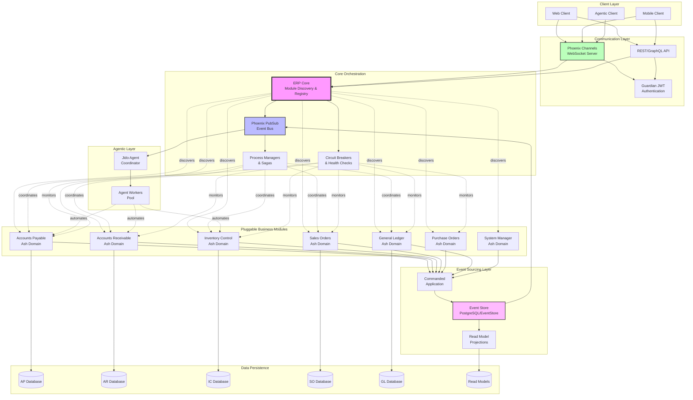

# Building a modular Elixir ERP system with event sourcing

The research reveals that building a modular, pluggable ERP system in Elixir requires careful orchestration of multiple architectural patterns. The combination of umbrella applications, Ash domains, Commanded event sourcing, and Phoenix Channels creates a powerful foundation that balances modularity with runtime flexibility. This architecture enables **hot-swappable modules**, **cross-domain workflows**, and **resilient distributed operations** while maintaining clear boundaries between business domains.

## System architecture overview



### Architecture diagram explanation

The diagram illustrates the complete system architecture with the following key flows:

1. **Client Layer**: Multiple client types (Web, Mobile, Agentic) connect through WebSocket channels for real-time updates or REST/GraphQL APIs for traditional requests
2. **Communication Layer**: Phoenix Channels handle WebSocket connections with Guardian JWT authentication securing all endpoints
3. **Core Orchestration**: The ERP Core discovers and registers available modules at runtime, managing their lifecycle through circuit breakers and health checks
4. **Pluggable Modules**: Each business module (AP, AR, IC, SO, PO, GL, SM) operates independently with its own Ash domain and database
5. **Event Sourcing**: All state changes flow through Commanded to the Event Store, with projections updating read models
6. **Cross-Domain Coordination**: Process Managers and Sagas handle workflows spanning multiple modules, with compensation for failures
7. **Agentic Layer**: Jido agents subscribe to events and automate workflows across modules
8. **Resilience**: Circuit breakers (dotted lines) monitor module health and prevent cascading failures

The architecture supports modules being unavailable (shown by dotted discovery lines) while maintaining system operation through the event bus and saga compensation patterns.

## Core architecture foundation

The optimal approach starts with an **umbrella application structure** that provides natural module boundaries while keeping deployment simple. Each ERP module (AP, AR, IC, SO, PO, GL, SM) exists as a separate application within the umbrella, containing its own Ash domain and event-sourced aggregates. This structure supports both monolithic deployment for smaller installations and distributed deployment across multiple nodes for enterprise scale.

```elixir
erp_system/
├── apps/
│   ├── erp_core/           # Orchestration and shared infrastructure
│   ├── erp_ap/             # Accounts Payable with Ash domain
│   ├── erp_ar/             # Accounts Receivable with Ash domain
│   ├── erp_ic/             # Inventory Control with Ash domain
│   ├── erp_so/             # Sales Orders with Ash domain
│   ├── erp_po/             # Purchase Orders with Ash domain
│   ├── erp_gl/             # General Ledger with Ash domain
│   └── erp_interfaces/     # WebSocket and API layers
```

The **runtime discovery mechanism** allows modules to be available or unavailable without crashing the system. A central module registry powered by ETS provides fast lookups while dynamic supervisors manage module lifecycles:

```elixir
defmodule ERPCore.ModuleDiscovery do
  use GenServer
  
  def discover_modules do
    potential_modules = [:erp_ap, :erp_ar, :erp_ic, :erp_so, :erp_po, :erp_gl]
    
    Enum.each(potential_modules, fn module_name ->
      module = Module.concat([ERPCore, String.upcase(to_string(module_name))])
      
      case Code.ensure_loaded(module) do
        {:module, ^module} ->
          if function_exported?(module, :available?, 0) and module.available?() do
            register_module(module_name, module)
            start_module_with_circuit_breaker(module_name, module)
          end
        {:error, _} -> :module_not_available
      end
    end)
  end
  
  defp start_module_with_circuit_breaker(module_name, module) do
    # Initialize Fuse circuit breaker for the module
    :fuse.install(module_name, {{:standard, 5, 10_000}, {:reset, 30_000}})
    
    # Start module under dynamic supervisor
    ERPCore.ModuleSupervisor.start_module(module_name, module)
  end
end
```

## Multi-domain Ash architecture

Each ERP module contains its own **Ash domain** with domain-specific resources, policies, and API configurations. Cross-domain operations are handled through explicit service layers that manage potential unavailability:

```elixir
defmodule Accountex.AccountsPayable do
  use Ash.Domain,
    extensions: [Ash.Policy.Authorizer, AshGraphql.Domain]

  resources do
    resource Accountex.AccountsPayable.Invoice
    resource Accountex.AccountsPayable.Payment
    resource Accountex.AccountsPayable.Vendor
  end

  code_interface do
    define :create_invoice, action: :create, resource: Accountex.AccountsPayable.Invoice
    define :pay_invoice, action: :pay, resource: Accountex.AccountsPayable.Invoice
  end
end

defmodule Accountex.AccountsPayable.Invoice do
  use Ash.Resource,
    domain: Accountex.AccountsPayable,
    data_layer: AshPostgres.DataLayer

  attributes do
    uuid_primary_key :id
    attribute :invoice_number, :string
    attribute :amount, :decimal
    attribute :gl_account_id, :uuid  # Cross-domain reference
  end

  actions do
    create :create_with_gl_entry do
      change fn changeset, _ ->
        # Protected cross-domain call with fallback
        case create_gl_entry_with_circuit_breaker(changeset.data) do
          {:ok, _entry} -> {:ok, changeset}
          {:error, :circuit_open} -> 
            # GL unavailable - schedule for later
            schedule_gl_entry_creation(changeset.data)
            {:ok, changeset}
        end
      end
    end
  end
end
```

## Event sourcing with Commanded and AshCommanded

The **event sourcing layer** uses Commanded for aggregates and process managers, while AshCommanded provides compile-time generation of boilerplate code. Each module's events flow through a central event bus that enables loose coupling:

```elixir
defmodule Accountex.Orders.Aggregates.Order do
  defstruct [:id, :customer_id, :status, :line_items, :total]
  
  def execute(%__MODULE__{id: nil}, %CreateOrder{} = command) do
    %OrderCreated{
      order_id: command.order_id,
      customer_id: command.customer_id,
      line_items: command.line_items,
      total: calculate_total(command.line_items)
    }
  end
  
  def apply(%__MODULE__{} = order, %OrderCreated{} = event) do
    %__MODULE__{
      order |
      id: event.order_id,
      customer_id: event.customer_id,
      status: :pending,
      line_items: event.line_items,
      total: event.total
    }
  end
end

# Cross-domain saga with compensation
defmodule Accountex.Workflows.OrderFulfillmentSaga do
  use Commanded.ProcessManagers.ProcessManager,
    application: Accountex.Application

  def handle(%__MODULE__{}, %OrderCreated{} = event) do
    # Start cross-domain workflow
    [
      %ReserveInventory{order_id: event.order_id, items: event.line_items},
      %CreateAREntry{order_id: event.order_id, amount: event.total}
    ]
  end
  
  def error({:error, :inventory_unavailable}, command, _context) do
    # Compensate by canceling order
    %CancelOrder{order_id: command.order_id, reason: :no_inventory}
  end
  
  def error({:error, :ar_module_unavailable}, command, _context) do
    # AR module down - continue without it
    {:continue, :ar_deferred}
  end
end
```

## WebSocket and authentication patterns

**Phoenix Channels** provide multi-client WebSocket support with role-based authorization integrated through Guardian JWT tokens:

```elixir
defmodule AccountexWeb.UserSocket do
  use Phoenix.Socket

  channel "orders:*", AccountexWeb.OrderChannel
  channel "agent:*", AccountexWeb.AgentChannel  # For Jido agents

  def connect(%{"token" => token}, socket, _connect_info) do
    case ERP.Guardian.decode_and_verify(token) do
      {:ok, claims} ->
        {:ok, assign(socket, :current_user, claims["sub"])}
      {:error, _} ->
        :error
    end
  end
end

defmodule AccountexWeb.OrderChannel do
  use AccountexWeb, :channel

  def join("orders:" <> order_id, _payload, socket) do
    with :ok <- authorize_order_access(socket.assigns.current_user, order_id) do
      # Subscribe to order events
      Phoenix.PubSub.subscribe(ERP.PubSub, "order:#{order_id}")
      {:ok, socket}
    end
  end

  def handle_info({:order_updated, order}, socket) do
    push(socket, "order_update", order)
    {:noreply, socket}
  end
end
```

## Jido agent integration

The **agentic layer** uses Jido for autonomous workflow processing, with agents subscribing to domain events and coordinating cross-module operations:

```elixir
defmodule ERP.Agents.OrderProcessorAgent do
  use Jido.Agent,
    name: "order_processor",
    actions: [
      ERP.Actions.ValidateOrder,
      ERP.Actions.CheckInventory,
      ERP.Actions.ProcessPayment
    ]

  def handle_info({:order_created, order_data}, state) do
    instructions = [
      %Jido.Instruction{action: "validate_order", params: %{order_id: order_data.order_id}},
      %Jido.Instruction{action: "check_inventory", params: %{order_id: order_data.order_id}}
    ]
    
    # Execute with circuit breaker protection
    case Jido.Agent.cmd(self(), instructions) do
      {:ok, result} -> broadcast_completion(result)
      {:error, :module_unavailable} -> schedule_retry(order_data)
    end
    
    {:noreply, state}
  end
end
```

## Resilience and configuration patterns

The system implements **multiple layers of fault tolerance**:

**Circuit Breakers** protect against cascading failures:
```elixir
defmodule ERPCore.CircuitBreaker do
  def call(module_name, fun) do
    case :fuse.ask(module_name, :sync) do
      :ok ->
        try do
          result = fun.()
          :fuse.melt(module_name) if match?({:error, _}, result)
          result
        rescue
          _ -> :fuse.melt(module_name)
          {:error, :circuit_breaker_tripped}
        end
      :blown ->
        {:error, :circuit_breaker_open}
    end
  end
end
```

**Health Checks** monitor module availability:
```elixir
defmodule ERPCore.HealthChecker do
  use GenServer
  
  def handle_info(:health_check, state) do
    Enum.each(ERPCore.ModuleDiscovery.get_available_modules(), fn {name, module} ->
      case GenServer.call(module, :health_check, 5000) do
        :ok -> ERPCore.CircuitBreaker.reset(name)
        _ -> :fuse.melt(name)
      end
    rescue
      _ -> :fuse.melt(name)
    end)
    
    schedule_next_check()
    {:noreply, state}
  end
end
```

**Dynamic Configuration** allows runtime module loading:
```elixir
config :erp_core, :modules,
  erp_ap: [
    auto_start: System.get_env("ENABLE_AP_MODULE") == "true",
    database_url: System.get_env("AP_DATABASE_URL")
  ],
  erp_ar: [
    auto_start: System.get_env("ENABLE_AR_MODULE") == "true",
    database_url: System.get_env("AR_DATABASE_URL")
  ]
```

## Production deployment architecture

The final architecture supports three deployment models:

1. **Single-node deployment** for small installations with all modules in one Erlang VM
2. **Multi-node clustering** using distributed Erlang for medium-scale deployments
3. **Microservices deployment** with modules as separate services communicating via gRPC or message queues

The supervision tree ensures proper startup order and isolation:
```elixir
defmodule ERPCore.Application do
  use Application
  
  def start(_type, _args) do
    children = [
      {Registry, keys: :unique, name: ERPCore.ModuleRegistry},
      ERPCore.ModuleDiscovery,
      ERPCore.ModuleSupervisor,
      ERPCore.CircuitBreakerSupervisor,
      ERPCore.HealthChecker,
      {Phoenix.PubSub, name: ERPCore.PubSub},
      ERPCore.EventStore,
      ERPCore.CommandedApplication
    ]
    
    Supervisor.start_link(children, strategy: :one_for_one)
  end
end
```

## Key architectural benefits

This architecture delivers several critical advantages for ERP systems:

**Runtime flexibility** allows modules to be added, removed, or updated without system restarts. Circuit breakers and health checks ensure the system remains operational even when individual modules fail. The event-sourced design provides complete audit trails required for financial compliance.

**Scalability** comes from Elixir's actor model and OTP supervision trees, allowing the system to handle thousands of concurrent operations. Phoenix Channels can manage millions of WebSocket connections for real-time updates across web, mobile, and agent clients.

**Maintainability** is enhanced through clear domain boundaries enforced by Ash, with each module having its own database schema, business logic, and API surface. The event-driven architecture ensures loose coupling, making it easy to modify individual modules without affecting others.

The combination of Elixir's fault-tolerance, Ash's domain modeling, Commanded's event sourcing, and Jido's agent capabilities creates a robust foundation for enterprise ERP systems that can grow from startup to Fortune 500 scale while maintaining operational excellence and development velocity.