# Accountex Purchase Orders - Workflows and State Management

## Overview

This document provides a comprehensive analysis of workflows and state management in the Purchase Orders domain. Each workflow represents a coordinated sequence of commands and events that manage state transitions across procurement components. The workflows follow event-sourced patterns using the Commanded framework with sophisticated approval processes, vendor coordination, and comprehensive audit trails.

## Core Purchase Order Workflows

### 1. Standard Purchase Order Lifecycle Workflow

**Description**: Complete purchase order lifecycle from creation through approval, vendor submission, goods receipt, and closure with comprehensive validation and audit requirements.

**State Transitions**: 
`Draft` → `Pending Approval` → `Approved` → `Sent` → `Partially Received` → `Fully Received` → `Closed`

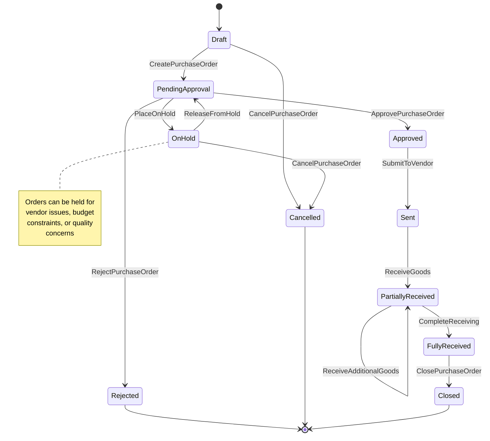

**Commands Involved**:
- `CreatePurchaseOrder` - Initiate new purchase order
- `ApprovePurchaseOrder` - Authorize order for vendor submission
- `RejectPurchaseOrder` - Decline order with feedback
- `SubmitToVendor` - Transmit approved order to vendor
- `ReceiveGoods` - Process goods receipt from vendor
- `CompleteReceiving` - Finalize receipt processing
- `ClosePurchaseOrder` - Complete order lifecycle
- `CancelPurchaseOrder` - Cancel order with cleanup
- `PlaceOnHold` - Suspend order processing
- `ReleaseFromHold` - Resume order processing

**Events Involved**:
- `PurchaseOrderCreated` - Order successfully created
- `PurchaseOrderApproved` - Approval received
- `PurchaseOrderRejected` - Order declined
- `PurchaseOrderSubmitted` - Order sent to vendor
- `GoodsReceived` - Goods delivered and received
- `ReceivingCompleted` - Receipt processing finished
- `PurchaseOrderClosed` - Lifecycle completed
- `PurchaseOrderCancelled` - Order cancelled
- `OrderPlacedOnHold` - Processing suspended
- `OrderReleasedFromHold` - Processing resumed

**Business Rules**:
- Vendor must be active and approved for transactions
- Order value must be within buyer's authorization limits
- Budget validation required if budget control enabled
- Cannot cancel orders after goods receipt without special authorization
- Amendment tracking required for audit compliance

---

### 2. Purchase Quote Management Workflow

**Description**: Purchase quote lifecycle from vendor proposal through evaluation, comparison, approval, and conversion to purchase order with competitive analysis.

**State Transitions**:
`Quote Requested` → `Quote Received` → `Evaluation` → `Approved/Rejected` → `Converted to PO`

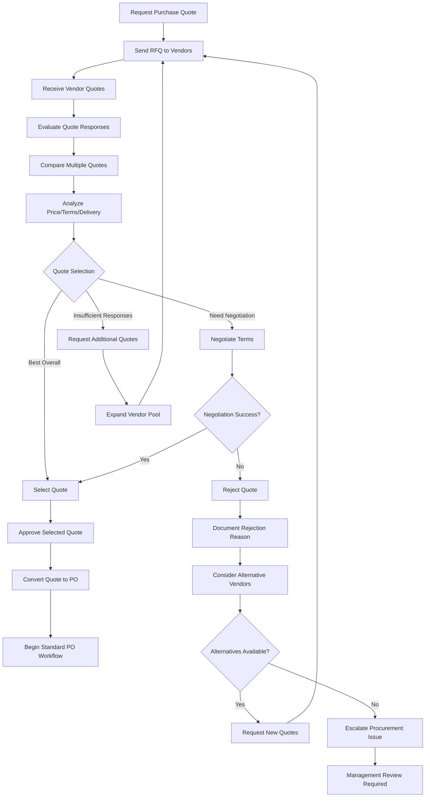

**Commands Involved**:
- `RequestPurchaseQuote` - Initiate quote request process
- `SendRFQToVendors` - Transmit RFQ to vendor pool
- `ReceiveVendorQuote` - Process incoming vendor quote
- `EvaluateQuote` - Analyze quote response
- `CompareQuotes` - Evaluate multiple vendor responses
- `NegotiateTerms` - Conduct price/term negotiations
- `ApproveQuote` - Select and authorize quote
- `RejectQuote` - Decline quote with reasoning
- `ConvertQuoteToPO` - Transform approved quote to purchase order

**Events Involved**:
- `PurchaseQuoteRequested` - Quote request initiated
- `RFQSentToVendors` - Request transmitted to vendors
- `VendorQuoteReceived` - Quote response received
- `QuoteEvaluated` - Analysis completed
- `QuotesCompared` - Comparative analysis finished
- `TermsNegotiated` - Negotiation completed
- `QuoteApproved` - Quote selection authorized
- `QuoteRejected` - Quote declined
- `QuoteConvertedToPO` - Quote converted to order

**Business Rules**:
- RFQ must specify clear requirements and evaluation criteria
- Quote evaluation based on price, delivery, terms, and vendor performance
- Competitive analysis required for significant purchases
- Quote approval authority based on order value and strategic importance
- Conversion maintains quote reference and negotiated terms

---

### 3. Blanket Purchase Order Management Workflow

**Description**: Long-term purchase agreement management including agreement establishment, release processing, commitment tracking, and performance monitoring.

**State Transitions**:
`Agreement Negotiated` → `Active` → `Releasing` → `Partially Consumed` → `Fully Released/Expired`

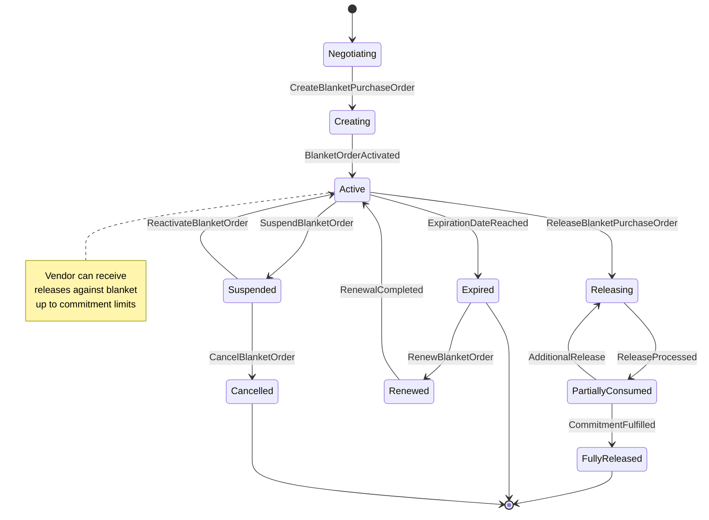

**Commands Involved**:
- `CreateBlanketPurchaseOrder` - Establish master agreement
- `NegotiateBlanketTerms` - Conduct agreement negotiations
- `ReleaseBlanketPurchaseOrder` - Convert portion to standard PO
- `MonitorBlanketConsumption` - Track commitment utilization
- `RenewBlanketOrder` - Extend agreement period
- `SuspendBlanketOrder` - Temporarily halt releases
- `CancelBlanketOrder` - Terminate agreement
- `ExpireBlanketOrder` - Handle agreement expiration

**Events Involved**:
- `BlanketPurchaseOrderCreated` - Agreement established
- `BlanketTermsNegotiated` - Terms finalized
- `BlanketPurchaseOrderReleased` - Release processed
- `BlanketConsumptionMonitored` - Utilization tracked
- `BlanketOrderRenewed` - Agreement extended
- `BlanketOrderSuspended` - Releases halted
- `BlanketOrderCancelled` - Agreement terminated
- `BlanketOrderExpired` - Agreement ended

**Business Rules**:
- Blanket agreements require vendor qualification and approval
- Release quantities must not exceed remaining commitment
- Pricing locked for agreement duration unless escalation clauses
- Performance tracking against delivery and quality commitments
- Agreement renewal requires performance evaluation

---

### 4. Goods Receipt Processing Workflow

**Description**: Comprehensive goods receipt processing including delivery validation, quality inspection, inventory updates, and financial accrual management with variance handling.

**State Transitions**:
`Goods Delivered` → `Receipt Processing` → `Quality Inspection` → `Inventory Update` → `Accrual Posted` → `Receipt Completed`

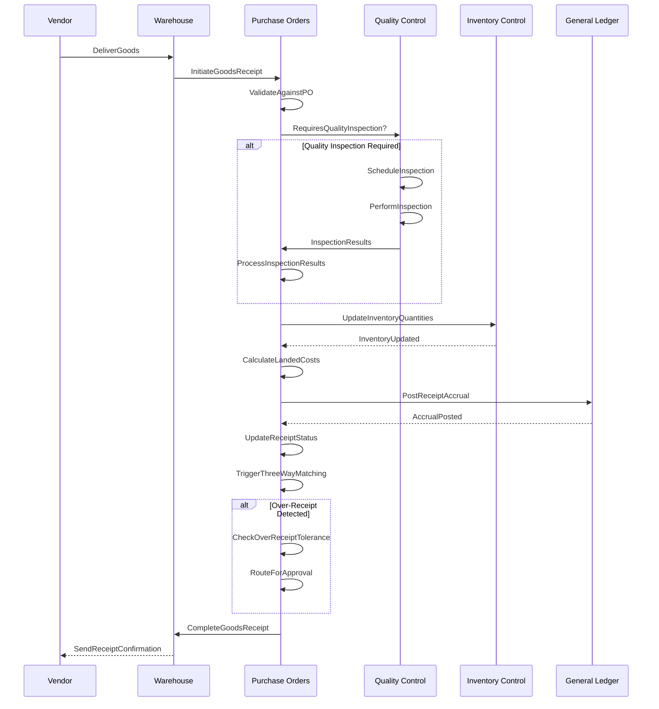

**Commands Involved**:
- `InitiateGoodsReceipt` - Begin receipt processing
- `ValidateAgainstPO` - Verify receipt against order
- `ScheduleQualityInspection` - Plan quality control
- `PerformInspection` - Execute quality inspection
- `UpdateInventoryQuantities` - Adjust stock levels
- `CalculateLandedCosts` - Compute total procurement costs
- `PostReceiptAccrual` - Create financial accruals
- `HandleOverReceipt` - Process over-receipt scenarios
- `CompleteGoodsReceipt` - Finalize receipt processing

**Events Involved**:
- `GoodsReceiptInitiated` - Receipt processing started
- `ReceiptValidatedAgainstPO` - Validation completed
- `QualityInspectionScheduled` - Inspection planned
- `InspectionPerformed` - Quality control executed
- `InventoryQuantitiesUpdated` - Stock levels adjusted
- `LandedCostsCalculated` - Costs computed
- `ReceiptAccrualPosted` - Financial entries created
- `OverReceiptHandled` - Variance processed
- `GoodsReceiptCompleted` - Receipt finalized

**Business Rules**:
- Receipt quantities validated against purchase order with tolerance
- Quality inspection required for items with quality control flags
- Inventory updates include on-hand quantities and cost calculations
- Landed cost allocation follows configured distribution method
- Over-receipt approval required beyond tolerance thresholds

---

### 5. Three-Way Matching Workflow

**Description**: Sophisticated document matching coordinating purchase orders, goods receipts, and vendor invoices with tolerance checking and variance resolution.

**State Transitions**:
`Documents Available` → `Matching Analysis` → `Variance Detection` → `Approval/Resolution` → `Match Completed`

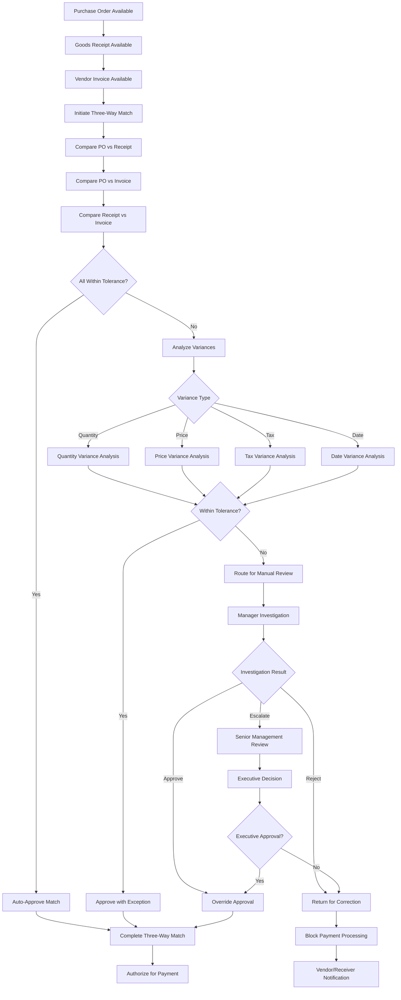

**Commands Involved**:
- `InitiateThreeWayMatch` - Begin document matching process
- `CompareDocuments` - Execute document comparison
- `AnalyzeVariances` - Examine document differences
- `ValidateTolerances` - Check variance thresholds
- `RouteForApproval` - Send to approval workflow
- `ApproveVariance` - Authorize variance acceptance
- `RejectMatch` - Decline matching due to variances
- `CompleteThreeWayMatch` - Finalize matching process
- `EscalateMatch` - Route to higher authority

**Events Involved**:
- `ThreeWayMatchInitiated` - Matching process started
- `DocumentsCompared` - Comparison analysis completed
- `VariancesAnalyzed` - Difference analysis finished
- `TolerancesValidated` - Threshold checking completed
- `VarianceRouted` - Sent to approval workflow
- `VarianceApproved` - Variance acceptance authorized
- `MatchRejected` - Matching declined
- `ThreeWayMatchCompleted` - Process successfully finished
- `MatchEscalated` - Routed to higher authority

**Business Rules**:
- Quantity variances within 5% tolerance typically auto-approved
- Price variances above $100 or 5% require manager approval
- Tax calculation variances require recalculation and validation
- Date variances beyond 7 days trigger investigation workflow
- All variance approvals maintain detailed justification

---

### 6. Vendor Management Workflow

**Description**: Comprehensive vendor relationship management including onboarding, performance monitoring, classification, and lifecycle coordination with compliance validation.

**State Transitions**:
`Vendor Prospect` → `Onboarding` → `Active` → `Performance Monitoring` → `Classification Update` → `Relationship Management`

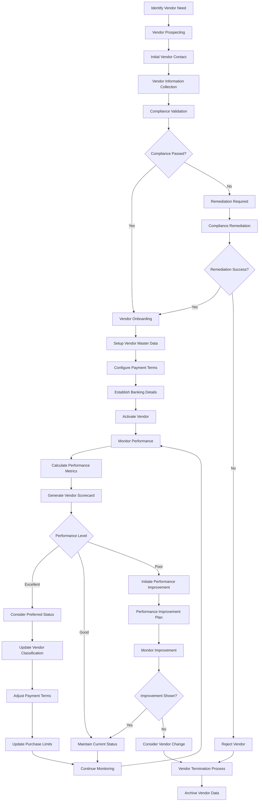

**Commands Involved**:
- `CreateVendor` - Establish new vendor account
- `ValidateVendorCompliance` - Verify regulatory compliance
- `OnboardVendor` - Complete vendor setup process
- `UpdateVendorInfo` - Modify vendor master data
- `MonitorVendorPerformance` - Track performance metrics
- `CalculatePerformanceMetrics` - Compute vendor scorecard
- `ClassifyVendor` - Update vendor classification
- `SuspendVendor` - Place vendor on hold
- `TerminateVendor` - End vendor relationship

**Events Involved**:
- `VendorCreated` - Vendor account established
- `VendorComplianceValidated` - Compliance verification completed
- `VendorOnboarded` - Setup process finished
- `VendorInfoUpdated` - Master data modified
- `VendorPerformanceMonitored` - Metrics tracked
- `PerformanceMetricsCalculated` - Scorecard computed
- `VendorClassified` - Classification updated
- `VendorSuspended` - Vendor placed on hold
- `VendorTerminated` - Relationship ended

**Business Rules**:
- Vendor compliance validation required before activation
- Performance monitoring based on delivery, quality, and service metrics
- Classification affects payment terms and purchase authorization limits
- Poor performance triggers improvement plans and potential termination
- Vendor termination requires completion of outstanding obligations

---

## Advanced Procurement Workflows

### 7. Recurring Purchase Order Automation Workflow

**Description**: Automated recurring purchase order generation including template management, schedule coordination, and exception handling with business calendar integration.

**State Transitions**:
`Template Created` → `Active` → `Generation Due` → `Order Generated` → `Processed` → `Next Cycle`

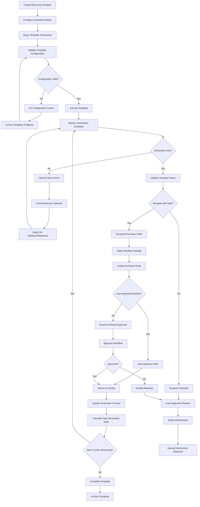

**Commands Involved**:
- `CreateRecurringTemplate` - Setup recurring order template
- `ConfigureRecurringSchedule` - Define generation pattern
- `ValidateTemplateConfiguration` - Verify template setup
- `ActivateRecurringTemplate` - Enable automatic generation
- `GenerateRecurringPurchaseOrder` - Create order from template
- `ApplyTemplateSettings` - Use template configuration
- `SuspendRecurringOrder` - Pause generation
- `CompleteRecurringTemplate` - End recurring cycle

**Events Involved**:
- `RecurringTemplateCreated` - Template established
- `RecurringScheduleConfigured` - Generation pattern defined
- `TemplateConfigurationValidated` - Setup verified
- `RecurringTemplateActivated` - Generation enabled
- `RecurringPurchaseOrderGenerated` - Order created from template
- `TemplateSettingsApplied` - Configuration used
- `RecurringOrderSuspended` - Generation paused
- `RecurringTemplateCompleted` - Cycle ended

**Business Rules**:
- Template configuration must include all required purchase order elements
- Generation schedule validates against business calendar
- Template vendor must remain active throughout recurring cycle
- Failed generation triggers error handling and administrator notification
- Recurring order lifecycle maintains complete audit trail

---

### 8. Return to Vendor (RTV) Workflow

**Description**: Return processing for defective or incorrect goods including return authorization, quality documentation, vendor coordination, and credit reconciliation.

**State Transitions**:
`Return Need Identified` → `Return Authorized` → `Goods Shipped` → `Credit Received` → `Return Resolved`

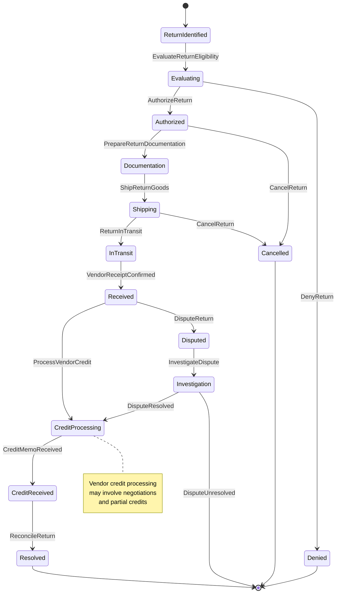

**Commands Involved**:
- `IdentifyReturnNeed` - Determine need for goods return
- `EvaluateReturnEligibility` - Assess return qualification
- `AuthorizeReturn` - Approve return processing
- `PrepareReturnDocumentation` - Generate return paperwork
- `ShipReturnGoods` - Process return shipment
- `TrackReturnShipment` - Monitor return in transit
- `ProcessVendorCredit` - Handle vendor credit memo
- `ReconcileReturn` - Complete return processing
- `DisputeReturn` - Handle return disputes

**Events Involved**:
- `ReturnNeedIdentified` - Return requirement determined
- `ReturnEligibilityEvaluated` - Qualification assessed
- `ReturnAuthorized` - Return processing approved
- `ReturnDocumentationPrepared` - Paperwork generated
- `ReturnGoodsShipped` - Return shipment processed
- `ReturnShipmentTracked` - Transit monitored
- `VendorCreditProcessed` - Credit memo handled
- `ReturnReconciled` - Process completed
- `ReturnDisputed` - Dispute initiated

**Business Rules**:
- Return eligibility based on purchase order terms and item condition
- Quality documentation required for defective item returns
- Return authorization may require vendor pre-approval
- Return shipping costs allocated based on return reason
- Credit reconciliation follows accounts payable procedures

---

## Integration and Coordination Workflows

### 9. Inventory Integration Workflow

**Description**: Real-time coordination with inventory management including reorder monitoring, availability updates, and cost synchronization with procurement planning.

**State Transitions**:
`Inventory Monitored` → `Reorder Triggered` → `PO Generated` → `Goods Received` → `Inventory Updated`

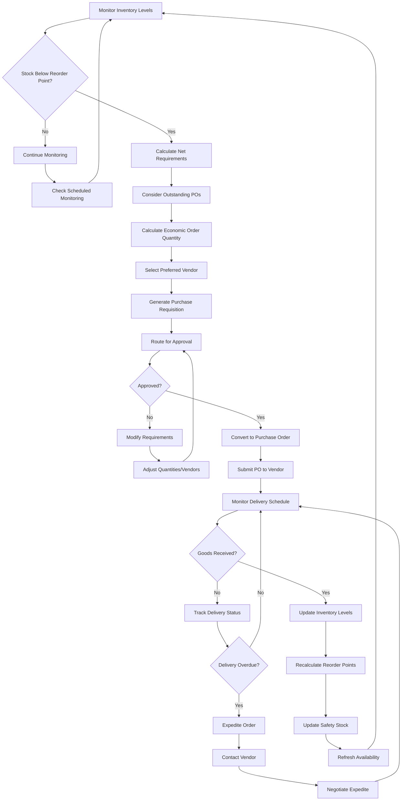

**Commands Involved**:
- `MonitorInventoryLevels` - Check stock against reorder points
- `CalculateNetRequirements` - Determine purchase needs
- `GeneratePurchaseRequisition` - Create purchase request
- `SelectPreferredVendor` - Choose optimal supplier
- `CalculateEOQ` - Determine economic order quantity
- `ConvertRequisitionToPO` - Transform requisition to order
- `ExpediteOrder` - Accelerate delivery when needed
- `UpdateInventoryFromReceipt` - Adjust stock from receipt

**Events Involved**:
- `InventoryLevelsMonitored` - Stock monitoring completed
- `NetRequirementsCalculated` - Purchase needs determined
- `PurchaseRequisitionGenerated` - Request created
- `PreferredVendorSelected` - Supplier chosen
- `EOQCalculated` - Order quantity optimized
- `RequisitionConvertedToPO` - Order created
- `OrderExpedited` - Delivery accelerated
- `InventoryUpdatedFromReceipt` - Stock adjusted

**Business Rules**:
- Reorder point monitoring frequency based on item velocity and criticality
- Economic order quantity balances carrying costs with ordering costs
- Vendor selection considers price, delivery performance, and quality
- Expediting authorized when stockout risk exceeds threshold
- Inventory updates maintain accurate cost and quantity information

---

### 10. Accounts Payable Integration Workflow

**Description**: Seamless integration with accounts payable for invoice matching, payment coordination, and vendor financial management with real-time data synchronization.

**State Transitions**:
`PO Approved` → `Goods Received` → `Invoice Received` → `Three-Way Match` → `Payment Authorized` → `Payment Processed`

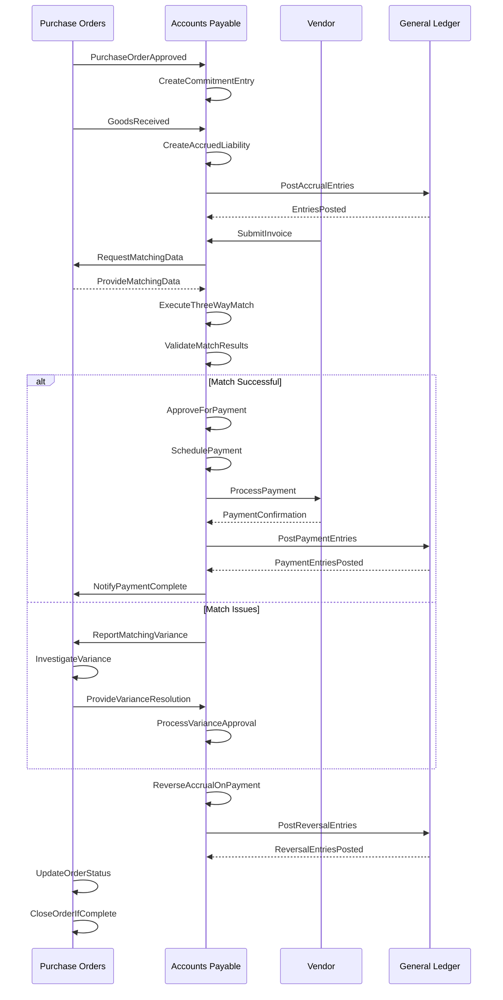

**Commands Involved**:
- `CreateCommitmentEntry` - Record purchase commitment
- `CreateAccruedLiability` - Generate accrual for receipt
- `RequestMatchingData` - Get PO/receipt information for matching
- `ProvideMatchingData` - Supply matching information to AP
- `ReportMatchingVariance` - Notify of matching discrepancies
- `InvestigateVariance` - Analyze matching issues
- `ProcessVarianceApproval` - Handle variance authorization
- `NotifyPaymentComplete` - Confirm payment processing
- `UpdateOrderFromPayment` - Update order status from payment

**Events Involved**:
- `CommitmentEntryCreated` - Purchase commitment recorded
- `AccruedLiabilityCreated` - Receipt accrual generated
- `MatchingDataRequested` - AP requested PO information
- `MatchingDataProvided` - Information supplied to AP
- `MatchingVarianceReported` - Discrepancy identified
- `VarianceInvestigated` - Issue analysis completed
- `VarianceApprovalProcessed` - Authorization handled
- `PaymentCompletionNotified` - Payment confirmed
- `OrderUpdatedFromPayment` - Status updated

**Business Rules**:
- Purchase commitments created when orders approved
- Accrued liability generated upon goods receipt
- Three-way matching validates PO, receipt, and invoice consistency
- Payment processing follows AP approval workflows
- Order closure requires complete payment processing

---

### 11. Drop Ship Coordination Workflow

**Description**: Drop shipment processing coordinating purchase orders with sales orders for direct vendor-to-customer delivery with margin protection.

**State Transitions**:
`Customer Order Received` → `Drop Ship PO Created` → `Vendor Ships Direct` → `Customer Receipt` → `Invoicing`

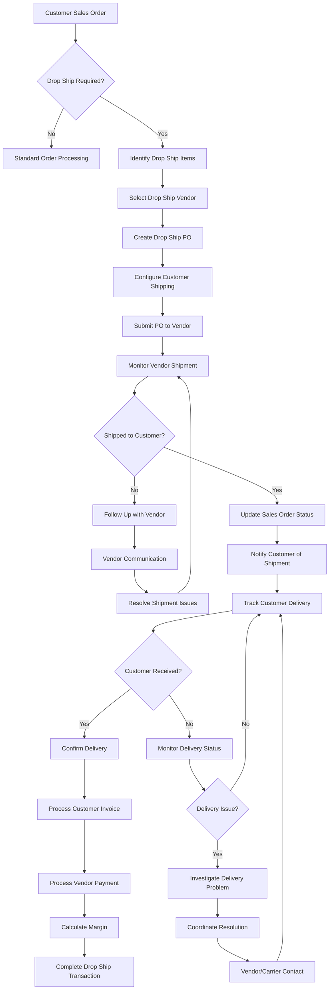

**Commands Involved**:
- `IdentifyDropShipItems` - Determine items for direct shipment
- `SelectDropShipVendor` - Choose vendor for drop shipment
- `CreateDropShipPO` - Generate purchase order for drop shipment
- `ConfigureCustomerShipping` - Setup customer delivery details
- `MonitorVendorShipment` - Track vendor shipment progress
- `NotifyCustomerOfShipment` - Inform customer of shipment
- `TrackCustomerDelivery` - Monitor delivery to customer
- `ConfirmCustomerDelivery` - Verify delivery completion
- `ProcessDropShipInvoicing` - Handle customer and vendor invoicing

**Events Involved**:
- `DropShipItemsIdentified` - Direct shipment items determined
- `DropShipVendorSelected` - Vendor chosen
- `DropShipPOCreated` - Purchase order generated
- `CustomerShippingConfigured` - Delivery details setup
- `VendorShipmentMonitored` - Shipment tracked
- `CustomerNotifiedOfShipment` - Customer informed
- `CustomerDeliveryTracked` - Delivery monitored
- `CustomerDeliveryConfirmed` - Delivery verified
- `DropShipInvoicingProcessed` - Billing completed

**Business Rules**:
- Drop ship items must be available from vendor inventory
- Customer shipping address validation required
- Vendor must agree to direct shipment terms
- Margin protection through blind shipping (hide vendor pricing)
- Delivery confirmation required before customer billing

---

### 12. Landed Cost Management Workflow

**Description**: Comprehensive landed cost processing including cost collection, allocation calculation, and distribution across received items with multiple allocation methods.

**State Transitions**:
`Costs Identified` → `Collection` → `Allocation Calculation` → `Distribution` → `Posted to GL` → `Completed`

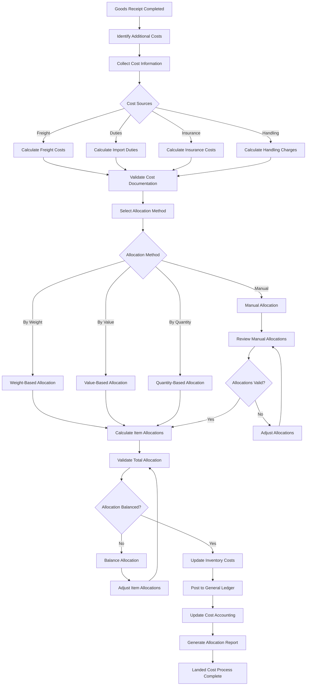

**Commands Involved**:
- `IdentifyAdditionalCosts` - Determine landed cost components
- `CollectCostInformation` - Gather cost documentation
- `CalculateLandedCosts` - Compute total additional costs
- `SelectAllocationMethod` - Choose cost distribution approach
- `AllocateCostsByMethod` - Distribute costs using selected method
- `ValidateAllocationBalance` - Verify allocation accuracy
- `UpdateInventoryCosts` - Apply costs to inventory items
- `PostLandedCostAccrual` - Create general ledger entries
- `GenerateAllocationReport` - Document cost distribution

**Events Involved**:
- `AdditionalCostsIdentified` - Landed cost components determined
- `CostInformationCollected` - Documentation gathered
- `LandedCostsCalculated` - Total costs computed
- `AllocationMethodSelected` - Distribution approach chosen
- `CostsAllocatedByMethod` - Distribution completed
- `AllocationBalanceValidated` - Accuracy verified
- `InventoryCostsUpdated` - Costs applied to items
- `LandedCostAccrualPosted` - GL entries created
- `AllocationReportGenerated` - Documentation completed

**Business Rules**:
- All landed cost components must be supported by documentation
- Cost allocation method must be appropriate for item characteristics
- Total allocated costs must equal total landed costs exactly
- Inventory cost updates follow configured costing method
- GL posting requires valid chart of accounts mapping

---

## Quality and Compliance Workflows

### 13. Quality Control Integration Workflow

**Description**: Quality inspection coordination for received goods including inspection scheduling, test execution, disposition determination, and nonconformance handling.

**State Transitions**:
`Goods Received` → `Inspection Required` → `Testing` → `Results Analysis` → `Disposition` → `Action Completed`

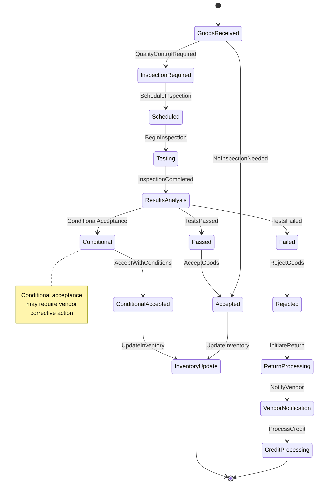

**Commands Involved**:
- `DetermineQualityRequirements` - Assess inspection needs
- `ScheduleInspection` - Plan quality inspection activities
- `BeginInspection` - Start inspection process
- `RecordInspectionResults` - Capture test results
- `AnalyzeInspectionResults` - Evaluate test outcomes
- `AcceptGoods` - Approve goods for inventory
- `RejectGoods` - Decline goods due to quality issues
- `ProcessNonconformance` - Handle quality failures
- `InitiateVendorCorrection` - Request vendor corrective action

**Events Involved**:
- `QualityRequirementsDetermined` - Inspection needs assessed
- `InspectionScheduled` - Quality inspection planned
- `InspectionBegun` - Testing started
- `InspectionResultsRecorded` - Test results captured
- `InspectionResultsAnalyzed` - Outcomes evaluated
- `GoodsAccepted` - Goods approved for inventory
- `GoodsRejected` - Goods declined due to quality
- `NonconformanceProcessed` - Quality failure handled
- `VendorCorrectionInitiated` - Corrective action requested

**Business Rules**:
- Quality inspection required for items with quality control flags
- Inspection criteria based on item specifications and vendor history
- Test results must be complete and documented before disposition
- Rejected goods trigger return to vendor workflow
- Quality performance tracked for vendor scorecard

---

### 14. Budget and Financial Control Workflow

**Description**: Budget validation and financial control including budget checking, encumbrance management, variance monitoring, and financial reporting coordination.

**State Transitions**:
`Budget Check Required` → `Validation` → `Encumbrance` → `Monitoring` → `Variance Analysis` → `Reporting`

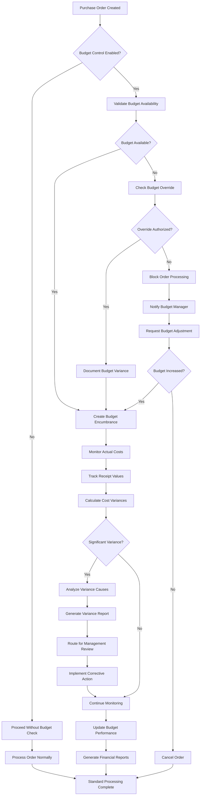

**Commands Involved**:
- `ValidateBudgetAvailability` - Check budget funds for purchase
- `CreateBudgetEncumbrance` - Reserve budget for purchase
- `MonitorActualCosts` - Track actual vs. budgeted costs
- `CalculateBudgetVariances` - Determine budget vs. actual differences
- `ProcessBudgetOverride` - Handle budget limit exceptions
- `GenerateVarianceReport` - Create budget variance analysis
- `UpdateBudgetPerformance` - Refresh budget tracking
- `ReleaseBudgetEncumbrance` - Free budget upon completion

**Events Involved**:
- `BudgetAvailabilityValidated` - Budget check completed
- `BudgetEncumbranceCreated` - Budget reserved
- `ActualCostsMonitored` - Cost tracking updated
- `BudgetVariancesCalculated` - Variance analysis completed
- `BudgetOverrideProcessed` - Exception handled
- `VarianceReportGenerated` - Analysis documentation created
- `BudgetPerformanceUpdated` - Tracking refreshed
- `BudgetEncumbranceReleased` - Budget freed

**Business Rules**:
- Budget validation required when budget control enabled
- Encumbrance created at purchase order approval
- Actual costs tracked at goods receipt and invoice processing
- Variance analysis triggers when differences exceed thresholds
- Budget override requires appropriate management authorization

---

## Error Recovery and Data Management Workflows

### 15. Purchase Order Error Recovery Workflow

**Description**: Comprehensive error handling including error classification, recovery strategy determination, compensation processing, and system integrity restoration.

**State Transitions**:
`Error Detected` → `Classified` → `Recovery Strategy` → `Compensation` → `Validation` → `Resolved`

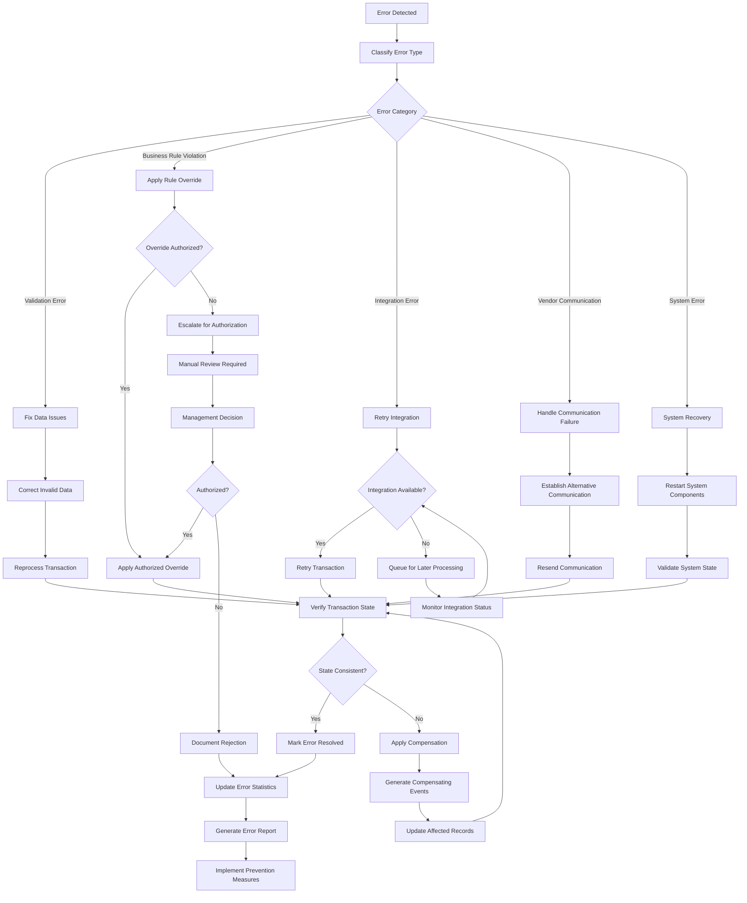

**Commands Involved**:
- `DetectPurchaseOrderError` - Identify processing errors
- `ClassifyError` - Categorize error types and severity
- `DetermineRecoveryStrategy` - Plan error resolution approach
- `ApplyErrorCompensation` - Generate compensating transactions
- `RetryFailedTransaction` - Attempt transaction retry
- `EscalateErrorForReview` - Route to manual intervention
- `ValidateErrorRecovery` - Verify recovery success
- `DocumentErrorResolution` - Record resolution details

**Events Involved**:
- `PurchaseOrderErrorDetected` - Error identified
- `ErrorClassified` - Error type determined
- `RecoveryStrategyDetermined` - Resolution approach planned
- `ErrorCompensationApplied` - Compensating transactions created
- `FailedTransactionRetried` - Retry attempted
- `ErrorEscalatedForReview` - Manual intervention required
- `ErrorRecoveryValidated` - Recovery success verified
- `ErrorResolutionDocumented` - Resolution recorded

**Business Rules**:
- All errors classified by type, severity, and business impact
- Recovery strategy appropriate for error type and business context
- Compensation maintains financial and inventory accuracy
- Critical errors require immediate escalation and investigation
- Error resolution includes root cause analysis and prevention

---

### 16. Bulk Import Processing Workflow

**Description**: High-volume purchase order import including file validation, business rule checking, batch processing, and comprehensive error handling with rollback capabilities.

**State Transitions**:
`File Uploaded` → `Validation` → `Processing` → `Reconciliation` → `Completion` → `Archive`

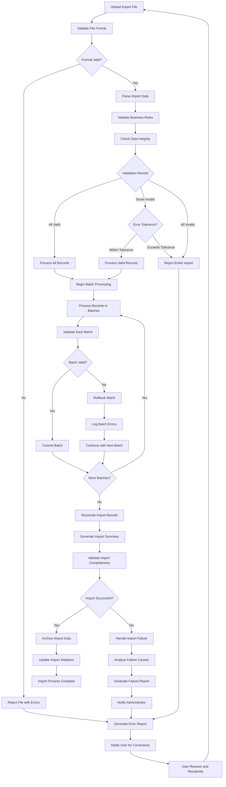

**Commands Involved**:
- `InitiateImport` - Begin import process
- `ValidateImportFile` - Check file format and content
- `ProcessImportBatch` - Handle batch of records
- `ValidateBusinessRules` - Check data against business logic
- `CommitImportBatch` - Save validated batch
- `RollbackImportBatch` - Reverse failed batch
- `ReconcileImportResults` - Verify import completeness
- `ArchiveImportData` - Preserve import history
- `HandleImportFailure` - Process failed imports

**Events Involved**:
- `ImportInitiated` - Process started
- `ImportFileValidated` - File format verified
- `ImportBatchProcessed` - Batch handled
- `BusinessRulesValidated` - Logic compliance verified
- `ImportBatchCommitted` - Batch saved
- `ImportBatchRolledBack` - Batch reversed
- `ImportResultsReconciled` - Completeness verified
- `ImportDataArchived` - History preserved
- `ImportFailureHandled` - Failure processed

**Business Rules**:
- Import file must conform to published format specifications
- All imported records must pass business rule validation
- Batch processing prevents partial failures from corrupting data
- Error tolerance configurable based on import criticality
- Failed imports provide detailed error reporting for correction

---

## Summary

The Purchase Orders domain orchestrates **16 primary workflows** that collectively manage:

- **Order Operations**: Creation, approval, amendment, cancellation, and lifecycle management
- **Quote Management**: Request, evaluation, negotiation, and conversion processes
- **Blanket Agreements**: Long-term agreement management with release processing
- **Receipt Operations**: Goods receipt, validation, quality control, and completion
- **Vendor Management**: Onboarding, performance monitoring, and relationship coordination
- **Return Processing**: Return authorization, shipping, and credit reconciliation
- **Financial Operations**: Landed cost calculation, budget validation, and accrual management
- **Integration Operations**: Inventory coordination, AP integration, and drop ship management
- **Quality Operations**: Inspection coordination, test execution, and disposition management
- **Automation**: Recurring order generation and reorder point monitoring
- **Data Operations**: Bulk import processing with validation and error handling
- **Error Recovery**: Comprehensive error handling and system integrity restoration

Each workflow maintains strict consistency boundaries, implements comprehensive audit trails, and supports sophisticated procurement operations including:

- **Multi-type purchase orders** (standard, quotes, blanket agreements, recurring orders)
- **Advanced approval workflows** with delegation, escalation, and override capabilities
- **Sophisticated vendor management** with performance tracking and compliance
- **Quality control integration** with inspection workflows and disposition management
- **Financial integration** with budget validation, encumbrance, and landed cost allocation
- **Real-time coordination** with inventory, accounts payable, and sales order modules
- **Comprehensive error handling** with recovery and compensation mechanisms

The workflows collectively ensure enterprise-grade procurement operations with complete traceability, regulatory compliance, vendor performance optimization, and seamless integration with other Accountex modules while maintaining data integrity, financial accuracy, and operational excellence for complex procurement scenarios including multi-vendor agreements, quality control requirements, and sophisticated cost management.