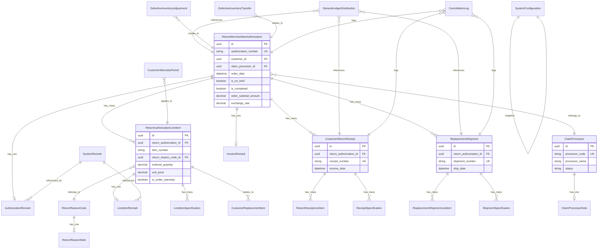

# Accountex Return Merchandise Authorization Domain

## Overview

This document defines the Ash domain and resources for the Return Merchandise Authorization (RMA) module of the Accountex ERP system. The module handles customer returns, replacements, repairs, and related inventory adjustments.

## Domain Module

```elixir
defmodule Accountex.ReturnMerchandiseAuthorization do
  use Ash.Domain

  alias Accountex.ReturnMerchandiseAuthorization.{
    ReturnMerchandiseAuthorization,
    ReturnAuthorizationLineItem,
    ClaimProcessor,
    ReturnReasonCode,
    CustomerReturnReceipt,
    ReturnReceiptLineItem,
    ReplacementShipment,
    ReplacementShipmentLineItem,
    CustomerReplacementItem,
    GeneralLedgerDistribution,
    SystemConfiguration,
    AuthorizationRemark,
    LineItemRemark,
    DefectiveInventoryAdjustment,
    DefectiveInventoryTransfer,
    CancellationLog,
    ClaimProcessorNote,
    ReturnReasonNote,
    SystemRemark,
    InvoiceRemark,
    CustomerWarrantyPeriod,
    LineItemSpecification,
    ReceiptSpecification,
    ShipmentSpecification
  }

  resources do
    resource ReturnMerchandiseAuthorization do
      define :list_return_merchandise_authorizations, action: :read
      define :get_return_merchandise_authorization, action: :read, get_by: [:authorization_number]
      define :create_return_merchandise_authorization, action: :create
      define :update_return_merchandise_authorization, action: :update
      define :delete_return_merchandise_authorization, action: :destroy
      define :place_on_hold, action: :update
      define :release_from_hold, action: :update
      define :cancel_authorization, action: :update
      define :complete_authorization, action: :update
    end

    resource ReturnAuthorizationLineItem do
      define :list_return_authorization_line_items, action: :read
      define :get_return_authorization_line_item, action: :read, get_by: [:id]
      define :create_return_authorization_line_item, action: :create
      define :update_return_authorization_line_item, action: :update
      define :delete_return_authorization_line_item, action: :destroy
      define :update_quantities, action: :update
    end

    resource ClaimProcessor do
      define :list_claim_processors, action: :read
      define :get_claim_processor, action: :read, get_by: [:processor_code]
      define :create_claim_processor, action: :create
      define :update_claim_processor, action: :update
      define :activate_claim_processor, action: :update
      define :deactivate_claim_processor, action: :update
    end

    resource ReturnReasonCode do
      define :list_return_reason_codes, action: :read
      define :get_return_reason_code, action: :read, get_by: [:reason_code]
      define :create_return_reason_code, action: :create
      define :update_return_reason_code, action: :update
      define :activate_return_reason_code, action: :update
      define :deactivate_return_reason_code, action: :update
    end

    resource CustomerReturnReceipt do
      define :list_customer_return_receipts, action: :read
      define :get_customer_return_receipt, action: :read, get_by: [:receipt_number]
      define :create_customer_return_receipt, action: :create
      define :update_customer_return_receipt, action: :update
      define :process_receipt, action: :update
    end

    resource ReturnReceiptLineItem do
      define :list_return_receipt_line_items, action: :read
      define :get_return_receipt_line_item, action: :read, get_by: [:id]
      define :create_return_receipt_line_item, action: :create
      define :update_return_receipt_line_item, action: :update
      define :update_received_quantity, action: :update
    end

    resource ReplacementShipment do
      define :list_replacement_shipments, action: :read
      define :get_replacement_shipment, action: :read, get_by: [:shipment_number]
      define :create_replacement_shipment, action: :create
      define :update_replacement_shipment, action: :update
      define :process_shipment, action: :update
    end

    resource ReplacementShipmentLineItem do
      define :list_replacement_shipment_line_items, action: :read
      define :get_replacement_shipment_line_item, action: :read, get_by: [:id]
      define :create_replacement_shipment_line_item, action: :create
      define :update_replacement_shipment_line_item, action: :update
      define :update_shipped_quantity, action: :update
    end

    resource GeneralLedgerDistribution do
      define :list_general_ledger_distributions, action: :read
      define :create_general_ledger_distribution, action: :create
      define :post_to_general_ledger, action: :update
    end

    resource SystemConfiguration do
      define :get_system_configuration, action: :read
      define :update_system_configuration, action: :update
    end

    resource DefectiveInventoryAdjustment do
      define :list_defective_inventory_adjustments, action: :read
      define :create_defective_inventory_adjustment, action: :create
      define :post_adjustment, action: :update
    end

    resource DefectiveInventoryTransfer do
      define :list_defective_inventory_transfers, action: :read
      define :create_defective_inventory_transfer, action: :create
      define :process_transfer, action: :update
    end

    resource CancellationLog do
      define :list_cancellation_logs, action: :read
      define :create_cancellation_log, action: :create
    end
  end
end
```

## Resources

### ReturnMerchandiseAuthorization

```elixir
defmodule Accountex.ReturnMerchandiseAuthorization.ReturnMerchandiseAuthorization do
  use Ash.Resource,
    domain: Accountex.ReturnMerchandiseAuthorization,
    data_layer: AshPostgres.DataLayer

  postgres do
    table "return_merchandise_authorizations"
    repo Accountex.Repo
  end

  attributes do
    uuid_primary_key :id

    attribute :authorization_number, :string do
      allow_nil? false
      public? true
    end

    attribute :revision_number, :string do
      default "A"
      public? true
    end

    attribute :customer_id, :uuid do
      allow_nil? false
      public? true
    end

    attribute :claim_processor_id, :uuid do
      public? true
    end

    attribute :salesperson_id, :uuid do
      allow_nil? false
      public? true
    end

    attribute :ordered_by_name, :string do
      public? true
    end

    attribute :entered_by_name, :string do
      public? true
    end

    # Billing Address Fields
    attribute :billing_address_code, :string do
      public? true
    end

    attribute :billing_company_name, :string do
      public? true
    end

    attribute :billing_address_line_1, :string do
      public? true
    end

    attribute :billing_address_line_2, :string do
      public? true
    end

    attribute :billing_city, :string do
      public? true
    end

    attribute :billing_state_province, :string do
      public? true
    end

    attribute :billing_postal_code, :string do
      public? true
    end

    attribute :billing_country, :string do
      public? true
    end

    attribute :billing_phone_number, :string do
      public? true
    end

    attribute :billing_contact_name, :string do
      public? true
    end

    attribute :billing_email_address, :string do
      public? true
    end

    # Shipping Address Fields
    attribute :shipping_address_code, :string do
      public? true
    end

    attribute :shipping_company_name, :string do
      public? true
    end

    attribute :shipping_address_line_1, :string do
      public? true
    end

    attribute :shipping_address_line_2, :string do
      public? true
    end

    attribute :shipping_city, :string do
      public? true
    end

    attribute :shipping_state_province, :string do
      public? true
    end

    attribute :shipping_postal_code, :string do
      public? true
    end

    attribute :shipping_country, :string do
      public? true
    end

    attribute :shipping_phone_number, :string do
      public? true
    end

    attribute :shipping_contact_name, :string do
      public? true
    end

    attribute :shipping_email_address, :string do
      public? true
    end

    # Order Details
    attribute :shipping_method, :string do
      public? true
    end

    attribute :freight_on_board_point, :string do
      public? true
    end

    attribute :purchase_order_number, :string do
      public? true
    end

    attribute :freight_charge_code, :string do
      public? true
    end

    attribute :freight_tax_code, :string do
      public? true
    end

    attribute :shipping_freight_charge_code, :string do
      public? true
    end

    attribute :shipping_freight_tax_code, :string do
      public? true
    end

    attribute :sales_tax_code, :string do
      public? true
    end

    attribute :payment_method_code, :string do
      allow_nil? false
      public? true
    end

    attribute :bank_account_number, :string do
      public? true
    end

    attribute :check_number, :string do
      public? true
    end

    attribute :credit_card_number, :string do
      public? true
    end

    attribute :credit_card_expiration_date, :string do
      public? true
    end

    attribute :credit_card_holder_name, :string do
      public? true
    end

    attribute :payment_reference_number, :string do
      public? true
    end

    # Shipping Payment Details
    attribute :shipping_payment_method_code, :string do
      public? true
    end

    attribute :shipping_bank_account_number, :string do
      public? true
    end

    attribute :shipping_check_number, :string do
      public? true
    end

    attribute :shipping_credit_card_number, :string do
      public? true
    end

    attribute :shipping_credit_card_expiration_date, :string do
      public? true
    end

    attribute :shipping_credit_card_holder_name, :string do
      public? true
    end

    attribute :shipping_payment_reference, :string do
      public? true
    end

    attribute :currency_code, :string do
      allow_nil? false
      default "USD"
      public? true
    end

    attribute :tax_exemption_type, :string do
      public? true
    end

    attribute :authorization_created_date, :datetime do
      allow_nil? false
      public? true
    end

    attribute :order_date, :datetime do
      allow_nil? false
      public? true
    end

    # Status Flags
    attribute :is_on_hold, :boolean do
      default false
      public? true
    end

    attribute :is_cancelled, :boolean do
      default false
      public? true
    end

    attribute :has_no_receive_backorder, :boolean do
      default false
      public? true
    end

    attribute :has_no_shipment_backorder, :boolean do
      default false
      public? true
    end

    attribute :has_no_complete_backorder, :boolean do
      default false
      public? true
    end

    attribute :is_completed, :boolean do
      default false
      public? true
    end

    attribute :is_freight_taxable_1, :boolean do
      default false
      public? true
    end

    attribute :is_freight_taxable_2, :boolean do
      default false
      public? true
    end

    attribute :is_shipping_freight_taxable_1, :boolean do
      default false
      public? true
    end

    attribute :is_shipping_freight_taxable_2, :boolean do
      default false
      public? true
    end

    attribute :should_apply_tax, :boolean do
      default false
      public? true
    end

    attribute :includes_tax_in_price, :boolean do
      default false
      public? true
    end

    attribute :is_order_printed, :boolean do
      default false
      public? true
    end

    attribute :is_pick_list_printed, :boolean do
      default false
      public? true
    end

    attribute :is_label_printed, :boolean do
      default false
      public? true
    end

    attribute :uses_customer_item_number, :boolean do
      default false
      public? true
    end

    attribute :save_credit_card_for_return, :boolean do
      default false
      public? true
    end

    attribute :save_credit_card_for_shipping, :boolean do
      default false
      public? true
    end

    # Terms and Discounts
    attribute :discount_days, :integer do
      default 0
      public? true
    end

    attribute :net_payment_days, :integer do
      default 0
      public? true
    end

    attribute :terms_discount_percentage, :decimal do
      default 0
      public? true
    end

    attribute :discount_percentage, :decimal do
      default 0
      public? true
    end

    attribute :tax_version_number, :integer do
      default 0
      public? true
    end

    attribute :freight_tax_version_number, :integer do
      default 0
      public? true
    end

    attribute :shipping_freight_tax_version, :integer do
      default 0
      public? true
    end

    # Amounts
    attribute :taxable_amount_1, :decimal do
      default 0
      public? true
    end

    attribute :taxable_amount_2, :decimal do
      default 0
      public? true
    end

    attribute :order_subtotal_amount, :decimal do
      default 0
      public? true
    end

    attribute :discount_amount, :decimal do
      default 0
      public? true
    end

    attribute :freight_charge_amount, :decimal do
      default 0
      public? true
    end

    attribute :shipping_freight_charge_amount, :decimal do
      default 0
      public? true
    end

    attribute :shipping_freight_amount, :decimal do
      default 0
      public? true
    end

    attribute :tax_amount_1, :decimal do
      default 0
      public? true
    end

    attribute :tax_amount_2, :decimal do
      default 0
      public? true
    end

    attribute :tax_amount_3, :decimal do
      default 0
      public? true
    end

    attribute :freight_tax_amount_1, :decimal do
      default 0
      public? true
    end

    attribute :freight_tax_amount_2, :decimal do
      default 0
      public? true
    end

    attribute :freight_tax_amount_3, :decimal do
      default 0
      public? true
    end

    attribute :shipping_freight_tax_amount_1, :decimal do
      default 0
      public? true
    end

    attribute :shipping_freight_tax_amount_2, :decimal do
      default 0
      public? true
    end

    attribute :shipping_freight_tax_amount_3, :decimal do
      default 0
      public? true
    end

    # Foreign Currency Amounts
    attribute :foreign_taxable_amount_1, :decimal do
      default 0
      public? true
    end

    attribute :foreign_taxable_amount_2, :decimal do
      default 0
      public? true
    end

    attribute :foreign_order_subtotal_amount, :decimal do
      default 0
      public? true
    end

    attribute :foreign_discount_amount, :decimal do
      default 0
      public? true
    end

    attribute :foreign_freight_amount, :decimal do
      default 0
      public? true
    end

    attribute :foreign_shipping_freight_charge, :decimal do
      default 0
      public? true
    end

    attribute :foreign_shipping_freight_amount, :decimal do
      default 0
      public? true
    end

    attribute :foreign_tax_amount_1, :decimal do
      default 0
      public? true
    end

    attribute :foreign_tax_amount_2, :decimal do
      default 0
      public? true
    end

    attribute :foreign_tax_amount_3, :decimal do
      default 0
      public? true
    end

    attribute :foreign_freight_tax_1, :decimal do
      default 0
      public? true
    end

    attribute :foreign_freight_tax_2, :decimal do
      default 0
      public? true
    end

    attribute :foreign_freight_tax_3, :decimal do
      default 0
      public? true
    end

    attribute :foreign_shipping_freight_tax_1, :decimal do
      default 0
      public? true
    end

    attribute :foreign_shipping_freight_tax_2, :decimal do
      default 0
      public? true
    end

    attribute :foreign_shipping_freight_tax_3, :decimal do
      default 0
      public? true
    end

    attribute :exchange_rate, :decimal do
      default 1.0
      public? true
    end

    attribute :shipping_weight, :decimal do
      default 0
      public? true
    end

    timestamps()
  end

  relationships do
    has_many :line_items, ReturnAuthorizationLineItem do
      destination_attribute :return_authorization_id
    end

    has_many :receipts, CustomerReturnReceipt do
      destination_attribute :return_authorization_id
    end

    has_many :shipments, ReplacementShipment do
      destination_attribute :return_authorization_id
    end

    has_one :authorization_remark, AuthorizationRemark do
      destination_attribute :return_authorization_id
    end

    has_one :invoice_remark, InvoiceRemark do
      destination_attribute :return_authorization_id
    end

    belongs_to :claim_processor, ClaimProcessor do
      attribute_type :uuid
    end
  end

  actions do
    defaults [:read, :destroy]

    create :create do
      primary? true
      accept [:customer_id, :salesperson_id, :ordered_by_name, :currency_code, 
              :payment_method_code, :order_date, :shipping_method]
    end

    update :update do
      primary? true
    end

    update :place_on_hold do
      change set_attribute(:is_on_hold, true)
    end

    update :release_from_hold do
      change set_attribute(:is_on_hold, false)
    end

    update :cancel_authorization do
      change set_attribute(:is_cancelled, true)
    end

    update :complete_authorization do
      change set_attribute(:is_completed, true)
    end
  end
end
```

### ReturnAuthorizationLineItem

```elixir
defmodule Accountex.ReturnMerchandiseAuthorization.ReturnAuthorizationLineItem do
  use Ash.Resource,
    domain: Accountex.ReturnMerchandiseAuthorization,
    data_layer: AshPostgres.DataLayer

  postgres do
    table "return_authorization_line_items"
    repo Accountex.Repo
  end

  attributes do
    uuid_primary_key :id

    attribute :return_authorization_id, :uuid do
      allow_nil? false
      public? true
    end

    attribute :customer_id, :uuid do
      allow_nil? false
      public? true
    end

    attribute :line_item_key, :string do
      allow_nil? false
      public? true
    end

    attribute :item_number, :string do
      allow_nil? false
      public? true
    end

    attribute :specification_code_1, :string do
      public? true
    end

    attribute :specification_code_2, :string do
      public? true
    end

    attribute :item_description, :string do
      public? true
    end

    attribute :warehouse_code, :string do
      public? true
    end

    attribute :unit_of_measure, :string do
      public? true
    end

    attribute :invoice_number, :string do
      public? true
    end

    attribute :invoice_line_key, :string do
      public? true
    end

    attribute :return_reason_code_id, :uuid do
      public? true
    end

    attribute :commission_code, :string do
      public? true
    end

    attribute :revenue_code, :string do
      public? true
    end

    attribute :end_user_customer_number, :string do
      public? true
    end

    attribute :reason_code, :string do
      public? true
    end

    attribute :line_item_tax_code, :string do
      public? true
    end

    attribute :restocking_tax_code, :string do
      public? true
    end

    attribute :repair_tax_code, :string do
      public? true
    end

    attribute :build_kit_transaction_id, :uuid do
      public? true
    end

    attribute :prebuilt_kit_transaction_id, :uuid do
      public? true
    end

    attribute :requested_date, :datetime do
      public? true
    end

    attribute :warranty_expiration_date, :datetime do
      public? true
    end

    attribute :invoice_date, :datetime do
      public? true
    end

    # Status flags
    attribute :is_stock_item, :boolean do
      default false
      public? true
    end

    attribute :is_under_warranty, :boolean do
      default false
      public? true
    end

    attribute :is_taxable_1, :boolean do
      default false
      public? true
    end

    attribute :is_taxable_2, :boolean do
      default false
      public? true
    end

    attribute :allows_remark_override, :boolean do
      default false
      public? true
    end

    attribute :should_print_remark, :boolean do
      default false
      public? true
    end

    attribute :should_print_on_pick_list, :boolean do
      default false
      public? true
    end

    attribute :is_kit_item, :boolean do
      default false
      public? true
    end

    attribute :is_customized_kit, :boolean do
      default false
      public? true
    end

    attribute :is_kit_component, :boolean do
      default false
      public? true
    end

    attribute :quantity_decimal_places, :integer do
      default 2
      public? true
    end

    attribute :discount_percentage, :decimal do
      default 0
      public? true
    end

    # Tax versions
    attribute :line_tax_version, :integer do
      default 0
      public? true
    end

    attribute :restocking_tax_version, :integer do
      default 0
      public? true
    end

    attribute :repair_tax_version, :integer do
      default 0
      public? true
    end

    # Amounts
    attribute :order_subtotal_amount, :decimal do
      default 0
      public? true
    end

    attribute :discount_amount, :decimal do
      default 0
      public? true
    end

    attribute :line_tax_amount_1, :decimal do
      default 0
      public? true
    end

    attribute :line_tax_amount_2, :decimal do
      default 0
      public? true
    end

    attribute :line_tax_amount_3, :decimal do
      default 0
      public? true
    end

    attribute :restocking_charge_amount, :decimal do
      default 0
      public? true
    end

    attribute :restocking_tax_amount_1, :decimal do
      default 0
      public? true
    end

    attribute :restocking_tax_amount_2, :decimal do
      default 0
      public? true
    end

    attribute :restocking_tax_amount_3, :decimal do
      default 0
      public? true
    end

    attribute :repair_charge_amount, :decimal do
      default 0
      public? true
    end

    attribute :repair_tax_amount_1, :decimal do
      default 0
      public? true
    end

    attribute :repair_tax_amount_2, :decimal do
      default 0
      public? true
    end

    attribute :repair_tax_amount_3, :decimal do
      default 0
      public? true
    end

    # Foreign Currency Amounts
    attribute :foreign_order_subtotal, :decimal do
      default 0
      public? true
    end

    attribute :foreign_discount_amount, :decimal do
      default 0
      public? true
    end

    attribute :foreign_line_tax_1, :decimal do
      default 0
      public? true
    end

    attribute :foreign_line_tax_2, :decimal do
      default 0
      public? true
    end

    attribute :foreign_line_tax_3, :decimal do
      default 0
      public? true
    end

    attribute :foreign_restocking_amount, :decimal do
      default 0
      public? true
    end

    attribute :foreign_restocking_tax_1, :decimal do
      default 0
      public? true
    end

    attribute :foreign_restocking_tax_2, :decimal do
      default 0
      public? true
    end

    attribute :foreign_restocking_tax_3, :decimal do
      default 0
      public? true
    end

    attribute :foreign_repair_amount, :decimal do
      default 0
      public? true
    end

    attribute :foreign_repair_tax_1, :decimal do
      default 0
      public? true
    end

    attribute :foreign_repair_tax_2, :decimal do
      default 0
      public? true
    end

    attribute :foreign_repair_tax_3, :decimal do
      default 0
      public? true
    end

    # Quantities
    attribute :ordered_quantity, :decimal do
      default 0
      public? true
    end

    attribute :received_quantity, :decimal do
      default 0
      public? true
    end

    attribute :shipped_quantity, :decimal do
      default 0
      public? true
    end

    attribute :completed_quantity, :decimal do
      default 0
      public? true
    end

    attribute :base_unit_conversion_factor, :decimal do
      default 1
      public? true
    end

    attribute :transaction_conversion_factor, :decimal do
      default 1
      public? true
    end

    # Pricing
    attribute :unit_cost, :decimal do
      default 0
      public? true
    end

    attribute :unit_price, :decimal do
      default 0
      public? true
    end

    attribute :unit_price_including_tax, :decimal do
      default 0
      public? true
    end

    attribute :restocking_unit_price, :decimal do
      default 0
      public? true
    end

    attribute :restocking_price_with_tax, :decimal do
      default 0
      public? true
    end

    attribute :repair_unit_price, :decimal do
      default 0
      public? true
    end

    attribute :repair_price_with_tax, :decimal do
      default 0
      public? true
    end

    attribute :foreign_unit_price, :decimal do
      default 0
      public? true
    end

    attribute :foreign_price_with_tax, :decimal do
      default 0
      public? true
    end

    attribute :foreign_restocking_price, :decimal do
      default 0
      public? true
    end

    attribute :foreign_restocking_with_tax, :decimal do
      default 0
      public? true
    end

    attribute :foreign_repair_price, :decimal do
      default 0
      public? true
    end

    attribute :foreign_repair_with_tax, :decimal do
      default 0
      public? true
    end

    attribute :sequence_number, :integer do
      allow_nil? false
      public? true
    end

    timestamps()
  end

  relationships do
    belongs_to :return_authorization, ReturnMerchandiseAuthorization do
      attribute_type :uuid
      allow_nil? false
    end

    belongs_to :return_reason_code, ReturnReasonCode do
      attribute_type :uuid
    end

    has_one :line_item_remark, LineItemRemark do
      destination_attribute :line_item_id
    end

    has_many :specifications, LineItemSpecification do
      destination_attribute :line_item_id
    end
  end

  actions do
    defaults [:read, :destroy]

    create :create do
      primary? true
    end

    update :update do
      primary? true
    end

    update :update_quantities do
      accept [:ordered_quantity, :received_quantity, :shipped_quantity, :completed_quantity]
    end
  end
end
```

### ClaimProcessor

```elixir
defmodule Accountex.ReturnMerchandiseAuthorization.ClaimProcessor do
  use Ash.Resource,
    domain: Accountex.ReturnMerchandiseAuthorization,
    data_layer: AshPostgres.DataLayer

  postgres do
    table "claim_processors"
    repo Accountex.Repo
  end

  attributes do
    uuid_primary_key :id

    attribute :processor_code, :string do
      allow_nil? false
      public? true
    end

    attribute :processor_name, :string do
      allow_nil? false
      public? true
    end

    attribute :job_title, :string do
      public? true
    end

    attribute :address_line_1, :string do
      public? true
    end

    attribute :address_line_2, :string do
      public? true
    end

    attribute :city, :string do
      public? true
    end

    attribute :state_province, :string do
      public? true
    end

    attribute :postal_code, :string do
      public? true
    end

    attribute :country, :string do
      public? true
    end

    attribute :phone_number, :string do
      public? true
    end

    attribute :status, :atom do
      constraints one_of: [:active, :inactive]
      default :active
      public? true
    end

    attribute :processor_created_date, :datetime do
      allow_nil? false
      public? true
    end

    timestamps()
  end

  relationships do
    has_many :return_authorizations, ReturnMerchandiseAuthorization do
      destination_attribute :claim_processor_id
    end

    has_one :processor_note, ClaimProcessorNote do
      destination_attribute :claim_processor_id
    end
  end

  actions do
    defaults [:read, :destroy]

    create :create do
      primary? true
    end

    update :update do
      primary? true
    end

    update :activate_claim_processor do
      change set_attribute(:status, :active)
    end

    update :deactivate_claim_processor do
      change set_attribute(:status, :inactive)
    end
  end
end
```

### SystemConfiguration

```elixir
defmodule Accountex.ReturnMerchandiseAuthorization.SystemConfiguration do
  use Ash.Resource,
    domain: Accountex.ReturnMerchandiseAuthorization,
    data_layer: AshPostgres.DataLayer

  postgres do
    table "system_configurations"
    repo Accountex.Repo
  end

  attributes do
    uuid_primary_key :id

    attribute :module_setup_status, :string do
      default "C"
      public? true
    end

    attribute :current_period, :string do
      public? true
    end

    attribute :next_authorization_number, :string do
      default "1000000001"
      public? true
    end

    attribute :next_return_vendor_number, :string do
      default "1000000001"
      public? true
    end

    attribute :next_receipt_number, :string do
      default "1000000001"
      public? true
    end

    attribute :next_shipment_number, :string do
      default "1000000001"
      public? true
    end

    attribute :next_transfer_number, :string do
      default "1000000001"
      public? true
    end

    attribute :next_adjustment_number, :string do
      default "1000000001"
      public? true
    end

    attribute :default_freight_code, :string do
      public? true
    end

    attribute :default_return_code, :string do
      public? true
    end

    attribute :default_vendor_ship_via, :string do
      public? true
    end

    attribute :default_vendor_fob, :string do
      public? true
    end

    attribute :default_vendor_freight_code, :string do
      public? true
    end

    attribute :default_vendor_return_code, :string do
      public? true
    end

    # GL Account Configuration
    attribute :accrued_received_goods_account, :string do
      public? true
    end

    attribute :vendor_accrued_goods_account, :string do
      public? true
    end

    attribute :shipment_gain_loss_account, :string do
      public? true
    end

    attribute :repair_inventory_account, :string do
      public? true
    end

    attribute :vendor_ship_gain_loss_account, :string do
      public? true
    end

    attribute :vendor_receive_gain_loss_account, :string do
      public? true
    end

    attribute :vendor_complete_gain_loss_account, :string do
      public? true
    end

    attribute :freight_cost_account, :string do
      public? true
    end

    attribute :sales_tax_cost_account, :string do
      public? true
    end

    # Report Options
    attribute :authorization_report_option, :string do
      default "P"
      public? true
    end

    attribute :vendor_report_option, :string do
      default "P"
      public? true
    end

    attribute :pick_list_report_option, :string do
      default "P"
      public? true
    end

    # Settings Flags
    attribute :use_auto_authorization_number, :boolean do
      default true
      public? true
    end

    attribute :use_auto_vendor_number, :boolean do
      default true
      public? true
    end

    attribute :require_invoice_for_line_items, :boolean do
      default false
      public? true
    end

    attribute :require_claim_processor, :boolean do
      default false
      public? true
    end

    attribute :allow_shipments_exceed_credit, :boolean do
      default false
      public? true
    end

    attribute :allow_pre_shipment, :boolean do
      default false
      public? true
    end

    attribute :auto_apply_credit_to_shipments, :boolean do
      default false
      public? true
    end

    attribute :generate_credit_invoice_on_receive, :boolean do
      default false
      public? true
    end

    attribute :allow_discard_non_stock, :boolean do
      default false
      public? true
    end

    attribute :allow_repair_non_stock, :boolean do
      default false
      public? true
    end

    attribute :allow_substitute_non_stock, :boolean do
      default false
      public? true
    end

    # Print Settings
    attribute :print_company_logo_authorizations, :boolean do
      default false
      public? true
    end

    attribute :print_company_name_authorizations, :boolean do
      default true
      public? true
    end

    attribute :double_space_authorization_lines, :boolean do
      default false
      public? true
    end

    attribute :print_invoice_on_shipment, :boolean do
      default false
      public? true
    end

    attribute :print_packing_slip_on_shipment, :boolean do
      default false
      public? true
    end

    # Defaults
    attribute :warranty_period_days, :integer do
      default 0
      public? true
    end

    attribute :restocking_percentage, :decimal do
      default 0
      public? true
    end

    attribute :minimum_restocking_amount, :decimal do
      default 0
      public? true
    end

    attribute :last_transfer_date, :datetime do
      public? true
    end

    attribute :authorization_purge_date, :datetime do
      public? true
    end

    attribute :vendor_purge_date, :datetime do
      public? true
    end

    timestamps()
  end

  actions do
    defaults [:read]

    update :update do
      primary? true
    end
  end
end
```

## Domain Diagram



## Key Design Decisions

1. **UUID7 Primary Keys**: All resources use UUID7 as the primary key field named `id` for consistency and distributed system compatibility.

2. **Semantic Naming**: All resource and field names use descriptive, semantically correct names rather than abbreviated codes from the legacy system.

3. **Snake Case Convention**: All field names follow the snake_case convention for consistency with Elixir conventions.

4. **Foreign Key Naming**: Foreign key fields follow the pattern `{referenced_resource}_id` for clarity.

5. **Soft Deletes**: Consider implementing soft deletes for audit trail purposes (not shown but recommended).

6. **Audit Fields**: All resources include `inserted_at` and `updated_at` timestamps.

7. **Status Management**: Status fields use atoms with constrained values for type safety.

8. **Decimal Types**: All monetary and quantity fields use the `:decimal` type for precision.

9. **Code Interfaces**: The domain provides pluralized interface functions for all standard CRUD operations plus domain-specific actions.

10. **Modular Structure**: The system is designed to work as an independent application that can interact with other Accountex modules at runtime.

## Implementation Notes

- **Data Migration**: When migrating from the legacy system, field mappings will need to be created between the old abbreviated names and the new semantic names.
- **Validation Rules**: Additional validations should be added based on business rules not captured in the original data dictionary.
- **Authorization**: Implement proper authorization policies using Ash's policy framework.
- **Calculations**: Many calculated fields from the original system should be implemented as Ash calculations rather than stored attributes.
- **History Tables**: Consider implementing audit log functionality for compliance requirements.
- **Integration Points**: Define clear APIs for interaction with other Accountex modules (Inventory, Accounts Receivable, General Ledger, etc.)
