# Accountex Sales Orders - Workflows and State Management

## Overview

This document provides a comprehensive analysis of workflows and state management in the Sales Orders domain. Each workflow represents a coordinated sequence of commands and events that manage state transitions across sales order components. The workflows follow event-sourced patterns using the Commanded framework with clear state boundaries and audit trails.

## Core Order Management Workflows

### 1. Order Creation and Lifecycle Workflow

**Description**: Complete order lifecycle from creation through approval to fulfillment, including credit validation, inventory allocation, and multi-stage approval processes.

**State Transitions**: 
`Draft` → `Pending Approval` → `Approved` → `Pick Released` → `Shipped` → `Invoiced` → `Closed`

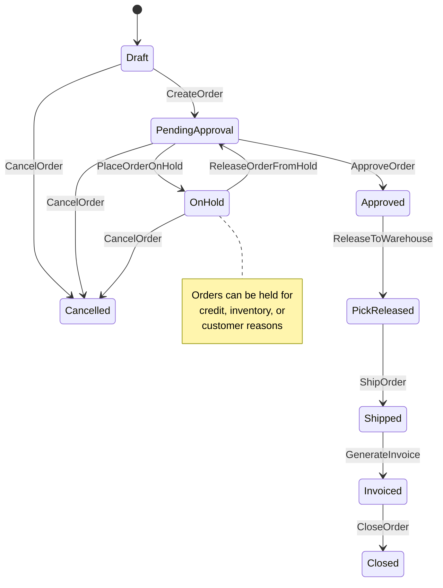
```mermaid
stateDiagram-v2
    [*] --> Draft
    Draft --> PendingApproval: CreateOrder
    Draft --> Cancelled: CancelOrder
    PendingApproval --> Approved: ApproveOrder
    PendingApproval --> OnHold: PlaceOrderOnHold
    PendingApproval --> Cancelled: CancelOrder
    OnHold --> PendingApproval: ReleaseOrderFromHold
    OnHold --> Cancelled: CancelOrder
    Approved --> PickReleased: ReleaseToWarehouse
    PickReleased --> Shipped: ShipOrder
    Shipped --> Invoiced: GenerateInvoice
    Invoiced --> Closed: CloseOrder
    
    note right of OnHold
        Orders can be held for
        credit, inventory, or
        customer reasons
    end note
```

**Commands Involved**:
- `CreateOrder` - Initiate new sales order
- `ApproveOrder` - Authorize order for fulfillment
- `PlaceOrderOnHold` - Suspend order processing
- `ReleaseOrderFromHold` - Resume order processing
- `CancelOrder` - Cancel order with cleanup
- `ReleaseToWarehouse` - Enable fulfillment
- `ShipOrder` - Process shipment
- `GenerateInvoice` - Create customer invoice
- `CloseOrder` - Complete order lifecycle

**Events Involved**:
- `OrderCreated` - Order successfully created
- `OrderApproved` - Approval received
- `OrderPlacedOnHold` - Processing suspended
- `OrderReleasedFromHold` - Processing resumed  
- `OrderCancelled` - Order cancelled
- `OrderReleasedToWarehouse` - Fulfillment enabled
- `OrderShipped` - Shipment completed
- `OrderInvoiced` - Invoice generated
- `OrderClosed` - Lifecycle completed

**Business Rules**:
- Customer must be active and not on credit hold
- Credit check must pass based on order value
- Inventory availability validation for stock items
- Hold release requires resolution of hold conditions
- Cannot cancel orders after shipment without special authorization

---

### 2. Quote Management Workflow

**Description**: Sales quotation lifecycle from creation through customer presentation to order conversion, including approval workflows and competitive analysis.

**State Transitions**:
`Draft` → `Pending Approval` → `Approved` → `Presented` → `Accepted/Rejected` → `Converted/Expired`

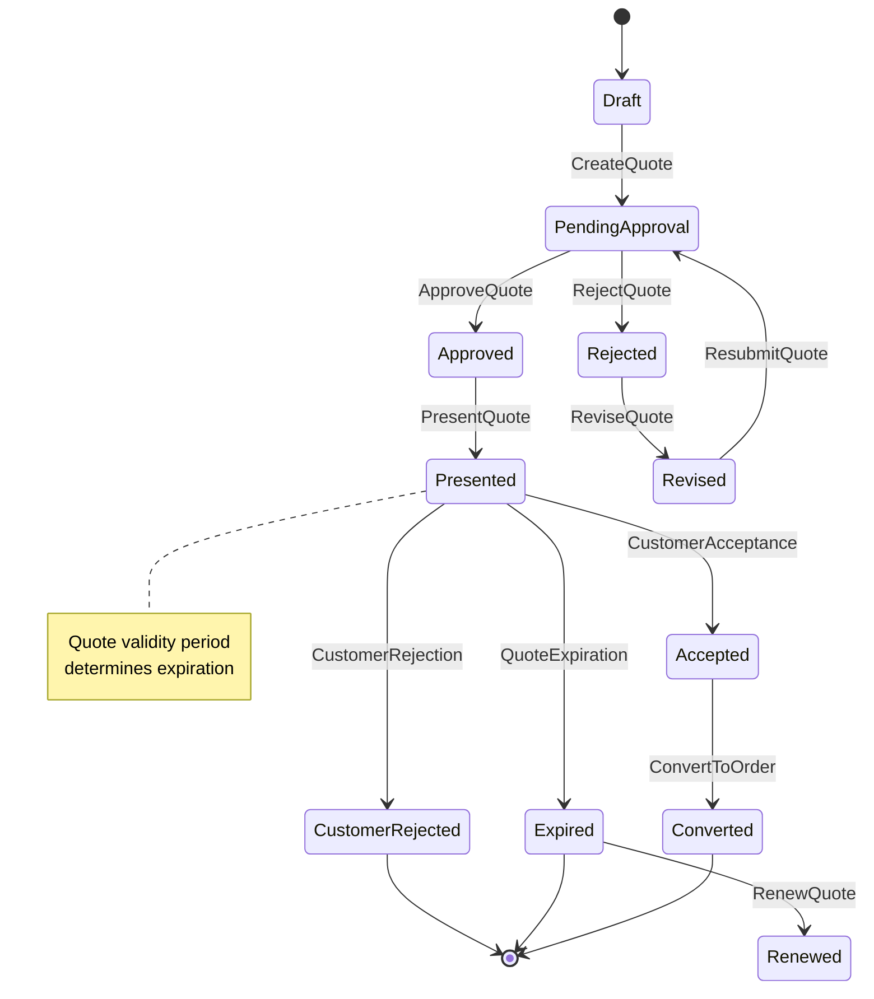
```mermaid
stateDiagram-v2
    [*] --> Draft
    Draft --> PendingApproval: CreateQuote
    PendingApproval --> Approved: ApproveQuote
    PendingApproval --> Rejected: RejectQuote
    Approved --> Presented: PresentQuote
    Presented --> Accepted: CustomerAcceptance
    Presented --> CustomerRejected: CustomerRejection
    Presented --> Expired: QuoteExpiration
    Accepted --> Converted: ConvertToOrder
    CustomerRejected --> [*]
    Expired --> Renewed: RenewQuote
    Expired --> [*]
    Converted --> [*]
    Rejected --> Revised: ReviseQuote
    Revised --> PendingApproval: ResubmitQuote
    
    note right of Presented
        Quote validity period
        determines expiration
    end note
```

**Commands Involved**:
- `CreateQuote` - Generate new sales quote
- `ApproveQuote` - Authorize quote for presentation
- `RejectQuote` - Reject quote with feedback
- `PresentQuote` - Deliver quote to customer
- `ReviseQuote` - Modify quote based on feedback
- `ConvertToOrder` - Transform accepted quote to order
- `ExpireQuote` - Handle quote expiration
- `RenewQuote` - Extend quote validity

**Events Involved**:
- `QuoteCreated` - Quote successfully created
- `QuoteApproved` - Quote authorized for presentation
- `QuoteRejected` - Quote rejected internally
- `QuotePresented` - Quote delivered to customer
- `QuoteRevised` - Quote modified
- `QuoteAccepted` - Customer accepted quote
- `QuoteConverted` - Quote converted to order
- `QuoteExpired` - Quote validity expired
- `QuoteRenewed` - Quote validity extended

**Business Rules**:
- Quote pricing must meet minimum margin requirements
- Approval authority based on discount percentages and order value
- Quote validity period configurable by customer type
- Price lock available during quote validity period
- Customer acceptance required before conversion

---

### 3. Inventory Allocation Workflow

**Description**: Sophisticated inventory allocation including ATP calculations, multi-warehouse optimization, substitution handling, and backorder processing.

**State Transitions**:
`Allocation Required` → `Checking Availability` → `Allocated/Backordered` → `Reserved` → `Picked`

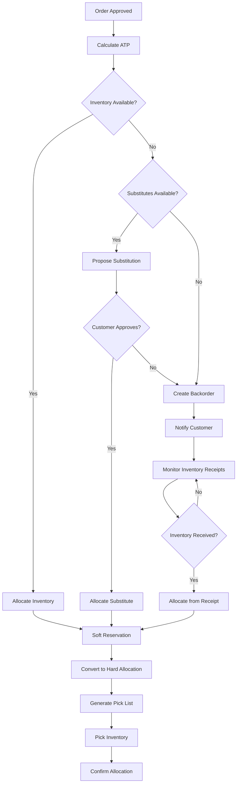
```mermaid
flowchart TD
    A[Order Approved] --> B[Calculate ATP]
    B --> C{Inventory Available?}
    C -->|Yes| D[Allocate Inventory]
    C -->|No| E{Substitutes Available?}
    E -->|Yes| F[Propose Substitution]
    E -->|No| G[Create Backorder]
    
    F --> H{Customer Approves?}
    H -->|Yes| I[Allocate Substitute]
    H -->|No| G
    
    D --> J[Soft Reservation]
    I --> J
    J --> K[Convert to Hard Allocation]
    K --> L[Generate Pick List]
    L --> M[Pick Inventory]
    M --> N[Confirm Allocation]
    
    G --> O[Notify Customer]
    O --> P[Monitor Inventory Receipts]
    P --> Q{Inventory Received?}
    Q -->|Yes| R[Allocate from Receipt]
    Q -->|No| P
    R --> J
```

**Commands Involved**:
- `AllocateInventory` - Reserve inventory for order
- `CalculateATP` - Compute available-to-promise
- `ProposeSubstitution` - Suggest alternative items
- `ProcessBackorder` - Handle unavailable items
- `ConfirmAllocation` - Verify allocation accuracy
- `ReleaseInventoryAllocation` - Return inventory to available
- `HandleSubstitution` - Process approved substitutes

**Events Involved**:
- `InventoryAllocated` - Inventory successfully reserved
- `ATPCalculated` - Availability computed
- `SubstitutionProposed` - Alternative suggested
- `BackorderCreated` - Items backordered
- `AllocationConfirmed` - Allocation verified
- `AllocationReleased` - Inventory returned to pool
- `SubstitutionHandled` - Substitute processed

**Business Rules**:
- ATP calculation includes safety stock and committed orders
- Multi-warehouse allocation optimizes shipping costs
- Substitution requires customer approval for non-equivalent items
- Backorder priority based on customer classification and order date
- Allocation expiry prevents indefinite reservations

---

### 4. Shipment Processing Workflow

**Description**: Physical fulfillment process including picking, packing, shipping coordination, and delivery confirmation with carrier integration.

**State Transitions**:
`Pick Released` → `Picking` → `Picked` → `Packing` → `Packed` → `Shipped` → `Delivered`

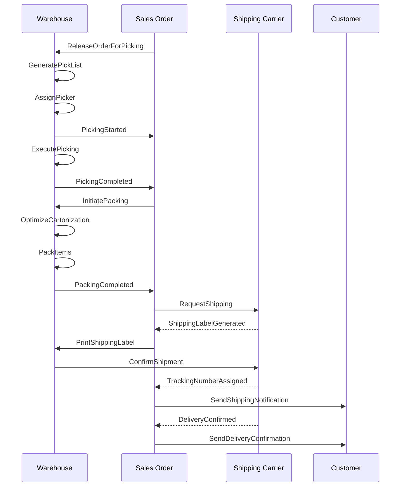
```mermaid
sequenceDiagram
    participant WMS as Warehouse
    participant SO as Sales Order
    participant Carrier as Shipping Carrier
    participant Customer as Customer
    
    SO->>WMS: ReleaseOrderForPicking
    WMS->>WMS: GeneratePickList
    WMS->>WMS: AssignPicker
    WMS->>SO: PickingStarted
    
    WMS->>WMS: ExecutePicking
    WMS->>SO: PickingCompleted
    
    SO->>WMS: InitiatePacking
    WMS->>WMS: OptimizeCartonization
    WMS->>WMS: PackItems
    WMS->>SO: PackingCompleted
    
    SO->>Carrier: RequestShipping
    Carrier-->>SO: ShippingLabelGenerated
    SO->>WMS: PrintShippingLabel
    
    WMS->>Carrier: ConfirmShipment
    Carrier-->>SO: TrackingNumberAssigned
    SO->>Customer: SendShippingNotification
    
    Carrier-->>SO: DeliveryConfirmed
    SO->>Customer: SendDeliveryConfirmation
```

**Commands Involved**:
- `ReleaseOrderForPicking` - Enable warehouse picking
- `GeneratePickList` - Create picking instructions
- `CompletePicking` - Confirm items picked
- `InitiatePacking` - Begin packing process
- `OptimizeCartonization` - Determine packaging
- `RequestShipping` - Coordinate carrier pickup
- `PrintShippingLabel` - Generate shipping documentation
- `ConfirmShipment` - Verify shipment with carrier
- `UpdateTrackingInfo` - Record tracking details
- `ConfirmDelivery` - Record delivery completion

**Events Involved**:
- `OrderReleasedForPicking` - Picking authorized
- `PickListGenerated` - Pick instructions created
- `PickingCompleted` - Items successfully picked
- `PackingInitiated` - Packing process started
- `CartonizationOptimized` - Packaging determined
- `ShippingRequested` - Carrier coordination initiated
- `ShippingLabelPrinted` - Documentation generated
- `ShipmentConfirmed` - Carrier confirmed pickup
- `TrackingInfoUpdated` - Tracking details recorded
- `DeliveryConfirmed` - Delivery completed

**Business Rules**:
- Pick list generation requires inventory allocation
- Packing optimization considers weight and dimension limits
- Carrier selection based on service level and cost optimization
- Tracking information required for shipments above value threshold
- Delivery confirmation enables automatic invoice generation

---

### 5. Blanket Order Management Workflow

**Description**: Long-term customer agreements allowing multiple order releases against pre-negotiated terms and pricing with commitment tracking.

**State Transitions**:
`Agreement Created` → `Active` → `Releasing` → `Partially Fulfilled` → `Completed/Expired`

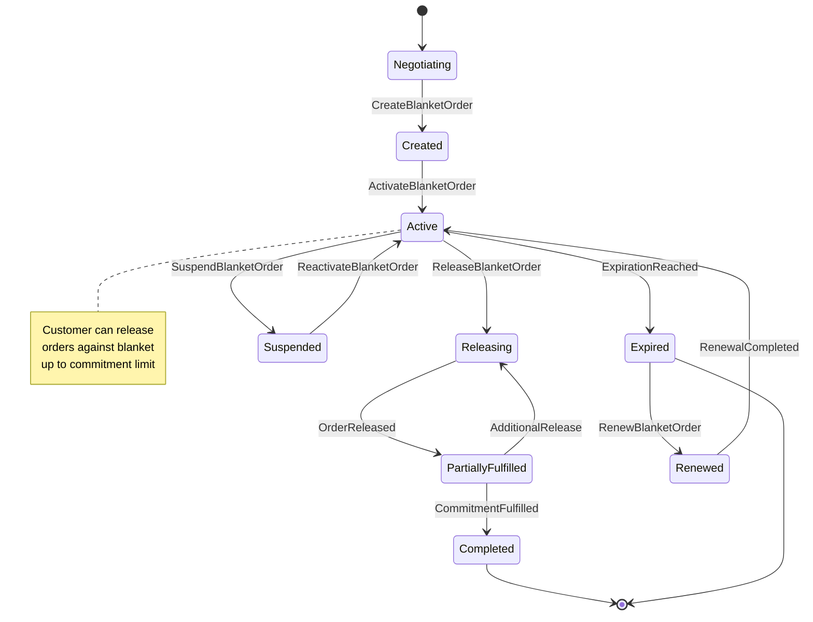
```mermaid
stateDiagram-v2
    [*] --> Negotiating
    Negotiating --> Created: CreateBlanketOrder
    Created --> Active: ActivateBlanketOrder
    Active --> Releasing: ReleaseBlanketOrder
    Releasing --> PartiallyFulfilled: OrderReleased
    PartiallyFulfilled --> Releasing: AdditionalRelease
    PartiallyFulfilled --> Completed: CommitmentFulfilled
    Active --> Suspended: SuspendBlanketOrder
    Suspended --> Active: ReactivateBlanketOrder
    Active --> Expired: ExpirationReached
    Expired --> Renewed: RenewBlanketOrder
    Renewed --> Active: RenewalCompleted
    Completed --> [*]
    Expired --> [*]
    
    note right of Active
        Customer can release
        orders against blanket
        up to commitment limit
    end note
```

**Commands Involved**:
- `CreateBlanketOrder` - Establish master agreement
- `ActivateBlanketOrder` - Enable order releases
- `ReleaseBlanketOrder` - Convert portion to sales order
- `SuspendBlanketOrder` - Temporarily halt releases
- `ReactivateBlanketOrder` - Resume release capability
- `AmendBlanketTerms` - Modify agreement terms
- `RenewBlanketOrder` - Extend agreement period
- `ExpireBlanketOrder` - Handle agreement expiration

**Events Involved**:
- `BlanketOrderCreated` - Agreement established
- `BlanketOrderActivated` - Releases enabled
- `BlanketOrderReleased` - Order generated from blanket
- `BlanketOrderSuspended` - Releases temporarily halted
- `BlanketOrderReactivated` - Releases resumed
- `BlanketTermsAmended` - Agreement modified
- `BlanketOrderRenewed` - Agreement extended
- `BlanketOrderExpired` - Agreement ended

**Business Rules**:
- Customer must meet qualification criteria for blanket orders
- Total commitment cannot exceed customer credit limit
- Release quantities must be within minimum/maximum parameters
- Pricing locked for agreement duration unless escalation clauses
- Commitment fulfillment tracking for performance evaluation

---

### 6. Recurring Order Automation Workflow

**Description**: Automated recurring order generation including template management, schedule processing, and exception handling with customer lifecycle integration.

**State Transitions**:
`Template Created` → `Active` → `Generating` → `Generated` → `Suspended/Completed`

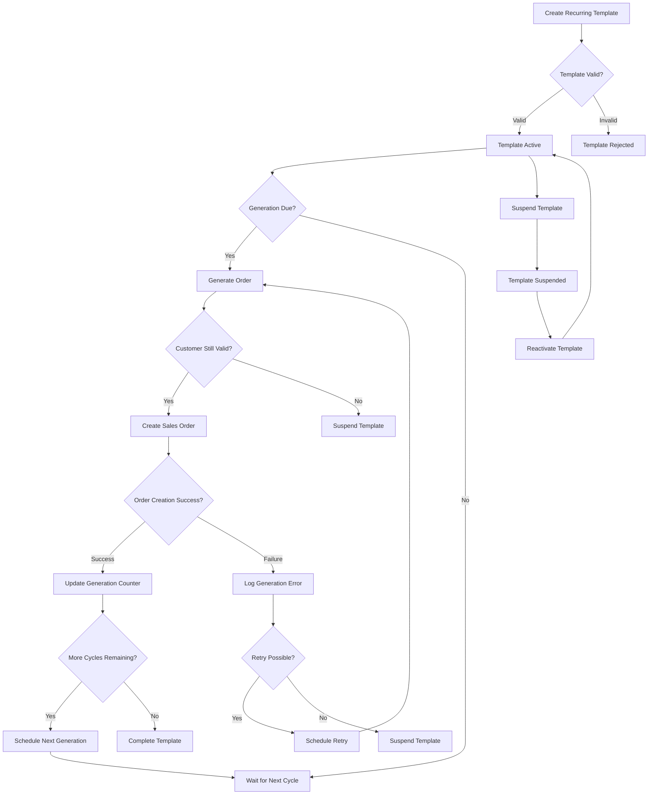
```mermaid
flowchart TD
    A[Create Recurring Template] --> B{Template Valid?}
    B -->|Valid| C[Template Active]
    B -->|Invalid| D[Template Rejected]
    
    C --> E{Generation Due?}
    E -->|Yes| F[Generate Order]
    E -->|No| G[Wait for Next Cycle]
    
    F --> H{Customer Still Valid?}
    H -->|Yes| I[Create Sales Order]
    H -->|No| J[Suspend Template]
    
    I --> K{Order Creation Success?}
    K -->|Success| L[Update Generation Counter]
    K -->|Failure| M[Log Generation Error]
    
    L --> N{More Cycles Remaining?}
    N -->|Yes| O[Schedule Next Generation]
    N -->|No| P[Complete Template]
    
    O --> G
    M --> Q{Retry Possible?}
    Q -->|Yes| R[Schedule Retry]
    Q -->|No| S[Suspend Template]
    R --> F
    
    C --> T[Suspend Template]
    T --> U[Template Suspended]
    U --> V[Reactivate Template]
    V --> C
```

**Commands Involved**:
- `CreateRecurringOrder` - Setup recurring template
- `GenerateRecurringOrder` - Create order from template
- `ModifyRecurringSchedule` - Update schedule parameters
- `SuspendRecurringOrder` - Pause generation
- `ReactivateRecurringOrder` - Resume generation
- `CompleteRecurringOrder` - End recurring cycle
- `HandleGenerationError` - Process generation failures

**Events Involved**:
- `RecurringOrderCreated` - Template established
- `RecurringOrderGenerated` - Order created from template
- `RecurringScheduleModified` - Schedule updated
- `RecurringOrderSuspended` - Generation paused
- `RecurringOrderReactivated` - Generation resumed
- `RecurringOrderCompleted` - Cycle ended
- `GenerationErrorHandled` - Error processed

**Business Rules**:
- Customer must remain active throughout recurring cycle
- Generation dates calculated based on schedule configuration
- Pricing can be fixed or current market rates
- Template suspension requires business justification
- Error handling includes automatic retry and manual intervention

---

## Advanced Order Processing Workflows

### 7. Kit Management and Customization Workflow

**Description**: Complex kit item processing including component explosion, customization handling, and assembly coordination with inventory integration.

**State Transitions**:
`Kit Ordered` → `Components Exploded` → `Customized` → `Components Allocated` → `Assembled` → `Shipped`

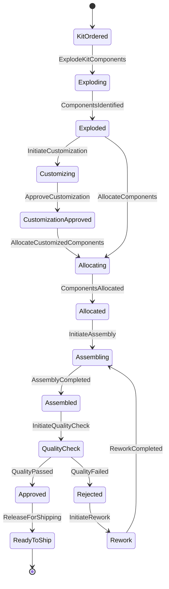
```mermaid
stateDiagram-v2
    [*] --> KitOrdered
    KitOrdered --> Exploding: ExplodeKitComponents
    Exploding --> Exploded: ComponentsIdentified
    Exploded --> Customizing: InitiateCustomization
    Exploded --> Allocating: AllocateComponents
    Customizing --> CustomizationApproved: ApproveCustomization
    CustomizationApproved --> Allocating: AllocateCustomizedComponents
    Allocating --> Allocated: ComponentsAllocated
    Allocated --> Assembling: InitiateAssembly
    Assembling --> Assembled: AssemblyCompleted
    Assembled --> QualityCheck: InitiateQualityCheck
    QualityCheck --> Approved: QualityPassed
    QualityCheck --> Rejected: QualityFailed
    Rejected --> Rework: InitiateRework
    Rework --> Assembling: ReworkCompleted
    Approved --> ReadyToShip: ReleaseForShipping
    ReadyToShip --> [*]
```

**Commands Involved**:
- `ConfigureKitComponents` - Setup kit component structure
- `ExplodeKitComponents` - Break kit into components
- `InitiateCustomization` - Begin kit customization
- `ApproveCustomization` - Authorize kit modifications
- `AllocateComponents` - Reserve component inventory
- `AssembleKit` - Coordinate kit assembly
- `ValidateComponents` - Verify component accuracy
- `ProcessSubstitution` - Handle component substitutes

**Events Involved**:
- `KitComponentsConfigured` - Kit structure defined
- `KitComponentsExploded` - Components identified
- `CustomizationInitiated` - Customization process started
- `CustomizationApproved` - Modifications authorized
- `ComponentsAllocated` - Component inventory reserved
- `KitAssembled` - Assembly completed
- `ComponentsValidated` - Component accuracy verified
- `SubstitutionProcessed` - Substitute handled

**Business Rules**:
- All kit components must be valid inventory items
- Customization requires customer approval and pricing adjustment
- Component allocation follows standard inventory rules
- Assembly quality control required before shipment
- Substitution authorization for out-of-stock components

---

### 8. Advanced Billing Workflow

**Description**: Complex billing scenarios including milestone billing, progress billing, and contract-based billing with revenue recognition coordination.

**State Transitions**:
`Billing Setup` → `Active` → `Milestone Reached` → `Billed` → `Paid` → `Completed`

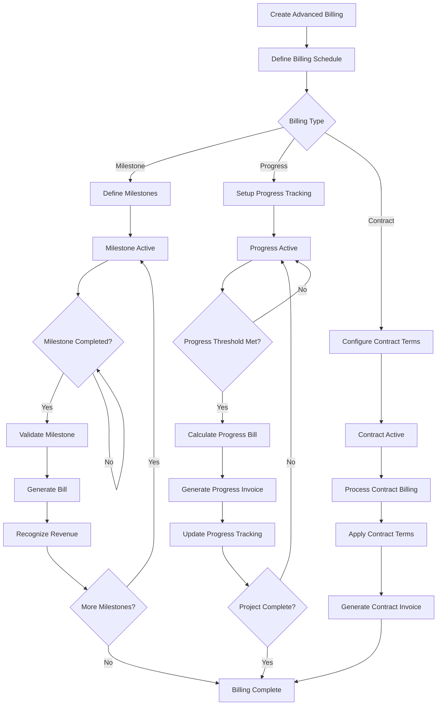
```mermaid
flowchart TD
    A[Create Advanced Billing] --> B[Define Billing Schedule]
    B --> C{Billing Type}
    C -->|Milestone| D[Define Milestones]
    C -->|Progress| E[Setup Progress Tracking]
    C -->|Contract| F[Configure Contract Terms]
    
    D --> G[Milestone Active]
    E --> H[Progress Active]
    F --> I[Contract Active]
    
    G --> J{Milestone Completed?}
    J -->|Yes| K[Validate Milestone]
    J -->|No| J
    K --> L[Generate Bill]
    L --> M[Recognize Revenue]
    M --> N{More Milestones?}
    N -->|Yes| G
    N -->|No| O[Billing Complete]
    
    H --> P{Progress Threshold Met?}
    P -->|Yes| Q[Calculate Progress Bill]
    P -->|No| H
    Q --> R[Generate Progress Invoice]
    R --> S[Update Progress Tracking]
    S --> T{Project Complete?}
    T -->|Yes| O
    T -->|No| H
    
    I --> U[Process Contract Billing]
    U --> V[Apply Contract Terms]
    V --> W[Generate Contract Invoice]
    W --> O
```

**Commands Involved**:
- `CreateAdvancedBilling` - Setup complex billing arrangement
- `ProcessMilestone` - Handle milestone completion
- `CalculateProgress` - Determine progress billing amount
- `GenerateBill` - Create billing document
- `ValidateMilestone` - Verify milestone completion
- `UpdateProgress` - Record progress measurements
- `RecognizeRevenue` - Coordinate revenue recognition

**Events Involved**:
- `AdvancedBillingCreated` - Billing arrangement established
- `MilestoneProcessed` - Milestone completion handled
- `ProgressCalculated` - Progress billing computed
- `BillGenerated` - Billing document created
- `MilestoneValidated` - Completion verified
- `ProgressUpdated` - Progress recorded
- `RevenueRecognized` - Revenue recognition processed

**Business Rules**:
- Advanced billing requires customer contract agreement
- Milestone definitions must be measurable and verifiable
- Progress billing based on objective completion criteria
- Revenue recognition follows accounting standards
- Billing schedule must align with project delivery schedule

---

## Payment and Credit Workflows

### 9. Credit Management Workflow

**Description**: Dynamic customer credit evaluation including limit management, hold processing, and risk assessment with automated triggers.

**State Transitions**:
`Credit Evaluation` → `Credit Approved` → `Credit Warning` → `Credit Hold` → `Credit Restored`

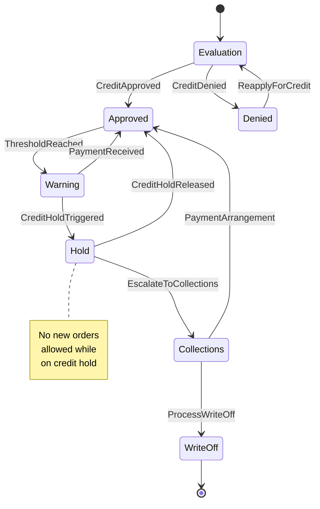
```mermaid
stateDiagram-v2
    [*] --> Evaluation
    Evaluation --> Approved: CreditApproved
    Evaluation --> Denied: CreditDenied
    Approved --> Warning: ThresholdReached
    Warning --> Hold: CreditHoldTriggered
    Warning --> Approved: PaymentReceived
    Hold --> Collections: EscalateToCollections
    Hold --> Approved: CreditHoldReleased
    Collections --> WriteOff: ProcessWriteOff
    Collections --> Approved: PaymentArrangement
    Denied --> Evaluation: ReapplyForCredit
    WriteOff --> [*]
    
    note right of Hold
        No new orders
        allowed while
        on credit hold
    end note
```

**Commands Involved**:
- `ValidateCustomerCredit` - Evaluate creditworthiness
- `SetCreditLimit` - Establish credit parameters
- `ProcessCreditHold` - Place customer on hold
- `ReleaseCreditHold` - Remove hold status
- `UpdateCreditTerms` - Modify payment terms
- `EscalateToCollections` - Begin collection process
- `ProcessWriteOff` - Handle bad debt

**Events Involved**:
- `CustomerCreditValidated` - Credit evaluation completed
- `CreditLimitSet` - Credit parameters established
- `CreditHoldProcessed` - Hold status applied
- `CreditHoldReleased` - Hold status removed
- `CreditTermsUpdated` - Payment terms modified
- `CollectionProcessInitiated` - Collections begun
- `WriteOffProcessed` - Bad debt handled

**Business Rules**:
- Credit evaluation based on payment history and financial strength
- Automatic hold triggers when exposure exceeds percentage of limit
- Hold release requires resolution of underlying credit issues
- Collection escalation follows defined aging thresholds
- Write-off requires management approval above threshold amounts

---

### 10. Payment Processing Workflow

**Description**: Order payment processing including method validation, authorization, capture, and settlement with fraud prevention.

**State Transitions**:
`Payment Initiated` → `Authorized` → `Captured` → `Settled` → `Reconciled`

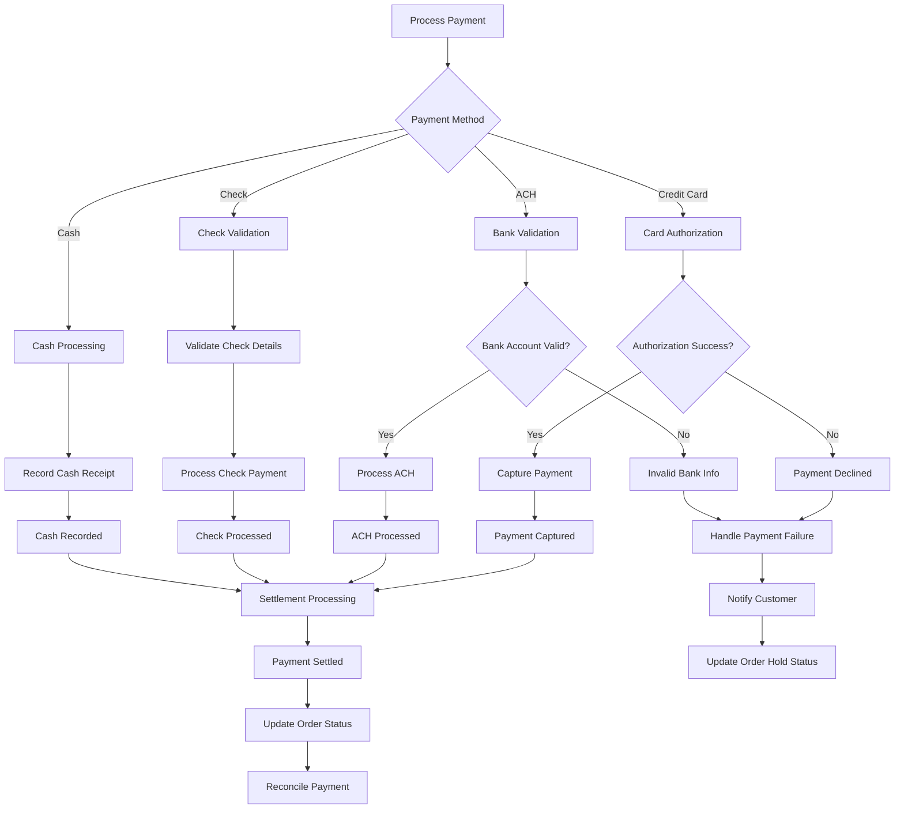
```mermaid
flowchart TD
    A[Process Payment] --> B{Payment Method}
    B -->|Credit Card| C[Card Authorization]
    B -->|ACH| D[Bank Validation]
    B -->|Check| E[Check Validation]
    B -->|Cash| F[Cash Processing]
    
    C --> G{Authorization Success?}
    G -->|Yes| H[Capture Payment]
    G -->|No| I[Payment Declined]
    
    D --> J{Bank Account Valid?}
    J -->|Yes| K[Process ACH]
    J -->|No| L[Invalid Bank Info]
    
    E --> M[Validate Check Details]
    M --> N[Process Check Payment]
    
    F --> O[Record Cash Receipt]
    
    H --> P[Payment Captured]
    K --> Q[ACH Processed]
    N --> R[Check Processed]
    O --> S[Cash Recorded]
    
    P --> T[Settlement Processing]
    Q --> T
    R --> T
    S --> T
    
    T --> U[Payment Settled]
    U --> V[Update Order Status]
    V --> W[Reconcile Payment]
    
    I --> X[Handle Payment Failure]
    L --> X
    X --> Y[Notify Customer]
    Y --> Z[Update Order Hold Status]
```

**Commands Involved**:
- `ProcessPayment` - Initiate payment processing
- `AuthorizePayment` - Obtain payment authorization
- `CapturePayment` - Capture authorized payment
- `ProcessRefund` - Handle payment refunds
- `ValidatePaymentMethod` - Verify payment details
- `HandlePaymentFailure` - Process failed payments
- `ReconcilePayment` - Match payment to settlement

**Events Involved**:
- `PaymentProcessed` - Payment processing initiated
- `PaymentAuthorized` - Authorization received
- `PaymentCaptured` - Payment captured successfully
- `RefundProcessed` - Refund completed
- `PaymentMethodValidated` - Payment details verified
- `PaymentFailureHandled` - Failure processed
- `PaymentReconciled` - Payment matched to settlement

**Business Rules**:
- Payment authorization required before order shipment
- Credit card pre-authorization for high-value orders
- ACH payments require customer bank account validation
- Payment failures trigger order hold until resolved
- Refund processing follows original payment method when possible

---

## Import and Integration Workflows

### 11. Bulk Order Import Workflow

**Description**: High-volume order import processing including file validation, business rule checking, and batch processing with comprehensive error handling.

**State Transitions**:
`File Uploaded` → `Validating` → `Processing` → `Completed` → `Archived`

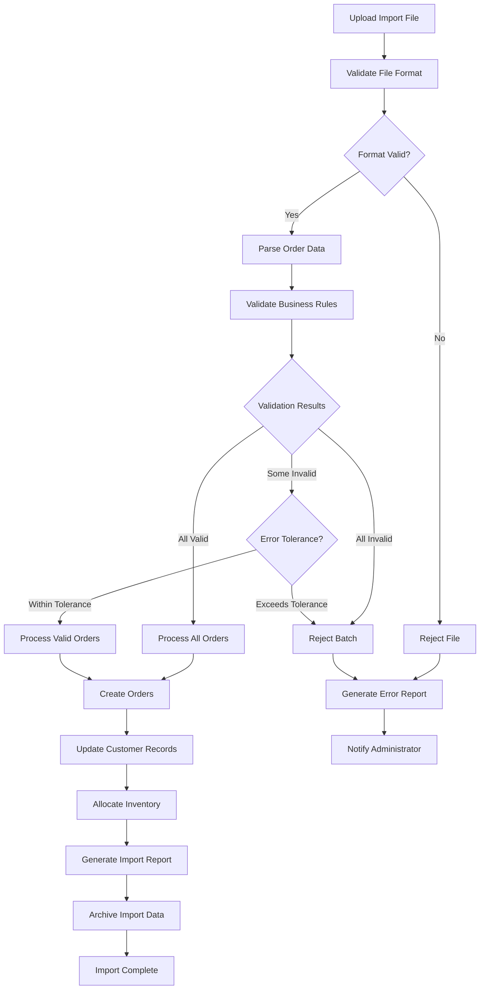
```mermaid
flowchart TD
    A[Upload Import File] --> B[Validate File Format]
    B --> C{Format Valid?}
    C -->|No| D[Reject File]
    C -->|Yes| E[Parse Order Data]
    
    E --> F[Validate Business Rules]
    F --> G{Validation Results}
    G -->|All Valid| H[Process All Orders]
    G -->|Some Invalid| I{Error Tolerance?}
    G -->|All Invalid| J[Reject Batch]
    
    I -->|Within Tolerance| K[Process Valid Orders]
    I -->|Exceeds Tolerance| J
    
    H --> L[Create Orders]
    K --> L
    L --> M[Update Customer Records]
    M --> N[Allocate Inventory]
    N --> O[Generate Import Report]
    O --> P[Archive Import Data]
    
    D --> Q[Generate Error Report]
    J --> Q
    Q --> R[Notify Administrator]
    
    P --> S[Import Complete]
```

**Commands Involved**:
- `InitiateImport` - Begin import process
- `ValidateImportFile` - Check file structure and content
- `ProcessImportBatch` - Create orders from valid data
- `HandleImportError` - Process validation failures
- `CompleteImport` - Finalize import process
- `RollbackImport` - Reverse failed import
- `GenerateImportReport` - Create processing summary

**Events Involved**:
- `ImportInitiated` - Import process started
- `ImportFileValidated` - File validation completed
- `ImportBatchProcessed` - Valid records processed
- `ImportErrorHandled` - Errors managed
- `ImportCompleted` - Process finished successfully
- `ImportRolledBack` - Failed import reversed
- `ImportReportGenerated` - Summary created

**Business Rules**:
- Import file must conform to defined template structure
- All orders must pass business rule validation
- Error tolerance configurable per import type
- Failed imports preserve data for manual review
- Import audit trail maintained for compliance

---

### 12. Customer Integration Workflow

**Description**: External customer system integration including EDI processing, API coordination, and real-time status synchronization.

**State Transitions**:
`Integration Setup` → `Active` → `Synchronizing` → `Error Handling` → `Recovered`

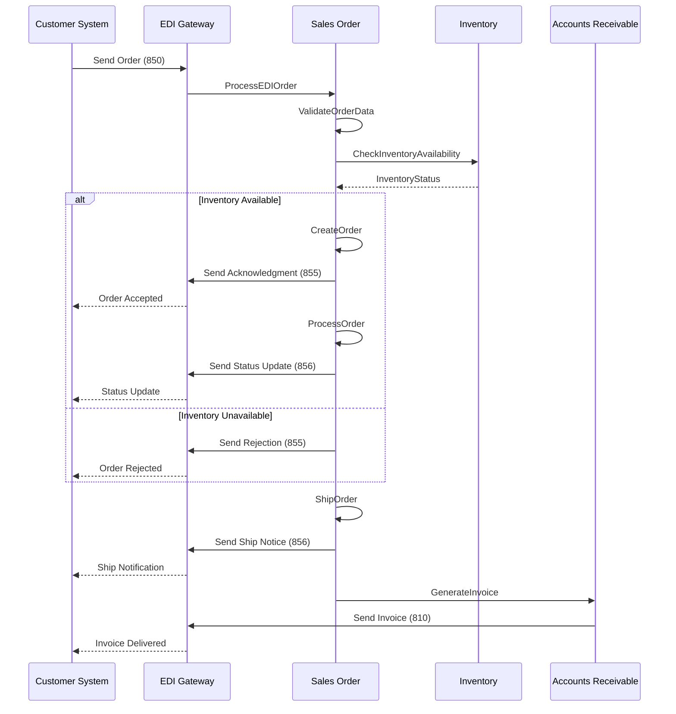
```mermaid
sequenceDiagram
    participant Customer as Customer System
    participant EDI as EDI Gateway
    participant SO as Sales Order
    participant IC as Inventory
    participant AR as Accounts Receivable
    
    Customer->>EDI: Send Order (850)
    EDI->>SO: ProcessEDIOrder
    SO->>SO: ValidateOrderData
    SO->>IC: CheckInventoryAvailability
    IC-->>SO: InventoryStatus
    
    alt Inventory Available
        SO->>SO: CreateOrder
        SO->>EDI: Send Acknowledgment (855)
        EDI-->>Customer: Order Accepted
        SO->>SO: ProcessOrder
        SO->>EDI: Send Status Update (856)
        EDI-->>Customer: Status Update
    else Inventory Unavailable
        SO->>EDI: Send Rejection (855)
        EDI-->>Customer: Order Rejected
    end
    
    SO->>SO: ShipOrder
    SO->>EDI: Send Ship Notice (856)
    EDI-->>Customer: Ship Notification
    
    SO->>AR: GenerateInvoice
    AR->>EDI: Send Invoice (810)
    EDI-->>Customer: Invoice Delivered
```

**Commands Involved**:
- `ProcessEDIOrder` - Handle EDI order transactions
- `SyncOrderStatus` - Synchronize status with customer
- `ValidateCustomerData` - Verify customer integration data
- `HandleIntegrationError` - Process integration failures
- `SendOrderAcknowledgment` - Confirm order receipt
- `SendStatusUpdate` - Provide order status updates
- `SendShipNotice` - Notify shipment completion

**Events Involved**:
- `EDIOrderProcessed` - EDI transaction completed
- `OrderStatusSynced` - Status synchronized
- `CustomerDataValidated` - Integration data verified
- `IntegrationErrorHandled` - Error processed
- `OrderAcknowledgmentSent` - Confirmation delivered
- `StatusUpdateSent` - Status communicated
- `ShipNoticeSent` - Shipment notification delivered

**Business Rules**:
- EDI transactions must follow industry standards (X12, EDIFACT)
- Customer system integration requires authentication
- Status synchronization mandatory for integrated customers
- Error handling includes retry mechanisms and manual intervention
- Integration audit trail required for compliance

---

### 13. Warehouse Integration Workflow

**Description**: Seamless integration with warehouse management systems including pick list generation, fulfillment coordination, and inventory synchronization.

**State Transitions**:
`Order Released` → `Pick List Generated` → `Picking` → `Packed` → `Shipped` → `Inventory Updated`

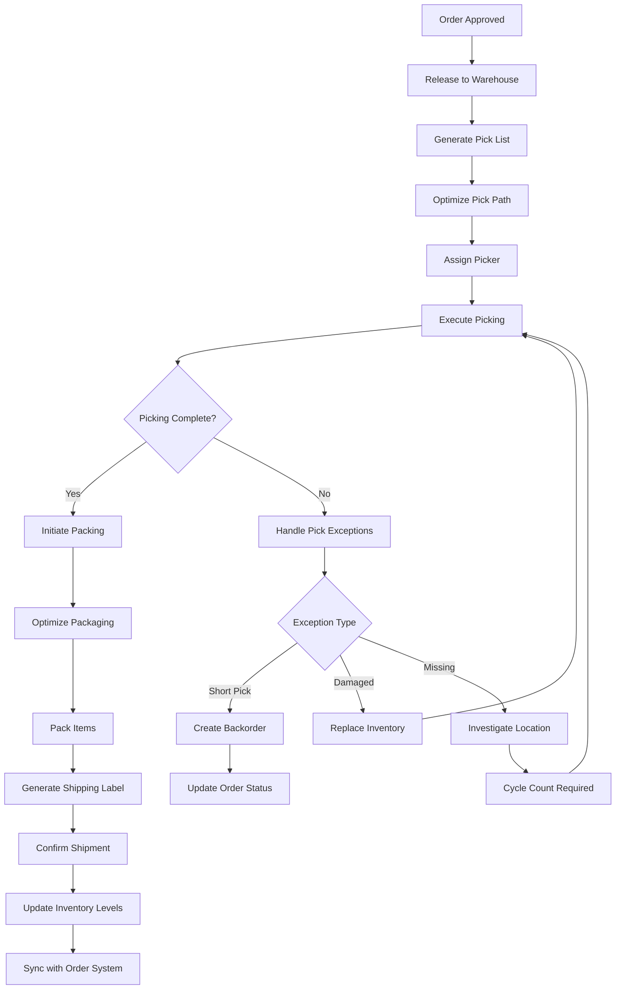
```mermaid
flowchart TD
    A[Order Approved] --> B[Release to Warehouse]
    B --> C[Generate Pick List]
    C --> D[Optimize Pick Path]
    D --> E[Assign Picker]
    E --> F[Execute Picking]
    F --> G{Picking Complete?}
    G -->|Yes| H[Initiate Packing]
    G -->|No| I[Handle Pick Exceptions]
    
    I --> J{Exception Type}
    J -->|Short Pick| K[Create Backorder]
    J -->|Damaged| L[Replace Inventory]
    J -->|Missing| M[Investigate Location]
    
    K --> N[Update Order Status]
    L --> F
    M --> O[Cycle Count Required]
    O --> F
    
    H --> P[Optimize Packaging]
    P --> Q[Pack Items]
    Q --> R[Generate Shipping Label]
    R --> S[Confirm Shipment]
    S --> T[Update Inventory Levels]
    T --> U[Sync with Order System]
```

**Commands Involved**:
- `ReleaseOrderToWarehouse` - Enable warehouse processing
- `GeneratePickList` - Create picking instructions
- `OptimizePickPath` - Determine efficient route
- `ExecutePicking` - Perform item picking
- `HandlePickException` - Process picking issues
- `InitiatePacking` - Begin packing process
- `GenerateShippingLabel` - Create shipping documentation
- `ConfirmShipment` - Verify shipment completion
- `SyncInventoryStatus` - Update inventory levels

**Events Involved**:
- `OrderReleasedToWarehouse` - Warehouse processing enabled
- `PickListGenerated` - Pick instructions created
- `PickPathOptimized` - Route determined
- `PickingExecuted` - Items picked
- `PickExceptionHandled` - Issue resolved
- `PackingInitiated` - Packing started
- `ShippingLabelGenerated` - Documentation created
- `ShipmentConfirmed` - Shipment verified
- `InventoryStatusSynced` - Levels updated

**Business Rules**:
- Pick list generation requires approved orders with allocated inventory
- Pick path optimization considers warehouse layout and efficiency
- Pick exceptions require immediate resolution or alternative processing
- Packing optimization considers weight, dimensions, and fragility
- Inventory synchronization maintains real-time accuracy

---

## Order Cancellation and Returns Workflows

### 14. Order Cancellation Workflow

**Description**: Comprehensive order cancellation processing including impact analysis, compensation handling, and stakeholder notification.

**State Transitions**:
`Cancellation Requested` → `Impact Analysis` → `Authorized` → `Processing` → `Completed`

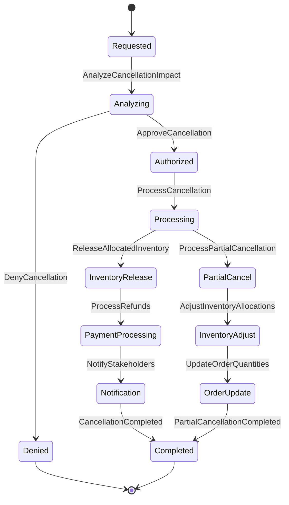
```mermaid
stateDiagram-v2
    [*] --> Requested
    Requested --> Analyzing: AnalyzeCancellationImpact
    Analyzing --> Authorized: ApproveCancellation
    Analyzing --> Denied: DenyCancellation
    Authorized --> Processing: ProcessCancellation
    Processing --> InventoryRelease: ReleaseAllocatedInventory
    InventoryRelease --> PaymentProcessing: ProcessRefunds
    PaymentProcessing --> Notification: NotifyStakeholders
    Notification --> Completed: CancellationCompleted
    Denied --> [*]
    Completed --> [*]
    
    Processing --> PartialCancel: ProcessPartialCancellation
    PartialCancel --> InventoryAdjust: AdjustInventoryAllocations
    InventoryAdjust --> OrderUpdate: UpdateOrderQuantities
    OrderUpdate --> Completed: PartialCancellationCompleted
```

**Commands Involved**:
- `RequestCancellation` - Initiate cancellation request
- `AnalyzeCancellationImpact` - Assess impact on operations
- `ApproveCancellation` - Authorize cancellation
- `ProcessCancellation` - Execute cancellation
- `ReleaseAllocatedInventory` - Return inventory to pool
- `ProcessRefunds` - Handle payment refunds
- `NotifyStakeholders` - Communicate cancellation
- `CompleteCancellation` - Finalize cancellation

**Events Involved**:
- `CancellationRequested` - Request initiated
- `CancellationImpactAnalyzed` - Impact assessed
- `CancellationApproved` - Authorization received
- `CancellationProcessed` - Cancellation executed
- `InventoryReleased` - Allocations returned
- `RefundsProcessed` - Payments refunded
- `StakeholdersNotified` - Communication completed
- `CancellationCompleted` - Process finished

**Business Rules**:
- Cancellation authorization based on order value and status
- Cannot cancel orders already shipped without return authorization
- Inventory allocation must be released immediately
- Refund processing depends on payment method and timing
- Customer notification required for all cancellations

---

### 15. Territory Management Workflow

**Description**: Sales territory configuration and assignment including geographic boundaries, customer assignments, and performance tracking.

**State Transitions**:
`Territory Defined` → `Customers Assigned` → `Salesperson Allocated` → `Active` → `Rebalanced`

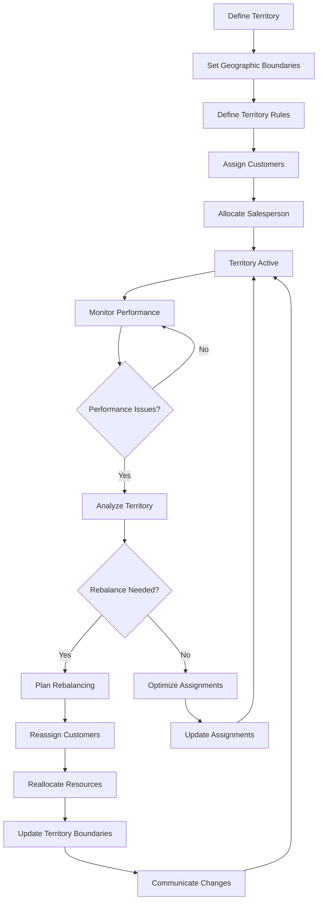
```mermaid
flowchart TD
    A[Define Territory] --> B[Set Geographic Boundaries]
    B --> C[Define Territory Rules]
    C --> D[Assign Customers]
    D --> E[Allocate Salesperson]
    E --> F[Territory Active]
    
    F --> G[Monitor Performance]
    G --> H{Performance Issues?}
    H -->|Yes| I[Analyze Territory]
    H -->|No| G
    
    I --> J{Rebalance Needed?}
    J -->|Yes| K[Plan Rebalancing]
    J -->|No| L[Optimize Assignments]
    
    K --> M[Reassign Customers]
    M --> N[Reallocate Resources]
    N --> O[Update Territory Boundaries]
    O --> P[Communicate Changes]
    P --> F
    
    L --> Q[Update Assignments]
    Q --> F
```

**Commands Involved**:
- `DefineTerritory` - Create territory structure
- `AssignCustomers` - Assign customers to territories
- `AllocateSalesperson` - Assign sales resources
- `RebalanceTerritories` - Optimize territory assignments
- `UpdateTerritoryBoundaries` - Modify geographic limits
- `TransferCustomerTerritory` - Move customer assignments
- `AnalyzeTerritoryPerformance` - Evaluate territory metrics

**Events Involved**:
- `TerritoryDefined` - Territory structure created
- `CustomersAssigned` - Customer assignments completed
- `SalespersonAllocated` - Sales resources assigned
- `TerritoriesRebalanced` - Assignments optimized
- `TerritoryBoundariesUpdated` - Geographic limits modified
- `CustomerTerritoryTransferred` - Customer moved
- `TerritoryPerformanceAnalyzed` - Metrics evaluated

**Business Rules**:
- Territory boundaries must not overlap for same product lines
- Customer assignments based on geographic or industry criteria
- Salesperson allocation considers capacity and expertise
- Rebalancing requires management approval for customer transfers
- Performance tracking includes sales metrics and customer satisfaction

---

## Analytics and Reporting Workflows

### 16. Sales Analytics Workflow

**Description**: Comprehensive sales performance analysis including trend identification, forecasting, and business intelligence generation.

**State Transitions**:
`Data Collection` → `Analysis` → `Pattern Recognition` → `Forecasting` → `Reporting`

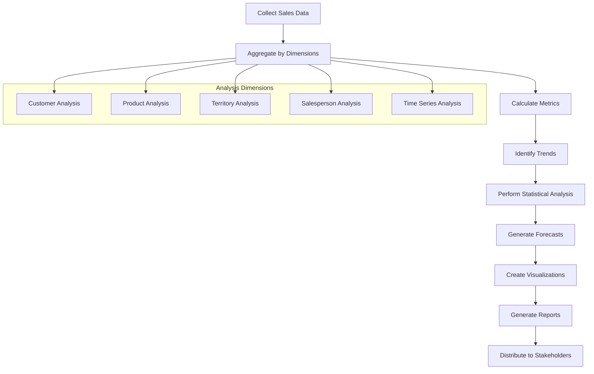
```mermaid
flowchart TD
    A[Collect Sales Data] --> B[Aggregate by Dimensions]
    B --> C[Calculate Metrics]
    C --> D[Identify Trends]
    D --> E[Perform Statistical Analysis]
    E --> F[Generate Forecasts]
    F --> G[Create Visualizations]
    G --> H[Generate Reports]
    H --> I[Distribute to Stakeholders]
    
    subgraph "Analysis Dimensions"
        J[Customer Analysis]
        K[Product Analysis] 
        L[Territory Analysis]
        M[Salesperson Analysis]
        N[Time Series Analysis]
    end
    
    B --> J
    B --> K
    B --> L
    B --> M
    B --> N
```

**Commands Involved**:
- `CalculateSalesMetrics` - Compute performance indicators
- `AnalyzeCustomerBehavior` - Study customer patterns
- `GenerateForecast` - Create sales projections
- `CreateAnalyticsReport` - Generate business intelligence
- `IdentifyTrends` - Detect patterns in data
- `UpdatePerformanceTargets` - Adjust sales goals
- `ScheduleAnalyticsRefresh` - Automate report generation

**Events Involved**:
- `SalesMetricsCalculated` - Performance indicators computed
- `CustomerBehaviorAnalyzed` - Patterns identified
- `ForecastGenerated` - Projections created
- `AnalyticsReportCreated` - Reports generated
- `TrendsIdentified` - Patterns detected
- `PerformanceTargetsUpdated` - Goals adjusted
- `AnalyticsRefreshScheduled` - Automation configured

**Business Rules**:
- Analytics data must be current within defined freshness window
- Forecasting uses minimum 12 months historical data
- Customer behavior analysis respects privacy requirements
- Performance targets require management approval
- Report distribution follows security and confidentiality rules

---

### 17. Order Fulfillment Analytics Workflow

**Description**: Fulfillment performance monitoring including cycle time analysis, accuracy measurement, and optimization recommendations.

**State Transitions**:
`Performance Data Collected` → `Analyzed` → `Benchmarked` → `Optimized` → `Monitored`

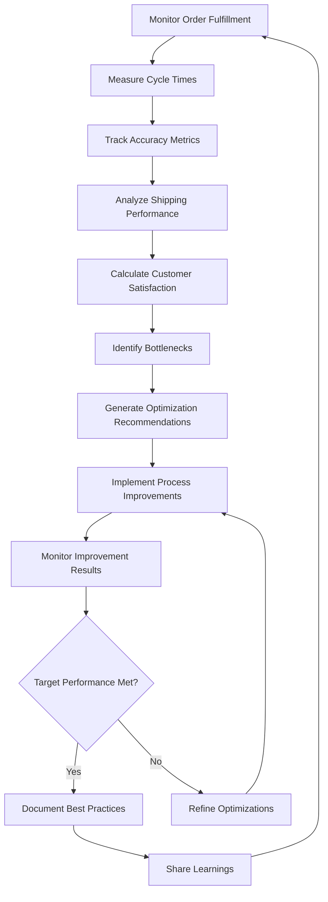
```mermaid
flowchart TD
    A[Monitor Order Fulfillment] --> B[Measure Cycle Times]
    B --> C[Track Accuracy Metrics]
    C --> D[Analyze Shipping Performance]
    D --> E[Calculate Customer Satisfaction]
    E --> F[Identify Bottlenecks]
    F --> G[Generate Optimization Recommendations]
    G --> H[Implement Process Improvements]
    H --> I[Monitor Improvement Results]
    I --> J{Target Performance Met?}
    J -->|Yes| K[Document Best Practices]
    J -->|No| L[Refine Optimizations]
    L --> H
    K --> M[Share Learnings]
    M --> A
```

**Commands Involved**:
- `AnalyzeFulfillmentPerformance` - Evaluate fulfillment metrics
- `TrackCycleTimes` - Measure process timing
- `MeasureAccuracy` - Calculate accuracy metrics
- `GenerateOptimizationReport` - Create improvement recommendations
- `IdentifyBottlenecks` - Find process constraints
- `ImplementImprovements` - Execute optimization changes
- `MonitorPerformanceChanges` - Track improvement results

**Events Involved**:
- `FulfillmentPerformanceAnalyzed` - Metrics evaluated
- `CycleTimesTracked` - Timing measured
- `AccuracyMeasured` - Quality metrics calculated
- `OptimizationReportGenerated` - Recommendations created
- `BottlenecksIdentified` - Constraints found
- `ImprovementsImplemented` - Changes executed
- `PerformanceChangesMonitored` - Results tracked

**Business Rules**:
- Performance measurement must include all fulfillment stages
- Cycle time analysis considers both normal and exception processing
- Accuracy measurement includes both quantity and quality metrics
- Optimization recommendations require cost-benefit analysis
- Performance improvements tracked for ROI validation

---

## Error Handling and Recovery Workflows

### 18. Transaction Error Recovery Workflow

**Description**: Comprehensive error handling including error classification, recovery strategies, and compensation processing with escalation management.

**State Transitions**:
`Error Detected` → `Classified` → `Recovery Strategy` → `Compensation` → `Resolved`

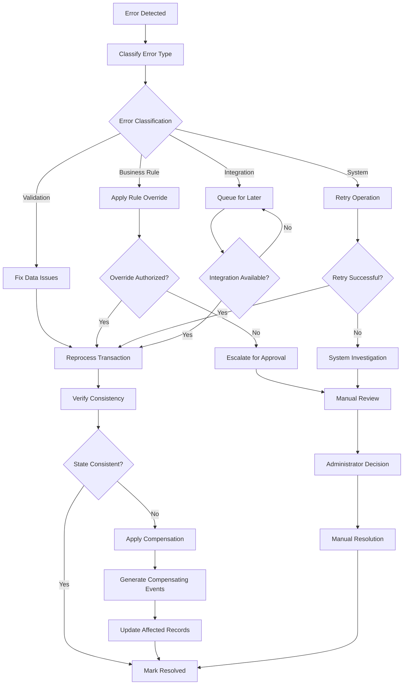
```mermaid
flowchart TD
    A[Error Detected] --> B[Classify Error Type]
    B --> C{Error Classification}
    
    C -->|Validation| D[Fix Data Issues]
    C -->|Business Rule| E[Apply Rule Override]
    C -->|System| F[Retry Operation]
    C -->|Integration| G[Queue for Later]
    
    D --> H[Reprocess Transaction]
    E --> I{Override Authorized?}
    I -->|Yes| H
    I -->|No| J[Escalate for Approval]
    
    F --> K{Retry Successful?}
    K -->|Yes| H
    K -->|No| L[System Investigation]
    
    G --> M{Integration Available?}
    M -->|Yes| H
    M -->|No| G
    
    H --> N[Verify Consistency]
    N --> O{State Consistent?}
    O -->|Yes| P[Mark Resolved]
    O -->|No| Q[Apply Compensation]
    
    Q --> R[Generate Compensating Events]
    R --> S[Update Affected Records]
    S --> P
    
    J --> T[Manual Review]
    L --> T
    T --> U[Administrator Decision]
    U --> V[Manual Resolution]
    V --> P
```

**Commands Involved**:
- `HandleTransactionError` - Process detected errors
- `ClassifyError` - Categorize error types
- `RetryFailedTransaction` - Attempt operation retry
- `ApplyErrorCompensation` - Generate compensating actions
- `EscalateError` - Route to manual intervention
- `ResolveManualError` - Complete manual resolution
- `ValidateErrorRecovery` - Verify recovery success

**Events Involved**:
- `TransactionErrorDetected` - Error identified
- `ErrorClassified` - Error type determined
- `TransactionRetried` - Retry attempted
- `ErrorCompensationApplied` - Compensation processed
- `ErrorEscalated` - Manual intervention required
- `ManualErrorResolved` - Manual resolution completed
- `ErrorRecoveryValidated` - Recovery verified

**Business Rules**:
- All transaction errors must be logged and tracked
- Automatic retry limited to safe, idempotent operations
- Compensation actions must maintain data consistency
- Manual escalation required for financial impact errors
- Error resolution includes root cause analysis and prevention

---

## Integration Pattern Workflows

### 19. Real-Time Event Coordination Workflow

**Description**: Event-driven integration across all Accountex modules enabling real-time coordination and data consistency.

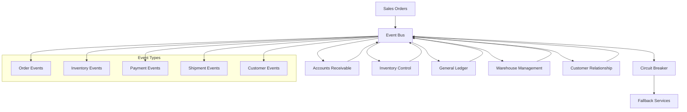
```mermaid
graph TB
    SO[Sales Orders] --> EventBus[Event Bus]
    EventBus --> AR[Accounts Receivable]
    EventBus --> IC[Inventory Control]
    EventBus --> GL[General Ledger]
    EventBus --> WMS[Warehouse Management]
    EventBus --> CRM[Customer Relationship]
    
    AR --> EventBus
    IC --> EventBus
    GL --> EventBus
    WMS --> EventBus
    CRM --> EventBus
    
    EventBus --> CircuitBreaker[Circuit Breaker]
    CircuitBreaker --> FallbackService[Fallback Services]
    
    subgraph "Event Types"
        E1[Order Events]
        E2[Inventory Events]
        E3[Payment Events]
        E4[Shipment Events]
        E5[Customer Events]
    end
    
    EventBus --> E1
    EventBus --> E2
    EventBus --> E3
    EventBus --> E4
    EventBus --> E5
```

**Commands Involved**:
- `PublishOrderEvent` - Send event to other modules
- `SubscribeToEvent` - Listen for external events
- `HandleEventFailure` - Process event handling errors
- `ActivateCircuitBreaker` - Enable fault tolerance
- `ResumeEventProcessing` - Restore normal operation
- `ValidateEventConsistency` - Verify event processing
- `ProcessEventBacklog` - Handle queued events

**Events Involved**:
- `OrderEventPublished` - Event sent successfully
- `EventSubscriptionActivated` - Listener registered
- `EventFailureHandled` - Processing error managed
- `CircuitBreakerActivated` - Fault tolerance engaged
- `EventProcessingResumed` - Normal operation restored
- `EventConsistencyValidated` - Processing verified
- `EventBacklogProcessed` - Queued events handled

**Business Rules**:
- All significant order events must be published
- Event processing must be idempotent
- Circuit breaker activates on failure threshold
- Event ordering preserved for dependent operations
- Fallback mechanisms ensure critical business continuity

---

## Summary

The Sales Orders domain orchestrates **19 primary workflows** that collectively manage:

- **Order Operations**: Creation, approval, lifecycle management, and cancellation
- **Quote Management**: Quotation creation, approval, presentation, and conversion
- **Inventory Operations**: Allocation, reservation, substitution, and backorder processing
- **Fulfillment Operations**: Picking, packing, shipping, and delivery confirmation
- **Advanced Order Types**: Blanket orders, recurring orders, and complex billing arrangements
- **Customer Integration**: Credit management, communication, and external system coordination
- **Warehouse Integration**: WMS coordination, pick optimization, and inventory synchronization
- **Payment Processing**: Authorization, capture, settlement, and refund handling
- **Import Operations**: Bulk processing, validation, and error handling
- **Analytics Operations**: Performance analysis, forecasting, and optimization
- **Territory Management**: Sales territory organization and performance tracking
- **Error Recovery**: Comprehensive error handling and compensation processing
- **Integration Coordination**: Real-time event processing and module communication

Each workflow maintains clear state boundaries, implements comprehensive audit trails, and supports both automated processing and manual intervention points. The event-driven architecture enables system resilience through circuit breaker patterns, graceful degradation, and sophisticated error recovery mechanisms.

The workflows collectively ensure enterprise-grade sales order management with complete traceability, regulatory compliance, sophisticated pricing and billing capabilities, and seamless integration with other Accountex modules while maintaining data integrity, performance optimization, and operational excellence for complex sales scenarios including multi-warehouse fulfillment, kit management, blanket agreements, recurring orders, and advanced billing arrangements.