# Accountex System Manager - Workflows and State Management

## Overview

This document provides a comprehensive analysis of workflows and state management in the System Manager domain. Each workflow represents a coordinated sequence of commands and events that manage state transitions across system components. The workflows follow event-sourced patterns using the Commanded framework with clear state boundaries and audit trails.

## Core System Workflows

### 1. System Initialization Workflow

**Description**: Bootstraps the Accountex system from initial deployment to operational readiness including environment setup, module activation, and core services initialization.

**State Transitions**: 
`Uninitialized` → `Initializing` → `Core Services Ready` → `Modules Loading` → `Fully Operational`

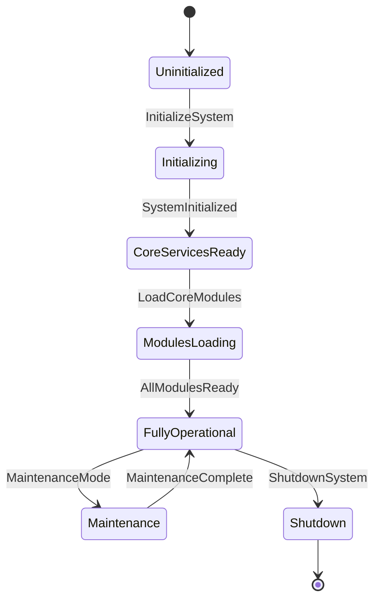

**Commands Involved**:
- `InitializeSystem` - Bootstrap system environment
- `LoadCoreModules` - Load essential modules
- `ConfigureIntegrationEndpoints` - Setup external integrations
- `ActivateAuditTrail` - Enable audit logging
- `SetInitialParameters` - Apply initial configuration

**Events Involved**:
- `SystemInitialized` - System successfully bootstrapped
- `CoreModulesLoaded` - Essential modules operational
- `IntegrationEndpointsConfigured` - External connections ready
- `AuditTrailActivated` - Logging enabled
- `SystemFullyOperational` - Ready for business operations

**Business Rules**:
- System can only be initialized once per environment
- Core modules must load successfully before other modules
- Audit trail must be active before business operations
- All integration endpoints must be validated

---

### 2. Company Lifecycle Workflow

**Description**: Manages the complete lifecycle of company entities from creation through operational status to archival, including multi-tenant setup and consolidation hierarchy management.

**State Transitions**:
`Proposed` → `Creating` → `Active` → `Locked` → `Archived`

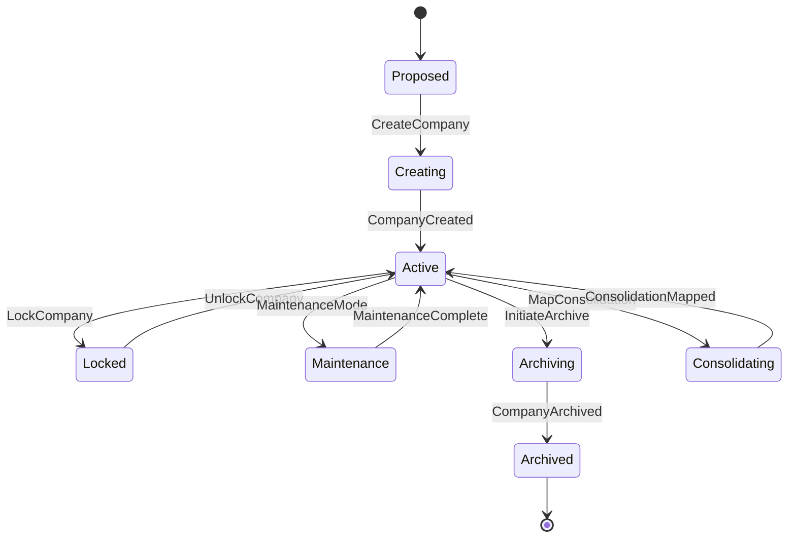

**Commands Involved**:
- `CreateCompany` - Establish new legal entity
- `UpdateCompanySettings` - Modify company configuration
- `LockCompany` - Restrict company access
- `UnlockCompany` - Restore company access
- `MapConsolidationAccounts` - Setup inter-company mappings
- `ShareResource` - Enable cross-company sharing
- `InitiateCompanyArchive` - Begin archival process

**Events Involved**:
- `CompanyCreated` - New company established
- `CompanySettingsUpdated` - Configuration modified
- `CompanyLocked` - Access restricted
- `CompanyUnlocked` - Access restored
- `ConsolidationMappingCreated` - Inter-company mapping established
- `ResourceShared` - Cross-company resource enabled
- `CompanyArchived` - Company data archived

**Business Rules**:
- Company code must be unique across system
- Parent company must exist for subsidiaries
- Lock/unlock requires appropriate authorization
- Archival requires zero active users and completed transactions

---

### 3. User Management Workflow

**Description**: Comprehensive user lifecycle management from account creation through access control to account termination, including authentication, authorization, and security enforcement.

**State Transitions**:
`Provisioning` → `Active` → `Locked` → `Password Reset` → `Active` → `Deactivated`

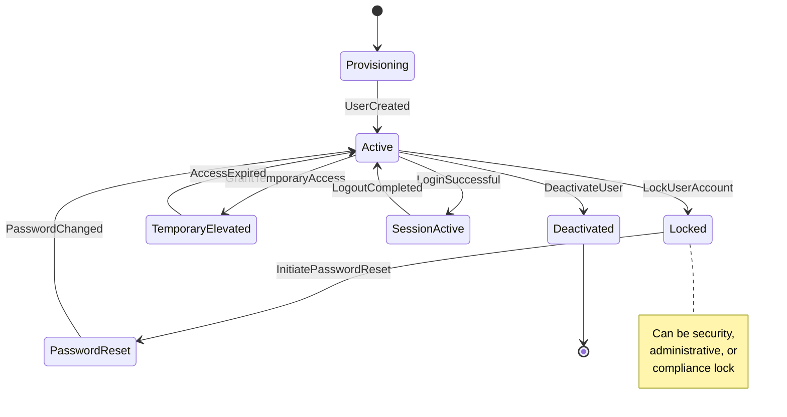

**Commands Involved**:
- `CreateUser` - Provision new user account
- `UpdateUserRoles` - Modify role assignments  
- `EnforcePasswordChange` - Require password update
- `LockUserAccount` - Disable user access
- `UnlockUserAccount` - Restore user access
- `CreateSecurityRole` - Define new security role
- `SetFieldLevelSecurity` - Configure field access controls
- `TerminateUserSession` - Force user logout
- `GrantTemporaryAccess` - Provide time-limited elevation

**Events Involved**:
- `UserCreated` - Account provisioned
- `UserRolesUpdated` - Permissions modified
- `PasswordChanged` - Credentials updated
- `UserAccountLocked` - Access disabled
- `UserAccountUnlocked` - Access restored
- `SecurityRoleCreated` - New role defined
- `FieldSecurityConfigured` - Field access configured
- `UserSessionTerminated` - Session forcibly ended
- `TemporaryAccessGranted` - Elevated permissions active
- `TemporaryAccessRevoked` - Elevation expired

**Business Rules**:
- User identifier must be unique within system
- Password must meet complexity requirements
- Role changes require appropriate authorization
- Temporary access requires business justification and automatic expiration

---

### 4. Module Activation Workflow

**Description**: Manages the dynamic loading, activation, and lifecycle of pluggable Accountex modules including dependency resolution, licensing, and health monitoring.

**State Transitions**:
`Unregistered` → `Registered` → `Dependencies Resolved` → `Licensed` → `Activated` → `Healthy`

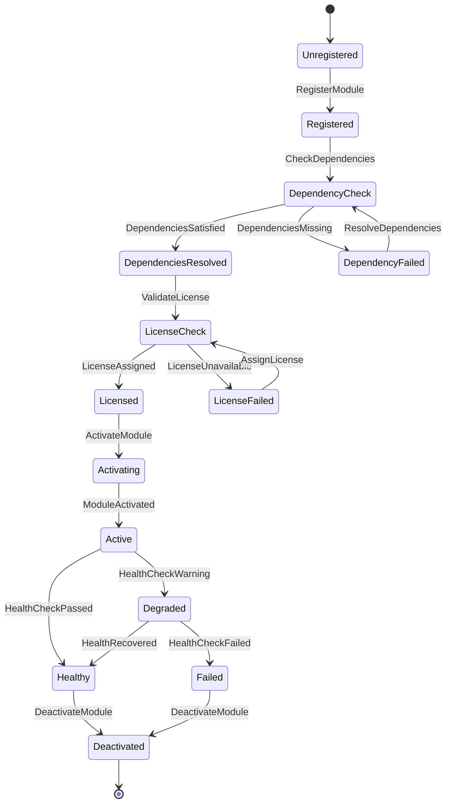

**Commands Involved**:
- `RegisterModule` - Add module to registry
- `ActivateModule` - Enable module functionality
- `DeactivateModule` - Disable module safely
- `AssignModuleLicense` - Allocate license to module
- `RevokeLicense` - Remove license assignment
- `UpdateModuleConfiguration` - Modify module settings
- `CheckModuleHealth` - Verify module status
- `ResolveDependencies` - Handle module dependencies

**Events Involved**:
- `ModuleRegistered` - Module added to system
- `ModuleActivated` - Functionality enabled
- `ModuleDeactivated` - Functionality disabled
- `LicenseAssigned` - License allocated
- `LicenseRevoked` - License removed
- `ModuleConfigurationUpdated` - Settings changed
- `ModuleHealthChecked` - Status verified
- `DependencyResolved` - Dependency satisfied
- `ModuleFailure` - Module failure detected
- `ModuleRecovered` - Module health restored

**Business Rules**:
- All dependencies must be resolved before activation
- Valid license required for module operation
- Health monitoring continuous for active modules
- Graceful shutdown required for deactivation

---

### 5. Security Authorization Workflow

**Description**: Multi-layered security authorization process that validates user access through company, module, function, and field-level security checks with comprehensive audit trail.

**State Transitions**:
`Request` → `Company Check` → `Module Check` → `Function Check` → `Field Check` → `Authorized/Denied`

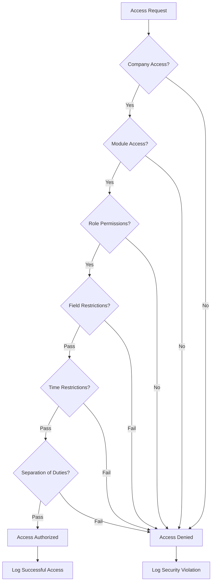

**Commands Involved**:
- `AuthorizeAccess` - Validate user access request
- `CreateSecurityRole` - Define role with permissions
- `SetFieldLevelSecurity` - Configure field access
- `GrantTemporaryAccess` - Provide elevated access
- `RevokeTemporaryAccess` - Remove elevated access
- `LogSecurityViolation` - Record unauthorized attempt

**Events Involved**:
- `AccessAuthorized` - Access granted to user
- `AccessDenied` - Access rejected for user
- `SecurityRoleCreated` - New role established
- `FieldSecurityConfigured` - Field access configured
- `TemporaryAccessGranted` - Elevation provided
- `TemporaryAccessRevoked` - Elevation removed
- `SecurityViolationLogged` - Violation recorded

**Business Rules**:
- All four security layers must pass for access
- Temporary access requires justification and expiration
- Security violations trigger investigation workflow
- Separation of duties enforced for financial transactions

---

### 6. Fiscal Period Management Workflow

**Description**: Coordinates fiscal period operations across all modules including period opening, transaction processing coordination, and period closing with comprehensive validation.

**State Transitions**:
`Planned` → `Opening` → `Open` → `Soft Closing` → `Hard Closing` → `Closed` → `Archived`

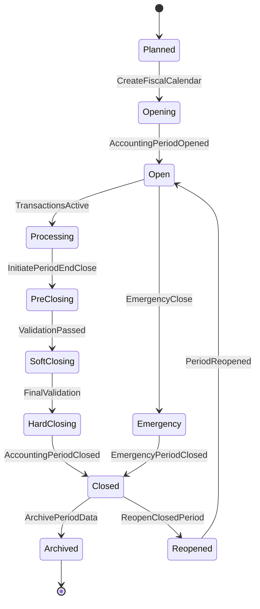

**Commands Involved**:
- `CreateFiscalCalendar` - Define fiscal year structure
- `OpenAccountingPeriod` - Enable transaction posting
- `CloseAccountingPeriod` - Prevent further posting
- `CreateAdjustmentPeriod` - Setup special periods
- `InitiatePeriodEndClose` - Begin closing process
- `ReopenClosedPeriod` - Allow retroactive adjustments
- `ArchivePeriodData` - Archive completed periods

**Events Involved**:
- `FiscalCalendarCreated` - Calendar structure defined
- `AccountingPeriodOpened` - Posting enabled
- `AccountingPeriodClosed` - Posting disabled
- `AdjustmentPeriodCreated` - Special period available
- `PeriodEndCloseInitiated` - Closing process started
- `ClosedPeriodReopened` - Retroactive posting allowed
- `PeriodDataArchived` - Historical data archived

**Business Rules**:
- Periods must open in sequential order
- All modules must confirm readiness before closing
- Final adjustments require approval
- Closed periods require high-level authority to reopen

---

### 7. Audit and Compliance Workflow

**Description**: Continuous audit trail management and compliance monitoring including policy configuration, real-time analysis, and regulatory reporting with automated anomaly detection.

**State Transitions**:
`Policy Draft` → `Policy Active` → `Monitoring` → `Analysis` → `Reporting` → `Compliance Verified`

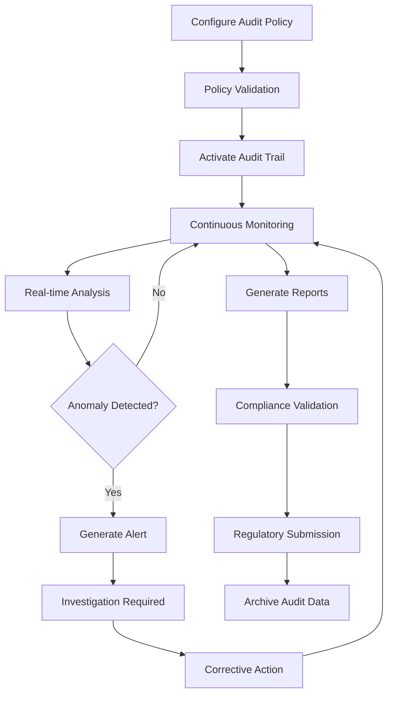

**Commands Involved**:
- `ConfigureAuditPolicy` - Set audit requirements
- `ActivateAuditTrail` - Enable audit logging
- `GenerateComplianceReport` - Create regulatory reports
- `ExportAuditTrail` - Extract audit data
- `ArchiveAuditData` - Move to long-term storage
- `ValidateDataIntegrity` - Check data consistency
- `InitiateSecurityAudit` - Begin security review
- `InvestigateAnomaly` - Investigate detected anomalies

**Events Involved**:
- `AuditPolicyConfigured` - Policy established
- `AuditTrailActivated` - Logging enabled
- `ComplianceReportGenerated` - Report created
- `AuditTrailExported` - Data extracted
- `AuditDataArchived` - Data archived
- `DataIntegrityValidated` - Consistency verified
- `SecurityAuditInitiated` - Security review started
- `AnomalyDetected` - Unusual pattern found
- `ComplianceViolation` - Regulatory violation identified

**Business Rules**:
- Audit trail must capture all system activities
- Compliance reports must meet regulatory standards
- Anomaly detection triggers investigation
- Data integrity validation required before period close

---

### 8. Password Management Workflow

**Description**: SOX-compliant password lifecycle management including policy enforcement, strength validation, rotation scheduling, and breach database checking with automated notifications.

**State Transitions**:
`New Password` → `Valid` → `Warning Period` → `Expired` → `Reset Required` → `New Password`

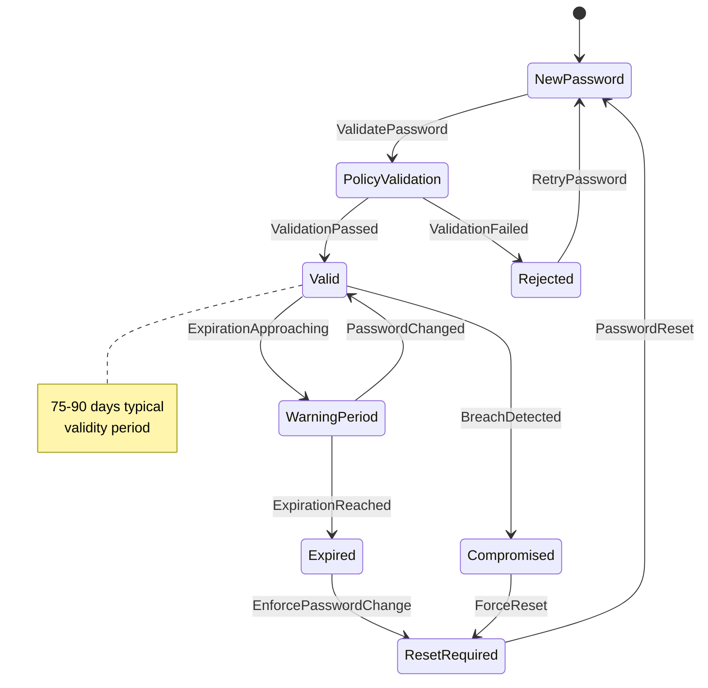

**Commands Involved**:
- `ValidatePassword` - Check password compliance
- `EnforcePasswordChange` - Require password update
- `CheckPasswordHistory` - Validate against history
- `CheckBreachDatabase` - Verify against known breaches
- `SendExpirationWarning` - Notify of upcoming expiration
- `ForcePasswordReset` - Mandatory password change
- `UpdatePasswordPolicy` - Modify password requirements

**Events Involved**:
- `PasswordValidated` - Password meets requirements
- `PasswordRejected` - Password failed validation
- `PasswordChanged` - User changed password
- `PasswordExpired` - Password validity expired
- `ExpirationWarningsent` - User notified of expiration
- `PasswordResetForced` - Mandatory reset required
- `BreachDetected` - Password found in breach database
- `PolicyUpdated` - Password requirements changed

**Business Rules**:
- Passwords must meet complexity requirements
- Password history prevents reuse of recent passwords
- Expiration warnings sent 15 days before expiration
- Breach database checked on all password changes

---

### 9. License Management Workflow

**Description**: Software license allocation, tracking, and compliance management including license pool optimization, usage monitoring, and automatic license reclamation.

**State Transitions**:
`Available` → `Assigned` → `In Use` → `Released` → `Available`

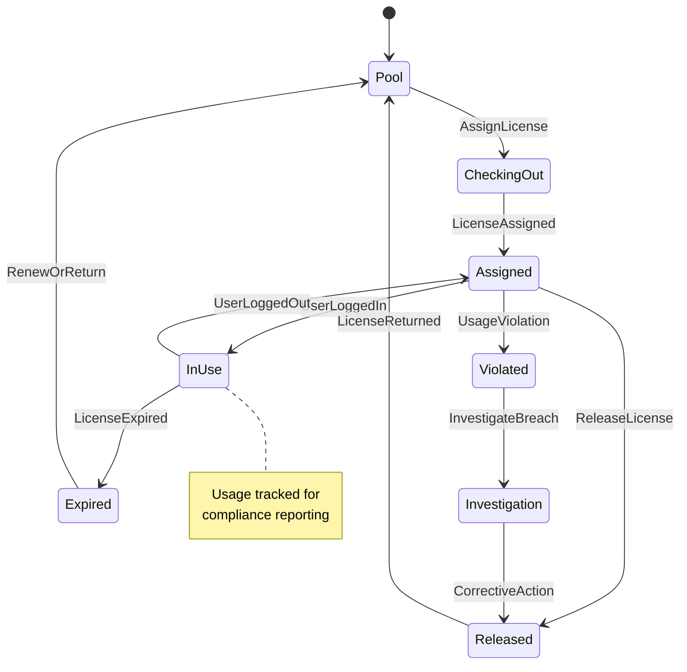

**Commands Involved**:
- `AssignModuleLicense` - Allocate license to module
- `RevokeLicense` - Remove license assignment
- `CheckLicenseUsage` - Monitor usage compliance
- `RenewLicense` - Extend license validity
- `OptimizeLicensePool` - Balance license allocation
- `GenerateLicenseReport` - Create usage reports

**Events Involved**:
- `LicenseAssigned` - License allocated
- `LicenseRevoked` - License removed
- `LicenseUsageTracked` - Usage recorded
- `LicenseExpired` - License validity ended
- `LicenseRenewed` - License extended
- `LicensePoolOptimized` - Pool rebalanced
- `UsageViolationDetected` - Compliance breach found

**Business Rules**:
- License allocation must not exceed pool capacity
- Usage tracking required for compliance
- License expiration triggers renewal workflow
- Violation detection requires investigation

---

### 10. Data Archival Workflow

**Description**: Intelligent data lifecycle management including archival policy execution, retention compliance, and storage optimization with automated cleanup and retrieval capabilities.

**State Transitions**:
`Active Data` → `Archival Candidate` → `Archiving` → `Archived` → `Purged`

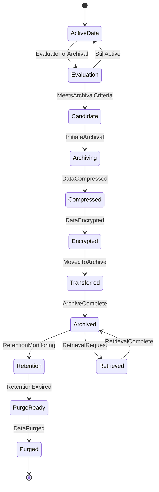

**Commands Involved**:
- `EvaluateDataForArchival` - Assess archival eligibility
- `InitiateDataArchival` - Begin archival process
- `CompressData` - Optimize storage size
- `EncryptArchivedData` - Secure archived data
- `ValidateArchiveIntegrity` - Verify archive quality
- `RetrieveArchivedData` - Access historical data
- `PurgeExpiredData` - Remove old archives

**Events Involved**:
- `DataEvaluatedForArchival` - Assessment completed
- `DataArchivalInitiated` - Process started
- `DataCompressed` - Size optimization completed
- `DataEncrypted` - Security applied
- `DataArchived` - Archive process completed
- `ArchiveIntegrityValidated` - Quality verified
- `ArchivedDataRetrieved` - Historical data accessed
- `ExpiredDataPurged` - Old data removed

**Business Rules**:
- Archival criteria must include transaction completion
- Encrypted storage required for sensitive data
- Retrieval must maintain audit trail
- Purging requires retention period compliance

---

### 11. System Maintenance Workflow

**Description**: Scheduled system maintenance operations including database optimization, performance tuning, and system health verification with minimal business disruption.

**State Transitions**:
`Normal Operations` → `Maintenance Scheduled` → `Maintenance Active` → `Validation` → `Normal Operations`

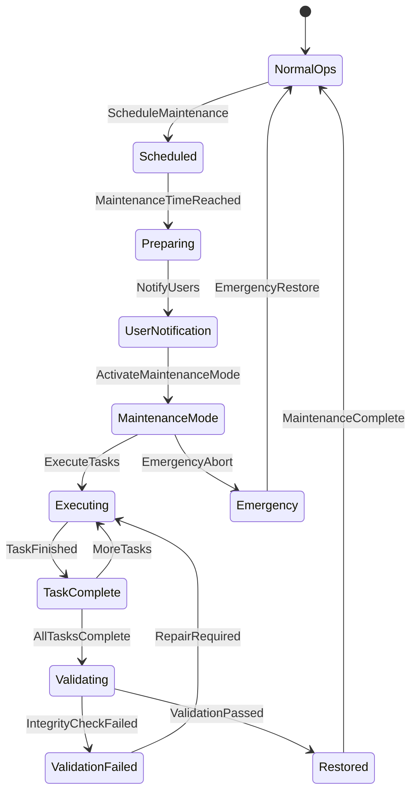

**Commands Involved**:
- `ScheduleMaintenanceWindow` - Plan maintenance activity
- `NotifyUsersOfMaintenance` - Alert affected users
- `InitiateMaintenanceMode` - Begin maintenance
- `ExecuteMaintenanceTask` - Perform specific task
- `ValidateSystemIntegrity` - Verify system health
- `RestoreNormalOperations` - Resume business operations
- `AbortMaintenance` - Emergency stop maintenance

**Events Involved**:
- `MaintenanceScheduled` - Maintenance planned
- `UsersNotified` - Users alerted
- `MaintenanceModeActivated` - System in maintenance
- `MaintenanceTaskCompleted` - Task finished
- `SystemIntegrityValidated` - Health verified
- `NormalOperationsRestored` - Business resumed
- `MaintenanceAborted` - Emergency stop executed

**Business Rules**:
- Maintenance must be scheduled during low-activity periods
- User notification required before maintenance
- System integrity must be verified after maintenance
- Emergency abort procedures must be available

---

### 12. Period-End Closing Workflow

**Description**: Comprehensive period-end closing process that coordinates all modules to ensure complete and accurate financial closing with validation checkpoints and rollback capabilities.

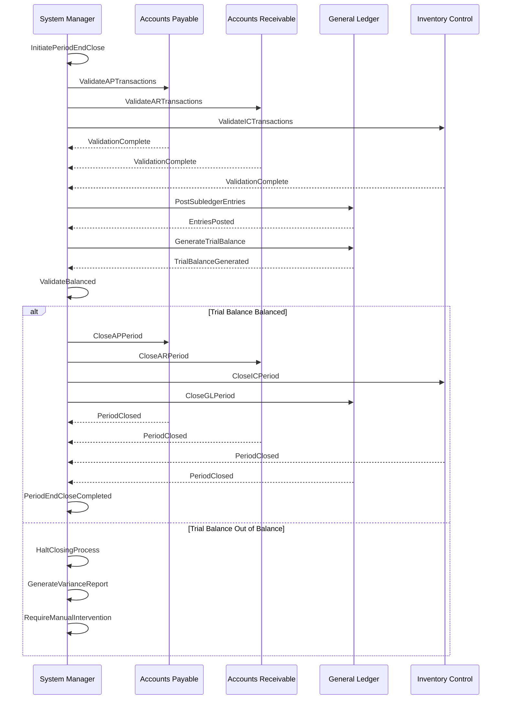

**Commands Involved**:
- `InitiatePeriodEndClose` - Begin closing process
- `ValidateModuleTransactions` - Verify transaction completeness
- `PostSubledgerEntries` - Transfer to general ledger
- `GenerateTrialBalance` - Create balance verification
- `ClosePeriodInModule` - Close period in specific module
- `GenerateFinancialStatements` - Create period reports
- `ArchivePeriodData` - Archive completed period data

**Events Involved**:
- `PeriodEndCloseInitiated` - Closing process started
- `ModuleTransactionsValidated` - Module validation complete
- `SubledgerEntriesPosted` - Entries transferred to GL
- `TrialBalanceGenerated` - Balance verification created
- `PeriodClosedInModule` - Module period closed
- `FinancialStatementsGenerated` - Reports created
- `PeriodEndCloseCompleted` - Closing process finished

**Business Rules**:
- All modules must validate transaction completeness
- Trial balance must be in balance before closing
- Financial statements must be generated before finalization
- Period close requires senior financial authority

---

### 13. Inter-Company Transaction Workflow

**Description**: Manages transactions between companies in the same hierarchy including reciprocal entry creation, elimination coordination, and consolidation reporting.

**State Transitions**:
`Transaction Initiated` → `Reciprocal Created` → `Both Companies Updated` → `Elimination Flagged` → `Consolidated`

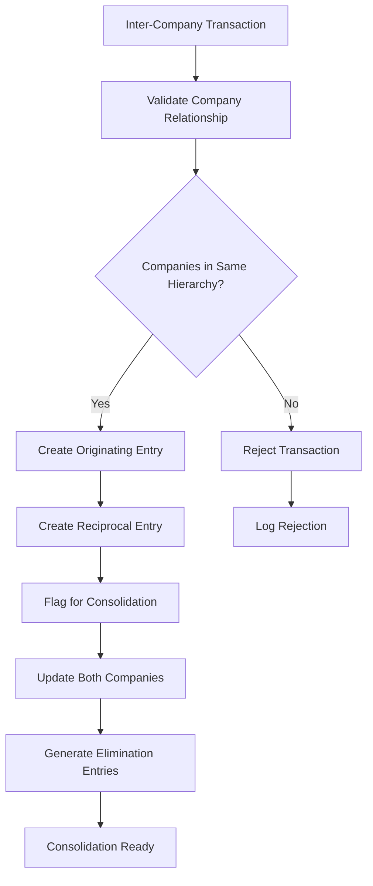

**Commands Involved**:
- `ProcessInterCompanyTransaction` - Handle cross-company transaction
- `CreateReciprocalEntry` - Generate offsetting entry
- `MapConsolidationAccounts` - Setup elimination mappings
- `GenerateEliminationEntries` - Create consolidation entries
- `ValidateInterCompanyBalance` - Verify reciprocal balances

**Events Involved**:
- `InterCompanyTransactionInitiated` - Transaction started
- `ReciprocalEntryCreated` - Offsetting entry generated
- `ConsolidationMappingCreated` - Elimination mapping setup
- `EliminationEntriesGenerated` - Consolidation entries created
- `InterCompanyBalanceValidated` - Reciprocal balance verified

**Business Rules**:
- Companies must be in same legal hierarchy
- Reciprocal entries must be mathematically equal
- Elimination entries required for consolidation
- Inter-company balances must reconcile

---

## Workflow Integration Patterns

### Event-Driven Coordination

All workflows coordinate through domain events, enabling loose coupling and independent module operation:

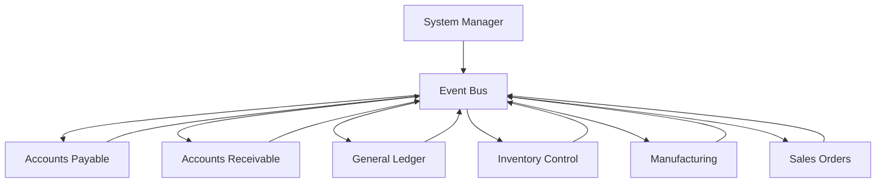

### Circuit Breaker Implementation

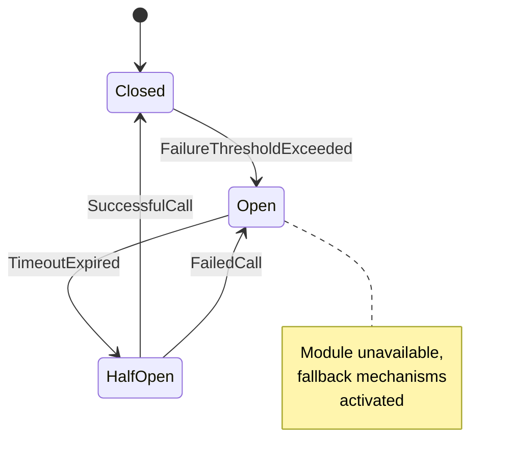

## Summary

The System Manager domain orchestrates **13 primary workflows** that collectively manage:

- **System Lifecycle**: Initialization, configuration, and maintenance operations
- **Company Operations**: Multi-tenant company creation, management, and archival
- **User Security**: Authentication, authorization, and access control
- **Module Management**: Dynamic module loading, activation, and health monitoring
- **Compliance Operations**: Audit trail management and regulatory compliance
- **Data Operations**: Archival, integrity monitoring, and lifecycle management
- **Integration Coordination**: Cross-module communication and event orchestration

Each workflow maintains clear state boundaries, implements comprehensive audit trails, and supports both automated and manual intervention points. The event-driven architecture enables system resilience through circuit breaker patterns and graceful degradation when modules become unavailable.

The workflows collectively ensure enterprise-grade system management with complete traceability, regulatory compliance, security enforcement, and operational excellence while supporting the distributed, event-sourced architecture of the Accountex ERP platform.