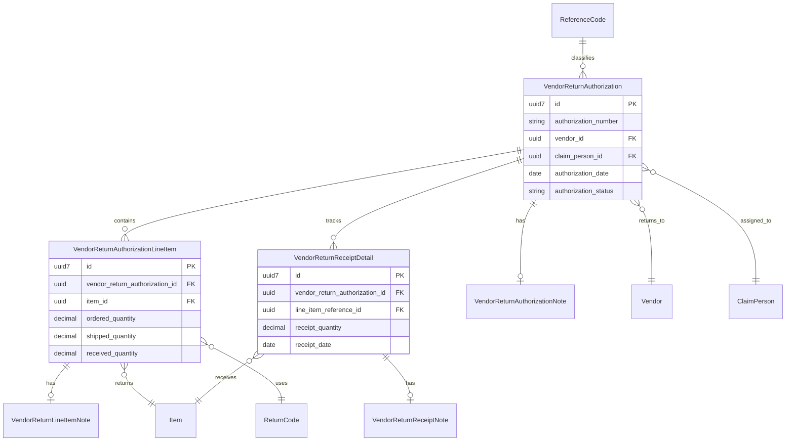

# Return to Vendor Authorization - Ash Domain Structure

## Domain Overview

The Return to Vendor (RV) Authorization system manages the process of returning items to vendors, tracking authorizations, shipments, receipts, and associated documentation.

## Domain Diagram



## Domain Module

```elixir
defmodule Accountex.ReturnToVendor do
  use Ash.Domain

  resources do
    resource Accountex.ReturnToVendor.VendorReturnAuthorization
    resource Accountex.ReturnToVendor.VendorReturnAuthorizationLineItem
    resource Accountex.ReturnToVendor.VendorReturnReceiptDetail
    resource Accountex.ReturnToVendor.VendorReturnAuthorizationNote
    resource Accountex.ReturnToVendor.VendorReturnLineItemNote
    resource Accountex.ReturnToVendor.VendorReturnReceiptNote
    resource Accountex.ReturnToVendor.ReferenceCode
  end
end
```

## Resources

### 1. VendorReturnAuthorization

```elixir
defmodule Accountex.ReturnToVendor.VendorReturnAuthorization do
  use Ash.Resource,
    domain: Accountex.ReturnToVendor,
    data_layer: AshPostgres.DataLayer

  postgres do
    table "vendor_return_authorizations"
    repo Accountex.Repo
  end

  attributes do
    uuid_primary_key :id, type: :uuid_v7

    attribute :authorization_number, :string do
      allow_nil? false
      description "Unique vendor return authorization number"
    end

    attribute :revision_code, :string do
      default "A"
      description "Revision identifier for the authorization"
    end

    attribute :vendor_id, :uuid do
      allow_nil? false
      description "Reference to the vendor"
    end

    attribute :claim_person_id, :uuid do
      description "Assigned claim person handling the return"
    end

    attribute :entered_by_user_name, :string do
      description "User who created the authorization"
    end

    attribute :confirmed_to_contact, :string do
      description "Vendor contact person for confirmation"
    end

    attribute :short_description, :string do
      description "Brief description of the return"
    end

    # Order From (Vendor) Information
    attribute :order_from_company_name, :string
    attribute :order_from_address_line_1, :string
    attribute :order_from_address_line_2, :string
    attribute :order_from_city, :string
    attribute :order_from_state_province, :string
    attribute :order_from_postal_code, :string
    attribute :order_from_country, :string
    attribute :order_from_phone_number, :string
    attribute :order_from_contact_name, :string
    attribute :order_from_email_address, :string

    # Ship To (Warehouse) Information
    attribute :ship_to_company_name, :string
    attribute :ship_to_address_line_1, :string
    attribute :ship_to_address_line_2, :string
    attribute :ship_to_city, :string
    attribute :ship_to_state_province, :string
    attribute :ship_to_postal_code, :string
    attribute :ship_to_country, :string
    attribute :ship_to_phone_number, :string
    attribute :ship_to_contact_name, :string
    attribute :ship_to_email_address, :string

    # Shipping Information
    attribute :shipping_method, :string
    attribute :freight_on_board_point, :string
    attribute :reference_number, :string
    attribute :freight_code, :string
    attribute :freight_tax_code, :string
    attribute :receive_freight_code, :string
    attribute :receive_freight_tax_code, :string

    # Financial Information
    attribute :tax_code, :string
    attribute :payment_code, :string
    attribute :receive_payment_code, :string
    attribute :currency_code, :string do
      allow_nil? false
      default "USD"
    end
    attribute :tax_exemption_type, :string
    attribute :exchange_rate, :decimal do
      default 1.0
    end

    # Dates
    attribute :authorization_creation_date, :datetime do
      allow_nil? false
    end
    attribute :authorization_order_date, :date do
      allow_nil? false
    end
    attribute :requested_completion_date, :date

    # Status Flags
    attribute :uses_accrued_received_goods, :boolean do
      default false
    end
    attribute :is_on_hold, :boolean do
      default false
    end
    attribute :is_cancelled, :boolean do
      default false
    end
    attribute :has_no_shipment_backorders, :boolean do
      default true
    end
    attribute :has_no_receipt_backorders, :boolean do
      default true
    end
    attribute :has_no_completion_backorders, :boolean do
      default true
    end
    attribute :is_freight_taxable_1, :boolean do
      default false
    end
    attribute :is_freight_taxable_2, :boolean do
      default false
    end
    attribute :is_receive_freight_taxable_1, :boolean do
      default false
    end
    attribute :is_receive_freight_taxable_2, :boolean do
      default false
    end
    attribute :apply_sales_tax, :boolean do
      default false
    end
    attribute :show_cost_including_tax, :boolean do
      default false
    end
    attribute :is_order_printed, :boolean do
      default false
    end
    attribute :is_pick_list_printed, :boolean do
      default false
    end
    attribute :is_label_printed, :boolean do
      default false
    end
    attribute :uses_vendor_part_numbers, :boolean do
      default false
    end

    # Terms Information
    attribute :terms_discount_days, :integer do
      default 0
    end
    attribute :terms_net_days, :integer do
      default 0
    end
    attribute :terms_discount_percentage, :decimal do
      default 0.0
    end
    attribute :discount_percentage, :decimal do
      default 0.0
    end

    # Tax Versions
    attribute :sales_tax_version, :integer do
      default 0
    end
    attribute :freight_sales_tax_version, :integer do
      default 0
    end
    attribute :receive_freight_sales_tax_version, :integer do
      default 0
    end

    # Calculated Amounts (Base Currency)
    attribute :taxable_amount_1, :decimal do
      default 0.0
    end
    attribute :taxable_amount_2, :decimal do
      default 0.0
    end
    attribute :subtotal_amount, :decimal do
      default 0.0
    end
    attribute :discount_amount, :decimal do
      default 0.0
    end
    attribute :freight_amount, :decimal do
      default 0.0
    end
    attribute :receive_freight_amount, :decimal do
      default 0.0
    end
    attribute :tax_amount_1, :decimal do
      default 0.0
    end
    attribute :tax_amount_2, :decimal do
      default 0.0
    end
    attribute :tax_amount_3, :decimal do
      default 0.0
    end
    attribute :freight_tax_amount_1, :decimal do
      default 0.0
    end
    attribute :freight_tax_amount_2, :decimal do
      default 0.0
    end
    attribute :freight_tax_amount_3, :decimal do
      default 0.0
    end
    attribute :receive_freight_tax_amount_1, :decimal do
      default 0.0
    end
    attribute :receive_freight_tax_amount_2, :decimal do
      default 0.0
    end
    attribute :receive_freight_tax_amount_3, :decimal do
      default 0.0
    end
    attribute :receive_freight_charge_amount, :decimal do
      default 0.0
    end

    # Foreign Currency Amounts
    attribute :foreign_taxable_amount_1, :decimal do
      default 0.0
    end
    attribute :foreign_taxable_amount_2, :decimal do
      default 0.0
    end
    attribute :foreign_subtotal_amount, :decimal do
      default 0.0
    end
    attribute :foreign_discount_amount, :decimal do
      default 0.0
    end
    attribute :foreign_freight_amount, :decimal do
      default 0.0
    end
    attribute :foreign_receive_freight_amount, :decimal do
      default 0.0
    end
    attribute :foreign_tax_amount_1, :decimal do
      default 0.0
    end
    attribute :foreign_tax_amount_2, :decimal do
      default 0.0
    end
    attribute :foreign_tax_amount_3, :decimal do
      default 0.0
    end
    attribute :foreign_freight_tax_amount_1, :decimal do
      default 0.0
    end
    attribute :foreign_freight_tax_amount_2, :decimal do
      default 0.0
    end
    attribute :foreign_freight_tax_amount_3, :decimal do
      default 0.0
    end
    attribute :foreign_receive_freight_tax_amount_1, :decimal do
      default 0.0
    end
    attribute :foreign_receive_freight_tax_amount_2, :decimal do
      default 0.0
    end
    attribute :foreign_receive_freight_tax_amount_3, :decimal do
      default 0.0
    end
    attribute :foreign_receive_freight_charge_amount, :decimal do
      default 0.0
    end

    timestamps()
  end

  relationships do
    has_many :line_items, Accountex.ReturnToVendor.VendorReturnAuthorizationLineItem
    has_many :receipt_details, Accountex.ReturnToVendor.VendorReturnReceiptDetail
    has_one :authorization_note, Accountex.ReturnToVendor.VendorReturnAuthorizationNote
  end

  actions do
    defaults [:read, :update, :destroy]

    create :create do
      primary? true
    end
  end

  code_interface do
    define :list_vendor_return_authorizations, action: :read
    define :get_vendor_return_authorization, action: :read, get?: true
    define :create_vendor_return_authorization, action: :create
    define :update_vendor_return_authorization, action: :update
    define :delete_vendor_return_authorization, action: :destroy
  end
end
```

### 2. VendorReturnAuthorizationLineItem

```elixir
defmodule Accountex.ReturnToVendor.VendorReturnAuthorizationLineItem do
  use Ash.Resource,
    domain: Accountex.ReturnToVendor,
    data_layer: AshPostgres.DataLayer

  postgres do
    table "vendor_return_authorization_line_items"
    repo Accountex.Repo
  end

  attributes do
    uuid_primary_key :id, type: :uuid_v7

    attribute :vendor_return_authorization_id, :uuid do
      allow_nil? false
    end

    attribute :vendor_id, :uuid do
      allow_nil? false
    end

    attribute :line_item_number, :string do
      allow_nil? false
      description "Unique line item identifier within the authorization"
    end

    attribute :item_number, :string do
      allow_nil? false
    end

    attribute :specification_code_1, :string
    attribute :specification_code_2, :string

    attribute :item_description, :string do
      allow_nil? false
    end

    attribute :warehouse_code, :string do
      allow_nil? false
    end

    attribute :unit_of_measure, :string

    attribute :customer_rma_number, :string
    attribute :vendor_rma_number, :string
    attribute :customer_rma_line_item, :string
    attribute :purchase_order_number, :string
    attribute :purchase_order_line_item, :string
    attribute :return_reason_code, :string do
      allow_nil? false
    end

    attribute :vendor_part_number, :string
    attribute :line_item_tax_code, :string

    attribute :requested_date, :date
    attribute :warranty_expiration_date, :date

    attribute :is_stocked_item, :boolean do
      default false
    end
    attribute :has_vendor_part_number, :boolean do
      default false
    end
    attribute :is_under_warranty, :boolean do
      default false
    end
    attribute :is_taxable_1, :boolean do
      default false
    end
    attribute :is_taxable_2, :boolean do
      default false
    end
    attribute :allow_remark_override, :boolean do
      default false
    end
    attribute :print_remark_on_documents, :boolean do
      default false
    end
    attribute :print_remark_on_pick_list, :boolean do
      default false
    end

    attribute :quantity_decimal_places, :integer do
      default 2
    end
    attribute :line_discount_percentage, :decimal do
      default 0.0
    end
    attribute :line_item_tax_version, :integer do
      default 0
    end

    # Amounts (Base Currency)
    attribute :line_subtotal_amount, :decimal do
      default 0.0
    end
    attribute :line_discount_amount, :decimal do
      default 0.0
    end
    attribute :line_tax_amount_1, :decimal do
      default 0.0
    end
    attribute :line_tax_amount_2, :decimal do
      default 0.0
    end
    attribute :line_tax_amount_3, :decimal do
      default 0.0
    end

    # Foreign Currency Amounts
    attribute :foreign_line_subtotal_amount, :decimal do
      default 0.0
    end
    attribute :foreign_line_discount_amount, :decimal do
      default 0.0
    end
    attribute :foreign_line_tax_amount_1, :decimal do
      default 0.0
    end
    attribute :foreign_line_tax_amount_2, :decimal do
      default 0.0
    end
    attribute :foreign_line_tax_amount_3, :decimal do
      default 0.0
    end

    # Quantities
    attribute :ordered_quantity, :decimal do
      allow_nil? false
      default 0.0
    end
    attribute :shipped_quantity, :decimal do
      default 0.0
    end
    attribute :received_quantity, :decimal do
      default 0.0
    end
    attribute :completed_quantity, :decimal do
      default 0.0
    end
    attribute :base_unit_conversion_factor, :decimal do
      default 1.0
    end
    attribute :transaction_unit_conversion_factor, :decimal do
      default 1.0
    end

    # Cost Information
    attribute :unit_cost, :decimal do
      default 0.0
    end
    attribute :unit_cost_including_tax, :decimal do
      default 0.0
    end
    attribute :foreign_unit_cost, :decimal do
      default 0.0
    end
    attribute :foreign_unit_cost_including_tax, :decimal do
      default 0.0
    end

    attribute :sequence_number, :integer do
      allow_nil? false
      description "Sort order within the authorization"
    end

    timestamps()
  end

  relationships do
    belongs_to :vendor_return_authorization, Accountex.ReturnToVendor.VendorReturnAuthorization
    has_one :line_item_note, Accountex.ReturnToVendor.VendorReturnLineItemNote
  end

  actions do
    defaults [:read, :create, :update, :destroy]
  end

  code_interface do
    define :list_vendor_return_authorization_line_items, action: :read
    define :get_vendor_return_authorization_line_item, action: :read, get?: true
    define :create_vendor_return_authorization_line_item, action: :create
    define :update_vendor_return_authorization_line_item, action: :update
    define :delete_vendor_return_authorization_line_item, action: :destroy
  end
end
```

### 3. VendorReturnReceiptDetail

```elixir
defmodule Accountex.ReturnToVendor.VendorReturnReceiptDetail do
  use Ash.Resource,
    domain: Accountex.ReturnToVendor,
    data_layer: AshPostgres.DataLayer

  postgres do
    table "vendor_return_receipt_details"
    repo Accountex.Repo
  end

  attributes do
    uuid_primary_key :id, type: :uuid_v7

    attribute :vendor_return_authorization_id, :uuid do
      allow_nil? false
    end

    attribute :vendor_id, :uuid do
      allow_nil? false
    end

    attribute :authorization_line_reference, :string do
      allow_nil? false
    end

    attribute :receipt_line_item_number, :string do
      allow_nil? false
    end

    attribute :item_number, :string do
      allow_nil? false
    end

    attribute :specification_code_1, :string
    attribute :specification_code_2, :string

    attribute :item_description, :string do
      allow_nil? false
    end

    attribute :warehouse_code, :string do
      allow_nil? false
    end

    attribute :unit_of_measure, :string
    attribute :vendor_part_number, :string
    attribute :tax_code, :string

    attribute :requested_date, :date
    attribute :warranty_expiration_date, :date

    attribute :is_stocked_item, :boolean do
      default false
    end
    attribute :has_vendor_part_number, :boolean do
      default false
    end
    attribute :is_under_warranty, :boolean do
      default false
    end
    attribute :is_taxable_1, :boolean do
      default false
    end
    attribute :is_taxable_2, :boolean do
      default false
    end
    attribute :allow_remark_override, :boolean do
      default false
    end
    attribute :print_remark_on_documents, :boolean do
      default false
    end

    attribute :quantity_decimal_places, :integer do
      default 2
    end
    attribute :receipt_discount_percentage, :decimal do
      default 0.0
    end
    attribute :tax_version, :integer do
      default 0
    end

    # Amounts (Base Currency)
    attribute :receipt_subtotal_amount, :decimal do
      default 0.0
    end
    attribute :receipt_discount_amount, :decimal do
      default 0.0
    end
    attribute :receipt_tax_amount_1, :decimal do
      default 0.0
    end
    attribute :receipt_tax_amount_2, :decimal do
      default 0.0
    end
    attribute :receipt_tax_amount_3, :decimal do
      default 0.0
    end

    # Foreign Currency Amounts
    attribute :foreign_receipt_subtotal_amount, :decimal do
      default 0.0
    end
    attribute :foreign_receipt_discount_amount, :decimal do
      default 0.0
    end
    attribute :foreign_receipt_tax_amount_1, :decimal do
      default 0.0
    end
    attribute :foreign_receipt_tax_amount_2, :decimal do
      default 0.0
    end
    attribute :foreign_receipt_tax_amount_3, :decimal do
      default 0.0
    end

    # Quantities
    attribute :receipt_ordered_quantity, :decimal do
      allow_nil? false
      default 0.0
    end
    attribute :receipt_received_quantity, :decimal do
      default 0.0
    end
    attribute :base_unit_conversion_factor, :decimal do
      default 1.0
    end
    attribute :transaction_unit_conversion_factor, :decimal do
      default 1.0
    end

    # Cost Information
    attribute :unit_cost, :decimal do
      default 0.0
    end
    attribute :unit_cost_including_tax, :decimal do
      default 0.0
    end
    attribute :foreign_unit_cost, :decimal do
      default 0.0
    end
    attribute :foreign_unit_cost_including_tax, :decimal do
      default 0.0
    end

    attribute :sequence_number, :integer do
      allow_nil? false
    end

    timestamps()
  end

  relationships do
    belongs_to :vendor_return_authorization, Accountex.ReturnToVendor.VendorReturnAuthorization
    has_one :receipt_note, Accountex.ReturnToVendor.VendorReturnReceiptNote
  end

  actions do
    defaults [:read, :create, :update, :destroy]
  end

  code_interface do
    define :list_vendor_return_receipt_details, action: :read
    define :get_vendor_return_receipt_detail, action: :read, get?: true
    define :create_vendor_return_receipt_detail, action: :create
    define :update_vendor_return_receipt_detail, action: :update
    define :delete_vendor_return_receipt_detail, action: :destroy
  end
end
```

### 4. VendorReturnAuthorizationNote

```elixir
defmodule Accountex.ReturnToVendor.VendorReturnAuthorizationNote do
  use Ash.Resource,
    domain: Accountex.ReturnToVendor,
    data_layer: AshPostgres.DataLayer

  postgres do
    table "vendor_return_authorization_notes"
    repo Accountex.Repo
  end

  attributes do
    uuid_primary_key :id, type: :uuid_v7

    attribute :vendor_return_authorization_id, :uuid do
      allow_nil? false
    end

    attribute :note_text, :text do
      allow_nil? false
      description "Remark or note content for the authorization"
    end

    timestamps()
  end

  relationships do
    belongs_to :vendor_return_authorization, Accountex.ReturnToVendor.VendorReturnAuthorization
  end

  actions do
    defaults [:read, :create, :update, :destroy]
  end

  code_interface do
    define :list_vendor_return_authorization_notes, action: :read
    define :get_vendor_return_authorization_note, action: :read, get?: true
    define :create_vendor_return_authorization_note, action: :create
    define :update_vendor_return_authorization_note, action: :update
    define :delete_vendor_return_authorization_note, action: :destroy
  end
end
```

### 5. VendorReturnLineItemNote

```elixir
defmodule Accountex.ReturnToVendor.VendorReturnLineItemNote do
  use Ash.Resource,
    domain: Accountex.ReturnToVendor,
    data_layer: AshPostgres.DataLayer

  postgres do
    table "vendor_return_line_item_notes"
    repo Accountex.Repo
  end

  attributes do
    uuid_primary_key :id, type: :uuid_v7

    attribute :vendor_return_line_item_id, :uuid do
      allow_nil? false
    end

    attribute :note_text, :text do
      description "Remark or note content for the line item"
    end

    attribute :problem_description, :text do
      description "Problem description for the returned item"
    end

    timestamps()
  end

  relationships do
    belongs_to :vendor_return_line_item, Accountex.ReturnToVendor.VendorReturnAuthorizationLineItem
  end

  actions do
    defaults [:read, :create, :update, :destroy]
  end

  code_interface do
    define :list_vendor_return_line_item_notes, action: :read
    define :get_vendor_return_line_item_note, action: :read, get?: true
    define :create_vendor_return_line_item_note, action: :create
    define :update_vendor_return_line_item_note, action: :update
    define :delete_vendor_return_line_item_note, action: :destroy
  end
end
```

### 6. VendorReturnReceiptNote

```elixir
defmodule Accountex.ReturnToVendor.VendorReturnReceiptNote do
  use Ash.Resource,
    domain: Accountex.ReturnToVendor,
    data_layer: AshPostgres.DataLayer

  postgres do
    table "vendor_return_receipt_notes"
    repo Accountex.Repo
  end

  attributes do
    uuid_primary_key :id, type: :uuid_v7

    attribute :vendor_return_receipt_detail_id, :uuid do
      allow_nil? false
    end

    attribute :note_text, :text do
      allow_nil? false
      description "Remark or note content for the receipt"
    end

    timestamps()
  end

  relationships do
    belongs_to :vendor_return_receipt_detail, Accountex.ReturnToVendor.VendorReturnReceiptDetail
  end

  actions do
    defaults [:read, :create, :update, :destroy]
  end

  code_interface do
    define :list_vendor_return_receipt_notes, action: :read
    define :get_vendor_return_receipt_note, action: :read, get?: true
    define :create_vendor_return_receipt_note, action: :create
    define :update_vendor_return_receipt_note, action: :update
    define :delete_vendor_return_receipt_note, action: :destroy
  end
end
```

### 7. ReferenceCode

```elixir
defmodule Accountex.ReturnToVendor.ReferenceCode do
  use Ash.Resource,
    domain: Accountex.ReturnToVendor,
    data_layer: AshPostgres.DataLayer

  postgres do
    table "reference_codes"
    repo Accountex.Repo
  end

  attributes do
    uuid_primary_key :id, type: :uuid_v7

    attribute :code_type, :string do
      allow_nil? false
      description "Type of reference code (BUYER, VENDCLASS, VENDINDUS, etc.)"
    end

    attribute :code_value, :string do
      allow_nil? false
      description "The actual code value"
    end

    attribute :code_description, :string do
      allow_nil? false
      description "Description of the code"
    end

    attribute :foreign_language_description, :string do
      description "Description in foreign language"
    end

    attribute :is_active, :boolean do
      default true
      description "Whether this code is currently active"
    end

    timestamps()
  end

  actions do
    defaults [:read, :create, :update, :destroy]
  end

  code_interface do
    define :list_reference_codes, action: :read
    define :get_reference_code, action: :read, get?: true
    define :create_reference_code, action: :create
    define :update_reference_code, action: :update
    define :delete_reference_code, action: :destroy
  end
end
```

## Summary

This Ash domain structure for the Return to Vendor Authorization system provides:

1. **Clean naming conventions** - All resources and fields use semantically meaningful names in snake_case format
2. **Proper relationships** - Foreign keys and associations are properly defined
3. **UUID7 primary keys** - All resources use UUID7 for their primary identifiers
4. **Comprehensive attributes** - All fields from the original data dictionary are represented with appropriate types
5. **Code interfaces** - Pluralized action names for easy access to resource operations
6. **PostgreSQL configuration** - Tables use snake_case naming that reflects the resource names

The domain supports the complete workflow of:
- Creating vendor return authorizations
- Adding line items for products to be returned
- Tracking receipt of returned items
- Managing notes and remarks at various levels
- Handling reference codes for lookups

This structure can be easily extended with additional actions, calculations, and validations as business requirements evolven.
